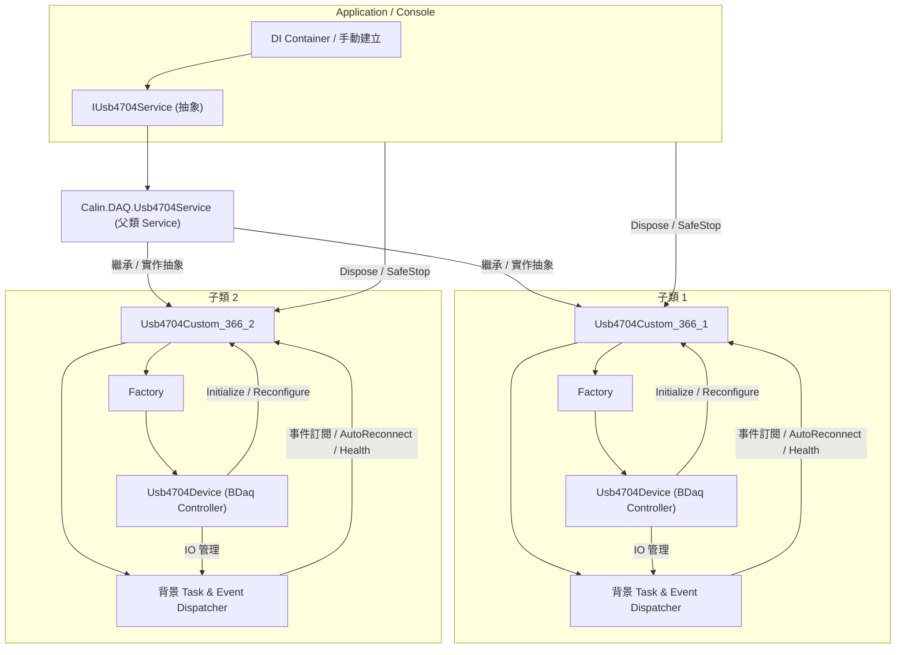
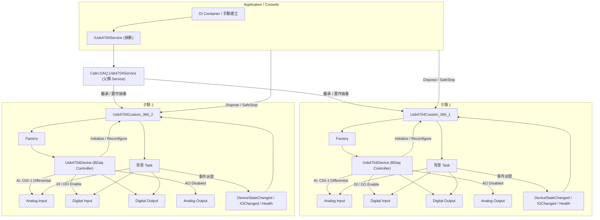
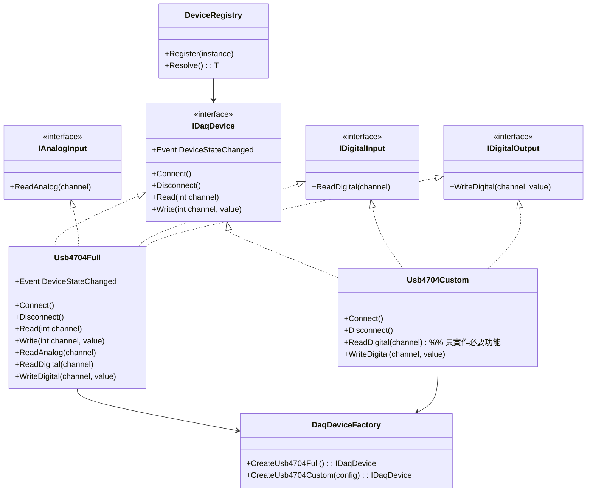
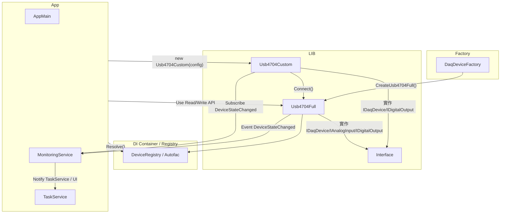
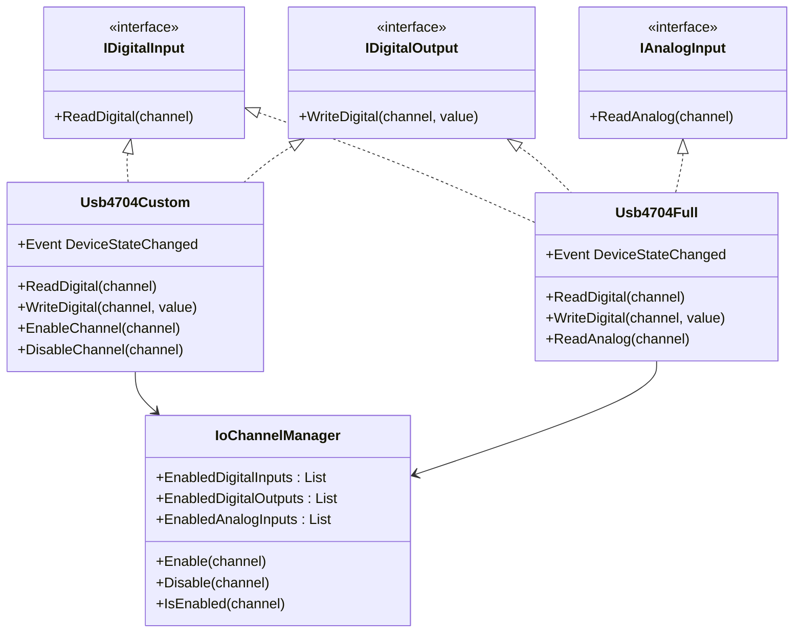
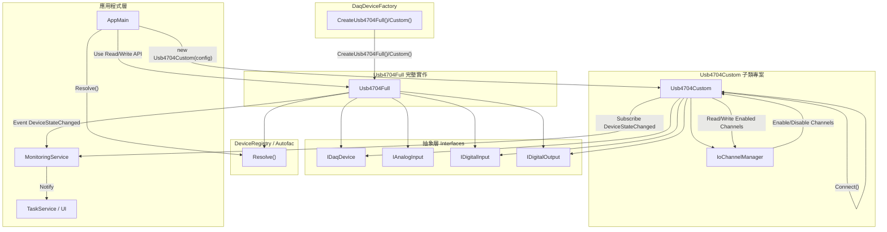

---
aliases:
date:
update:
author:
language:
sourceurl:
tags:
---

# Advantech USB-4704 (DI + Factory 混合架構）

你現在是一位資深工業自動化系統架構師與高可靠度系統工程師。請在既有架構：

Application
↓
Calin.DAQ.USB4704
↓
Calin.Transport.Core
↓
Calin.IO.Abstractions

之上建立一個工控等級 (24/7) Advantech USB-4704（Automation.BDaq SDK）之 .NET Framework 4.8 類別庫。
此專案為「基礎類別庫」，不可包含 UI，不可耦合特定應用層，必須完全符合以下設計原則與工控規範，並採用 抽象 + DI + Factory + 子類化 + IO 管理 架構設計：

## 全域設計優先順序（不可違反）

1. 穩定性
2. 相容性
3. 效能
4. 可預測性
5. 可維護性
6. 擴充性
7. 優雅設計

若設計衝突：
- 永遠優先穩定性與效能
- 禁止為了架構美觀犧牲穩定性
- 禁止為了 DI 純度犧牲可預測性

## 抽象層

- 提供 `IDaqDevice` 或 `IUsb4704DeviceBase` 抽象介面
- Service 層與子類僅依賴抽象
- 子類 `Usb4704Custom` 也只依賴抽象介面
- 提供 `IAnalogInput` / `IDigitalInput` / `IDigitalOutput` 介面以支援 IO 選擇性啟用

## DI + Factory + 子類設計定位

1. **Service 層（公開介面）**
    - `IUsb4704Service` / `IUsb4704`
    - 負責：
        - Initialize / Dispose
        - IO 通道管理（Enable/Disable）
        - AutoReconnect / Health / Retry
        - 事件派發（DeviceStateChanged / IOChanged）
    - 可在 DI Container 註冊為 Singleton
    - 建構式禁止初始化硬體
    - 背景 Task 支援 CancellationToken
    - 所有 public 方法 thread-safe
2. **Factory 層（internal）**
    - `IUsb4704DeviceFactory`
    - 負責：
        - 建立硬體層 `Usb4704Device` 實例
        - 只在 Service 控制下使用
        - 每次 Reconfigure 或 Initialize 重新建立
        - 不被 DI Container 或 Application 直接使用
3. **硬體層（internal）**
    - `Usb4704Device`
    - 持有 BDaq Controller
    - 不對外暴露任何 BDaq SDK 物件
    - 所有通道 Enable/Disable / 模式切換 / I/O 由 Service 管理
4. **子類 / IO 選擇性**
   - 提供 `Usb4704Custom` 子類範例
   - 使用 `IoChannelManager` 管理啟用 / 禁用通道
   - 未啟用通道操作必須拋 `Usb4704Exception`
   - 初始化前可配置模式與啟用通道，初始化後禁止改變

## DI 與非 DI 使用方式

- **非 DI**

```csharp
var factory = new Usb4704DeviceFactory();
var service = new Usb4704Service(factory, logger);
service.Initialize(config);
```

- **DI**

```csharp
builder.RegisterModule<Usb4704Module>();
var service = scope.Resolve<IUsb4704Service>();
service.Initialize(config);
```

兩者行為完全一致，建構式不得初始化硬體。

## 設備實例管理

- 每個 Usb4704Device 僅對應單一實體硬體
- 不共享任何可變狀態 / 緩衝區 / BDaq Controller
- 可共享 readonly static 常數

## IO 通道管理

- 每個 AI / AO / DI / DO 可獨立 Enable / Disable
- 操作未啟用通道必須拋例外（Usb4704Exception）
- AI 支援：
    - Single-Ended / Differential
    - 模式設定必須在 Initialize() 前完成，初始化後禁止變更
- Enable / Disable 方法範例：
    - EnableAnalogInput(channel)
    - DisableAnalogInput(channel)
    - EnableDigitalInput(port)
    - DisableDigitalInput(port)
    - EnableDigitalOutput(port)
    - DisableDigitalOutput(port)

## 24/7 工控要求

- 長時間運作
- Dispose 必須 idempotent
- 所有 public 方法 thread-safe
- 支援 100+ 設備並行
- 背景 Task 支援 CancellationToken
- 不可 Thread.Abort
- 僅使用 Windows 7 / 10 相容 API
- 不可阻塞 BDaq callback
- 防止 race condition / deadlock / event re-entrancy
- 減少 GC 壓力 / 不在高頻 loop 配置物件 / 避免 LINQ 與 boxing
- 使用 ConfigureAwait(false)

## 背景資料擷取

- Continuous Acquisition：
    - 使用 Task + CancellationToken
    - 循環緩衝區防止 buffer overrun
    - 不可 busy-wait
    - BDaq callback 不執行耗時操作
    - 事件派發非阻塞，Subscriber 拋例外不得影響主流程

## 錯誤處理

- 捕捉 BDaqException → 包裝為 Usb4704Exception
- 所有例外透過 ILogger 記錄，不 swallow
- 可選 DiagnosticLogger 記錄背景 Task 狀態、緩衝區滿溢警告、重連統計

## 自動復原與狀態機

- 狀態機：Disconnected → Connecting → Connected → Faulted
- 支援斷線偵測
- AutoReconnect 僅在 Faulted 狀態觸發
- 重連流程不可阻塞呼叫執行緒，禁止重連風暴
- 提供 DeviceStateChanged / HealthStatusChanged 事件

## Dispose 與資源管理

- 完整釋放：
  - BDaq Controller
  - 背景 Task
  - 事件訂閱
  - 緩衝區引用
- 可安全多次呼叫
- 不可拋例外
- 提供 SafeDisposeAsync() 非阻塞等待 Task 完成

## Logger

- 使用 ILogger (Calin.Logging)
- 記錄 Initialize、Start/Stop Acquisition、錯誤、重連、Dispose
- 日誌包含 Thread ID / Timestamp / Device ID（多設備運行時）

## 文件與 XML Summary

- 所有 public 類別與方法必須有 XML Summary（正體中文）
- 說明 thread-safety 行為

## 輸出要求

- 完整可編譯 .NET Framework 4.8 Class Library
- Autofac 註冊範例（僅註冊 IUsb4704Service）
- 非 DI 建立範例
- 自訂例外類別與 EventArgs
- 2 台設備並行運作 Console 範例
- 安全停止與 Dispose 範例
- AutoReconnect 範例
- FakeDevice 模擬實作範例，用於單元測試或 App 模擬

## 生成限制

- 不得簡化
- 不得過度抽象
- 不得將 DI 與硬體生命週期混為一談
- 不得在建構式中建立硬體資源
- 生命週期控制、Reconfigure、背景 Task、Dispose 必須集中於 Service
- 硬體 Factory 僅 Service 可使用

開始生成完整工控強化版實作。

---

# 366 旋入機子類

整合：

- 抽象依賴，只使用 Service / Device 抽象接口
- IO 管理封裝（啟用/禁用通道、模式設定）
- 背景 Task 與事件派發（thread-safe、非阻塞、Subscriber 例外保護）
- 狀態機與 AutoReconnect
- DI / 非 DI 使用
- Console 多設備範例
- 24/7 工控注意事項
- XML Summary 與 thread-safety 說明

## 最終 Copilot 子類生成 PROMPT

你現在是一位資深工業自動化系統架構師與高可靠度系統工程師，請生成 `Calin.DAQ.Usb4704Custom_366` 專案的內容，繼承 `Calin.DAQ.Usb4704` 抽象介面或 Service 層。

## 全域設計優先順序（不可違反）

1. 穩定性
2. 相容性
3. 效能
4. 可預測性
5. 可維護性
6. 擴充性
7. 優雅設計

若設計衝突：
- 永遠優先穩定性與效能
- 禁止為了架構美觀犧牲穩定性
- 禁止為了 DI 純度犧牲可預測性

## 1. 子類用途與機台資訊

- 專用於工控機台 **366 旋入機**，控制機台內一台 USB-4704
- 工控 24/7 運行，支援多設備並行、AutoReconnect、背景資料採集
- 只依賴抽象接口（`IUsb4704Service` / `IUsb4704DeviceBase`），不直接操作父類內部 BDaq 物件

## 2. IO 配置與管理

- **AI**：僅使用 Differential 模式，接在 Channel0-1，其餘全部 disable
- **AO**：全部 disable
- **DI / DO**：全部 enable
- 未啟用通道操作必須拋 `Usb4704Exception`
- 提供 `Enable/Disable` 方法範例
- 可使用內部 `IoChannelManager` 或類似封裝集中管理通道狀態
- Initialize() 前可設定模式與啟用通道，初始化後禁止更改

## 3. 方法與功能

- Initialize / Dispose / Read / Write 範例
- Polling 支援（分開 AI / DIO）
    - `StartAiPolling()` / `StopAiPolling()`：讀取 AI 通道數值
    - `StartDioPolling()` / `StopDioPolling()`：讀取 DI / DO 狀態
    - Polling Task 可由 APP 控制啟動與停止
    - 支援 CancellationToken，thread-safe，非阻塞 BDaq callback
- 背景 Task 支援 CancellationToken，用於連續資料採集
- 事件訂閱範例（DeviceStateChanged / IOChanged / HealthStatusChanged）
- Dispose 必須 idempotent，可安全多次呼叫
- 所有 public 方法 thread-safe
- AutoReconnect 與斷線偵測
- 硬體建構式禁止初始化 BDaq Controller，硬體初始化集中於 Initialize()

## 4. 狀態機與 AutoReconnect

- 狀態機：Disconnected → Connecting → Connected → Faulted
- AutoReconnect 僅在 Faulted 狀態觸發
- 重連流程不可阻塞呼叫執行緒，禁止重連風暴
- DeviceStateChanged / HealthStatusChanged 事件需非阻塞、thread-safe

## 5. DI 與非 DI 使用

- **非 DI**

```csharp
var factory = new Usb4704DeviceFactory();
var custom = new Usb4704Custom_366(factory, logger);
custom.Initialize(config);
custom.StartPolling();
```

- **DI**

```csharp
builder.RegisterModule<Usb4704Module>();
var custom = scope.Resolve<Usb4704Custom_366>();
custom.Initialize(config);
custom.StartPolling();
```

## 6. Console 範例要求

- 初始化兩台 `Usb4704Custom_366` 設備
- 訂閱事件，讀取/寫入 IO
- 開始與停止 Polling (`StartPolling()` / `StopPolling()`)
- 安全停止、Dispose
- 模擬 AutoReconnect
- 展示多設備背景 Task 與事件同步

## 7. 背景 Task、Polling 與事件注意事項

- 背景 Task 與 Polling Task 不阻塞 BDaq callback
- 避免 race condition / deadlock / event re-entrancy
- Subscriber 拋例外不影響主流程
- 使用 ConfigureAwait(false)
- Polling 必須 thread-safe，可多台設備並行運作

## 8. Logger 與診斷

- 使用 ILogger (Calin.Logging)
- 記錄 Initialize、Start/Stop Acquisition、Polling、錯誤、重連、Dispose
- 日誌包含 Thread ID / Timestamp / Device ID（多設備運行）
- 可選 DiagnosticLogger 記錄背景 Task 與 Polling 狀態、緩衝區滿溢警告、重連統計

## 9. XML Summary 與 thread-safety

- 所有 public 類別與方法必須有 XML Summary（正體中文）
- 每個 public 方法說明 thread-safety 行為

## 10. 測試與模擬

- 可生成 FakeDevice 或 MockDevice 範例，用於單元測試或 App 模擬

## 11. 生成限制

- 不得在建構式中建立硬體資源
- 背景 Task、Polling Task、Dispose、Reconfigure 必須集中於 Service
- 父類完整功能保留，子類僅做機台特定 IO 精簡
- 支援 24/7 長時間運行，減少 GC 壓力

開始生成，且完全可直接使用。

---

## 多台子類設備初始化 → 背景 Task → IO / 事件 → Dispose 完整流程



### 說明

- **Application / Console**
    - 可以用 DI 或非 DI 初始化多台子類設備
- **父類 Service 層**
    - 集中管理 IO、背景 Task、事件、AutoReconnect
- **子類 `Usb4704Custom_366`**
    - 每台設備獨立 Factory + Usb4704Device
    - 配置機台特定 IO（AI/DI/DO/AO）
    - 獨立背景 Task 與事件處理
- **Factory + Device**
    - Factory 僅在 Initialize / Reconfigure 時建立硬體
    - Device 封裝 BDaq Controller
- **背景 Task & Event Dispatcher**
    - 保護 Subscriber 拋例外
    - 支援 AutoReconnect / Health
    - Thread-safe、非阻塞

## 多設備 IO 與事件流向的詳細分支圖

把每台子類設備的 AI/DI/DO 通道啟用/禁用、事件派發、背景 Task 循環流程都可視化，方便理解多設備運作。



### 說明

1. **AI / DI / DO / AO 通道**
    - AI: 只啟用 Ch0-1 Differential
    - DI / DO: 全部啟用
    - AO: 全部 disable
2. **背景 Task**
    - 循環讀取 / 寫入通道
    - 非阻塞，支援 CancellationToken
3. **事件派發**
    - DeviceStateChanged / IOChanged / Health
    - Subscriber 拋例外不影響主流程
4. **多設備安全操作**
    - 每台子類設備獨立 Factory + Device
    - Initialize / Reconfigure / Dispose / SafeStop 都獨立執行
    - 事件與 Task 互不干擾

這張圖可以清楚看到 **多設備同時運作、IO 狀態、事件與背景 Task 流程**，完全符合工控 24/7 設計。

---

# 子類生成說明

上面的 PROMPT **只強調「子類化設計與概念」**，但 Copilot 生成時通常會以 **完整實作的父類 (`Usb4704Service` / `Usb4704Device`) 為主**，不會自動生成真正的子類 (`Usb4704Custom`)。它只是會把架構、抽象、IO 管理等做完，但子類化需要 **額外明確要求 Copilot 生成子類**，或手動建立。

如果你希望 Copilot **直接生成子類範例**，可以在 PROMPT 裡加上這段：

> **子類範例要求**
>
> - 生成一個 `Usb4704Custom` 類別，繼承父類抽象介面或 Service 層
> - 只啟用部分 IO 通道（可用 `IoChannelManager`）
> - 提供 Initialize / Dispose / Read / Write 方法範例
> - 適用於特定工控機台，並可直接用於非 DI / DI 使用
> - 包含事件訂閱與背景 Task 處理範例
> - 生成 Console 範例：初始化兩台 Custom 設備，安全停止、Dispose、AutoReconnect

加上這段後，Copilot 才會把 **父類 + 子類 + IO 選擇性** 都生成出來，而不是只做父類實作。

## 子類是否獨立一個專案

對你的情境來說，**將子類（Usb4704Custom）單獨建一個專案是比較建議的做法**，原因如下：

### 優點

1. **解耦父類庫與應用專案**
    - 基礎類別庫（父類）只負責完整 USB-4704 實作、DI/Factory、IO 管理、背景 Task、AutoReconnect 等工控核心功能。
    - 子類專案只針對特定工控機台，使用父類抽象或 Service 層，不會膨脹父類庫。
2. **易於維護與版本管理**
    - 不同機台需求可能不同，子類專案可以獨立版本控制，父類庫可保持穩定版本。
    - 當父類更新（如修 bug、強化 24/7 穩定性）時，子類只需更新參考，不破壞特定機台邏輯。
3. **便於測試與模擬**
    - 子類可以有專屬 FakeDevice / 模擬範例，與父類分開測試。
    - 可以在子類專案增加單元測試或 Console 範例，不影響父類。
4. **減少專案耦合**
    - App 層依賴父類庫（抽象 + Service）即可
    - 子類專案只依賴父類庫，不影響父類功能
    - 多台設備或不同機台可以各自有 Custom 專案，互不干擾
5. **便於 DI/Factory 擴展**
    - 子類可以覆寫部分行為（IO 啟用/禁用、模式設定）
    - 仍可透過同樣的 Factory 或 DI Container 注入父類接口，保持一致性

### 權衡點

- **專案數量多**：如果每台機台都建子類專案，解決方案會多個專案，管理稍複雜，但這在工控系統是常態。
- **父類修改時需同步**：父類接口或抽象更新，子類需重新編譯或調整。
- **共享程式碼**：共用邏輯建議放在父類庫或共用專案，避免子類重複實作。

### 建議策略

1. 父類庫保持完整、穩定、工控級別，可供多專案依賴
2. 子類專案只實作針對特定機台的 IO / 配置 / 特殊邏輯
3. App 層只依賴父類庫（抽象 + Service），不直接依賴子類
4. 多台設備或不同機台各自建立 Custom 專案，透過 Factory + DI 注入使用

---

# 基礎庫 + 專案庫 + 應用程式 三層設計

(原 Prompt) 從架構、可維護性與工控特性的建議和改進方向：

## 架構與繼承

- 你使用 **Advantech USB-4704 基礎類別庫** 作為父類別，針對新工控機台再建立子類別，這樣做的好處是重用現有功能，但需注意：
    - 避免子類別只用到部分功能時，父類的完整功能會成為**不必要依賴**。
    - 可以考慮將父類庫拆成 **核心抽象層 + 實作層**：
        - 核心抽象層（interface / abstract class）：定義基本 IO 操作、事件、狀態。
        - 實作層：完整實作 USB-4704 功能。
    - 子類庫只依賴抽象層，透過 **Composition over Inheritance（組合優先於繼承）** 來選擇需要的功能，這樣可避免「膨脹類別」與不必要依賴。

## DI 與工廠模式

- 你的 LIB 建議同時支援：
    - **DI 注入**（例如 Autofac）：方便在 App 中統一管理設備實例與生命週期。
    - **非 DI 使用**（new 直實例化）：方便快速測試或小型工具。
- 改進建議：
    - 可以提供一個 **工廠類別或靜態建構器**：依配置回傳需要的功能子集或設備實例。
    - 對於需要多台設備的場景，也可以用工廠模式統一管理設備參數與生命週期。

## IO 接點與功能選擇

- 如果新工控機台只使用部分 IO 接點：
    - 考慮將 **IO 接點抽象成介面或集合**，子類只實作需要的部分。
    - 可以提供 **開關/功能開啟註冊機制**，讓 APP 層或子類庫決定要用哪些 IO。
    - 這樣可以避免子類庫膨脹，也方便後續擴展新設備。

## 例外與狀態管理

- USB-4704 在工控環境可能遇到斷線、硬體錯誤：
    - 父類庫建議 **統一事件與狀態管理**（Connected, Faulted, IOError…）。
    - 子類庫可選擇性覆寫或訂閱這些事件，而不是直接改寫父類實作。
    - 配合 DI 或工廠模式，可以在 App 層集中監控多設備狀態。

## 測試與模擬

- 建議提供 **Fake/Mock USB-4704 實作**：
    - 測試子類庫或 APP 層功能時不用真機。
    - 提升開發效率，也可在 CI/CD 自動化測試。

## 可擴展性

- 如果將來會有更多 Advantech 類型或其他 USB DAQ：
    - 建議 **建立統一抽象介面（IDaqDevice）**：
        - 定義基本 IO、事件、狀態。
        - USB-4704 和其他設備都實作這個介面。
        - APP 只依賴介面，增加可擴展性。

---

總結來說，你目前的規劃可行，但若未來設備會增多、IO 功能需求不同，建議：

1. 將父類拆成 **抽象層 + 完整實作層**，子類只依賴抽象層。
2. 對 IO 功能與接點採 **組合或開關式管理**，減少膨脹。
3. 提供 DI / 工廠 / 模擬支援，提高維護性與測試性。
4. 統一狀態事件管理，避免子類亂改父類行為。

---

# 建議的 USB-4704 LIB 架構圖（DI + Factory + 子類專案）



## 說明

- **抽象層（Interface）**
    - `IDaqDevice`：統一連線、讀寫、事件管理接口。
    - `IAnalogInput / IDigitalInput / IDigitalOutput`：針對不同 IO 類型抽象，子類只實作需要的部分。
- **完整實作層**
    - `Usb4704Full`：實作所有 USB-4704 功能。
    - 提供完整測試環境，也可作為子類的組件。
- **子類專案（Custom LIB）**
    - `Usb4704Custom`：針對特定工控機台，只實作用到的 IO。
    - 依賴抽象層，可避免膨脹與不必要依賴。
- **工廠（Factory）**
    - `DaqDeviceFactory`：統一建立 Full 或 Custom 實例，支援配置參數。
- **DI Container / Registry**
    - 支援 Autofac 或其他 DI 容器註冊與解析。
    - App 層只依賴抽象介面，方便測試與替換設備。

---

# APP 使用 USB-4704 LIB 的流程圖（DI + 非 DI + 事件監控）



## 說明

- **非 DI 使用**
    - App 層可以直接 `new Usb4704Custom(config)` 建立設備。
    - 訂閱 `DeviceStateChanged` 事件監控狀態。
    - 適合小工具或快速測試。
- **DI 使用**
    - 使用 `DaqDeviceFactory` 產生 Full 或 Custom 實例，注入 DI Container。
    - App 層只依賴抽象介面 `IDaqDevice`，方便切換不同設備。
    - DI 容器統一管理生命週期、事件訂閱與多設備情境。
- **事件與狀態監控**
    - `DeviceStateChanged` 統一推送設備狀態（Connected / Faulted / IO Error）。
    - `MonitoringService` 負責集中監控，多設備時統一處理通知給 `TaskService` 或 UI。
- **可擴展性**
    - 未來增加新設備或新 IO 類型，只要實作介面並透過工廠 / DI 註冊即可。
    - App 層不需要改動，保持最小耦合。

---

# 子類 USB-4704 Custom 的 IO 接點管理示意圖



## 說明

- **抽象 IO 層**
    - 定義所有可能的 IO 接口。
    - App 層與子類只依賴介面，增加可擴展性。
- **Usb4704Full**
    - 實作完整的所有 IO 接點。
    - 可供測試或子類使用。
- **Usb4704Custom**
    - 只使用必要的 IO 接點。
    - 透過 `IoChannelManager` 來管理啟用/禁用的通道。
    - 可動態決定哪些 IO 可以讀寫，避免不必要膨脹。
- **IoChannelManager**
    - 統一管理所有 IO 通道的啟用狀態。
    - 子類只要呼叫 `Enable(channel)` 或 `Disable(channel)` 即可。
    - 可結合配置檔或 DI 設定自動初始化需要的通道。

這樣一來，你的 **子類 USB-4704 Custom** 就可以只啟用實際需要的 IO，減少記憶體與事件管理負擔，同時保持父類完整功能的可用性與測試能力。

---

# USB-4704 LIB + 子類 + APP 全覽整合圖（含 IO 管理與 DI/非 DI 流程）



## 整合說明

- **抽象層**
    - 定義統一接口：`IDaqDevice`、IO 接口。
    - App 層與子類只依賴介面，易於擴展。
- **基礎實作層 (Usb4704Full)**
    - 完整實作所有 USB-4704 功能，供子類或 DI 使用。
- **子類專案 (Usb4704Custom)**
    - 只實作需要的 IO 功能，透過 `IoChannelManager` 管理啟用通道。
    - 適合特定工控機台。
- **工廠模式**
    - `DaqDeviceFactory` 統一產生 Full 或 Custom 實例。
    - 配合 DI 容器註冊或非 DI 使用。
- **DI / 非 DI 使用**
    - **非 DI**：直接 `new` 子類，手動訂閱事件。
    - **DI**：透過工廠與容器，App 層只依賴抽象接口，統一管理生命週期與事件。
- **事件與監控**
    - `DeviceStateChanged` 事件統一推送設備狀態。
    - `MonitoringService` 集中監控，多設備時統一通知 `TaskService / UI`。
- **IO 管理**
    - 子類透過 `IoChannelManager` 啟用/禁用實際使用的通道，減少膨脹與不必要資源占用。

---

這個圖把 **抽象層 + 完整實作層 + 子類專案 + 工廠 + DI/非 DI 使用流程 + IO 管理 + 事件監控** 全部整合在一起，可以直接作為專案設計參考。
