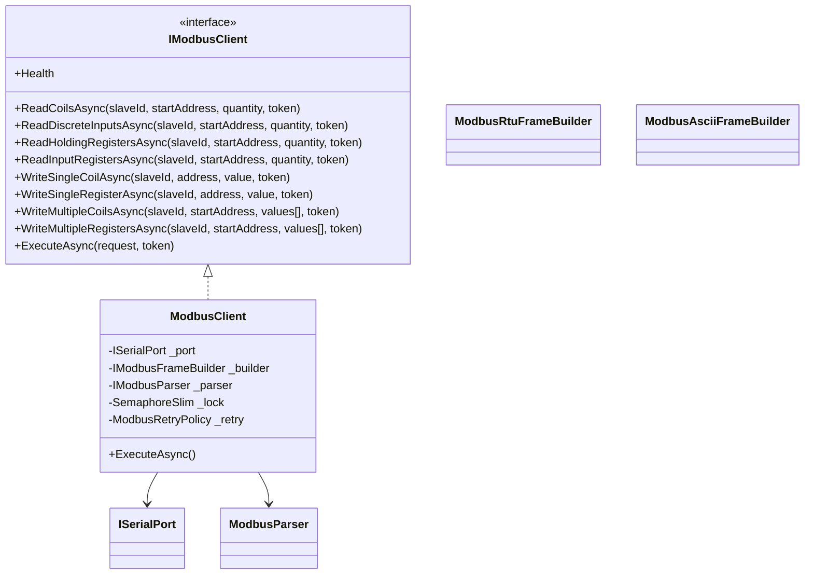
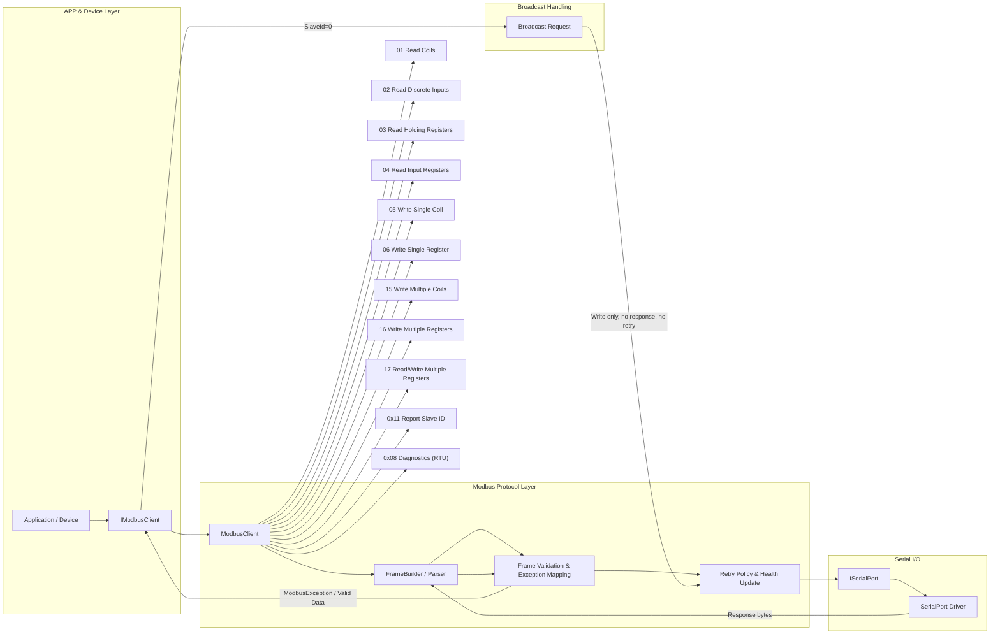
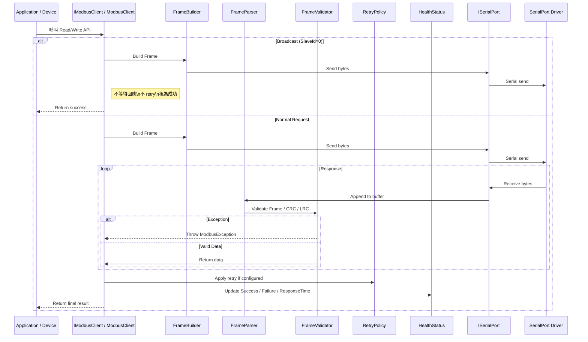

# Calin.Communication.Modbus 架構規劃（工控 LEVEL 5）

## 專案名稱

`Calin.Communication.Modbus`

## 目標

建立工控 LEVEL 5 等級的 **Modbus 協定核心模組**，提供 **RTU / ASCII 完整協定實作**，負責 Frame 建構/解析、Exception 精細化、通訊重試策略、健康度回報與並發控制。

本專案定位為 **Protocol Layer（協定層）**，位於 `Calin.Communication.SerialPort` 之上，提供穩定、可預測、可測試的 Modbus 通訊能力，適用於 24/7 工控環境。

## 環境

- Windows 7 / 10
- .NET Framework 4.8
- C# 9
- 不使用 .NET Core 專屬 API
- 適用低資源設備與舊型工控環境

## 核心設計原則

- **角色定位**：
  - 本專案為 **Protocol Layer（協定層）**
  - 僅負責 Modbus 協定邏輯（RTU / ASCII）
  - 所有實體 I/O 透過 `ISerialPort` 完成
  - 不處理設備狀態與商業邏輯

- **責任範圍（必須）**：
  - Modbus RTU / ASCII Frame 建構與解析
  - CRC / LRC 驗證
  - Function Code 完整支援
  - Exception Code 精細化
  - Retry 策略整合
  - Health 狀態回報
  - 並發控制（Command Serialization）

- **責任排除（禁止）**：
  - AutoReconnect
  - Background Polling
  - Heartbeat
  - UI
  - 商業邏輯
  - 設備專屬實作（Device Driver）

- **優先順序**：
  1. 協定正確性
  2. 穩定性（錯誤可預測）
  3. Deterministic 行為（避免隱性狀態）
  4. 並發安全
  5. 效能
  6. 可測試性

- 所有 public API 必須 thread-safe
- Configuration 初始化後不可變更（immutable）
- 不可依賴時間或外部狀態造成非決定性行為

## 與 SerialPort 關係

- 依賴：
  - `ISerialPort`（唯一 I/O 抽象）

- 不可：
  - 直接操作 SerialPort 實作
  - 假設底層為 RTU（必須抽象）

- 通訊流程：

```text
Application / Device Layer
        ↓
IModbusClient
        ↓
Modbus Protocol Layer（本專案）
        ↓
ISerialPort
        ↓
SerialPortConnection（Driver）
```

## 非同步與 Thread 安全

- 所有 API 必須為 async-first
- 支援 CancellationToken
- 單一 Slave 通訊必須 **序列化（禁止同時送出多筆 request）**
- 可支援多 Slave（透過多 client instance）
- 並發控制：
  - 使用 SemaphoreSlim（1,1）或 Channel
  - 確保 request/response 配對正確
- 禁止：
  - 同一連線上多個未完成 request
  - 使用 lock 封鎖整體 I/O 流程

## Modbus 協定實作

- 必須支援：
  - RTU（CRC16）
  - ASCII（LRC）

- Frame 結構：

### RTU

```text
[SlaveId][Function][Data][CRC_L][CRC_H]
```

### ASCII

```text
: [Address][Function][Data][LRC] \r\n
```

- 必須處理：
  - Frame 邊界判定（RTU silent interval）
  - ASCII Start/End delimiter
  - 半包 / 黏包（stream reassembly）

- Parser 必須：
  - 可處理任意切分的 byte stream
  - 不依賴一次 Read 完整封包

### RTU Timing

```text
- Frame 間隔（≥ 3.5 char time）視為封包邊界
- Frame 內間隔（> 1.5 char time）視為異常
- 超時或間隔異常必須丟棄該 frame
```

### Broadcast

```text
- SlaveId = 0 視為 broadcast
- 不可等待 response
- 不可 retry
- 僅允許 write 類 function code
```

### Response Validation

```text
- Response FunctionCode 必須與 Request 相符
- Exception 回應（Function | 0x80）需轉換為 ModbusException
- Data Length 必須符合對應 Function Code 規範
```

### Endianness

```text
- Register（16-bit）採 Big Endian
- 多 Register（32/64-bit）組合不在本層處理
- 不提供 float/int32 轉換
```

### Frame Size 限制

```text
- RTU 最大建議 256 bytes
- ASCII 最大建議 513 chars（含起訖符號）
- 超過長度必須丟棄並 reset parser
```

### Parser Reset 策略

```text
- CRC/LRC 錯誤 → 丟棄 frame
- Timeout → 清空 buffer
- 異常長度 → reset
```

### Request 前處理

```text
- 每次 request 前應清空 parser buffer
- 必要時可由上層決定是否清空 Serial input buffer
```

## Function Code 支援（最少）

- 01 Read Coils
- 02 Read Discrete Inputs
- 03 Read Holding Registers
- 04 Read Input Registers
- 05 Write Single Coil
- 06 Write Single Register
- 15 Write Multiple Coils
- 16 Write Multiple Registers
- 17 Read/Write Multiple Registers（可擴充）
- 0x11 Report Slave ID（可選擴充）
- RTU 支援 0x08 Diagnostics
- 設計為可擴充（Custom Function Code）

## Exception Code 精細化

- 必須將 Modbus Exception Mapping 為強型別：

```csharp
public enum ModbusExceptionCode
{
    IllegalFunction = 1,
    IllegalDataAddress = 2,
    IllegalDataValue = 3,
    SlaveDeviceFailure = 4,
    Acknowledge = 5,
    SlaveDeviceBusy = 6,
    MemoryParityError = 8,
    GatewayPathUnavailable = 10,
    GatewayTargetFailed = 11
}
```

- 必須轉換為：

```csharp
public class ModbusException : Exception
{
    public ModbusExceptionCode Code { get; }
}
```

- 禁止直接傳遞 raw byte

## Retry 策略（內建）

- 支援：
  - Timeout Retry
  - Exception Retry（可配置是否重試）

- 設定項：

```csharp
public class ModbusRetryPolicy
{
    public int MaxRetries { get; init; }
    public TimeSpan RetryDelay { get; init; }
    public bool RetryOnException { get; init; }
}
```

- 行為：
  - 必須 deterministic（固定次數）
  - 不可無限重試

### Retry 限制

```text
- Read 類操作：允許 retry
- Write 類操作：
  - 預設不可 retry（避免重複寫入）
  - 可由設定覆寫
```

## Health 回報

- 每次 request 必須更新 health：

```csharp
public class ModbusHealthStatus
{
    public bool IsHealthy { get; }
    public int SuccessCount { get; }
    public int FailureCount { get; }
    public TimeSpan LastResponseTime { get; }
    public DateTime LastSuccessTime { get; }
}
```

- 不可：
  - 主動發送 heartbeat
  - 自動觸發任何通訊

## Timeout 與通訊控制

- 每個 request 必須支援：
  - Response Timeout
  - Total Timeout（含 retry）

- 必須支援：
  - CancellationToken 中斷

- Timeout 發生：
  - 視為 failure
  - 進入 retry 或回報 exception

## 類別結構建議



## Frame Builder / Parser 設計

- Builder：
  - Stateless
  - 負責 byte[] 生成

- Parser：
  - Stateful（stream buffer）
  - 必須支援：
    - partial data
    - multi-frame buffer

- CRC / LRC：
  - 必須獨立模組（可測試）

## 並發控制（關鍵）

- 每個 `IModbusClient`：
  - 僅允許 **單一 in-flight request**

- 必須避免：
  - Response 錯配
  - 多執行緒寫入衝突

### 多 Slave 建議

```text
- 每個 Slave 建議使用獨立 IModbusClient instance
- 不建議單一 client 輪詢多 slave（避免 timeout 互相影響）
```

## 錯誤模型

- 分類：

```text
Transport Error（SerialPort）
Protocol Error（CRC/LRC/Frame）
Modbus Exception（設備回傳）
Timeout
```

- 必須區分：
  - 不同錯誤不可混淆

## Logging 規範

- 核心介面：
  - 使用 `Calin.Logging`

- 相依套件：
  - 僅允許 `Microsoft.Extensions.Logging.Abstractions`

- 禁止：
  - 高頻路徑（ReadLoop / Polling）直接呼叫 ILogger
  - 字串插值（$""）或 string.Format 用於 logging

- 必須：
  - 先做 LogLevel 判斷（避免不必要成本）
  - 使用非阻塞 Queue（ConcurrentQueue / Channel）
  - 背景執行批次寫入
  - 所有 logging 不可阻塞 I/O Thread

- 高效能寫法（強制）：
  - 使用 `LoggerMessage.Define` 預編譯 logging
  - 避免 boxing / template parsing / allocation

- 建議：
  - Request/Response trace（可開關）
  - Error 必須記錄

## 狀態管理規範

```text
- 本專案不實作完整狀態機
- 不維護連線狀態（由 SerialPort 層負責）
- 不提供 Ready / NotReady 判定

- 僅允許：
  - 內部 request lifecycle 狀態（不可對外暴露）

- 上層（Device / Application）負責：
  - 設備狀態機
  - 通訊策略（Polling / Retry escalation）
```

## DI 與非 DI 註冊

- 原則：
  - 對外僅暴露 `IModbusClient`
  - 不暴露實作類別

### IModbusClient

```csharp
public interface IModbusClient : IDisposable
{
    Task<bool[]> ReadCoilsAsync(byte slaveId, ushort startAddress, ushort quantity, CancellationToken token);
    Task<bool[]> ReadDiscreteInputsAsync(byte slaveId, ushort startAddress, ushort quantity, CancellationToken token);
    Task<ushort[]> ReadHoldingRegistersAsync(byte slaveId, ushort startAddress, ushort quantity, CancellationToken token);
    Task<ushort[]> ReadInputRegistersAsync(byte slaveId, ushort startAddress, ushort quantity, CancellationToken token);
    Task WriteSingleCoilAsync(byte slaveId, ushort address, bool value, CancellationToken token);
    Task WriteSingleRegisterAsync(byte slaveId, ushort address, ushort value, CancellationToken token);
    Task WriteMultipleCoilsAsync(byte slaveId, ushort startAddress, bool[] values, CancellationToken token);
    Task WriteMultipleRegistersAsync(byte slaveId, ushort startAddress, ushort[] values, CancellationToken token);
    Task<ModbusResponse> ExecuteAsync(ModbusRequest request, CancellationToken token);
    ModbusHealthStatus Health { get; }
}
```

### DI 註冊

- 預設使用 Autofac
- 不可：
  - 在註冊時建立 I/O
  - 使用 Singleton（除非明確單一連線）

## 設定物件

```csharp
public class ModbusConfiguration
{
    public ModbusMode Mode { get; init; } // RTU / ASCII
    public TimeSpan ResponseTimeout { get; init; }
    public TimeSpan TotalTimeout { get; init; }
    public ModbusRetryPolicy RetryPolicy { get; init; }
}
```

## Dispose 規範

```text
1. 停止所有進行中的 request（CancellationToken）
2. 釋放 Semaphore
3. 釋放 Parser buffer
4. 不負責關閉 SerialPort（由外部控制）
```

## 子類專案規範（強制）

例如：`Calin.Communication.Modbus.DeviceX`

- 允許：
  - 包裝 IModbusClient
  - 實作 Polling
  - 狀態管理
  - Domain Model 映射
  - FakeDevice（測試）

- 禁止：
  - 修改本專案
  - 改寫 Modbus 協定行為

## Application 使用規範

- 僅依賴：
  - `IModbusClient`

- 不可：
  - 直接依賴 RTU / ASCII
  - 操作 Frame

- 建議：
  - 透過 Device Layer 封裝設備語意

---

# IModbusClient 與 Function Code + Broadcast 處理流程

讓開發者能一眼看到請求到回應的整體流程。



### 說明

- **APP & Device Layer**：依賴 `IModbusClient`，不直接操作 Frame。
- **Modbus Protocol Layer**：
  - `ModbusClient` 封裝 Function Code 呼叫。
  - `FrameBuilder/Parser` 處理 RTU/ASCII Frame 生成與解析。
  - `Frame Validation & Exception Mapping` 確保 FunctionCode 對應與 Exception 轉換。
  - `Retry Policy & Health Update` 根據配置進行重試，更新健康狀態。

- **Serial I/O**：所有 I/O 由 `ISerialPort` 封裝，支援多種底層串口。
- **Function Code 支援**：完整列出 01~17、0x08、0x11。
- **Broadcast Handling**：
  - 只針對 SlaveId=0 的 Write 類 Function Code。
  - 不等待 Response。
  - 不執行 Retry。
  - 直接視為成功。

---

# Sequence Diagram

呈現單一 request 從 APP 呼叫 `IModbusClient` 到 SerialPort 回應，再到 Health 更新的完整流程，包含 Broadcast 與 Retry 情況。



### 說明

- **Broadcast 特殊處理**：
  - 只針對 SlaveId=0
  - 不等待回應
  - 不執行 Retry
  - 直接視為成功

- **Normal Request**：
  - Request → FrameBuilder → ISerialPort → Driver → Parser → Validator → Client → Retry → Health → 回傳 APP

- **Parser / Validator**：
  - 支援半包、黏包、異常 frame 處理
  - Exception 轉 `ModbusException`

- **Retry**：
  - Timeout / Exception 根據設定可 retry
  - Write 類操作預設不 retry（避免重複寫入）

- **HealthStatus**：
  - 每個 request 結束後更新
  - 包含 SuccessCount、FailureCount、LastResponseTime、LastSuccessTime

這個 Sequence Diagram 可以直接放在你的規範文件，對開發者說明 **Request 到 Response 完整流程**、Broadcast 與 Retry 特殊規則。
