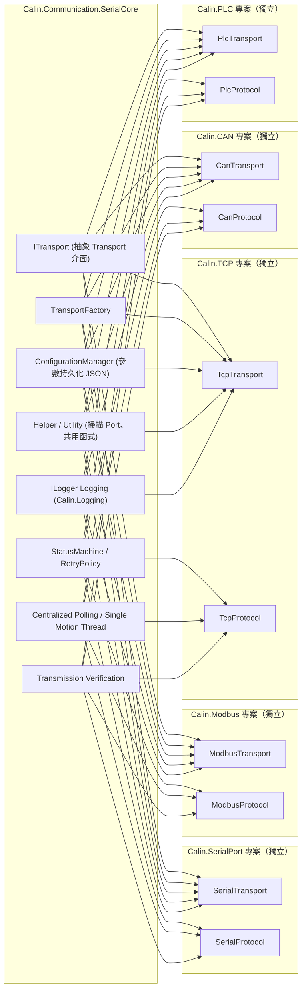
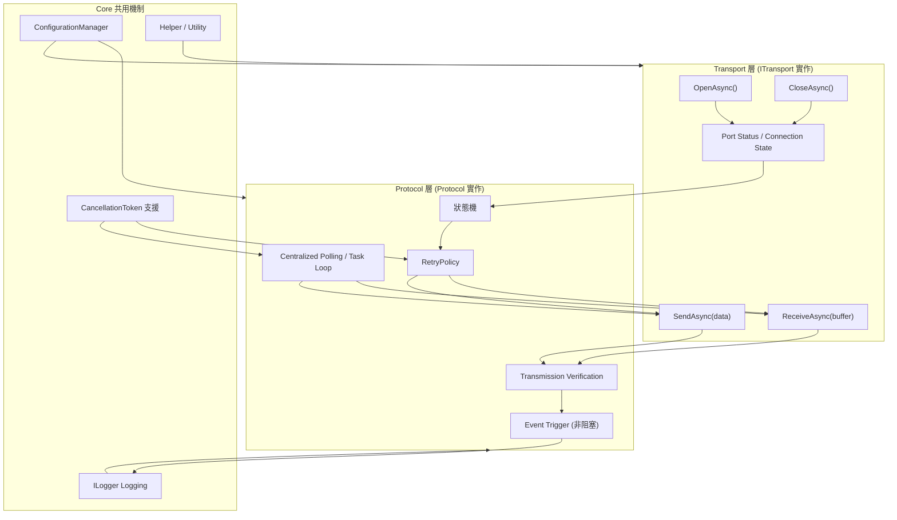
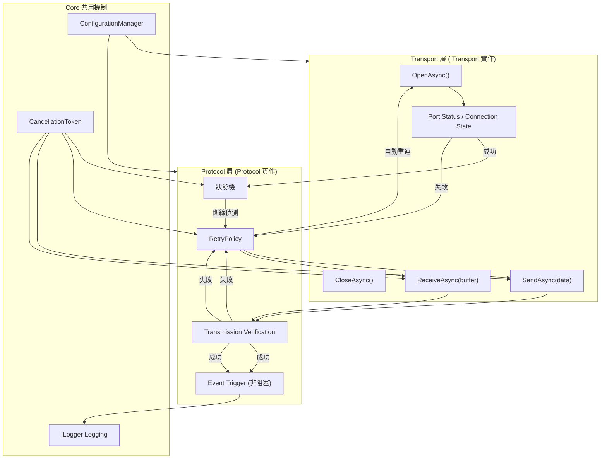
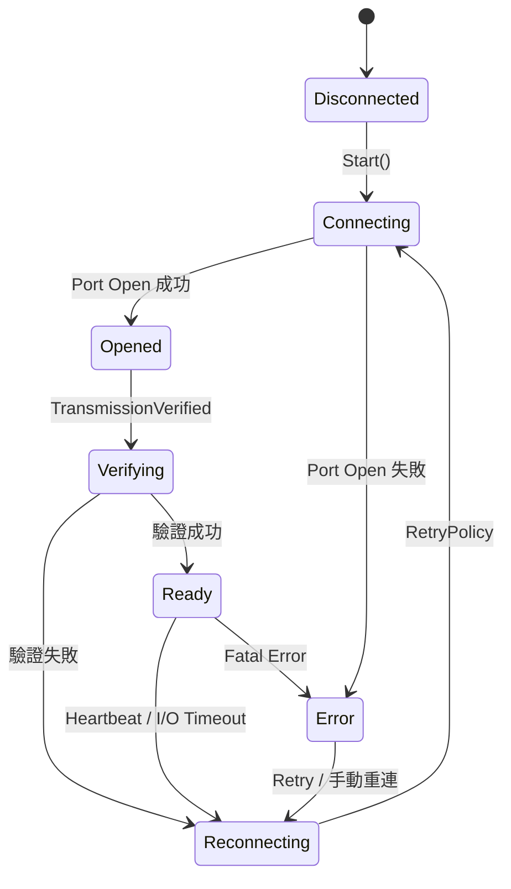
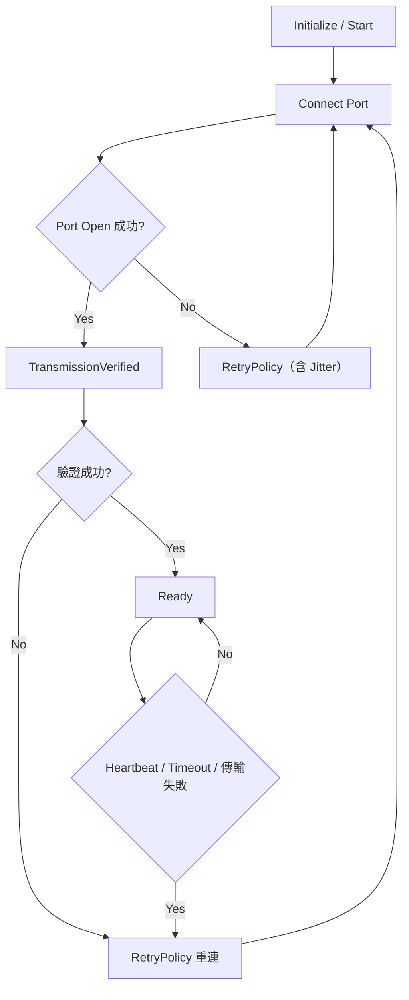
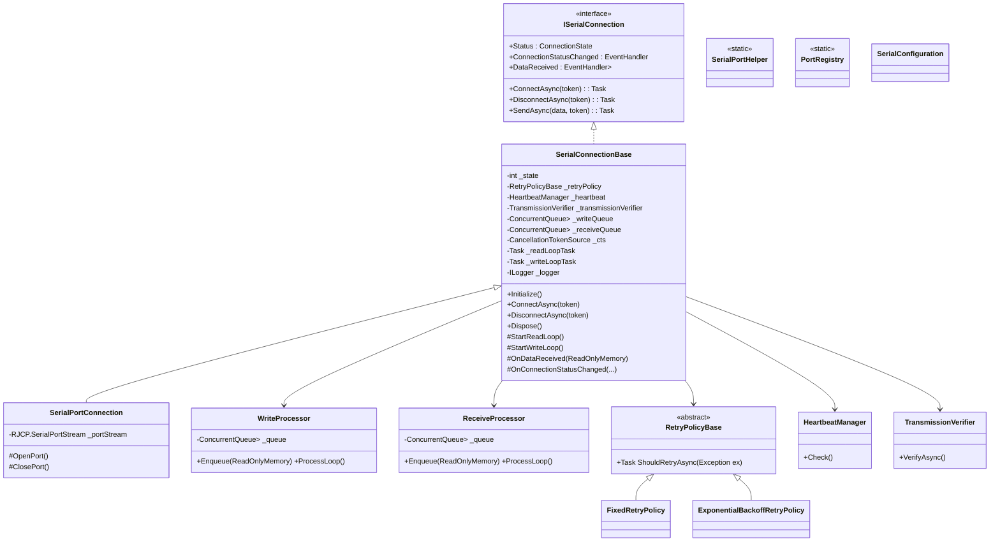

# 目錄

- [目錄](#目錄)
- [`Calin.Communication.SerialCore` 與未來擴充專案獨立化架構圖](#calincommunicationserialcore-與未來擴充專案獨立化架構圖)
  - [Calin.Communication.SerialCore 架構圖（概念）](#calincommunicationserialcore-架構圖概念)
    - [說明](#說明)
- [串列通訊專案內部 Transport 與 Protocol 的資料流與 Polling 流程圖](#串列通訊專案內部-transport-與-protocol-的資料流與-polling-流程圖)
  - [說明](#說明-1)
- [完整 Core + 多專案資料流整合圖](#完整-core--多專案資料流整合圖)
  - [圖表說明](#圖表說明)
- [序列通訊內部事件流程圖](#序列通訊內部事件流程圖)
  - [流程說明](#流程說明)
- [Calin.Communication.SerialCore 規範（工控 LEVEL 5）](#calincommunicationserialcore-規範工控-level-5)
  - [專案名稱](#專案名稱)
  - [目標](#目標)
  - [環境](#環境)
  - [核心設計原則](#核心設計原則)
  - [非同步與 Thread 安全](#非同步與-thread-安全)
  - [I/O 與錯誤處理](#io-與錯誤處理)
  - [串列通訊核心功能](#串列通訊核心功能)
  - [ConnectionState Enum](#connectionstate-enum)
  - [I/O Pipeline（強制規範）](#io-pipeline強制規範)
  - [Memory / Buffer 管理（強制）](#memory--buffer-管理強制)
  - [狀態機設計](#狀態機設計)
  - [狀態管理（強制）](#狀態管理強制)
  - [Retry 與 TransmissionVerified 流程](#retry-與-transmissionverified-流程)
  - [類別結構建議](#類別結構建議)
  - [背景 Task / Polling 設計](#背景-task--polling-設計)
  - [Event 與 Callback 規範](#event-與-callback-規範)
  - [Logging 規範](#logging-規範)
  - [設定與持久化](#設定與持久化)
  - [Helper 範例](#helper-範例)
  - [Dispose 強化規範](#dispose-強化規範)
  - [核心強化規範](#核心強化規範)
- [Calin.Communication.SerialCore Prompt](#calincommunicationserialcore-prompt)

---

# `Calin.Communication.SerialCore` 與未來擴充專案獨立化架構圖

清楚呈現各層責任、抽象化與專案獨立性。

## Calin.Communication.SerialCore 架構圖（概念）



### 說明

1. **Core 層**
   - 完全抽象化 Transport 與 Protocol，不依賴任何通訊專案。
   - 提供狀態機、RetryPolicy、Centralized Polling、傳輸驗證與 ILogger。
   - ConfigurationManager 負責參數持久化與共用設定。
   - Helper 提供常用工具，例如掃描 SerialPort、檢查 Port 可用性。
2. **專案層**（SerialPort / Modbus / TCP / CAN / PLC）
   - 各專案完全獨立，只依賴 Core 提供的抽象。
   - Transport 層實作 ITransport 介面。
   - Protocol 層實作對應的訊息處理邏輯。
   - 各專案可獨立測試、部署與升級，不影響 Core 或其他專案。
   - 共用 Core 的 Polling 與 Logging 機制，保持工控 Level 5 標準。
3. **事件與 Thread Safety**
   - Core 層提供 thread-safe 公開 API。
   - 所有事件非阻塞 I/O Thread，避免 re-entrancy。
   - Background Task 支援 CancellationToken 安全停止。
4. **擴充性**
   - 新增任何通訊專案，只需實作 ITransport + Protocol 層。
   - 不需要改 Core 層即可享有共用功能。

這個架構保證：

- **穩定性**：狀態機 + Retry + Polling
- **可維護性**：抽象化 + 專案獨立化
- **擴充性**：新增專案無需修改 Core
- **效能**：Centralized Polling + 最小物件分配

---

# 串列通訊專案內部 Transport 與 Protocol 的資料流與 Polling 流程圖

顯示事件觸發、Retry、傳輸驗證、CancellationToken 安全停止等流程：



## 說明

1. **Transport 層**
   - 封裝實際 I/O（SerialPort / TCP / CAN / PLC），提供 Open/Close、Send/Receive。
   - 只暴露必要 API，對外不直接透漏底層 Stream。
2. **Protocol 層**
   - 負責狀態機、RetryPolicy、傳輸驗證、Centralized Polling。
   - PollLoop 控制周期性資料傳送/接收，支援 CancellationToken 安全停止。
   - EventTrigger 非阻塞觸發外部事件，所有異常寫入 Logger。
3. **Core 共用機制**
   - Logger：記錄錯誤、Retry、異常事件，不阻塞 I/O。
   - ConfigurationManager：參數持久化與載入。
   - CancellationToken：安全停止背景任務與 Polling。
   - Helper：共用功能，如掃描可用 Port、格式轉換等。
4. **Retry + Transmission Verification**
   - 任何 Send / Receive 都會經過驗證。
   - 發生失敗時觸發 RetryPolicy，確保穩定性。
5. **事件與 Thread Safety**
   - 所有 public API thread-safe，事件非阻塞，避免 race condition 或 deadlock。
   - PollLoop 與 Retry 都可以被 CancellationToken 安全停止，符合 24/7 長時間運作需求。

這個圖可以直接對應到你未來的 **SerialPort / Modbus / TCP / CAN / PLC 專案**，每個專案都會用同樣的 Core 機制實作 Transport + Protocol，保證穩定性與可維護性。

---

# 完整 Core + 多專案資料流整合圖

清楚呈現從 Core 到各專案的 Polling、Retry、事件、Logging 資料流與擴充架構：

```mermaid
flowchart TD
    %% Core 層
    subgraph Core["Calin.Communication.SerialCore"]
        direction TB
        ITransport["ITransport (抽象 Transport 介面)"]
        TransportFactory["TransportFactory"]
        StateMachine["StateMachine / RetryPolicy"]
        PollLoop["Centralized Polling / Single Motion Thread"]
        Verify["Transmission Verification"]
        Logger["ILogger Logging"]
        Config["ConfigurationManager (JSON)"]
        Helper["Helper / Utility"]
        Cancellation["CancellationToken 支援"]
    end

    %% 專案層
    subgraph SerialPortProj["Calin.SerialPort 專案（獨立）"]
        SerialTransport["SerialTransport"]
        SerialProtocol["SerialProtocol"]
    end

    subgraph ModbusProj["Calin.Modbus 專案（獨立）"]
        ModbusTransport["ModbusTransport"]
        ModbusProtocol["ModbusProtocol"]
    end

    subgraph TCPProj["Calin.TCP 專案（獨立）"]
        TcpTransport["TcpTransport"]
        TcpProtocol["TcpProtocol"]
    end

    subgraph CANProj["Calin.CAN 專案（獨立）"]
        CanTransport["CanTransport"]
        CanProtocol["CanProtocol"]
    end

    subgraph PLCProj["Calin.PLC 專案（獨立）"]
        PlcTransport["PlcTransport"]
        PlcProtocol["PlcProtocol"]
    end

    %% Core 與專案依賴
    ITransport --> SerialTransport
    ITransport --> ModbusTransport
    ITransport --> TcpTransport
    ITransport --> CanTransport
    ITransport --> PlcTransport

    TransportFactory --> SerialTransport
    TransportFactory --> ModbusTransport
    TransportFactory --> TcpTransport
    TransportFactory --> CanTransport
    TransportFactory --> PlcTransport

    StateMachine --> SerialProtocol
    StateMachine --> ModbusProtocol
    StateMachine --> TcpProtocol
    StateMachine --> CanProtocol
    StateMachine --> PlcProtocol

    PollLoop --> SerialProtocol
    PollLoop --> ModbusProtocol
    PollLoop --> TcpProtocol
    PollLoop --> CanProtocol
    PollLoop --> PlcProtocol

    Verify --> SerialProtocol
    Verify --> ModbusProtocol
    Verify --> TcpProtocol
    Verify --> CanProtocol
    Verify --> PlcProtocol

    Logger --> SerialProtocol
    Logger --> ModbusProtocol
    Logger --> TcpProtocol
    Logger --> CanProtocol
    Logger --> PlcProtocol

    Config --> SerialTransport
    Config --> ModbusTransport
    Config --> TcpTransport
    Config --> CanTransport
    Config --> PlcTransport

    Helper --> SerialTransport
    Helper --> ModbusTransport
    Helper --> TcpTransport
    Helper --> CanTransport
    Helper --> PlcTransport

    Cancellation --> PollLoop
    Cancellation --> StateMachine

    %% 資料流示意
    SerialTransport -->|Send/Receive| SerialProtocol
    SerialProtocol -->|Event Trigger| Logger
    SerialProtocol -->|Retry / Verify| SerialTransport

    ModbusTransport -->|Send/Receive| ModbusProtocol
    ModbusProtocol -->|Event Trigger| Logger
    ModbusProtocol -->|Retry / Verify| ModbusTransport

    TcpTransport -->|Send/Receive| TcpProtocol
    TcpProtocol -->|Event Trigger| Logger
    TcpProtocol -->|Retry / Verify| TcpTransport

    CanTransport -->|Send/Receive| CanProtocol
    CanProtocol -->|Event Trigger| Logger
    CanProtocol -->|Retry / Verify| CanTransport

    PlcTransport -->|Send/Receive| PlcProtocol
    PlcProtocol -->|Event Trigger| Logger
    PlcProtocol -->|Retry / Verify| PlcTransport
```



## 圖表說明

1. **Core 層**
   - 提供抽象介面 ITransport、TransportFactory、狀態機/Retry、Polling、傳輸驗證、Logger、Config、Helper、CancellationToken。
   - 所有專案都依賴 Core 提供的共用機制，保持工控 Level 5 標準。
2. **專案層**
   - 每個專案（SerialPort / Modbus / TCP / CAN / PLC）完全獨立。
   - 封裝自己的 Transport 與 Protocol，實作 Core 的抽象接口。
   - 可獨立測試與部署，不影響 Core 或其他專案。
3. **資料流**
   - Transport 層負責 I/O，Protocol 層負責狀態機、Retry、傳輸驗證。
   - PollLoop 控制週期性操作，支援 CancellationToken 安全停止。
   - Event Trigger 非阻塞觸發 Logger，確保 I/O Thread 不阻塞。
4. **擴充性與維護性**
   - 新增專案只需實作 ITransport + Protocol，無需修改 Core。
   - 所有專案共用 Polling、Retry、Logging、Config、Helper 機制。

這張圖同時整合了**架構層級**與**資料流 / Polling / Retry 流程**，可以直接作為專案設計藍圖使用。

---

# 序列通訊內部事件流程圖

涵蓋 **斷線偵測、自動重連、RetryPolicy、傳輸驗證**，呈現從 Transport 到 Protocol 的事件與流程控制：



## 流程說明

1. **連線建立**
   - OpenAsync 嘗試開啟 Port/連線。
   - 成功 → 狀態機管理，失敗 → 觸發 RetryPolicy 自動重連。
2. **傳送與接收**
   - Send / Receive 進入 Transmission Verification。
   - 驗證成功 → Event Trigger 發布事件（非阻塞）。
   - 驗證失敗 → RetryPolicy 重試，保證穩定性。
3. **斷線偵測與自動重連**
   - 狀態機監控 Port 狀態。
   - 發現斷線 → RetryPolicy 自動重連。
   - Retry 次數、延遲策略可透過 Core 設定。
4. **CancellationToken 支援**
   - 所有背景 Task（PollLoop / Send / Receive / Retry）可安全停止。
   - 確保 24/7 長時間運作時能被外部安全取消。
5. **Logging 與配置**
   - EventTrigger 事件非阻塞寫入 Logger。
   - ConfigurationManager 提供 Port 設定、Protocol 參數持久化。

這張圖完整描述了 **內部事件與控制流程**，適用於 **SerialPort / Modbus / TCP / CAN / PLC** 所有專案實作，並符合你的 **Level 5 工控規範**。

---

# Calin.Communication.SerialCore 規範（工控 LEVEL 5）

## 專案名稱

`Calin.Communication.SerialCore`

## 目標

建立工控 LEVEL 5 等級的串列通訊核心模組，作為 RS-232 / RS-485 / RS-422 / USB-Serial / Modbus / TCP / CAN / PLC 等通訊基礎程式庫。核心功能為長時間穩定運行、支援大量設備並行（100+）、低資源消耗、24/7 運作，並確保 I/O 高效能與記憶體可控。

## 環境

- Windows 7 / 10
- .NET Framework 4.8
- C# 9
- 適用低階資源、舊硬體
- 不使用 .NET Core 專屬 API

## 核心設計原則

- **優先順序**：
  1. 穩定性
  2. 相容性
  3. 效能
  4. 可預測性
  5. 可維護性
  6. 擴充性
  7. 優雅設計

- 架構簡潔、輕量化，避免過度設計
- 支援 24/7 運作及大量設備並行（100+）
- 無記憶體洩漏，減少物件分配與 GC 壓力
- 高頻路徑禁止隱式配置（LINQ / boxing / new byte[]）
- 遵守 Interface Segregation 原則
- 使用 `Microsoft.Extensions.Logging.ILogger` 作為唯一 logging abstraction
- 每個類別與介面需有 XML Summary（正體中文）
- `Dispose` 必須完整釋放資源且可重入
- 禁止 `Thread.Abort`
- 避免 race condition / deadlock / event re-entrancy
- 所有 public API 必須 thread-safe
- 事件不可阻塞 I/O 執行緒

## 非同步與 Thread 安全

- 禁止 `async void`（UI Handler 除外）
- 所有 Task / ValueTask 必須支援 CancellationToken
- 背景 Task 必須安全停止並捕捉所有例外
- 禁止未受控 fire-and-forget
- 公開 API 或長時間 Task 使用 `async Task`
- 內部短期、頻繁非同步可使用 `async ValueTask`
- Centralized Polling / Single Polling Thread
- 每個 Connection：
  - 單一 Read Loop（唯一）
  - 單一 Write Queue（序列化輸出）
- Polling 固定週期，避免漂移或 Busy Loop
- 禁止多執行緒直接操作 SerialPort
- 禁止多 Writer 同時寫入 Port

## I/O 與錯誤處理

- 建構子不得執行 I/O
- Initialize / Start / Stop / Dispose 必須安全且可重入
- 所有 I/O 操作必須可 Timeout
- 設備異常（斷線、無回應、傳輸失敗）必須被安全處理
- 單一設備或任務失敗不得影響整體系統
- Logging 高頻循環不可阻塞主流程
- I/O Pipeline 必須解耦（Read / Process / Event）
- 常見例外需分類處理：
  - IOException（USB 拔除）
  - UnauthorizedAccessException（Port 被佔用）
  - TimeoutException（Read timeout）
  - InvalidOperationException（Port 狀態錯亂）

## 串列通訊核心功能

- 使用 `RJCP.SerialPortStream`，不可直接曝露給外部，禁用 `System.IO.Ports`
- 支援 RS-232 / RS-485 / RS-422 / USB-Serial
- 可偵測斷線並自動重連
  - USB-Serial 需靠 Heartbeat / Polling 與最後回應時間戳判斷
- TransmissionVerified 功能：
  - 核心檢測 Port 是否可實際傳輸
  - 分級驗證：
    - Level 1：Port Open 成功
    - Level 2：Write 成功
    - Level 3：Read 回應成功（最終判定）
  - 可透過 Heartbeat / Ping / Echo / 測試資料
  - 成功才認定設備可用
  - **策略接口**：
    - `ITransmissionProbe` 可替換不同協議（PLC / Modbus / ASCII / Binary）
    - Probe 必須 timeout、retry、至少一次完整 request/response cycle
- RetryPolicy 抽象化：
  - 固定間隔 / 指數退避
  - 最大重試次數與總時間
  - 必須加入 Jitter（避免同步重連風暴）
- 傳輸驗證（CRC / Checksum / 自訂策略）
- 減少 Buffer 複製，使用共享 / Ring Buffer
- 防止同一 PortName 被重複開啟（全域 Port Registry，僅保證同 Process）
- 參數持久化（Newtonsoft.Json，僅限非高頻）
- 提供 Helper 類：
  - 列出可用串列埠
  - 檢查 Port 使用狀態
  - 簡易連線測試
- Write Queue 背壓策略：
  - Fail-fast + Log（Queue 滿時丟失最舊資料）
- Receive Queue 僅提供 raw stream，**封包邊界由 Parser 層處理**

## ConnectionState Enum

```csharp
public enum ConnectionState
{
    Disconnected = 0,
    Connecting = 1,
    Opened = 2,
    Verifying = 3,
    Ready = 4,
    Reconnecting = 5,
    Error = 6
}
```

- Ready = Open + TransmissionVerified 成功
- Opened 不可對外視為可用
- Error 不可停留，必須導向 Reconnecting 或 Dispose

## I/O Pipeline（強制規範）

```text
[SerialPort ReadLoop]
    ↓（僅資料搬移，不做邏輯）
[ArrayPool Buffer]
    ↓
[Receive Queue / RingBuffer]
    ↓
[Protocol Parser / 上層處理]
    ↓
[Event / Callback（非阻塞）]
```

- DataReceived / ReadLoop：
  - 不可做解析
  - 不可觸發事件
  - 不可阻塞
- 必須寫入內部 Queue / RingBuffer
- Write 必須透過 Queue，不可直接寫入 Port

## Memory / Buffer 管理（強制）

- 禁止：
  - 高頻路徑使用 `new byte[]`
- 必須：
  - `ArrayPool<byte>.Shared`
  - `Memory<byte>` / `Span<byte>`
- 規範：
  - 租借 → 使用 → finally 歸還
  - 不可跨執行緒持有 pooled buffer
  - 不可長時間持有 buffer
  - 減少 buffer 複製（零拷貝或單次拷貝）

## 狀態機設計



## 狀態管理（強制）

- 使用 `Interlocked` / `Volatile`
- 狀態轉換必須原子操作
- 禁止多執行緒同時修改狀態
- 必須避免狀態競態（race condition）
- Dispose 必須雙重保護：\_disposed flag + Interlocked

## Retry 與 TransmissionVerified 流程



## 類別結構建議



## 背景 Task / Polling 設計

```text
- 單一 Polling Thread 處理所有設備
- 每個設備：
    - Heartbeat 檢查
    - Timeout 判斷
    - TransmissionVerified 狀態檢查
    - 狀態轉換
- Polling 禁止執行 I/O
- I/O 僅存在於各自 Connection Task
- 捕捉所有例外
- 支援 CancellationToken 安全停止
- 固定 Polling 週期，使用 Stopwatch 校正，避免漂移或 Busy Loop
- 所有高頻事件非阻塞
```

## Event 與 Callback 規範

- 不可在 I/O Thread 直接觸發
- 必須非同步派送（Queue / Task）
- try-catch 保護
- 順序必須保證
- Queue 滿：Drop 最舊資料

## Logging 規範

- 核心介面：
  - 使用 `Microsoft.Extensions.Logging.ILogger`
- 相依套件：
  - 僅允許 `Microsoft.Extensions.Logging.Abstractions`
- 禁止：
  - 高頻路徑（ReadLoop / Polling）直接呼叫 ILogger
  - 字串插值（$""）或 string.Format 用於 logging
- 必須：
  - 先做 LogLevel 判斷（避免不必要成本）
  - 使用非阻塞 Queue（ConcurrentQueue / Channel）
  - 背景執行批次寫入
  - 所有 logging 不可阻塞 I/O Thread
- 高效能寫法（強制）：
  - 使用 `LoggerMessage.Define` 預編譯 logging
  - 避免 boxing / template parsing / allocation

```csharp
private static readonly Action<ILogger, int, Exception?> _logValue =
    LoggerMessage.Define<int>(
        LogLevel.Debug,
        new EventId(1001, nameof(LogValue)),
        "Value: {Value}");
```

- 呼叫方式：

```csharp
_logValue(_logger, value, null);
```

- 背壓策略：
  - logging queue 滿時 Drop（避免阻塞主流程）
- 錯誤等級規範：
  - Error：設備異常 / I/O failure
  - Warning：重試 / 非致命錯誤
  - Info：狀態變化（非高頻）
  - Debug：禁止出現在高頻路徑

## 設定與持久化

```csharp
public class SerialConfiguration
{
    public string PortName { get; set; }
    public int BaudRate { get; set; }
    public Parity Parity { get; set; }
    public int DataBits { get; set; }
    public StopBits StopBits { get; set; }
    public TimeSpan Timeout { get; set; }
    public RetryPolicyConfiguration RetryPolicy { get; set; }

    public void Load(string filePath)
    {
        var json = File.ReadAllText(filePath);
        var config = JsonConvert.DeserializeObject<SerialConfiguration>(json);
        // Thread-safe apply
    }

    public void Save(string filePath)
    {
        var json = JsonConvert.SerializeObject(this, Formatting.Indented);
        File.WriteAllText(filePath, json);
    }
}
```

- 僅允許：
  - 啟動前載入
  - 手動更新
- 禁止高頻 JSON 操作

## Helper 範例

```csharp
public static class SerialPortHelper
{
    public static string[] GetAvailablePorts()
    {
        return RJCP.IO.Ports.SerialPortStream.GetPortNames();
    }

    public static bool IsPortAvailable(string portName)
    {
        try
        {
            using var port = new RJCP.IO.Ports.SerialPortStream(portName);
            port.Open();
            port.Close();
            return true;
        }
        catch
        {
            return false;
        }
    }
}
```

## Dispose 強化規範

```text
1. _disposed flag + Interlocked 防重入
2. Cancel 所有 Token
3. 停止 Read Loop
4. 停止 Write Queue
5. 等待 Task 結束（含 timeout）
6. 關閉 SerialPort
7. 歸還所有 Buffer（ArrayPool）
```

## 核心強化規範

- CORE 層統一管理 Heartbeat / TransmissionVerified / Polling / RetryPolicy
- App 只訂閱事件，不需處理 I/O 或重連邏輯
- USB 轉接頭斷線偵測與 TransmissionVerified 均在 CORE 層完成
- 所有高頻 I/O 操作與事件均非阻塞
- 每個 PortName 由 CORE 層管理，避免重複開啟
- 高頻循環 Log 使用非阻塞 Queue 批次寫入
- I/O、Memory、Thread Model 必須符合高效能強制規範
- TransmissionVerified 與 Heartbeat 職責明確切割
- Write / Receive Queue 背壓與順序策略明確
- Polling 固定週期使用 Stopwatch 校正
- PortRegistry 僅保證 in-process 單例

---

# Calin.Communication.SerialCore Prompt
