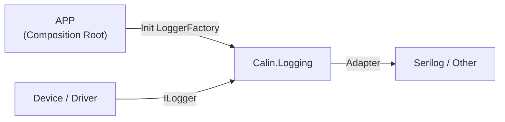
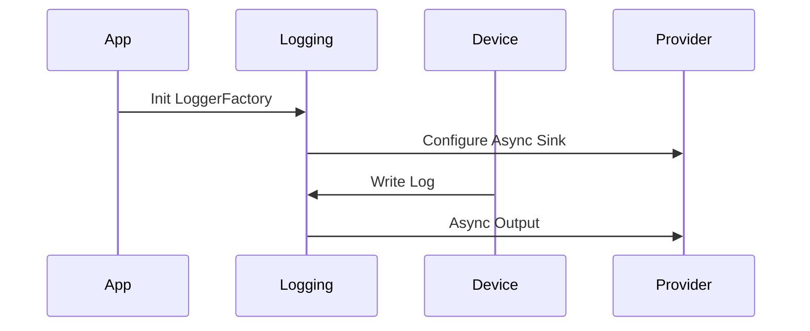
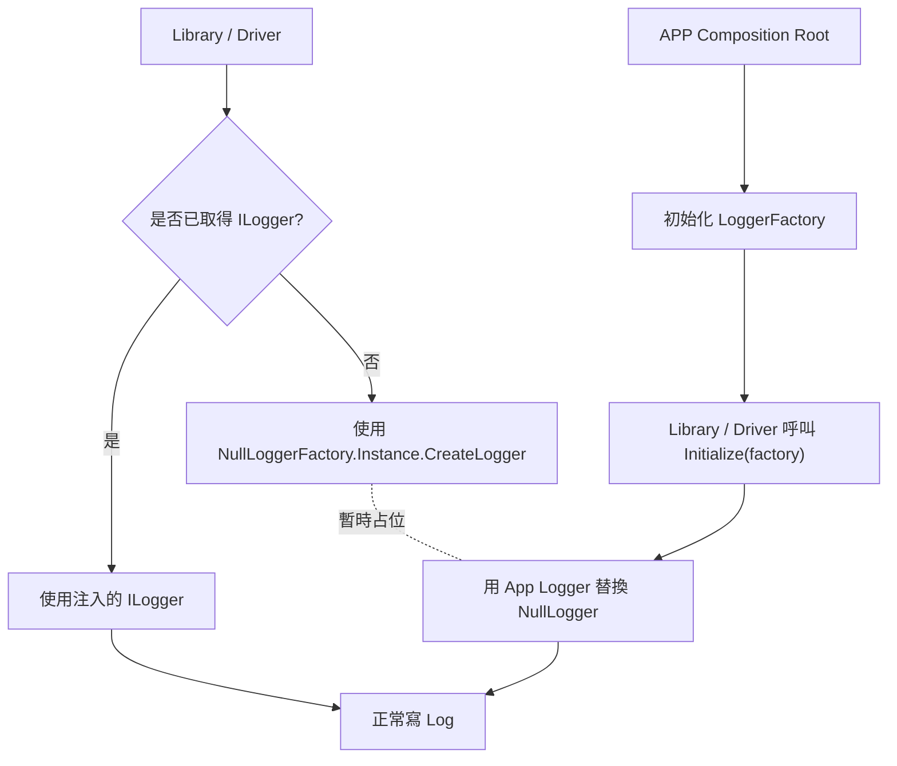
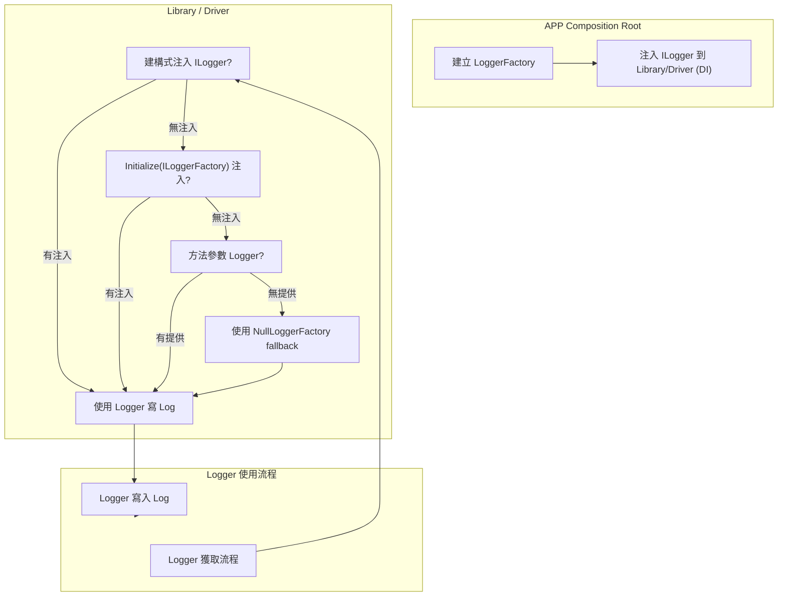

# Calin.Logging（工控 Level 5 Logging 核心規範）

本規範為可直接落地之工控等級 Logging 架構（Level 5），已完整涵蓋穩定性、效能、決定性與長時間運行需求，並明確限制 Logger 使用方式，避免架構退化。

專案名稱：`Calin.Logging`
技術平台：.NET Framework 4.8
適用：WPF / WinForm / Console / Service

## 設計目標

- 完整隔離 Logging Framework（預設 Serilog，可替換）
- Logging 不影響主流程（Failure Isolation）
- 支援 DI / 非 DI
- 適用 24/7 長時間運行
- 最小化 allocation 與 GC 壓力
- 明確限制 Logger 取得方式（避免濫用）
- 維持輕量設計（無過度抽象）

## 核心設計原則

- Logging 能力集中於 Infrastructure
- Logging 決策完全由 App 控制
- Logger 初始化僅允許於 App Composition Root
- Library / Driver 僅能寫 Log
- Logging 必須非阻塞（Non-blocking）
- Logging 不得影響系統穩定性
- Logging 依賴必須為「顯式依賴」

## 架構總覽



## 專案結構

```text
Calin.Logging
│
├─ Abstractions
│  ├─ ILoggingConfigurator.cs
│
├─ Context
│  ├─ LoggingScope.cs
│
├─ Performance
│  ├─ LogMessages.cs
│  ├─ LogThrottle.cs
│
├─ Safety
│  ├─ NullLoggerFactory.cs
│
├─ Extensions
│  ├─ LoggerExtensions.cs
│
├─ Autofac
│  ├─ AutofacLoggingModule.cs
│
└─ README.md
```

## Namespace 規劃

```text
Calin.Logging
Calin.Logging.Abstractions
Calin.Logging.Context
Calin.Logging.Performance
Calin.Logging.Safety
Calin.Logging.Extensions
Calin.Logging.Autofac
```

## 責任區塊說明

### Abstractions

- 定義最小初始化擴充點（僅 App 使用）

### Context

- 提供 Scope 傳遞 Device Context
- 僅限低頻使用（避免 allocation）

### Performance

- 預編譯 Logging（LoggerMessage）
- 提供節流機制避免 Log 洪水

### Safety

- 保證 Logging 永不影響主流程
- 提供 NullLogger fallback

### Extensions

- 提供必要的 ILogger 擴充（避免重複碼）
- 僅允許語法糖封裝，不得改變 Logging 行為或加入隱性邏輯

### Autofac

- 僅負責 ILogger 注入
- 不參與初始化

## 關鍵設計

### NullLoggerFactory（Level 5 必備）

```csharp
namespace Calin.Logging.Safety
{
    /// <summary>
    /// 防止未初始化 Logger 導致系統異常
    /// </summary>
    public sealed class NullLoggerFactory : ILoggerFactory
    {
        public static readonly NullLoggerFactory Instance = new();

        public ILogger CreateLogger(string categoryName)
            => Microsoft.Extensions.Logging.Abstractions.NullLogger.Instance;

        public void AddProvider(ILoggerProvider provider) { }

        public void Dispose() { }
    }
}
```

## LoggingScope（低頻 Context）

```csharp
namespace Calin.Logging.Context
{
    /// <summary>
    /// 設備 Scope（禁止高頻使用）
    /// </summary>
    public static class LoggingScope
    {
        public static IDisposable BeginDeviceScope(
            ILogger logger,
            string deviceId,
            string portName = null,
            string station = null)
        {
            return logger.BeginScope(new Dictionary<string, object>
            {
                ["DeviceId"] = deviceId,
                ["PortName"] = portName,
                ["Station"] = station
            });
        }
    }
}
```

## 高效能 Logging（強制）

```csharp
namespace Calin.Logging.Performance
{
    /// <summary>
    /// 預編譯 Log（避免 allocation）
    /// </summary>
    public static class LogMessages
    {
        private static readonly Action<ILogger, string, Exception> _deviceConnected =
            LoggerMessage.Define<string>(
                LogLevel.Information,
                new EventId(1001, "DeviceConnected"),
                "Device connected: {DeviceId}");

        public static void DeviceConnected(ILogger logger, string deviceId)
        {
            _deviceConnected(logger, deviceId, null);
        }
    }
}
```

## LogThrottle（高頻防護）

```csharp
namespace Calin.Logging.Performance
{
    /// <summary>
    /// 簡易節流（避免 Log 洪水）
    /// </summary>
    public static class LogThrottle
    {
        private static long _lastTicks;

        public static bool ShouldLog(int intervalMs)
        {
            var now = Environment.TickCount64;
            var last = Interlocked.Read(ref _lastTicks);

            if (now - last < intervalMs)
                return false;

            Interlocked.Exchange(ref _lastTicks, now);
            return true;
        }
    }
}
```

## Logger 取得規範（強制）

```text
所有 Library / Driver 必須依照以下優先順序取得 ILogger：

1. 建構式注入（ILogger<T>）【首選】
2. Initialize / 方法注入
3. Property Injection（限制使用）
4. Stateless 方法參數傳入 ILogger

禁止：
- 全域 Logger（LoggingBridge 類型）
- static Logger
- Service Locator
```

### 建構式注入（標準）

```text
- 使用 ILogger<T>
- 為唯一推薦方式
```

### Initialize 注入（允許）

```text
適用：
- 無法控制建構式（Framework / Legacy）

要求：
- 提供 Initialize(ILoggerFactory)
- 必須具備 NullLogger fallback
```

### Property Injection（限制）

```text
- Logger 不可為強制依賴
- 必須允許 null
- 必須 fallback 至 NullLogger
```

### 方法注入（Stateless）

```text
- Utility 類別使用
- 不保存 Logger
```

## 非 DI 安全範例

```csharp
public class LegacyComponent
{
    private ILogger _logger = NullLoggerFactory.Instance.CreateLogger(nameof(LegacyComponent));

    public void Initialize(ILoggerFactory factory)
    {
        _logger = factory?.CreateLogger<LegacyComponent>()
                  ?? NullLoggerFactory.Instance.CreateLogger(nameof(LegacyComponent));
    }
}
```

## Autofac 註冊

```csharp
namespace Calin.Logging.Autofac
{
    public class AutofacLoggingModule : Module
    {
        protected override void Load(ContainerBuilder builder)
        {
            builder.Register(ctx =>
            {
                var factory = ctx.Resolve<ILoggerFactory>();
                return factory.CreateLogger("Default");
            })
            .As<ILogger>()
            .SingleInstance();
        }
    }
}
```

## ILoggerFactory 生命週期規範

```text
- 必須為 Singleton
- 由 App 全域唯一建立
- 不可重複建立
- 不可於 Library / Driver 建立
```

## App 初始化（唯一合法位置）

```csharp
using Serilog;
using Microsoft.Extensions.Logging;

var serilog = new LoggerConfiguration()
    .MinimumLevel.Information()
    .Enrich.FromLogContext()
    .WriteTo.Async(a => a.File("logs/log.txt"))
    .CreateLogger();

var factory = LoggerFactory.Create(builder =>
{
    builder.ClearProviders();
    builder.AddSerilog(serilog, dispose: true);
});

var logger = factory.CreateLogger("Startup");
logger.LogInformation("System Startup Completed");
```

## App Shutdown（必要）

```csharp
Log.CloseAndFlush();
factory.Dispose();
```

## Autofac（App）

```csharp
builder.RegisterInstance(factory)
    .As<ILoggerFactory>()
    .SingleInstance();

builder.RegisterModule<AutofacLoggingModule>();
```

## 高頻 Logging 規範

```text
高頻路徑（Polling / I/O Loop）：

- 禁止直接呼叫 logger.LogXXX
- 必須使用：
    - LogThrottle
    - 或預編譯 Log + 條件判斷
```

## 嚴格邊界規範

### 僅允許存在於 App

```text
- LoggerConfiguration
- Sink 設定
- MinimumLevel
- Enricher 設定
- Serilog 套件引用
- Async Logging 設定
```

### 可存在於 NuGet / Driver

```text
- ILogger / ILogger<T>
- LoggerMessage.Define
- LogThrottle
- LoggingScope（低頻）
```

### 絕對禁止

```text
- 在 NuGet 建立 LoggerConfiguration
- static Logger
- LoggingBridge / Global Logger
- 直接依賴 Serilog / NLog
- 同步阻塞 Logging
- 高頻建立 Scope
```

## EventId 規範

```text
1000~1999 Device
2000~2999 Communication
3000~3999 System
同一類別內必須唯一
```

## Category 規範

```text
使用 FullTypeName
禁止手動字串（除非特殊需求）
```

## Thread Safety

- ILogger 為 thread-safe
- Scope 不可跨 Thread 傳遞
- Logging 不可阻塞主流程

## 錯誤處理與穩定性

- Logging 失敗不得影響系統
- Logging 不得影響主流程控制
- 不可依賴 Logging 成功與否
- 不可拋出 Logging 例外
- 不得將 Logging 包裝於影響流程的 try/catch
- 必須使用 Async Sink
- 必須具備 NullLogger fallback

## README（Mermaid）



## 最終結論

本規範已完整達成：

- Level 5 穩定性（Failure Isolation）
- 高效能（預編譯 + 節流）
- 決定性行為（Non-blocking）
- 長時間運行（無資源洩漏）
- 架構約束清晰（防止濫用 Logger）

可直接作為工控系統 Logging 標準實作基準。

---

# GitHub Copilot Prompt：Calin.Logging（工控 Level 5 Logging 核心）

你是一位資深 .NET 工控系統架構師，請依照以下規範，設計並產出一套可直接落地的 Logging NuGet 專案：

專案名稱：
Calin.Logging

技術平台：
.NET Framework 4.8
套件版本是由中央管理，專案檔中勿加入版本號。

使用情境：
- WPF / WinForm / Console / Service
- 工控系統（24/7 長時間運行）
- 多設備並行（100+）

架構定位：
- Infrastructure 層
- 提供全系統共用 Logging 能力
- 支援 Driver / Library / App

【設計目標】

- 完整隔離 Logging Framework（預設 Serilog，可替換）
- Logging 不影響主流程（Failure Isolation）
- 支援 DI / 非 DI
- 最小化 allocation 與 GC 壓力
- 嚴格限制 Logger 使用方式
- 維持輕量化（禁止過度設計）

【核心設計原則（必須遵守）】

- Logging 能力集中於 Infrastructure
- Logging 決策完全由 App 控制
- Logger 初始化只能在 App Composition Root
- Library / Driver 只能寫 Log
- Logging 必須 Non-blocking
- Logging 不得影響系統穩定性
- Logging 依賴必須為「顯式依賴」

【架構圖】

```mermaid
flowchart LR
    App["APP<br/>(Composition Root)"]
    Logging[Calin.Logging]
    Device[Device / Driver]
    Provider[Serilog / Other]

    App -->|Init LoggerFactory| Logging
    Logging -->|Adapter| Provider
    Device -->|ILogger<T>| Logging
````

【專案結構】

```text
Calin.Logging
│
├─ Abstractions
│  ├─ ILoggingConfigurator.cs
│
├─ Context
│  ├─ LoggingScope.cs
│
├─ Performance
│  ├─ LogMessages.cs
│  ├─ LogThrottle.cs
│
├─ Safety
│  ├─ NullLoggerFactory.cs
│
├─ Extensions
│  ├─ LoggerExtensions.cs
│
├─ Autofac
│  ├─ AutofacLoggingModule.cs
│
└─ README.md
```

【必要實作項目】

1. NullLoggerFactory（必須）

```csharp
- 實作 ILoggerFactory
- 回傳 NullLogger
- Singleton Instance
- 不可丟例外
```

2. LoggingScope

```csharp
- 使用 Dictionary<string, object>
- 提供 DeviceId / PortName / Station
- 禁止高頻使用
```

3. LogMessages（高效能）

```csharp
- 使用 LoggerMessage.Define
- 預編譯 logging
- 不可使用字串插值
- 避免 allocation
```

4. LogThrottle

```csharp
- 使用 Environment.TickCount64
- 使用 Interlocked
- 提供 ShouldLog(intervalMs)
```

【Logger 使用規範（強制）】

```text
優先順序：

1. 建構式注入（ILogger<T>）【首選】
2. Initialize 注入（ILoggerFactory）
3. Property Injection（有限度）
4. 方法參數傳入 ILogger（Stateless）

禁止：

- LoggingBridge
- static Logger
- Service Locator
```

【ILoggerFactory 規範】

```text
- 必須為 Singleton
- 只能由 App 建立
- 不可在 Library / Driver 建立
- 不可重複建立
```

【高頻 Logging 規範】

```text
Polling / I/O Loop：

- 禁止直接 logger.LogXXX
- 必須使用：
    - LogThrottle
    - 或條件判斷
```

【Logging 行為限制】

```text
- Logging 不得影響主流程
- 不可依賴 Logging 成功與否
- 不可拋出 Logging 例外
- 不得使用 try/catch 改變流程
```

【LoggerExtensions 限制】

```text
- 僅允許語法糖
- 禁止：
    - 建立 Scope
    - 加入邏輯
    - 改變行為
```

【EventId 規範】

```text
1000~1999 Device
2000~2999 Communication
3000~3999 System

同一類別內必須唯一
```

【Category 規範】

```text
- 使用 FullTypeName
- 禁止手動字串（除非必要）
```

【邊界規範】

App 才能做：

```text
- LoggerConfiguration
- Sink 設定
- MinimumLevel
- Enricher
- Serilog 套件
- Async Sink
```

Library / Driver 只能做：

```text
- ILogger
- LoggerMessage
- LogThrottle
- LoggingScope（低頻）
```

【絕對禁止】

```text
- 在 NuGet 建立 LoggerConfiguration
- static Logger
- LoggingBridge
- 直接依賴 Serilog / NLog
- 同步 Logging
- 高頻 Scope
```

【App 初始化範例】

```csharp
using Serilog;
using Microsoft.Extensions.Logging;

var serilog = new LoggerConfiguration()
    .MinimumLevel.Information()
    .Enrich.FromLogContext()
    .WriteTo.Async(a => a.File("logs/log.txt"))
    .CreateLogger();

var factory = LoggerFactory.Create(builder =>
{
    builder.ClearProviders();
    builder.AddSerilog(serilog, dispose: true);
});
```

【App Shutdown】

```csharp
Log.CloseAndFlush();
factory.Dispose();
```

【Autofac 註冊】

```csharp
builder.RegisterInstance(factory)
    .As<ILoggerFactory>()
    .SingleInstance();

builder.RegisterModule<AutofacLoggingModule>();
```

【輸出要求】

請產出：

1. 完整可編譯的 Calin.Logging.csproj
2. 所有資料夾與檔案
3. 每個類別需有 XML Summary（繁體中文）
4. 範例程式碼（DI / 非 DI）
5. README（含 Mermaid 架構圖）

【設計限制】

- 不可過度抽象
- 不可引入額外框架
- 不可增加不必要功能
- 必須可直接用於工控系統

---

# NullLoggerFactory 說明

正確理解你的疑問：`NullLoggerFactory` 並不是用來「實際寫 Log」的，而是一個 **安全保護物件**。它主要用途是在 **Library / Driver 尚未取得真正 Logger 時**，避免程式拋例外或阻塞主流程。

## 功能說明

1. **Fallback / Safety**
    - 當 Library/Driver 無法取得 App 初始化的 `ILoggerFactory` 時，`NullLoggerFactory.Instance` 可提供一個安全 Logger。
    - 這個 Logger **永遠不會實際寫入任何 Log**，也不會丟例外。
    - 避免程式因 Logger 為 null 或未初始化而崩潰。
2. **使用場景**
    - 非 DI Library / Legacy Component
    - 尚未完成 App 初始化時
    - 測試 / Unit Test 環境（不想產生實際 Log）
3. **特性**
    - 實作 `ILoggerFactory`。
    - 回傳 `Microsoft.Extensions.Logging.Abstractions.NullLogger.Instance`。
    - Singleton：`NullLoggerFactory.Instance`。
    - 不會 AddProvider，也不會 Dispose 任何資源。

## 範例用法

### 非 DI / Legacy 初始化

```csharp
public class LegacyComponent
{
    // 先使用 NullLogger 保護
    private ILogger _logger = NullLoggerFactory.Instance.CreateLogger(nameof(LegacyComponent));

    public void Initialize(ILoggerFactory factory)
    {
        // 如果 App 已初始化 LoggerFactory，則使用它
        _logger = factory?.CreateLogger<LegacyComponent>()
                  ?? NullLoggerFactory.Instance.CreateLogger(nameof(LegacyComponent));
    }

    public void DoWork()
    {
        // 不用擔心 logger 為 null
        _logger.LogInformation("Legacy work started");
    }
}
```

### DI 情境

- 如果 Library/Driver 已透過 DI 注入 `ILogger<T>`，則不會用到 `NullLoggerFactory`。
- 它只是一個 **安全 fallback**，不會影響正常 Logger 流程。

## 行為如下

1. **APP 正常初始化 LoggerFactory**
    - Library / Driver 取得的 Logger 會使用 **真正的 ILogger / LoggerFactory**。
    - `NullLoggerFactory` 只作為 fallback，**不會干擾已注入的 Logger**。
    - 所有 Log 都會依照 App 設定的 Sink / MinimumLevel / Enricher 正常輸出。
2. **Library / Driver 先用 NullLoggerFactory**
    - 在 APP 還沒注入 Logger 前，Library/Driver 先用 `NullLoggerFactory.Instance` 避免崩潰。
    - 一旦 APP 注入 LoggerFactory（例如呼叫 Initialize 或建構式注入），可以 **覆寫 NullLogger**，改用真正的 Logger。
3. **替換行為**
    - NullLogger 只是暫時占位，**不會永久替換掉 App 注入的 Logger**。
    - 典型做法：
        - 若 factory 有值 → 用真正 Logger
        - 若 factory null → 用 NullLogger

```csharp
_logger = factory?.CreateLogger<MyClass>() 
          ?? NullLoggerFactory.Instance.CreateLogger(nameof(MyClass));
```

簡單比喻：`NullLoggerFactory` 就像一個「安全防護網」，保護程式不會因 Logger 為 null 而崩潰；只要 APP 初始化了 Logger，它就會自動切換到真正的 Logger，**不會被 NullLogger 擋住或替換掉**。

**重點結論：**

- `NullLoggerFactory` 並不是要寫 Log。
- 它 **永不產生任何 Log**，完全作為安全保護。
- 確保即使 Logger 尚未初始化，Library/Driver 也不會崩潰或阻塞主流程。

## Logger 取得流程 + NullLogger fallback + APP 注入切換 的圖

說明 Library/Driver 如何安全取得 Logger：



### 流程解釋

1. **Library / Driver 啟動時**
    - 若尚未注入 Logger → 使用 `NullLoggerFactory` 暫時保護。
2. **APP 初始化**
    - 在 Composition Root 建立真正的 `LoggerFactory`。
3. **Library / Driver 接收 Initialize**
    - 透過 `factory.CreateLogger<T>()` 替換掉 NullLogger。
4. **後續所有 Log**
    - 都使用真正 Logger，依照 App 配置正常輸出。
5. **NullLogger 只是暫時佔位**
    - 永遠不會產生 Log，也不會干擾已注入 Logger。

這樣的設計確保：

- Library / Driver 永不會因 Logger 為 null 崩潰。
- APP 注入 Logger 後，Log 立即切換到正確通道。
- 無需擔心 NullLogger 永久阻塞或遺漏 Log。

## DI / 非 DI Library Logger 取得完整流程圖

包含建構式注入、Initialize 注入、方法參數注入，並顯示 NullLogger fallback 的情境：



### 說明

1. **建構式注入**
    - 首選，若 DI 容器已注入 `ILogger<T>` → 直接使用。
2. **Initialize 注入**
    - 適用於無法控制建構式的 Library / Legacy Component。
    - 若提供 LoggerFactory → 使用 App Logger；否則 fallback NullLogger。
3. **方法參數注入**
    - 適用於 Stateless Utility 類別。
    - 若沒有提供 → fallback NullLogger。
4. **NullLoggerFactory fallback**
    - 永遠不會寫出 Log，只是暫時佔位，保護程式不崩潰。
5. **最終寫 Log**
    - 無論哪個途徑取得 Logger，最終都會透過 Logger 寫出 Log（若非 NullLogger）。

這個流程圖可以直接放在 **Copilot Prompt** 或 **README** 裡，讓開發者清楚知道 **Library / Driver 如何安全取得 Logger**，並符合 Level 5 安全與非阻塞規範。
