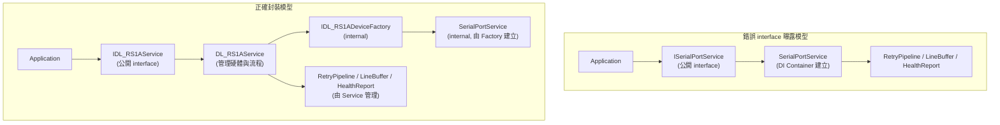

# Keyence DL_RS1A（DI + Factory 混合架構設計）

你是一位資深 .NET 工控架構師，請在既有架構：

Application
↓
Calin.SerialPort
↓
Calin.Transport.Core
↓
Calin.IO.Abstractions

之上生成 `Calin.Comm.DL_RS1A` 專案。

## 架構邊界強制規範

- 不得推翻既有抽象與基礎設施
- 不得修改 Calin.IO.Abstractions 既有介面
- 不得破壞 TransportBase 抽象定位
- 不得讓 DI Container 直接管理硬體設備生命週期
- 硬體實例必須由內部 Factory 建立與重建
- AutoFac 僅註冊 Service 與 Factory，不得在註冊時建立硬體實例
- APP 僅需 `builder.RegisterModule<DL_RS1A_Module>();`
- 必須新增企業級「安全 Reconfigure」能力
- 不可產生 race condition、雙連線、背景殘留 Task、記憶體洩漏
- 必須提供 `Initialize(SerialPortConfig config)` 方法建立初始化與硬體實例，回傳 bool
- 非 DI 使用方式與 DI 使用方式，行為必須完全一致

## 一、全域設計優先原則（強制遵守）

1. 穩定性
2. 相容性
3. 效能
4. 可預測性
5. 可維護性
6. 擴充性
7. 優雅設計

必須滿足：

- 支援 24/7 長時間運作
- 所有背景 Task 可安全取消（CancellationToken）
- Dispose 必須完整釋放資源且可重入
- 所有 public 方法 thread-safe
- 支援 100+ 設備並行
- 事件不可阻塞 I/O 執行緒
- 不可使用 Thread.Abort
- 僅使用 Windows 7 / Windows 10 相容 API
- 降低 GC 壓力（ArrayPool / RingBuffer）
- 所有例外必須捕捉並透過 ILogger 回報
- 每個類別與介面必須提供正體中文 XML Summary

若設計與穩定性或效能衝突，優先穩定性與效能。

## 二、DI + Factory 架構定位（強制要求）

### 1. DI 職責（預設使用 Autofac）

DI 僅負責：

- Application Service
- DL_RS1AService
- ILogger
- 設定提供者
- DL_RS1ADeviceFactory

DI 不得：

- 直接註冊 SerialPortService 為 Singleton
- 直接建立硬體實例
- 管理硬體重建流程

### 2. Factory 職責（關鍵）

必須新增：

```csharp
internal interface IDL_RS1ADeviceFactory
{
    ISerialPortService Create(SerialPortConfig config);
}
```

Factory 必須：

- 每次 Reconfigure 重新建立 SerialPortService
- 不得重用舊實例
- 不得洩漏舊實例
- 可注入 FakeSerialPortService（供測試使用）
- 封裝硬體建立與依賴初始化

Factory 是唯一允許 new SerialPortService 的地方。

### 3. Service 職責

DL_RS1AService：

- 不直接 new SerialPortService
- 僅透過 IDL_RS1ADeviceFactory 建立硬體實例
- 管理生命週期
- 管理 Retry
- 管理 Health
- 管理 Reconfigure

## 三、專案目標

DL_RS1AService 需提供：

- RS-232 ASCII 通訊服務
- ASCII 尾端固定為 `\r\n`，不可更改
- 支援 DI 與非 DI 使用
- 支援健康檢查、重試策略與連線管理
- 支援企業級安全 Reconfigure
- 適用於長時間工控設備運作

## 四、Initialize 設計定位（重要變更）

```csharp
bool Initialize(SerialPortConfig config);
```

規範：

- 不可在建構式中建立硬體
- Initialize 內部必須透過 Factory 建立硬體實例
- 若已初始化，不可重複初始化
- Initialize 必須 thread-safe
- 失敗時不得殘留半初始化狀態

DI 與非 DI 使用流程必須一致：

非 DI：

```csharp
var factory = new DL_RS1ADeviceFactory();
var service = new DL_RS1AService(factory, logger);
service.Initialize(config);
```

DI：

```csharp
var service = scope.Resolve<DL_RS1AService>();
service.Initialize(config);
```

## 五、Reconfigure 設計定位（強制保留）

Reconfigure 屬於具體傳輸層行為。

- 不可放入 TransportBase
- 不可污染抽象層
- 只可實作於 DL_RS1AService
- TransportBase 僅可提供狀態機保護與 I/O 停止鉤子
- 重建硬體必須透過 Factory

## 六、必須新增 API

```csharp
Task ReconfigureAsync(
    SerialPortConfig newConfig,
    bool preserveHealthStatistics,
    CancellationToken cancellationToken);

bool IsReconfiguring { get; }

bool Initialize(SerialPortConfig config);
```

## 七、Reconfigure 核心流程（強制實作）

必須依照以下順序實作：

1. 取得互斥鎖（SemaphoreSlim）
2. 標記 IsReconfiguring = true
3. 停止 Retry 管線
4. 取消 I/O CTS
5. 等待背景讀寫 Task 完整退出
6. 關閉現有連線
7. 清空 LineBuffer
8. Dispose 舊 SerialPortService
9. 透過 Factory 建立新實例
10. 重置 Retry 狀態
11. 依 preserveHealthStatistics 決定是否重置健康資料
12. 開啟新連線
13. 標記 IsReconfiguring = false
14. 釋放鎖

不得省略任何步驟。

## 八、硬體生命週期強制規則（新增）

- SerialPortService 不得註冊為 Singleton
- 不得跨 Reconfigure 重用
- 不得在 DI Container 中被直接 Resolve
- 所有硬體重建必須經過 Service 控制

## 九、其餘章節

以下章節要求保持原規格不變，並必須符合：

- WriteAsync / ReadAsync 行為要求
- LineBuffer 規範
- Retry 策略
- 健康監控設計
- 事件非阻塞設計
- Dispose 可重入與完全釋放
- AutoFac 註冊範例
- 非 DI 使用範例
- README 完整說明
- 使用範例程式碼
- 企業級穩定性驗證

## 十、最終架構目標

請生成一個：

- 符合工控 24/7 穩定性
- 無 race condition
- 無雙連線
- 無背景殘留 Task
- 無 unmanaged 洩漏
- DI 可插拔
- 硬體生命週期可控
- 未來可平滑升級至更完整 IoC 架構

的完整企業級實作。

不得生成示範級簡化版本。

---

# 為何重設 Config 再重連，不能只是 Cloas() 再 Open() 就好？

## 一、是否「自己 Close 再 Open」就足夠？

結論：**不能單純對外暴露 Close → Open 就算完成需求**。

在工控長時間 24/7 運作場景中，若允許「隨時變更 CONFIG 並重連」，必須額外處理：

1. 舊 I/O Task 的安全取消
2. 舊事件管線完全停止（避免 event re-entrancy）
3. LineBuffer 清空
4. 重試狀態重置
5. 健康統計是否保留或重置（需明確策略）
6. 避免同時有兩條連線存在（race condition）
7. 避免連線切換期間 WriteAsync 被呼叫

如果只是：

```csharp
await CloseAsync();
await OpenAsync();
```

在多執行緒下非常容易出現：

- 正在 ReadAsync 時被 Dispose
- 重試管線仍在執行
- DataReceived 尚未派發完成
- 新舊 SerialPortService 同時存在

這在高頻設備（100+）環境會造成間歇性異常。

因此應該新增**原子化 ReconfigureAsync 流程**，而不是讓使用者自行 Close/Open。

## 二、建議新增設計：動態重設連線設定

### 設計原則

- 必須 thread-safe
- 必須原子化
- 不可產生雙連線
- 不可殘留背景 Task
- 可選擇是否保留健康統計
- 期間 WriteAsync 必須被阻擋或排隊

## 三、API 設計建議

在 `DL_RS1AService` 新增：

```csharp
Task ReconfigureAsync(
    SerialPortConfig newConfig,
    bool preserveHealthStatistics,
    CancellationToken cancellationToken);
```

或若使用 TransportOptions：

```csharp
Task ReconfigureAsync(
    TransportOptions newOptions,
    CancellationToken cancellationToken);
```

## 四、內部實作架構建議（關鍵設計）

### 1️⃣ 使用 AsyncLock（SemaphoreSlim）

新增：

```csharp
private readonly SemaphoreSlim _reconfigureLock = new(1, 1);
```

確保：

- Open
- Close
- Reconfigure

三者互斥。

### 2️⃣ ReconfigureAsync 正確流程

正確順序必須為：

1. 取得 `_reconfigureLock`
2. 設定 `_isReconfiguring = true`
3. 停止重試管線
4. 取消 I/O CTS
5. 等待背景 Task 完成
6. Close 連線
7. 清空 LineBuffer
8. 重建 SerialPortService（使用新 Config）
9. Reset retry state
10. 視需求 Reset health
11. Open 新連線
12. `_isReconfiguring = false`
13. 釋放 lock

⚠ 不可以直接修改 SerialPort 參數然後 Open。

很多 SerialPort 屬性在 Open 後變更會丟例外或產生不一致狀態。

必須重建實例。

### 3️⃣ WriteAsync 保護

在 WriteAsync 開頭加入：

```csharp
if (_isReconfiguring)
    throw new InvalidOperationException("Reconfiguring");
```

或：

- 排隊等待 `_reconfigureLock`
- 或直接快速失敗（工控建議快速失敗）

## 五、避免 Race Condition 的核心技巧

### 技巧 1：雙層 CancellationToken

- `_lifetimeCts` → 整個 Service 生命週期
- `_ioCts` → 每次 Open 產生

Reconfigure 時：

- Cancel `_ioCts`
- 等待 I/O Loop 完整退出
- 重新建立 `_ioCts`

### 技巧 2：SerialPortService 必須可 Dispose 重入

你必須確保：

```csharp
Dispose()
CloseAsync()
ReconfigureAsync()
```

三者不會互相踩到。

## 六、健康監控策略建議

需要決定：

### 方案 A（推薦）

- 保留總成功/失敗統計
- 重置連線狀態相關計數

### 方案 B

- 完全重置

請在 README 明確說明策略。

## 七、ReconfigureAsync 範例實作骨架

```csharp
public async Task ReconfigureAsync(
    SerialPortConfig newConfig,
    bool preserveHealth,
    CancellationToken ct)
{
    ThrowIfDisposed();

    await _reconfigureLock.WaitAsync(ct).ConfigureAwait(false);

    try
    {
        _isReconfiguring = true;

        _logger.Info("Reconfiguring DL_RS1AService...");

        await StopRetryPipelineAsync().ConfigureAwait(false);

        _ioCts?.Cancel();

        await WaitForIoLoopExitAsync().ConfigureAwait(false);

        await _serial.CloseAsync(ct).ConfigureAwait(false);

        _lineBuffer.Clear();

        _serial.Dispose();

        _serial = CreateSerialPortService(newConfig);

        ResetRetryState();

        if (!preserveHealth)
            _healthTracker.Reset();

        await _serial.OpenAsync(ct).ConfigureAwait(false);

        _logger.Info("Reconfiguration completed.");
    }
    finally
    {
        _isReconfiguring = false;
        _reconfigureLock.Release();
    }
}
```

## 八、README 應補充說明

新增章節：

### 動態變更 Serial 設定

- 支援運行中修改
- 會中斷當前連線
- I/O 會被安全停止
- 不會產生雙連線
- 不會造成記憶體洩漏
- 不保證未完成 Write 會成功

## 九、工控等級額外建議（重要）

### 建議加入

```csharp
public bool IsReconfiguring { get; }
```

讓上層 Application 可觀察狀態。

### 建議加入

Reconfigure Timeout 保護

避免 Serial 驅動卡死導致整個 Service 卡住。

## 十、最終結論

問題答案：

> 「這是自己 CLOSE 再 OPEN 就好嗎？」

**在單執行緒 demo 可以。**

但在：

- 100+ 設備
- 非同步 I/O
- Auto retry
- 背景任務
- 事件派發

的工控級環境下：
**必須設計原子化 Reconfigure 流程，不能讓使用者自己 Close/Open。**

---

# 展示責任邊界與生命週期管理差異



## 說明

- **錯誤模型**
  - SerialPortService 對外公開
  - DI 直接管理硬體 → 雙連線、Reconfigure 不安全
  - 背景 Task 與 Dispose 散落
- **正確封裝模型**
  - 對外公開只有 Service interface（IDL_RS1AService）
  - 硬體（SerialPortService）由 Factory 建立、Service 管理
  - Service 控制 Retry、Health、Reconfigure
  - 生命週期與邊界清楚，APP 不直接操作硬體

---

# DI 生命週期本質（以 Autofac 為例）

DI Container 的生命週期通常有：

1. SingleInstance（Singleton）
2. InstancePerLifetimeScope（Scoped）
3. InstancePerDependency（Transient，預設）

如果你沒有明確指定，通常是 Transient。

## 情境分析

### 情境一：註冊為 InstancePerDependency（預設）

```csharp
builder.RegisterType<SerialPortService>();
```

結果：

- 每一次 Resolve
- 每一個注入點
- 都會產生「新的實例」

也就是：

AService 取得一個實例
BService 取得另一個實例

⚠ 這在工控通訊層是危險的
可能導致：

1. 同一 COM Port 被開兩次
2. 雙連線
3. 非預期競爭
4. 硬體鎖死

### 情境二：註冊為 SingleInstance

```csharp
builder.RegisterType<SerialPortService>()
       .SingleInstance();
```

結果：

- 全域只有一個實例
- 所有注入點都共用

技術上解決多實例問題

但工控架構上有嚴重缺點：

1. DI Container 控制硬體生命週期
2. Reconfigure 時無法安全重建
3. 容器不知道硬體狀態
4. 無法做「原子重建」

這就是為什麼我說：

❌ 不要讓 DI 直接管理硬體物件

## 為什麼要「禁止直接註冊 SerialPortService」

因為只要註冊了：

其他人就可以：

```csharp
public SomeClass(SerialPortService port)
```

這會繞過你的：

- Reconfigure 保護
- 重建流程
- 狀態機控制
- 重試管線

等於破壞工控邊界。

## 正確設計方式（工控等級）

### 1️⃣ 不註冊 SerialPortService

Container 不知道它的存在。

### 2️⃣ 只註冊 Factory

```csharp
builder.RegisterType<DL_RS1ADeviceFactory>()
       .As<IDL_RS1ADeviceFactory>()
       .SingleInstance();
```

### 3️⃣ 只註冊 DL_RS1AService

```csharp
builder.RegisterType<DL_RS1AService>()
       .SingleInstance();
```

### 4️⃣ SerialPortService 只允許由 Factory new

```csharp
public ISerialPortService Create(SerialPortConfig config)
{
    return new SerialPortService(config);
}
```

這樣：

✔ 整個系統只有 DL_RS1AService 持有硬體
✔ 不會有多個注入點亂拿
✔ Reconfigure 可安全重建
✔ 不受 Container 生命週期影響

## 回答你的問題（精準版）

> 不註冊為 Singleton，建構式注入是否會得到不同實例？

✔ 如果你用預設（Transient），一定會得到不同實例。
✔ 如果你註冊為 Singleton，就會得到同一實例。

但工控正確解法是：

「根本不要讓它能被注入。」

## 一句關鍵原則

在工控架構中：

DI 管理「無狀態或邏輯層物件」
Service 管理「有硬體資源的物件」

硬體物件永遠不應該成為公開可注入依賴。

## 再補一個更深的觀念

如果你讓 SerialPortService 可以被任意注入：

那它就不再是「設備的一部分」
而變成「公共資源」

這會破壞：

1. 邊界
2. 封裝
3. 狀態一致性
4. 故障恢復模型

## 結論

是的，不是 Singleton 就會產生不同實例。

但在工控架構下，真正正確的做法是：

✔ 不註冊硬體實例
✔ 只透過 Factory 建立
✔ 由 Service 完整控制生命週期
