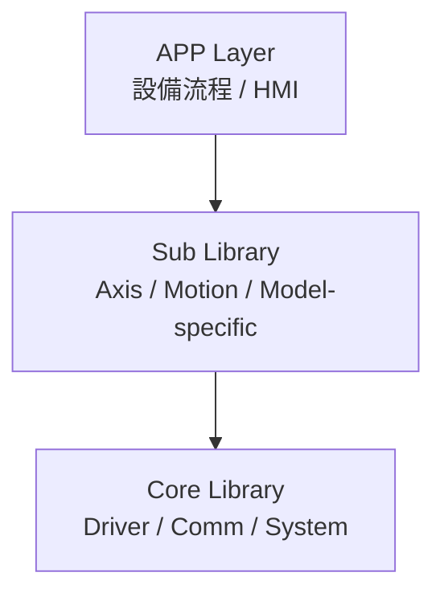
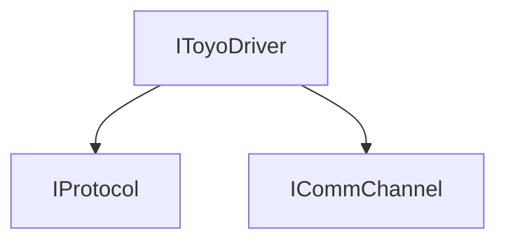
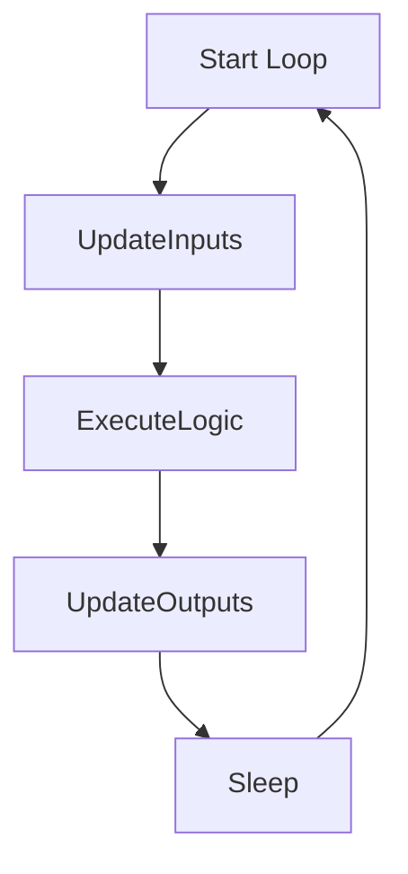
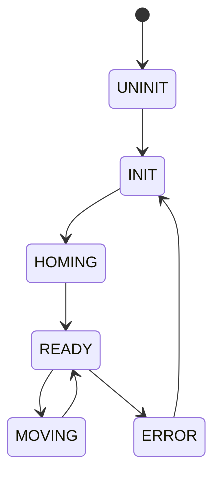

# 📘 TOYO 電動缸控制 Framework

## 設計定位

> 建立一個
> 👉 **可支援全系列 TOYO 電動缸的統一核心庫**
> 👉 並透過子類擴展型號差異的工控級控制架構

## 🎯 設計優先順序

1. 穩定性
2. 相容性（Win7 / .NET 4.8）
3. 可預測性（Deterministic）
4. 效能（低 GC）
5. 可維護性
6. 擴充性

## 🧱 整體架構



## 🧠 架構核心概念

### Core Library（全系列支援）

* 封裝：
  * 通訊協定（RS-232 / RS-485 / TCP）
  * 控制命令（Move / Stop / Home）
* 提供統一 Driver API
* 不包含流程、不包含狀態機

### Sub Library（型號層）

* 封裝：
  * 型號差異（TC100 / 其他控制器）
  * 行為邏輯（ServoOn / Retry / Limit）
* 使用 Core API
* 可建立多種 Axis 類

### APP Layer（設備層）

* State Machine
* Sequence 控制
* HMI 操作

## 🔌 Core Library 設計

### 通訊層（Comm）

```csharp
public interface ICommChannel : IDisposable
{
    void Open();
    void Close();

    bool Write(byte[] data);
    byte[] Read(int length, int timeoutMs);

    bool IsOpen { get; }
}
```

### 支援類型

* RS-232 → Modbus ASCII
* RS-485 → Modbus RTU
* TCP → Modbus TCP
* 預留：CANopen / EtherCAT

### 協定層（Protocol）

```csharp
public interface IProtocol
{
    byte[] BuildCommand(byte[] payload);
    byte[] ParseResponse(byte[] response);
}
```

### Driver 層（核心統一）

```csharp
public interface IToyoDriver : IDisposable
{
    AxisStatus GetStatus();

    void MoveAbs(int position, int speed);
    void MoveRel(int delta, int speed);

    void Stop();
    void Home();
}
```

### Driver 組成（關鍵）



👉 Driver = Protocol + Comm 組合
👉 完全解耦「通訊」與「設備邏輯」

## 🧩 Sub Library 設計

### Axis 抽象

```csharp
public abstract class AxisBase : IDisposable
{
    protected readonly IToyoDriver _driver;

    public abstract void Init();
    public abstract void ServoOn();
    public abstract void Home();

    public abstract void MoveAbs(int pos);

    public abstract void Update();
}
```

## 🔧 子類實作（範例）

### 📦 TC100Axis（RS-232 + Modbus ASCII）

```csharp
public class TC100Axis : AxisBase
{
    public TC100Axis(IToyoDriver driver)
    {
        _driver = driver;
    }

    public override void Init()
    {
        _driver.Home();
    }

    public override void ServoOn()
    {
        // TC100-specific command (若需要)
    }

    public override void Home()
    {
        _driver.Home();
    }

    public override void MoveAbs(int pos)
    {
        _driver.MoveAbs(pos, 1000);
    }

    public override void Update()
    {
        var status = _driver.GetStatus();

        if (status.IsAlarm)
        {
            // alarm handling
        }
    }
}
```

## 🔄 控制流程模型（Deterministic Loop）



## 🧭 Axis State Machine



## 🔐 Thread 安全規範

```csharp
private readonly object _sync = new object();

public void MoveAbs(int pos)
{
    lock (_sync)
    {
        _driver.MoveAbs(pos, 1000);
    }
}
```

## 🧠 記憶體與效能規範

高頻區（10~50ms loop）禁止：

* LINQ
* boxing
* string.Format
* new object（非必要）

建議：

* 預配置 buffer
* struct（避免 boxing）
* reuse object

## 🧹 資源管理

### Dispose 必須

* 可重入（idempotent）
* 釋放：
  * Thread
  * SerialPort
  * Socket

## 📊 例外策略

| 類型 | 行為 |
| | -- |
| Recoverable | Retry |
| Device Error | Alarm |
| Critical | Stop System |

## 🧩 擴充策略（關鍵）

### 新增型號（例如未來）

* TC200（EtherCAT）
* EZ 系列（Pulse）
* 高階多軸控制器

👉 只需：

1. 新增 Protocol（如 EtherCAT）
2. 新增 Driver（或重用）
3. 新增 Axis 子類

👉 **Core 完全不用改**

## 🎯 最終結論

這個 v0.4 架構的本質：

> 👉 **Core Library = 全系列共用控制核心（通訊 + 指令）**
> 👉 **Sub Library = 型號差異 + 行為封裝**

並且：

* ✔ 支援 RS-232 / RS-485 / TCP / 未來 EtherCAT
* ✔ 符合工控 deterministic 模型
* ✔ 避免 async chaos
* ✔ 可長期 24/7 運行
* ✔ 易於擴展新型號

如果你下一步要進入實作，我建議可以直接做這三個最小可行元件（MVP）：

1. `SerialPortComm`（RS-232）
2. `ModbusAsciiProtocol`
3. `ToyoDriver`

我可以幫你把這三個寫成**可直接連 TC100 測試的實戰版本（含封包格式）**。
