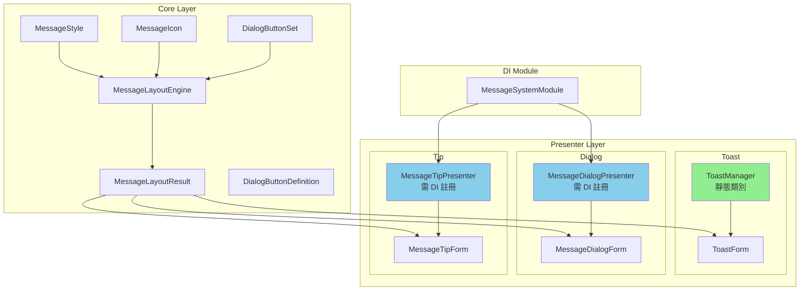

# Calin.WinForms.MessageSystem

提供完整訊息通知系統，包含 Toast、Dialog、MessageTip 三種訊息形式。

# 目錄

- [Calin.WinForms.MessageSystem](#calinwinformsmessagesystem)
- [目錄](#目錄)
- [快速開始](#快速開始)
  - [安裝](#安裝)
  - [基本使用](#基本使用)
- [系統架構](#系統架構)
  - [命名空間與責任](#命名空間與責任)
  - [架構圖](#架構圖)
- [樣式屬性](#樣式屬性)
  - [標題樣式](#標題樣式)
  - [內容樣式](#內容樣式)
  - [按鈕樣式](#按鈕樣式)
  - [圖示樣式](#圖示樣式)
  - [佈局樣式](#佈局樣式)
- [Toast 通知](#toast-通知)
  - [特點](#特點)
  - [基本使用](#基本使用-1)
  - [自訂樣式](#自訂樣式)
  - [全域預設樣式](#全域預設樣式)
- [Message Dialog](#message-dialog)
  - [特點](#特點-1)
  - [基本使用](#基本使用-2)
  - [便捷方法](#便捷方法)
  - [DialogButtonSet 使用](#dialogbuttonset-使用)
  - [預設按鈕集合](#預設按鈕集合)
  - [自訂按鈕樣式](#自訂按鈕樣式)
  - [自訂對話框樣式](#自訂對話框樣式)
  - [帶擁有者視窗](#帶擁有者視窗)
- [Message Tip](#message-tip)
  - [特點](#特點-2)
  - [基本使用](#基本使用-3)
  - [自訂樣式](#自訂樣式-1)
  - [完整參數](#完整參數)
- [主題支援](#主題支援)
  - [使用主題](#使用主題)
  - [Light 主題色彩](#light-主題色彩)
  - [Dark 主題色彩](#dark-主題色彩)
- [AutoFac DI 註冊](#autofac-di-註冊)
  - [註冊方式](#註冊方式)
  - [使用服務](#使用服務)
  - [註冊說明](#註冊說明)
- [更多範例](#更多範例)
- [最佳實踐](#最佳實踐)
  - [Toast](#toast)
  - [Dialog](#dialog)
  - [MessageTip](#messagetip)
- [License](#license)
- [🛠 技術資訊](#-技術資訊)

[🔝](#目錄)

---

# 快速開始

## 安裝

在您的專案中引用 `Calin.WinForms` 專案或 NuGet 套件。

## 基本使用

```csharp
// Toast 通知
ToastManager.ShowToast("操作成功！");

// Dialog 對話框
var dialog = new MessageDialogPresenter();
dialog.ShowInformation("這是資訊訊息");

// MessageTip 提示
var tip = new MessageTipPresenter();
tip.ShowBelow(textBox, "請輸入有效的 Email");
```

[🔝](#目錄)

---

# 系統架構

## 命名空間與責任

```text
Calin.WinForms.MessageSystem
├─ Core/                              # 共用核心，提供樣式、佈局計算、按鈕模型
│   ├─ MessageStyle.cs                # 樣式定義（標題、內容、按鈕、佈局）
│   ├─ MessageLayoutEngine.cs         # 佈局計算引擎
│   ├─ MessageLayoutResult.cs         # 佈局計算結果
│   ├─ MessageIcon.cs                 # 圖示類型定義
│   ├─ DialogButtonDefinition.cs      # 按鈕定義
│   └─ DialogButtonSet.cs             # 按鈕集合
│
├─ Presenter/                         # 具體訊息呈現層
│   ├─ Toast/
│   │   ├─ ToastForm.cs               # Toast 視窗
│   │   └─ ToastManager.cs            # Toast 管理器（靜態）
│   ├─ Dialog/
│   │   ├─ MessageDialogPresenter.cs  # Dialog 呈現器
│   │   └─ MessageDialogForm.cs       # Dialog 視窗
│   └─ Tip/
│       ├─ MessageTipPresenter.cs     # Tip 呈現器
│       └─ MessageTipForm.cs          # Tip 視窗
│
└─ MessageSystemModule.cs             # AutoFac DI 模組
```

## 架構圖



[🔝](#目錄)

---

# 樣式屬性

`MessageStyle` 提供完整的樣式自訂功能：

## 標題樣式

| 屬性             | 類型    | 說明                   |
| ---------------- | ------- | ---------------------- |
| `TitleFont`      | `Font`  | 標題字體               |
| `TitleForeColor` | `Color` | 標題文字顏色           |
| `TitleBackColor` | `Color` | 標題背景色             |
| `TitleHeight`    | `int`   | 標題區域高度（0=自動） |

## 內容樣式

| 屬性               | 類型    | 說明         |
| ------------------ | ------- | ------------ |
| `ContentFont`      | `Font`  | 內容字體     |
| `ContentForeColor` | `Color` | 內容文字顏色 |
| `ContentBackColor` | `Color` | 內容背景色   |

## 按鈕樣式

| 屬性                   | 類型    | 說明           |
| ---------------------- | ------- | -------------- |
| `ButtonFont`           | `Font`  | 按鈕字體       |
| `ButtonForeColor`      | `Color` | 按鈕文字顏色   |
| `ButtonBackColor`      | `Color` | 按鈕背景色     |
| `ButtonHoverBackColor` | `Color` | 按鈕懸停背景色 |
| `ButtonAreaBackColor`  | `Color` | 按鈕區域背景色 |
| `ButtonHeight`         | `int`   | 按鈕高度       |
| `ButtonSpacing`        | `int`   | 按鈕間距       |

## 圖示樣式

| 屬性           | 類型           | 說明                   |
| -------------- | -------------- | ---------------------- |
| `IconSize`     | `Size`         | 圖示尺寸               |
| `IconPosition` | `IconPosition` | 圖示位置（Left/Right） |

## 佈局樣式

| 屬性          | 類型      | 說明     |
| ------------- | --------- | -------- |
| `Padding`     | `Padding` | 內邊距   |
| `Spacing`     | `int`     | 元素間距 |
| `MinWidth`    | `int`     | 最小寬度 |
| `MaxWidth`    | `int`     | 最大寬度 |
| `BorderColor` | `Color`   | 邊框顏色 |
| `BorderWidth` | `int`     | 邊框寬度 |

[🔝](#目錄)

---

# Toast 通知

在螢幕右下角顯示短暫的訊息通知，不搶焦點。

## 特點

- ✅ 不搶焦點，不影響使用者操作
- ✅ 自動堆疊管理，多個 Toast 會往上排列
- ✅ 可點擊關閉
- ✅ 自訂顯示時間和樣式

## 基本使用

```csharp
using Calin.WinForms.MessageSystem.Presenter.Toast;

// 顯示預設 3 秒的 Toast
ToastManager.ShowToast("操作成功！");

// 顯示指定秒數的 Toast
ToastManager.ShowToast("檔案已儲存", 5);

// 連續顯示多個 Toast（會自動往上堆疊）
ToastManager.ShowToast("第一則通知", 4);
ToastManager.ShowToast("第二則通知", 4);

// 關閉所有 Toast
ToastManager.CloseAll();
```

## 自訂樣式

```csharp
using Calin.WinForms.MessageSystem.Core;

// 成功樣式（綠色）
var successStyle = new MessageStyle
{
    ContentFont = new Font("Microsoft JhengHei", 10f),
    ContentBackColor = Color.FromArgb(39, 174, 96),
    ContentForeColor = Color.White,
    Padding = new Padding(16),
    MinWidth = 150,
    MaxWidth = 350
};

// 錯誤樣式（紅色）
var errorStyle = new MessageStyle
{
    ContentFont = new Font("Microsoft JhengHei", 10f, FontStyle.Bold),
    ContentBackColor = Color.FromArgb(192, 57, 43),
    ContentForeColor = Color.White,
    Padding = new Padding(16),
    MinWidth = 150,
    MaxWidth = 350
};

ToastManager.ShowToast("操作成功！", 3, successStyle);
ToastManager.ShowToast("發生錯誤！", 5, errorStyle);
```

## 全域預設樣式

```csharp
// 設定全域預設樣式
ToastManager.DefaultStyle = new MessageStyle
{
    ContentFont = new Font("Microsoft JhengHei", 11f),
    ContentBackColor = Color.FromArgb(40, 40, 40),
    ContentForeColor = Color.LightGreen,
    Padding = new Padding(20),
    MinWidth = 180,
    MaxWidth = 400
};

// 重設為預設樣式
ToastManager.ResetToDefaultStyle();
```

[🔝](#目錄)

---

# Message Dialog

顯示模態對話框，支援自訂按鈕、圖示、標題和樣式。

## 特點

- ✅ 模態對話框，阻塞 UI 直到使用者回應
- ✅ 支援多種預設按鈕集合（OK、OKCancel、YesNo 等）
- ✅ 可自訂按鈕文字、樣式和行為
- ✅ 支援圖示（Information、Warning、Error、Question、Success）
- ✅ 可拖曳標題列移動視窗
- ✅ 支援鍵盤快捷鍵（Enter、Escape）

## 基本使用

```csharp
using Calin.WinForms.MessageSystem.Presenter.Dialog;
using Calin.WinForms.MessageSystem.Core;

// 透過 DI 取得 Presenter（推薦）
var dialog = container.Resolve<MessageDialogPresenter>();

// 或直接建立實例
var dialog = new MessageDialogPresenter();

// 顯示簡單訊息
dialog.Show("操作已完成");

// 顯示帶標題的訊息
dialog.Show("檔案已儲存成功", "儲存結果");

// 顯示帶圖示的訊息
dialog.Show("請確認是否繼續？", "確認", MessageIcon.Question);
```

## 便捷方法

```csharp
// 資訊對話框
dialog.ShowInformation("這是資訊訊息");

// 警告對話框
dialog.ShowWarning("這是警告訊息");

// 錯誤對話框
dialog.ShowError("這是錯誤訊息");

// 確認對話框（是/否）
var result = dialog.ShowConfirm("確定要刪除嗎？");
if (result == DialogResultValue.Yes)
{
    // 使用者點擊「是」
}

// 確認對話框（是/否/取消）
var result = dialog.ShowConfirmWithCancel("是否儲存變更？");
```

## DialogButtonSet 使用

```csharp
// 使用預設按鈕集合
var result = dialog.Show("內容", "標題", MessageIcon.Question, DialogButtonSet.YesNoCancel);

// 建立自訂按鈕
var customButtons = DialogButtonSet.Create(
    "儲存", DialogResultValue.Custom1,
    "不儲存", DialogResultValue.Custom2,
    "取消", DialogResultValue.Cancel);

var result = dialog.Show("是否儲存變更？", "儲存", MessageIcon.Question, customButtons);

switch (result)
{
    case DialogResultValue.Custom1:
        // 儲存
        break;
    case DialogResultValue.Custom2:
        // 不儲存
        break;
    case DialogResultValue.Cancel:
        // 取消
        break;
}
```

## 預設按鈕集合

| 按鈕集合             | 按鈕             | 說明             |
| -------------------- | ---------------- | ---------------- |
| `DialogButtonSet.OK` | 確定             | 單一確定按鈕     |
| `OKCancel`           | 確定、取消       | 確定或取消       |
| `YesNo`              | 是、否           | 是或否           |
| `YesNoCancel`        | 是、否、取消     | 是、否或取消     |
| `RetryCancel`        | 重試、取消       | 重試或取消       |
| `AbortRetryIgnore`   | 中止、重試、忽略 | 中止、重試或忽略 |

## 自訂按鈕樣式

```csharp
var buttonSet = new DialogButtonSet();

// 新增自訂樣式按鈕
buttonSet.Add(new DialogButtonDefinition("確定", DialogResultValue.OK)
{
    IsDefault = true,
    Font = new Font("Microsoft JhengHei", 10f, FontStyle.Bold),
    ForeColor = Color.White,
    BackColor = Color.FromArgb(0, 122, 204),
    MinWidth = 100
});

buttonSet.Add(new DialogButtonDefinition("取消", DialogResultValue.Cancel)
{
    IsCancel = true,
    Font = new Font("Microsoft JhengHei", 10f),
    ForeColor = Color.Black,
    BackColor = Color.FromArgb(230, 230, 230)
});

dialog.Show("確定要執行嗎？", "確認", MessageIcon.Question, buttonSet);
```

## 自訂對話框樣式

```csharp
var style = new MessageStyle
{
    // 標題樣式
    TitleFont = new Font("Microsoft JhengHei", 12f, FontStyle.Bold),
    TitleForeColor = Color.White,
    TitleBackColor = Color.FromArgb(0, 122, 204),
    TitleHeight = 40,

    // 內容樣式
    ContentFont = new Font("Microsoft JhengHei", 10f),
    ContentForeColor = Color.Black,
    ContentBackColor = Color.White,

    // 按鈕樣式
    ButtonFont = new Font("Microsoft JhengHei", 9f),
    ButtonForeColor = Color.White,
    ButtonBackColor = Color.FromArgb(0, 122, 204),
    ButtonHoverBackColor = Color.FromArgb(0, 102, 184),
    ButtonAreaBackColor = Color.FromArgb(240, 240, 240),
    ButtonHeight = 32,
    ButtonSpacing = 10,

    // 佈局
    Padding = new Padding(20),
    Spacing = 15,
    MinWidth = 350,
    MaxWidth = 500,
    BorderColor = Color.FromArgb(0, 122, 204),
    BorderWidth = 2
};

dialog.Show("標題", "內容", MessageIcon.Information, DialogButtonSet.OK, style);
```

## 帶擁有者視窗

```csharp
// 對話框會顯示在擁有者視窗中央
dialog.Show(
    ownerForm,
    "標題",
    "內容",
    MessageIcon.Information,
    DialogButtonSet.OK,
    null);
```

[🔝](#目錄)

---

# Message Tip

在控制項附近顯示提示訊息，類似 ToolTip 但可完全自訂樣式。

## 特點

- ✅ 四個方向支援（上、下、左、右）
- ✅ 自動位置調整，確保顯示在螢幕內
- ✅ 不搶焦點
- ✅ 可自訂樣式和圖示
- ✅ 自動計時關閉

## 基本使用

```csharp
using Calin.WinForms.MessageSystem.Presenter.Tip;

// 透過 DI 取得 Presenter（推薦）
var tip = container.Resolve<MessageTipPresenter>();

// 或直接建立實例
var tip = new MessageTipPresenter();

// 在控制項下方顯示提示
tip.ShowBelow(textBox, "請輸入有效的 Email");

// 在控制項上方顯示提示
tip.ShowAbove(button, "點擊送出表單");

// 在控制項右側顯示提示
tip.ShowRight(label, "必填欄位");

// 在控制項左側顯示提示
tip.ShowLeft(control, "提示訊息");

// 隱藏特定控制項的提示
tip.Hide(textBox);

// 隱藏所有提示
tip.HideAll();
```

## 自訂樣式

```csharp
var errorTipStyle = new MessageStyle
{
    ContentFont = new Font("Microsoft JhengHei", 9f),
    ContentBackColor = Color.FromArgb(255, 200, 200),
    ContentForeColor = Color.DarkRed,
    Padding = new Padding(8),
    BorderColor = Color.Red,
    BorderWidth = 1,
    MinWidth = 100,
    MaxWidth = 250
};

tip.Show(textBox, "輸入格式錯誤", TipPosition.Below, 5, errorTipStyle, MessageIcon.Error);
```

## 完整參數

```csharp
// 參數說明：
// 1. control: 目標控制項
// 2. content: 提示內容
// 3. position: 顯示位置（Above/Below/Left/Right）
// 4. durationSeconds: 顯示秒數
// 5. style: 自訂樣式
// 6. icon: 圖示
tip.Show(control, "提示內容", TipPosition.Right, 5, customStyle, MessageIcon.Warning);
```

[🔝](#目錄)

---

# 主題支援

MessageSystem 內建 Light 和 Dark 兩種主題。

## 使用主題

```csharp
using Calin.WinForms.MessageSystem.Core;

// 設定全域預設主題
MessageStyle.DefaultTheme = StyleTheme.Dark;

// Toast 使用主題
var toastStyle = MessageStyle.CreateToastDefault();
ToastManager.ShowToast("深色主題通知", 3, toastStyle);

// Dialog 使用主題
var dialogStyle = MessageStyle.CreateDialogWithTheme(StyleTheme.Dark);
dialog.Show("標題", "內容", MessageIcon.Information, DialogButtonSet.OK, dialogStyle);

// MessageTip 使用主題
var tipStyle = MessageStyle.CreateMessageTipWithTheme(StyleTheme.Light);
tip.Show(control, "提示", TipPosition.Below, 3, tipStyle, null);
```

## Light 主題色彩

| 元素     | 顏色             |
| -------- | ---------------- |
| 標題背景 | `#007ACC` (藍色) |
| 內容背景 | `#FAFAFA` (淺灰) |
| 按鈕背景 | `#007ACC` (藍色) |
| 邊框     | `#007ACC` (藍色) |

## Dark 主題色彩

| 元素     | 顏色             |
| -------- | ---------------- |
| 標題背景 | `#2D2D30` (深灰) |
| 內容背景 | `#3C3C3C` (灰色) |
| 按鈕背景 | `#464646` (灰色) |
| 邊框     | `#646464` (淺灰) |

[🔝](#目錄)

---

# AutoFac DI 註冊

## 註冊方式

```csharp
using Autofac;
using Calin.WinForms.MessageSystem;

var builder = new ContainerBuilder();

// 註冊 MessageSystem 模組
builder.RegisterModule<MessageSystemModule>();

var container = builder.Build();
```

## 使用服務

```csharp
// 透過 DI 取得 Presenter
var dialog = container.Resolve<MessageDialogPresenter>();
var tip = container.Resolve<MessageTipPresenter>();

// 使用服務
dialog.ShowInformation("透過 DI 取得的 Dialog");
tip.ShowBelow(textBox, "透過 DI 取得的 Tip");

// ToastManager 是靜態類別，直接使用
ToastManager.ShowToast("Toast 不需要 DI");
```

## 註冊說明

| 服務                     | 註冊方式 | 說明               |
| ------------------------ | -------- | ------------------ |
| `MessageDialogPresenter` | 單例     | Dialog 呈現器      |
| `MessageTipPresenter`    | 單例     | Tip 呈現器         |
| `ToastManager`           | 不需註冊 | 靜態類別，直接使用 |

[🔝](#目錄)

---

# 更多範例

更多詳細範例請參考 `MessageSystemUsageExamples` 類別：

- Toast 基本使用、自訂樣式、全域樣式、主題
- Dialog 基本使用、按鈕集合、自訂按鈕、自訂樣式、帶擁有者視窗、主題
- MessageTip 基本使用、自訂樣式、完整參數、全域樣式
- DI 註冊範例

[🔝](#目錄)

---

# 最佳實踐

## Toast

- ✅ 用於不需要使用者回應的簡短通知
- ✅ 訊息長度建議不超過一行
- ✅ 顯示時間建議 3-5 秒
- ❌ 避免用於重要警告或錯誤訊息

## Dialog

- ✅ 用於需要使用者回應的重要訊息
- ✅ 標題簡短明確
- ✅ 內容清楚說明問題和選項
- ✅ 按鈕文字使用動詞（如「儲存」而非「是」）
- ❌ 避免過長的內容文字

## MessageTip

- ✅ 用於欄位驗證錯誤提示
- ✅ 用於即時輸入提示
- ✅ 訊息簡短明確
- ❌ 避免用於重要警告

[🔝](#目錄)

---

# License

此專案遵循 MIT License。

# 🛠 技術資訊

- **目標框架**: .NET Framework 4.8
- **依賴套件**: AutoFac
- **命名空間**: `Calin.WinForms.MessageSystem`

[🔝](#目錄)
