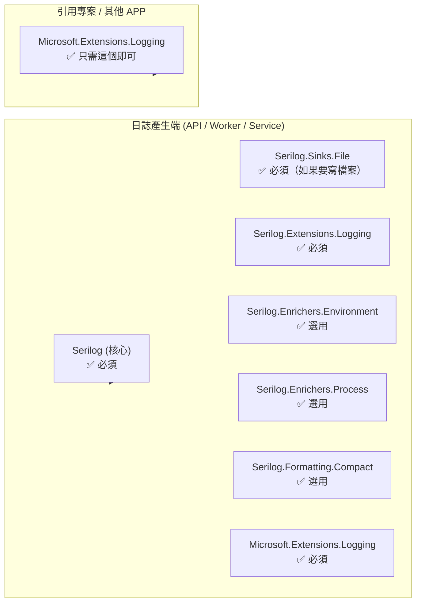
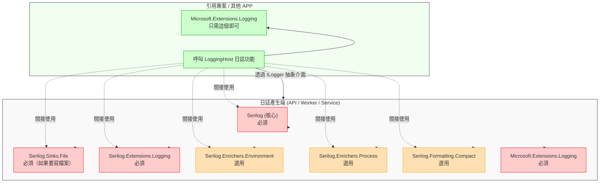

---
aliases:
date:
update:
author:
language:
sourceurl:
tags:
---

# Serilog 檔案繼承與關聯

明白了，你這裡列出的是一組 **Serilog + Microsoft Logging** 相關的 NuGet 套件。你問的是「除了 Serilog，哪些需要套用到引用的 APP？」我來幫你釐清。

## 你列的套件及作用

| 套件                              | 作用                               | 是否需要在 APP 專案引用                                          |
| ------------------------------- | -------------------------------- | ------------------------------------------------------- |
| `Serilog`                       | 核心日誌框架                           | ✅ 需要，所有使用 Serilog 的專案都要                                 |
| `Serilog.Sinks.File`            | 將日誌寫入檔案                          | ✅ 需要，如果你 APP 需要把日誌寫到檔案                                  |
| `Microsoft.Extensions.Logging`  | Microsoft 官方 Logging Abstraction | ✅ 需要，通常在 ASP.NET Core 或 Worker Service 中用來抽象化日誌         |
| `Serilog.Extensions.Logging`    | 讓 Serilog 能整合 Microsoft Logging  | ✅ 需要，如果你使用 `ILogger` 或要把 Serilog 當作 MS Logging Provider |
| `Serilog.Enrichers.Environment` | 讓日誌帶上環境資訊（如 MachineName）         | ❌ 通常只在產生日誌的專案引用即可，不需要其他引用的 APP 也引用                      |
| `Serilog.Enrichers.Process`     | 讓日誌帶上 Process 資訊                 | ❌ 同上，只要日誌產生端引用即可                                        |
| `Serilog.Formatting.Compact`    | 提供 Compact JSON 格式輸出             | ❌ 同上，只需要在產生日誌的專案引用                                      |

## 核心原則

1. **日誌產生端（Logging Host / API / Service）**

   * 必須引用 **Serilog 核心 + Sink + Enrichers + Formatter**，才能完整產生日誌。
   * 例如：你的 API 專案或 Worker 專案。

2. **日誌消費端 / 其他引用這個專案的 APP**

   * 如果這些 APP 只是調用 API 或共用程式庫，**通常只需要 `Microsoft.Extensions.Logging`**，不需要 Serilog 或 Enrichers，除非它們本身也要寫日誌。

✅ **總結一句話**：

* **APP 專案要寫日誌 → 需要引用 Serilog、Sink、Extensions、必要的 Enrichers**
* **只是引用其他專案 → 通常只需引用 Microsoft Logging Abstraction (`Microsoft.Extensions.Logging`)**

下面圖表清楚呈現哪些 NuGet 套件加上 **套件用途標示**，用顏色或文字區分哪些套件 **必須放在 LoggingHost**、哪些套件 **可以只在引用 APP 放 MS Logging**，這樣一眼就能看懂依賴。

📌 **說明：**

* **綠色或 ✅ 標示** → 套件必須放在該專案
* **LoggingHost 專案** → 產生日誌的地方，要完整 Serilog 生態（核心、Sink、Extensions、Formatter/Enricher 選用）
* **ConsumerApp 專案** → 只引用 `Microsoft.Extensions.Logging` 就能調用 LoggingHost 暴露的日誌功能，不需要額外安裝 Serilog 或 Enrichers

下圖加上 **依賴流程箭頭** 及 **APP 間接使用 LoggingHost 套件的箭頭**，，這樣圖不只是顯示套件放置位置，還能清楚看出 **ConsumerApp 如何透過 MS Logging 呼叫 LoggingHost 的日誌功能**，也能清楚看到 **哪些套件實際被 APP 間接利用**。

📌 **解讀這個版本：**

1. **紅色 (必須)** → LoggingHost 專案必裝套件
2. **橘色 (選用)** → LoggingHost 專案可選套件
3. **綠色 (APP)** → ConsumerApp 只需 MS Logging
4. **LoggingHost**
   * 產生日誌的專案，需要完整 Serilog 生態。
   * 套件依賴箭頭表明這些套件都必須引用在 LoggingHost。
5. **ConsumerApp**
   * 只需引用 `Microsoft.Extensions.Logging`，並透過 `ILogger` 或共用函式呼叫 LoggingHost 的日誌功能。
   * 不需要自己引用 Serilog 或 Enrichers。
6. **箭頭流程**
   * `ConsumerApp → CallLogging → LoggingHost` 顯示 **APP 透過 ILogger 抽象層呼叫 LoggingHost 日誌功能**。
   * 這符合典型的 **分層架構 / 日誌集中化** 做法。
7. 🔹 **虛線箭頭 (-.-)**
   * 表示 **APP 透過 CallLogging 間接使用 LoggingHost 的 Serilog、Sink、Extensions 等套件功能**。
   * 也就是說，APP 不用自己裝這些套件，但仍然能使用日誌功能。
