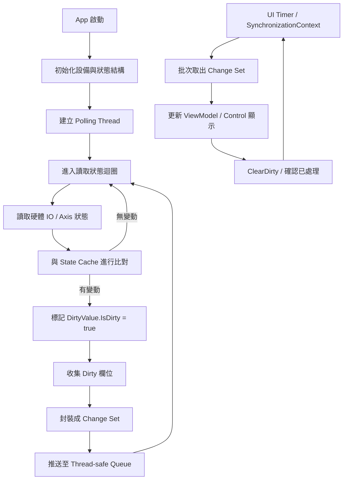
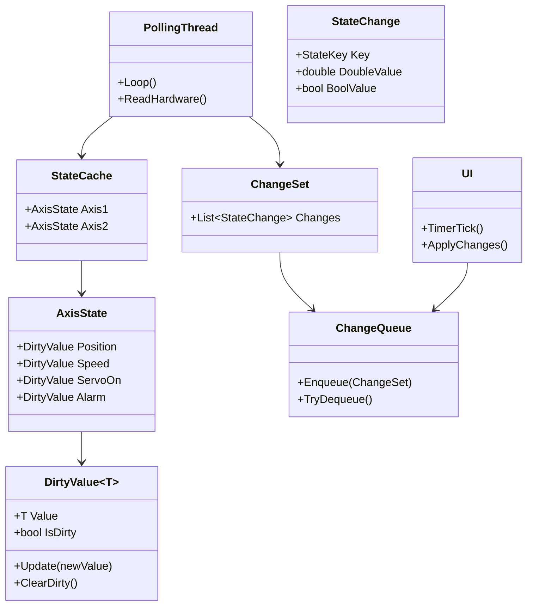
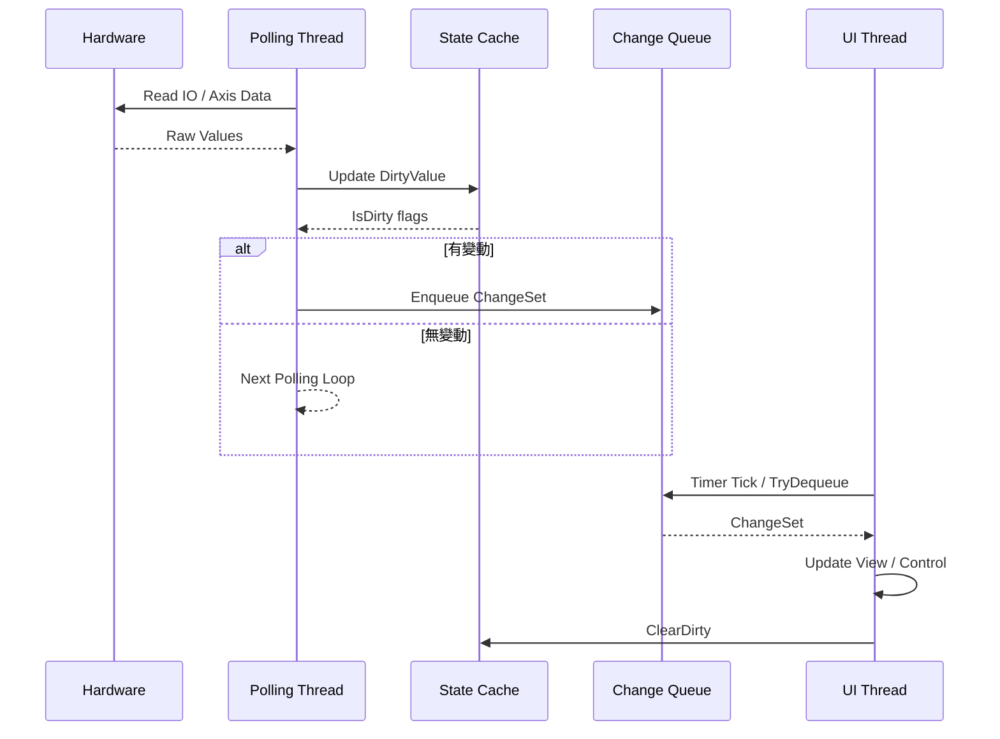

---
aliases:
date:
update:
author:
language:
sourceurl:
tags:
---

# 工控各種數值、參數、狀態、訊號的讀寫/顯示設計

## 設計目標與限制前提

- 平台：C# .NET Framework 4.6.2、Windows 7、低階工控電腦
- 架構：背景 Thread 讀取設備狀態，UI / App 顯示結果
- 資料型態：double（座標、參數）、bool（狀態、燈號）
- 核心需求：只傳遞「有變動」的數值，避免無效更新與 UI 卡頓

## 核心設計原則

- 背景 Thread 與 UI 嚴格解耦
- 狀態變化在「資料層」就被判斷，不讓 UI 承擔比對責任
- 避免每次輪詢就丟完整物件
- 避免 lock 大物件或整包資料
- 儘量使用結構化、可擴充、低 GC 壓力的方式

## 推薦整體架構分層

- Device Polling Thread
    - 專責讀取硬體狀態
- State Cache（快取層）
    - 保存「上一輪狀態」
    - 判斷是否變動
- Dirty Dispatcher（變動派發）
    - 只推送有變動的欄位
- UI / App
    - 被動接收變動並更新畫面

## 方案一：欄位級 Dirty Flag（最穩定、最省效能）

適合 IO 點很多、資料結構固定的工控專案

### 資料結構設計

- 每一個狀態值都包在一個「可比對容器」
- 容器只在值改變時才標記為 Dirty

```csharp
public struct DirtyValue<T> where T : struct
{
    public T Value;
    public bool IsDirty;

    public bool Update(T newValue)
    {
        if (!EqualityComparer<T>.Default.Equals(Value, newValue))
        {
            Value = newValue;
            IsDirty = true;
            return true;
        }
        return false;
    }

    public void ClearDirty()
    {
        IsDirty = false;
    }
}
```

### 實際狀態定義

```csharp
public class AxisState
{
    public DirtyValue<double> Position;
    public DirtyValue<double> Speed;
    public DirtyValue<bool> ServoOn;
    public DirtyValue<bool> Alarm;
}
```

### Thread 讀取時行為

```csharp
_axisState.Position.Update(readPos);
_axisState.ServoOn.Update(readServo);
```

### 派送策略

- Thread 每圈 loop 結束後
- 掃描 IsDirty == true 的欄位
- 封裝成輕量更新事件送出
- UI 更新完成後呼叫 ClearDirty

### 優點

- 不需要額外 Dictionary 或反射
- 效能可預期，GC 幾乎為零
- 非常適合 Windows 7 舊機

### 注意事項

- 欄位數量多時，建議用 partial class 或區塊分類
- 不要用 property setter 內自動 Raise UI Event

## 打包並封裝成輕量更新事件派送

- 以 `AxisState` 為來源
- 只打包 **Dirty 的欄位**
- 封裝成 **輕量更新事件**
- 可安全跨 Thread 派送給 UI
- 避免整包物件、避免 GC 壓力

### 核心設計概念

- AxisState 本身不跨 Thread 傳遞
- DirtyValue 只負責「是否變動」
- **事件只攜帶必要欄位**
- UI 不需要知道 AxisState 全貌

### 步驟一：定義欄位識別 Key

```csharp
public enum AxisField
{
    Position,
    Speed,
    ServoOn,
    Alarm
}
```

### 步驟二：定義輕量更新事件（Value Type）

```csharp
public struct AxisStateChange
{
    public int AxisNo;
    public AxisField Field;
    public double DoubleValue;
    public bool BoolValue;
}
```

設計說明

- 使用 struct，避免配置
- double / bool 共用一個事件型別
- 由 Field 決定實際使用哪個值

### 步驟三：AxisState 內提供打包方法

```csharp
public class AxisState
{
    public DirtyValue<double> Position;
    public DirtyValue<double> Speed;
    public DirtyValue<bool> ServoOn;
    public DirtyValue<bool> Alarm;

    public void CollectChanges(int axisNo, IList<AxisStateChange> buffer)
    {
        if (Position.IsDirty)
        {
            buffer.Add(new AxisStateChange
            {
                AxisNo = axisNo,
                Field = AxisField.Position,
                DoubleValue = Position.Value
            });
        }

        if (Speed.IsDirty)
        {
            buffer.Add(new AxisStateChange
            {
                AxisNo = axisNo,
                Field = AxisField.Speed,
                DoubleValue = Speed.Value
            });
        }

        if (ServoOn.IsDirty)
        {
            buffer.Add(new AxisStateChange
            {
                AxisNo = axisNo,
                Field = AxisField.ServoOn,
                BoolValue = ServoOn.Value
            });
        }

        if (Alarm.IsDirty)
        {
            buffer.Add(new AxisStateChange
            {
                AxisNo = axisNo,
                Field = AxisField.Alarm,
                BoolValue = Alarm.Value
            });
        }
    }

    public void ClearDirty()
    {
        Position.ClearDirty();
        Speed.ClearDirty();
        ServoOn.ClearDirty();
        Alarm.ClearDirty();
    }
}
```

關鍵點

- AxisState **只負責產生事件**
- 不知道 Queue、不知道 UI
- buffer 由外部重用，避免反覆 new List

#### 遍歷方式的選擇

- **可以遍歷**
- 但在 **工控 + Windows 7 + .NET 462** 的前提下
- **不建議用反射或通用迴圈**
- 最佳解法是 **「表驅動（table-driven）」而不是 if 一大串**

下面給你三種可行層級，由低風險到高彈性

##### 為什麼「直覺遍歷」通常不適合

你直覺會想到的方式通常是

- 反射掃描 property
- Attribute 標註欄位
- Dictionary<string, DirtyValue>

在工控輪詢中，這些都有問題

- 反射成本不可預期
- Attribute + PropertyInfo 會產生 GC
- Dictionary 破壞 cache locality
- Debug 時難追

所以答案是

- **不要動態遍歷**
- **要靜態可展開、可 inline 的遍歷**

##### 解法一：表驅動欄位描述（最推薦）

###### 核心概念

- 用「靜態表」描述欄位
- 每個欄位只寫一次
- CollectChanges 用 for 迴圈跑表

###### 欄位描述結構

```csharp
public struct AxisFieldEntry
{
    public AxisField Field;
    public Func<AxisState, bool> IsDirty;
    public Action<AxisStateChange, AxisState> Fill;
}
```

說明

- IsDirty：判斷是否變動
- Fill：把值填進 Change

###### 靜態表定義

```csharp
static readonly AxisFieldEntry[] _axisFieldTable =
{
    new AxisFieldEntry
    {
        Field = AxisField.Position,
        IsDirty = s => s.Position.IsDirty,
        Fill = (c, s) => c.DoubleValue = s.Position.Value
    },
    new AxisFieldEntry
    {
        Field = AxisField.Speed,
        IsDirty = s => s.Speed.IsDirty,
        Fill = (c, s) => c.DoubleValue = s.Speed.Value
    },
    new AxisFieldEntry
    {
        Field = AxisField.ServoOn,
        IsDirty = s => s.ServoOn.IsDirty,
        Fill = (c, s) => c.BoolValue = s.ServoOn.Value
    },
    new AxisFieldEntry
    {
        Field = AxisField.Alarm,
        IsDirty = s => s.Alarm.IsDirty,
        Fill = (c, s) => c.BoolValue = s.Alarm.Value
    }
};
```

###### CollectChanges 改寫

```csharp
public void CollectChanges(
    int axisNo,
    IList<AxisStateChange> buffer)
{
    for (int i = 0; i < _axisFieldTable.Length; i++)
    {
        ref readonly var entry = ref _axisFieldTable[i];
        if (!entry.IsDirty(this))
            continue;

        var change = new AxisStateChange
        {
            AxisNo = axisNo,
            Field = entry.Field
        };

        entry.Fill(change, this);
        buffer.Add(change);
    }
}
```

###### 優點

- 點位多也只加一行表項
- CollectChanges 永遠不變
- 沒有反射
- 可預期效能

###### 注意

- delegate 在 .NET 462 仍有些微間接成本
- 但比反射穩定非常多

##### 解法二：介面化欄位（更乾淨，但物件數較多）

###### 概念

- 每個欄位一個小物件
- 共用介面

```csharp
interface IAxisFieldAccessor
{
    AxisField Field { get; }
    bool IsDirty(AxisState s);
    void Fill(ref AxisStateChange c, AxisState s);
}
```

###### CollectChanges

```csharp
foreach (var f in _fields)
{
    if (!f.IsDirty(this))
        continue;

    var c = new AxisStateChange
    {
        AxisNo = axisNo,
        Field = f.Field
    };

    f.Fill(ref c, this);
    buffer.Add(c);
}
```

###### 適用情境

- 欄位數非常多
- 需要模組化拆分

###### 缺點

- 多一層 virtual 呼叫
- 建構物件稍多

##### 解法三：強型別批次（效能極致，碼最多）

###### 概念

- 按型別分組
- for 迴圈跑 array

```csharp
DirtyValue<double>[] _doubleFields;
DirtyValue<bool>[] _boolFields;
```

###### 優點

- 效能最好
- 無 delegate

###### 缺點

- AxisState 結構會變形
- 可讀性下降
- 維護成本高

##### 不建議但你一定會想到的作法

- Reflection + PropertyInfo
- Dictionary<AxisField, DirtyValue>
- dynamic
- LINQ

##### 實務建議總結

- 欄位 < 20：直接寫 if（最直觀）
- 欄位 20~100：表驅動
- 欄位 > 100 且超高頻：強型別批次

### 步驟四：Polling Thread 使用方式

```csharp
private readonly List<AxisStateChange> _changeBuffer
    = new List<AxisStateChange>(8);

void PollingLoop()
{
    while (_running)
    {
        _axisState.Position.Update(ReadPosition());
        _axisState.Speed.Update(ReadSpeed());
        _axisState.ServoOn.Update(ReadServo());
        _axisState.Alarm.Update(ReadAlarm());

        _changeBuffer.Clear();
        _axisState.CollectChanges(0, _changeBuffer);

        if (_changeBuffer.Count > 0)
        {
            _queue.EnqueueRange(_changeBuffer);
            _axisState.ClearDirty();
        }
    }
}
```

設計重點

- 每圈 Loop 最多只配置一次 List
- 沒有變動就不派送
- Dirty 清除時機明確

### 步驟五：UI 端消費事件

```csharp
void OnUiTimerTick()
{
    while (_queue.TryDequeue(out AxisStateChange change))
    {
        ApplyChange(change);
    }
}
```

```csharp
void ApplyChange(AxisStateChange change)
{
    switch (change.Field)
    {
        case AxisField.Position:
            _axisViews[change.AxisNo].Position = change.DoubleValue;
            break;

        case AxisField.Speed:
            _axisViews[change.AxisNo].Speed = change.DoubleValue;
            break;

        case AxisField.ServoOn:
            _axisViews[change.AxisNo].ServoOn = change.BoolValue;
            break;

        case AxisField.Alarm:
            _axisViews[change.AxisNo].Alarm = change.BoolValue;
            break;
    }
}
```

### 這個封裝方式的實務優點

- 每個變動 = 一筆最小事件
- 無反射、無序列化
- struct 傳遞，GC 幾乎為零
- UI 更新成本完全可控
- 非常適合 Windows 7 低階工控機

### 常見可再優化方向

- 高頻座標可合併為「最後一筆」
- Alarm / Safety 類可用高優先 Queue
- 多軸可共用同一 Change 結構
- UI 可限制單 Tick 最大處理筆數

### 一句話總結

- **AxisState 不傳遞**
- **只傳 AxisStateChange**
- **DirtyValue 是變動判斷**
- **Change 是跨 Thread 合約**

如果你下一步想做的是
「多軸 AxisStateChange 的批次合併策略」或
「ChangeQueue 的無鎖 RingBuffer 實作」，可以直接接著這個結構深化。

## 方案二：變動佇列（Change Queue）

適合「變動頻率低，但欄位很多」的狀況

### 核心概念

- Thread 偵測到變動就立即丟一筆「變動紀錄」
- UI 只處理佇列裡的事件

### 變動事件定義

```csharp
public struct StateChange
{
    public StateKey Key;
    public double DoubleValue;
    public bool BoolValue;
}
```

### Key 定義

```csharp
public enum StateKey
{
    Axis1_Position,
    Axis1_ServoOn,
    Lamp_Green
}
```

### Thread 端

```csharp
if (_lastPos != newPos)
{
    _lastPos = newPos;
    _queue.Enqueue(new StateChange
    {
        Key = StateKey.Axis1_Position,
        DoubleValue = newPos
    });
}
```

### UI 端

- 使用 Timer 或 SynchronizationContext 批次取出
- 一次處理多筆，避免頻繁 Invoke

### 優點

- UI 更新邏輯非常單純
- 傳遞資料量最小

### 缺點

- Key 管理需要紀律
- 不適合大量高速連續數值（例如座標高速更新）

## 方案三：Double 專用門檻比對（工控必備）

座標與參數通常不需要「每個浮點誤差都更新」

### 設計重點

- double 不用 Equals
- 使用容許誤差判斷

```csharp
public bool Update(double newValue, double epsilon)
{
    if (Math.Abs(Value - newValue) > epsilon)
    {
        Value = newValue;
        IsDirty = true;
        return true;
    }
    return false;
}
```

### 實務建議

- 座標顯示：epsilon = 0.001 或 UI 解析度
- 參數顯示：epsilon = 實際工程容許誤差

## 強烈不建議的作法

- 每次 loop 丟整個 AxisState 給 UI
- UI 再自己比對前後值
- 使用 ObservableCollection 在背景 Thread 直接修改
- 反射掃描 property 判斷是否變動
- 每個 IO 點各自 Invoke UI

## 綜合推薦組合

- 狀態資料：方案一（DirtyValue）
- bool、燈號：方案一或二
- 座標、速度：方案一 + epsilon
- UI 更新節奏：Timer 每 50~100ms 批次處理

---

## Polling → Dirty Cache → UI 更新（完整流程）



### 流程說明重點

- Polling Thread 永不直接操作 UI
- 狀態比對發生在資料層，不在 UI
- Dirty Cache 是唯一「真實狀態來源」
- UI 以固定節奏拉取變動，避免頻繁 Invoke
- ClearDirty 僅在 UI 成功處理後執行

### 可延伸節點（實務常見）

- 錯誤狀態可走高優先佇列
- 座標類型可加 epsilon 判斷
- 燈號類可合併批次更新
- UI 停止時可暫停 Polling Thread

## 資料結構關係圖（State / Dirty / UI）



### 資料結構設計重點

- StateCache 是唯一真實狀態來源
- DirtyValue 負責「值比較 + 是否變動」
- ChangeSet 是一次 UI 更新的最小單位
- UI 永遠不直接存取硬體或 StateCache 內部

## Thread 與 UI 時序圖（Sequence）



### 時序設計重點

- Polling Thread 只做三件事：讀取、比對、入列
- Change Queue 是 Thread 與 UI 的唯一交會點
- UI 以固定節奏批次處理，避免高頻 Invoke
- ClearDirty 在 UI 成功顯示後才執行，避免漏更新

### 實務落地建議

- Polling Thread 週期：5~10ms（依設備）
- UI Timer 週期：50~100ms
- ChangeSet 內可合併同一軸多個欄位
- 高優先錯誤狀態可使用獨立 Queue

---

# 複製方法

## 先講結論

- **不能直接用 `AxisState = axisState` 來「儲存結果」**
- 是否可行，完全取決於 **AxisState 是 class 還是 struct**
- 在你這個工控 DirtyState 架構下
- **建議明確實作 Copy / Apply，而不是用指派**

## 情況一：AxisState 是 class

### 發生的實際行為

```csharp
AxisState = axisState;
```

- 這只是「**參考指派**」
- 兩個變數指向同一個物件
- 不會發生任何「值複製」

### 造成的問題

- Dirty 判斷失效
- UI 可能改到 Polling Thread 的資料
- ClearDirty 影響來源狀態
- Debug 時會非常痛苦

### 結論

- **這在工控狀態結構中是錯的做法**

## 正確作法一：明確的 CopyFrom（強烈推薦）

### AxisState 設計

```csharp
public class AxisState
{
    public DirtyValue<double> Position;
    public DirtyValue<double> Speed;
    public DirtyValue<bool> ServoOn;
    public DirtyValue<bool> Alarm;

    public void CopyFrom(AxisState source)
    {
        Position.Value = source.Position.Value;
        Speed.Value = source.Speed.Value;
        ServoOn.Value = source.ServoOn.Value;
        Alarm.Value = source.Alarm.Value;

        Position.ClearDirty();
        Speed.ClearDirty();
        ServoOn.ClearDirty();
        Alarm.ClearDirty();
    }
}
```

### 使用方式

```csharp
_cacheAxisState.CopyFrom(readAxisState);
```

### 優點

- 行為完全可控
- 不會共享參考
- Dirty 狀態清楚
- 易於除錯

## 正確作法二：ApplyChanges（只套用 Dirty 欄位）

更符合你「只傳遞有變動值」的設計

```csharp
public void ApplyChanges(AxisState source)
{
    if (source.Position.IsDirty)
        Position.Value = source.Position.Value;

    if (source.Speed.IsDirty)
        Speed.Value = source.Speed.Value;

    if (source.ServoOn.IsDirty)
        ServoOn.Value = source.ServoOn.Value;

    if (source.Alarm.IsDirty)
        Alarm.Value = source.Alarm.Value;
}
```

### 適用情境

- ChangeSet → UI State
- Polling → Cache
- 跨 Thread 同步

## 情況二：AxisState 是 struct（不建議）

### 行為說明

```csharp
AxisState = axisState;
```

- 會發生 **整個結構的值複製**
- 看似符合需求

### 為什麼不建議

- struct 很快就會變很大
- Copy 成本高
- 易產生隱性 Boxing
- DirtyValue 若是 struct 會更複雜
- 很難擴充

### 結論

- **AxisState 不要用 struct**

## 如果你真的想要「一行指派」的語意

### Clone 模式（次選）

```csharp
public AxisState Clone()
{
    return new AxisState
    {
        Position = Position,
        Speed = Speed,
        ServoOn = ServoOn,
        Alarm = Alarm
    };
}
```

### 使用

```csharp
_axisState = readAxisState.Clone();
```

### 缺點

- 會配置新物件
- GC 壓力增加
- 不適合高頻 Polling

## 工控實務的命名與責任建議

- `ReadAxisState`
    - 單次讀取結果
- `AxisStateCache`
    - 長期存在、唯一真實狀態
- `ApplyChanges`
    - 同步變動
- `CopyFrom`
    - 初始化或全量覆蓋

## 一句話總結

- `AxisState = axisState` 在 class 世界只是複製指標
- 工控狀態一定要「明確 Copy 行為」
- **不要依賴 C# 預設指派語意**
- 用 `CopyFrom / ApplyChanges` 才是安全設計

如果你願意，我可以直接依你目前的 AxisState 欄位數量，幫你產生一個「零配置、零反射、可 inline」的 ApplyChanges 範本。
