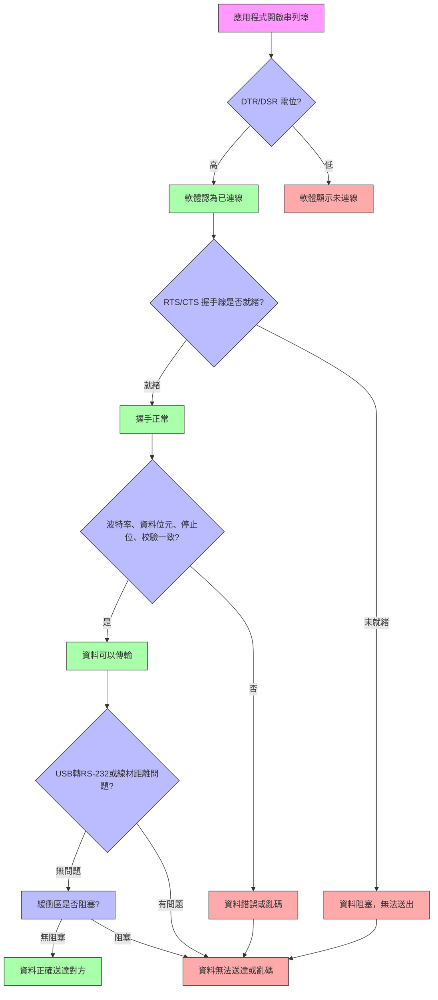

---
aliases:
date:
update:
author:
language:
sourceurl:
tags:
---

這種現象在 RS-232 通訊中其實很常見，看起來「已連線」，但實際上資料無法傳輸，背後涉及硬體與通訊協定的幾個原理問題：

# RS-232「看似連線但無法傳輸」的可能原因

1. **握手線狀態不符（Handshaking）**
   RS-232 除了 TX/RX 資料線，還有控制線如 **RTS/CTS**、**DTR/DSR**。如果軟體判定「連線」只看 DSR 或 DTR 高低，但 CTS 沒有回應，資料就無法送出。 例：軟體認為連上了，因為 DSR=高，但實際上 CTS=低，發送端卡住。

2. **波特率、資料位元、停止位、校驗不一致**
   即使線路物理連接，雙方通訊設定不同仍會造成資料無法正確傳送或接收。
   例：一邊 9600, 8N1；另一邊 115200, 8N1 → 雖然能建立連線，但資料亂碼或丟失。

3. **緩衝區滿或軟體阻塞**
   Windows 或應用程式的串列埠驅動有時會因緩衝區未清空而阻塞。
   例如應用程式只檢查「端口打開成功」就認為連線，但 TX 緩衝區卡住，資料根本送不出去。

4. **線材品質或距離問題**
   RS-232 的標準最大距離約 15 公尺，線材太長或有干擾可能造成連線穩定性下降。
   短時間連上後，TX/RX 信號衰減或錯誤導致資料無法到達對方。

5. **驅動程式或虛擬 COM 埠問題**
   USB 轉 RS-232 的轉接器或虛擬 COM 埠可能回報「已開啟」但實際物理鏈路沒有完全就緒。
   常見於 USB 轉 RS-232，尤其是 CH340、FTDI 驅動版本不合時。

6. **硬體握手與軟體控制不一致**
   有些設備要求硬體握手（RTS/CTS），但應用程式設定成「軟體握手」或無握手，導致訊號雖然連上但資料無法傳送。

## 總結原理

RS-232 的「連線」其實只是物理線路打通或控制線達到預期電位，**不代表資料可以可靠傳輸**。要資料能送通，需要：

- TX/RX 線路正常
- 控制線（RTS/CTS、DTR/DSR）符合握手協定
- 波特率、資料位元、停止位、校驗一致
- 緩衝區與驅動程式正常運作

簡單說，「連線」是電氣或軟體狀態，而「可傳輸資料」需要電氣、協定、軟體三者都就緒。

---

# RS-232 連線與握手流程示意

## 說明

- **DTR/DSR**：軟體判斷「物理連線」的基礎
- **RTS/CTS**：硬體握手控制，決定資料是否能送出
- **波特率/資料位元/停止位/校驗**：通訊協定一致性，否則資料雖送出但亂碼
- **結果**：
    - 全部正確 → 資料正確送達
    - 任何一項錯誤 → 看似連線但資料無法傳輸
- **USB 轉 RS-232 或線材距離問題**
    - 轉接器或線長超過規範 → 信號衰減、資料亂碼
- **緩衝區阻塞**
    - 驅動程式或應用程式未及時清空緩衝 → 送不出資料

這個流程可以當作 RS-232 連線診斷圖，用來快速找出「連線正常但資料無法通訊」的原因。
