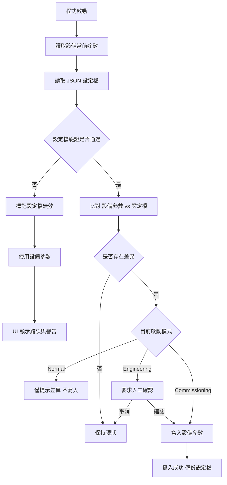

---
aliases:
date:
update:
author:
language:
sourceurl:
tags:
---

# 工控設備參數檔規劃

## 問題本質與核心風險

在工控設備中，設備參數同時存在於三個層級：
- 設備實體內部狀態（軸卡 RAM / EEPROM / Flash）
- 程式啟動時載入的設定檔（JSON）
- UI 允許即時修改並回寫設定檔

風險主要來自：
- JSON 可被外部直接編輯，無法保證正確性
- 啟動時若「盲目覆蓋」設備，可能直接造成設備異常或危險動作
- 若完全不覆蓋，又可能造成 UI 與實際設備狀態不一致

## 建議的整體設計原則

- 設定檔永遠視為「候選設定」，不是權威來源
- 設備實際回報的參數是「即時真實狀態」
- 啟動流程必須有「驗證、比較、決策」三個階段
- 所有自動寫入設備的行為都必須可追溯、可回復

## 啟動時的參數取捨策略（建議）

- 啟動時先讀取設備當前參數
- 讀取 JSON 設定檔
- 對設定檔做完整驗證
- 驗證失敗時，直接標記為不可信，不寫入設備
- 驗證成功後，比對設備參數與設定檔
- 僅在「差異存在」且「策略允許」時才寫入設備

## JSON 設定檔的防呆與驗證機制

- Schema 驗證
    - 型別是否正確
    - 必填欄位是否存在
    - 範圍限制（速度、加速度、Jerk、軟限位）
- 工控邏輯驗證
    - 軟限位是否合理（Min < Max）
    - 螺距、解析度是否為正值
    - 速度 × 螺距是否超過機構能力
- 版本驗證
    - 設定檔 Version 與程式版本是否相容
- 雜湊或簽章
    - 偵測是否被人工直接修改（非必要但加分）

## 工程師改錯 JSON 的處理方式

- 啟動時發現驗證失敗
    - 不寫入任何設備參數
    - UI 顯示錯誤清單（明確指出是哪一軸、哪個欄位）
    - 系統自動改用設備當前參數
- 提供安全回復機制
    - 自動備份最後一次成功設定檔
    - 允許一鍵回復為「上一次可用設定」
- 嚴禁 Silent Fail
    - 不允許悄悄忽略錯誤後仍寫入部分參數

## 啟動模式的實務分類（推薦）

- Normal Mode
    - 僅載入並比對
    - 不自動覆蓋設備
- Engineering Mode
    - 允許人工確認後寫入設備
- Commissioning / First Run
    - 明確指定以設定檔初始化設備
    - 僅限特殊流程啟用

## 啟動流程示意



## 實務經驗總結

- 「設定檔覆蓋設備」永遠是高風險行為
- 啟動時自動寫設備，只適合在受控模式下發生
- 最安全的設計是：
    - 啟動只讀、不寫
    - 由人確認後再寫
- 能被工程師直接改的 JSON，一定要假設「它會被改錯」

---

# C# 啟動流程架構

## C# 啟動流程整體架構（分層視角）

### 啟動流程責任分配

- Application Layer
    - 統籌啟動流程
    - 決定啟動模式（Normal / Engineering / Commissioning）
    - 不包含任何驗證或設備通訊細節
- Core Layer
    - 定義參數模型與驗證規則
    - 比對設備參數與設定檔
    - 輸出「差異結果」與「驗證結果」
- Infrastructure Layer
    - JSON 讀寫
    - 軸卡通訊與實際參數讀取/寫入
    - 紀錄 Log、備份檔案

### 啟動流程概念步驟

- 啟動 Application
- Infrastructure 讀取設備參數
- Infrastructure 讀取 JSON 設定檔
- Core 驗證設定檔
- Core 比對設定檔與設備參數
- Application 根據啟動模式做決策
- Infrastructure 執行寫入或僅記錄

## C# 啟動流程範例骨架

### 啟動協調服務（Application）

```csharp
public class StartupCoordinator
{
    private readonly IDeviceParameterProvider _deviceProvider;
    private readonly IConfigProvider _configProvider;
    private readonly IParameterValidator _validator;
    private readonly IParameterComparer _comparer;

    public StartupResult Run(StartupMode mode)
    {
        var deviceParams = _deviceProvider.ReadCurrent();
        var configResult = _configProvider.Load();

        if (!configResult.IsSuccess)
            return StartupResult.UseDevice(deviceParams, configResult.Errors);

        var validation = _validator.Validate(configResult.Value);
        if (!validation.IsValid)
            return StartupResult.UseDevice(deviceParams, validation.Errors);

        var diff = _comparer.Compare(deviceParams, configResult.Value);

        return StartupDecision.Decide(mode, deviceParams, configResult.Value, diff);
    }
}
```

### 設計重點

- 啟動流程「只組合結果」，不做任何實作細節
- 所有可能失敗的地方都有 Result 物件承載錯誤

---

# 設定驗證責任切分（Infrastructure / Core）

## Infrastructure Layer 責任

- JSON 結構解析
- Schema 驗證
    - 欄位存在
    - 型別正確
- 檔案層級錯誤
    - JSON 格式錯誤
    - 版本欄位缺失

## Core Layer 責任

- 工控語意驗證
    - 軟限位邏輯（Min < Max）
    - 加速度、Jerk 為正值
    - 機構極限計算
- 軸間關聯驗證
    - 同步軸參數一致性
    - 主從軸限制
- 業務規則
    - 不允許在某模式下修改特定參數

## 驗證介面設計

```csharp
public interface IParameterValidator
{
    ValidationResult Validate(DeviceParameterSet parameters);
}
```

```csharp
public sealed class ValidationResult
{
    public bool IsValid { get; }
    public IReadOnlyList<ValidationError> Errors { get; }
}
```

## 驗證錯誤模型

```csharp
public sealed class ValidationError
{
    public string AxisId { get; }
    public string ParameterName { get; }
    public string Message { get; }
    public ValidationSeverity Severity { get; }
}
```

---

# UI 提示與錯誤呈現策略

## UI 不該做的事

- 不重新驗證參數邏輯
- 不自行判斷是否可寫入設備
- 不吞錯誤

## UI 該呈現的三種狀態

- 設定檔無效
    - 顯示錯誤清單
    - 明確指出軸號與參數名稱
- 設定檔有效但與設備不同
    - 顯示差異列表
    - 標示「僅顯示 / 可套用」
- 設定檔已成功套用
    - 顯示套用時間
    - 顯示來源（JSON / UI）

## UI 錯誤層級呈現

- Error
    - 禁止寫入設備
    - 強制使用設備參數
- Warning
    - 允許工程師確認後套用
- Info
    - 僅作提示

## 差異顯示資料模型

```csharp
public sealed class ParameterDiff
{
    public string AxisId { get; }
    public string ParameterName { get; }
    public object DeviceValue { get; }
    public object ConfigValue { get; }
}
```

## UI 操作流程建議

- 啟動完成後顯示「參數狀態摘要」
- 提供「查看差異」對話框
- Engineering Mode 才顯示「套用設定檔」按鈕
- 套用前顯示二次確認與影響說明

# 五、實務落地建議總結

- 啟動流程必須「可中斷、可回退」
- Core 永遠不碰 IO、不知道 JSON、不知道 UI
- Infrastructure 永遠不決策
- UI 永遠只呈現結果與要求確認
- 所有寫入設備的行為都要可追溯（Log + Backup）

如果你願意，我可以下一步直接幫你整理成：

- 一個可直接用於專案的資料夾結構
- 一組完整 Result / Error Code 規範
- 或針對「運動軸卡參數」給更細的驗證規則清單

---

# 一組完整 Result / Error Code 規範

## 一、Result / Error Code 整體設計目標

- 所有跨層回傳一律使用 Result 物件
- 不丟例外做流程控制
- Error Code 必須可被 UI、Log、測試一致解析
- 同一錯誤在不同層級不可使用不同代碼

## 二、Result 型別總規範

### 基礎 Result

```csharp
public class Result
{
    public bool IsSuccess { get; }
    public IReadOnlyList<Error> Errors { get; }

    public static Result Success() => new Result(true, Array.Empty<Error>());
    public static Result Fail(params Error[] errors) => new Result(false, errors);
}
```

### 泛型 Result

```csharp
public sealed class Result<T> : Result
{
    public T Value { get; }

    public static Result<T> Success(T value) =>
        new Result<T>(true, value, Array.Empty<Error>());
}
```

### Error 基本結構

```csharp
public sealed class Error
{
    public ErrorCode Code { get; }
    public string Message { get; }
    public ErrorSeverity Severity { get; }
    public string AxisId { get; }
    public string Parameter { get; }

    public Error(ErrorCode code, string message,
                 ErrorSeverity severity,
                 string axisId = null,
                 string parameter = null)
    {
        Code = code;
        Message = message;
        Severity = severity;
        AxisId = axisId;
        Parameter = parameter;
    }
}
```

## 三、Error Code 命名與分群規範

### 命名規則

- 前綴代表責任層
    - INF：Infrastructure
    - CORE：Core 業務邏輯
    - APP：Application 流程決策
- 中段代表模組
    - CFG：設定檔
    - AXIS：運動軸
    - SYS：系統流程
- 後段為流水號（三位數）

### ErrorSeverity 定義

```csharp
public enum ErrorSeverity
{
    Info,
    Warning,
    Error,
    Critical
}
```

## 四、Infrastructure 層 Error Code

### 設定檔讀取與格式

- INF-CFG-001
    - JSON 格式錯誤，無法解析
- INF-CFG-002
    - 檔案不存在或無法存取
- INF-CFG-003
    - Schema 驗證失敗
- INF-CFG-004
    - 設定檔版本不支援

### 設備通訊

- INF-AXIS-001
    - 軸卡連線失敗
- INF-AXIS-002
    - 讀取設備參數失敗
- INF-AXIS-003
    - 寫入設備參數失敗

## 五、Core 層 Error Code（運動軸卡重點）

### 基本物理與數值限制

- CORE-AXIS-001
    - 速度必須為正值
- CORE-AXIS-002
    - 加速度必須為正值
- CORE-AXIS-003
    - Jerk 必須為正值
- CORE-AXIS-004
    - 解析度或脈衝比為 0 或負值
- CORE-AXIS-005
    - 螺距必須大於 0

### 行程與限位

- CORE-AXIS-010
    - 軟限位最小值 >= 最大值
- CORE-AXIS-011
    - 軟限位超出機械極限
- CORE-AXIS-012
    - Home Offset 超出行程範圍

### 交互關係與計算驗證

- CORE-AXIS-020
    - 最大速度 × 螺距超過機構允許
- CORE-AXIS-021
    - 加速度與負載慣量不相容
- CORE-AXIS-022
    - Jerk 與加速度比例不合理
- CORE-AXIS-023
    - 同步軸參數不一致

### 模式與權限限制

- CORE-AXIS-030
    - Normal Mode 禁止修改該參數
- CORE-AXIS-031
    - 參數僅允許在停止狀態修改

## 六、Application 層 Error Code

### 啟動流程與決策

- APP-SYS-001
    - 啟動模式未指定
- APP-SYS-002
    - 嘗試在禁止模式寫入設備
- APP-SYS-003
    - 使用者取消套用設定
        
七、總結建議

- Error Code 是「規格」，不是備註
- 每一條驗證規則都要對應一個 Error Code
- 寧可多定義，也不要共用模糊代碼
- 日後軸卡更換，只需調整 Core 驗證，不動 UI 與流程

---

# 「運動軸卡參數」的驗證規則清單

## 一、運動軸卡參數驗證規則清單（可實作）

### 單軸即時驗證

- MaxVelocity > 0
- MaxAcceleration > 0
- MaxJerk > 0
- PulsePerUnit > 0
- LeadPitch > 0

### 行程與 Home

- SoftLimitMin < SoftLimitMax
- HomePosition ∈ [SoftLimitMin, SoftLimitMax]
- HomeOffset ∈ 機械允許範圍

### 動態能力驗證

- MaxVelocity × LeadPitch ≤ 機構最大線速度
- MaxAcceleration ≤ 馬達額定加速度 × 安全係數
- MaxJerk / MaxAcceleration ≤ 經驗上限值

### 多軸關聯驗證

- Gantry 軸 PulsePerUnit 必須一致
- Master / Slave 軸最大速度比例一致
- 同步軸軟限位區間重疊

### 狀態相關限制

- 軸 Enable 狀態下禁止修改
- 軸 Moving 狀態下禁止任何寫入
- Servo On 狀態限制特定參數

## 二、UI 與 Error Code 對應策略

- UI 僅依 ErrorSeverity 決定顯示樣式
- Error Code 決定行為（是否可套用）
- Message 僅作人類閱讀，不做邏輯判斷
- 所有 Error Code 必須可被 Log 與測試斷言

如果你要，我可以下一步直接幫你：

- 把這套 Error Code 生出 enum + 常數表
- 寫一個 AxisParameterValidator 實作範例
- 或整理成一份可交付給團隊的設計規範文件
