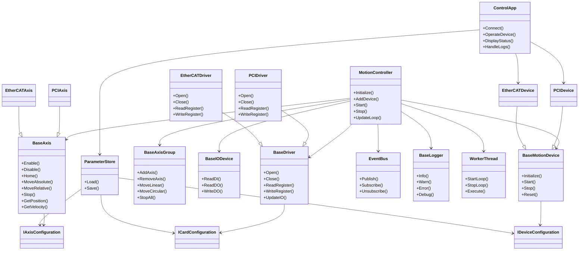

---
aliases:
date:
update:
author:
language:
sourceurl:
tags:
---

# Advantech Motion Control Prompt

# Prompt 1：Calin.MotionControl.Advantech Level 5 核心父類庫

專案名稱：Calin.MotionControl.Advantech

你現在是一位 **資深 .NET 工控運動控制首席架構師**，請設計並產生一個 **可直接投入 24/7 工控量產的 Level 5 核心運動控制架構**。

本專案為 **長期穩定核心層（Long-term Stable Core Layer）**。

必須同時滿足：

- 工控成熟度模型 Level 5
- Native Driver 完整封裝
- Native Crash 隔離
- 多卡多軸架構
- 外部組態 / 參數持久化支援

生成程式碼必須 **完整可編譯**。

禁止：

- 示範式程式碼
- TODO
- Stub
- 未完成方法

不得簡化任何核心架構。

## 不可包含

- PCI 專屬邏輯
- EtherCAT 專屬邏輯
- Polling
- UI
- 商業邏輯
- Application 層行為

本專案僅提供 **穩定核心控制層**。

## 環境限制

- .NET Framework 4.8
- Windows 7 / Windows 10 相容
- 僅使用 Win7 可用 API
- 不可使用 Thread.Abort
- 不可使用 async void
- 不可 lock(this)
- Dispose 不可呼叫 virtual
- Finalizer 不可存取 managed 物件
- 高頻區域禁止 LINQ
- 高頻區域禁止隱性 boxing
- 高頻區域禁止 string.Format
- 所有 public API 必須 thread-safe
- Dispose 必須完整釋放資源且可重入
- 所有例外必須透過 ILogger（Calin.Logging）記錄
- 所有 public 類別與方法必須提供 **正體中文 XML Summary**

## 全域設計優先順序

1 穩定性
2 相容性
3 效能
4 可預測性
5 可維護性
6 擴充性
7 架構優雅

若設計衝突：

- 永遠優先穩定性
- 禁止為架構美觀犧牲穩定性
- 禁止為 DI 純度犧牲可預測性

## 核心目標

支援 Advantech 運動控制卡（AdvMotAPI.dll / ACM）。

系統模型：

- 多 Device
- 每 Device 多 Motion Card
- 每 Card 多 Axis

要求：

- 多卡完全隔離
- 卡 Fault 不影響其他卡
- 軸 Fault 不影響其他軸
- 未來可擴充 EtherCAT

## 重大規範：AdvMotAPI.dll 必須完全封裝（不可曝露）

此專案 **必須將 AdvMotAPI.dll 完整封裝為 Managed Driver**。

任何外部專案不得直接接觸：

- AdvMotAPI.dll
- ACM API
- Native handle
- Native enum
- Native struct
- Native error code

外部程式 **完全不知道 AdvMotAPI.dll 存在**。

### Public API 禁止出現

- IntPtr
- ACM_HANDLE
- Native struct
- Native enum
- Native error code

### Native 呼叫層規則

所有 DllImport **只能存在於單一 Native 檔案群**。

禁止：

```csharp
Axis → DllImport
```

必須：

```csharp
Axis
↓
MotionCard
↓
NativeInvoker
↓
AcmNativeMethods
↓
AdvMotAPI.dll
```

### Native Handle 封裝

所有 ACM handle 必須使用：

```csharp
SafeHandle
```

例如：

```csharp
SafeAcmHandle : SafeHandle
```

禁止：

```csharp
public IntPtr
```

### Native Error Model

ACM error code 必須轉換為 Managed 模型：

```csharp
MotionErrorCode
MotionException
AxisFaultException
CardFaultException
```

Public API **不可出現 ACM error code**。

### Native Struct 封裝

Native struct 必須：

```csharp
internal struct NativeXXX
```

轉換為：

```csharp
internal ManagedModel
```

Public API 只使用 ManagedModel。

### Native Enum 封裝

ACM enum 必須轉換為：

```csharp
internal enum NativeEnum
```

映射為：

```csharp
public enum AxisStatus
```

### Native API 檔案限制

Native API 只能存在：

```csharp
Native
├ AcmNativeMethods.cs
├ SafeAcmHandle.cs
├ NativeInvoker.cs
├ NativeErrorMapper.cs
└ NativeCallGuard.cs
```

其他檔案 **禁止出現 DllImport**。

## Driver Crash 隔離機制（工控關鍵）

AdvMotAPI.dll 可能造成：

- AccessViolation
- Driver crash
- Native memory corruption

為避免整個工控程式崩潰，必須設計 **Crash Guard 機制**。

### Native 呼叫保護

所有 Native 呼叫必須：

```csharp
NativeCallGuard.Execute()
```

必須捕捉：

- AccessViolationException
- SEHException
- InvalidOperationException

若發生：

```csharp
→ Card 進入 Faulted
→ Axis 停止
→ 記錄 Logger
```

系統不得 crash。

### Fault 隔離

Native Crash 只影響：

- 該 MotionCard
- 該 Axis

不得影響：

- 其他 MotionCard
- 其他 Device

## 一、多設備 / 多卡 / 多軸模型

必須實作：

- IDevice
- IMotionCard
- IMotionAxis
- IDeviceFactory
- ICardFactory
- IAxisFactory

Device 僅為組合層，不負責 I/O。

Card 層負責：

- I/O 序列化
- CommandQueue
- Native 呼叫

Axis 層負責：

- 軸控制邏輯
- 動作競態策略
- Safety Policy

## 二、Native 隔離層

必須建立：

```csharp
IAcmNative
NativeInvoker
NativeCallGuard
SafeAcmHandle
NativeErrorMapper
```

功能：

- DLL 存在檢查
- FileVersion 檢查
- x86/x64 架構檢查
- Timeout 保護
- Native 呼叫統計
- 連續錯誤計數

連續錯誤超過閾值：

```csharp
Card → Faulted
```

## 三、I/O 序列化模型

每張 MotionCard 必須只有：

```csharp
Single IO Dispatcher
```

禁止多執行緒直接呼叫 Native。

所有指令必須經過：

```csharp
CommandQueue
```

優先權：

```csharp
Stop > Home > Move > Read
```

規則：

- Stop 永遠最高優先
- Move 可覆蓋 Move
- Home 必須可被 Stop 中止

## 四、狀態機（Atomic）

狀態：

```csharp
Disconnected
Initializing
Ready
Enabled
Faulted
Disposed
```

要求：

- Interlocked.CompareExchange
- TransitionGuard
- 非法轉移拋出 StateViolationException
- 保存 FaultReason
- 記錄來源與目標狀態
- 所有轉移 atomic

## 五、Safety Policy 層

建立：

```csharp
IAxisSafetyPolicy
```

規則：

- Servo 未 ON 禁止 Move
- Alarm 未清除禁止 Enable
- RDY 未成立禁止動作
- Home 未完成禁止 Move（可設定）

SafetyPolicy 不包含商業邏輯。

## 六、Capability（Immutable）

包含：

```csharp
SupportsRdySignal
SupportsSoftLimit
SupportsEncoderFeedback
SupportsInterpolation
MaxAxisCount
MaxVelocity
MaxAcceleration
```

必須 immutable。

不可 runtime 修改。

## 七、軸控制 API

提供：

```csharp
Enable
Disable
Home
MoveAbs
MoveRel
Stop
ReadPosition
ReadStatus
```

規則：

- Move 中再 Move → 覆蓋
- Home 中 Stop → 立即中止
- Stop 永遠最高優先

## 八、Axis Reference Monitor

核心層必須提供：

AxisReferenceMonitor。

功能：

- 判斷軸位置相對於 Reference
- 提供 Side 狀態
- SideChanged 事件
- 支援多 Reference

ReferenceSide：

```csharp
LessThan
Equal
GreaterThan
```

Axis API：

```csharp
AddReferenceMonitor
RemoveReferenceMonitor
GetReferenceMonitors
```

要求：

- thread-safe
- 不可高頻配置
- 使用 ArrayPool 或預配置集合
- 支援高頻 Position 更新

Driver 只提供 Position。

Reference 邏輯必須在 Core。

## 九、同步 / 插補預留

建立：

```csharp
IMotionGroup
IInterpolationController
```

僅建立抽象，不實作插補。

## 十、時間來源抽象

建立：

```csharp
ITimeProvider
```

內部使用：

```csharp
Stopwatch
```

禁止使用：

```csharp
DateTime.Now
```

作為 timeout。

## 十一、診斷模式

提供：

- Native 呼叫耗時統計
- 平均 I/O 延遲
- 最長呼叫時間
- CommandQueue 深度
- 最近 N 筆 I/O 記錄（RingBuffer）

診斷模式不得影響正常模式效能。

## 十二、GC 控制

要求：

- ArrayPool
- RingBuffer
- readonly struct 事件
- 禁止高頻 new
- 禁止高頻 string allocation

## 十三、DI

預設 DI：

Autofac。

提供：

```csharp
Autofac Module
```

限制：

- 不可強依賴 Container
- Factory 不可持有 Container

## 十四、參數持久化支援

核心層只提供：

```csharp
ApplyConfiguration
ApplyParameters
```

不負責：

- JSON
- DB
- NVRAM

Persistence 層負責儲存。

建立：

```csharp
IAxisConfiguration
ICardConfiguration
IDeviceConfiguration
IParameterStore
```

## 十五、FakeDevice / Simulator

必須提供：

```csharp
FakeMotionDevice
FakeMotionCard
FakeAxis
```

要求：

- 不引用 AdvMotAPI.dll
- 不引用 Native namespace
- 可觸發 AxisReferenceMonitor
- 可模擬 Position 更新

## 十六、輸出要求

Copilot 必須：

- 生成完整可編譯專案
- 所有 public API 提供正體中文 XML Summary
- Native API 完全封裝
- 不曝露 AdvMotAPI.dll
- 不生成硬體專屬邏輯
- 不生成 Polling
- 不生成 UI
- 不生成商業邏輯
- 使用 segmented generation
- 不要一次生成整個專案

---

# GitHub Copilot 分段生成指令

專案：**Calin.MotionControl.Advantech**

此版本已整合最終 PROMPT 的所有規範，包括：

- Level 5 工控成熟度
- Native API 完整封裝
- AdvMotAPI.dll 不可曝露
- Native Crash Guard
- Axis Reference Monitor
- Configuration / Parameter Snapshot
- FakeDevice 模擬
- CommandQueue I/O 序列化
- GC / Allocation 控制

以下為 **GitHub Copilot Segmented Generation 指令**。

Copilot 每次只生成 **一個 MODULE**。

## Step 0：共通規則（所有模組都必須套用）

```csharp
請生成 C# 專案 Calin.MotionControl.Advantech 中的 [MODULE_NAME] 模組。

此專案為 Level 5 工控核心層。

環境：

- .NET Framework 4.8
- Windows 7 / Windows 10 相容
- 24/7 工控系統

核心限制：

- 不得包含 UI
- 不得包含 WinForms
- 不得包含商業邏輯
- 不得包含 PCI / EtherCAT 專屬邏輯
- 不得包含 Polling

Native API 規範：

- 不可曝露 AdvMotAPI.dll
- Public API 不得出現 IntPtr
- Public API 不得出現 Native struct / enum
- 所有 DllImport 僅存在 Native 模組
- Native handle 必須使用 SafeHandle
- 所有 Native 呼叫必須透過 NativeInvoker
- Native 呼叫必須使用 NativeCallGuard.Execute()

Crash Guard：

- 必須捕捉 AccessViolationException / SEHException
- 發生錯誤時 Card → Faulted
- 不可讓系統 Crash

Thread Safety：

- 所有 public API 必須 thread-safe
- 使用 Interlocked / lock(private object)

GC 控制：

- 禁止高頻 new
- 禁止 LINQ
- 禁止隱性 boxing
- 禁止高頻 string allocation

Logging：

- 所有例外透過 ILogger 記錄

Dispose：

- 必須完整釋放資源
- Dispose 必須可重入
- Dispose 不可呼叫 virtual

XML 文件：

- 所有 public 類別與方法必須提供正體中文 XML Summary

生成要求：

- 不可簡化
- 不可留下 TODO
- 必須完整可編譯
- 分段生成
```

## Step 1：Core / MotionController

```csharp
MODULE_NAME: Core

生成 MotionController.cs

職責：

- 管理 MotionDevice / MotionCard / Axis
- 管理 AxisGroup
- 管理 EventBus
- 管理 Diagnostics

主要 API：

Initialize()
Start()
Stop()
AddDevice()
RemoveDevice()

功能：

- 系統初始化
- Card / Axis 註冊
- UpdateLoop（透過 WorkerThread）

提供：

ApplyConfiguration()
ApplyParameters()

要求：

- thread-safe
- 不包含硬體呼叫
- XML Summary
```

## Step 2：Device

```csharp
MODULE_NAME: Device

生成：

IMotionDevice.cs
BaseMotionDevice.cs
IDeviceFactory.cs

功能：

- Device 為 MotionCard 容器
- Device 不負責 I/O

要求：

- 支援多 Device
- thread-safe
- XML Summary
```

## Step 3：MotionCard

```csharp
MODULE_NAME: Card

生成：

IMotionCard.cs
BaseMotionCard.cs
ICardFactory.cs

功能：

- 管理多 Axis
- 管理 CommandQueue
- I/O Dispatcher
- Native 呼叫入口

限制：

- 只允許單一 I/O Dispatcher
- 不可多執行緒直接呼叫 Native

Command Priority：

Stop > Home > Move > Read

thread-safe
XML Summary
```

## Step 4：Axis

```csharp
MODULE_NAME: Axis

生成：

IMotionAxis.cs
BaseMotionAxis.cs
AxisState.cs

Axis API：

Enable()
Disable()
Home()
MoveAbs()
MoveRel()
Stop()

ReadPosition()
ReadStatus()

功能：

- 軸狀態機
- SafetyPolicy
- Move 覆蓋策略

狀態：

Disconnected
Initializing
Ready
Enabled
Faulted
Disposed

狀態轉移：

- Interlocked.CompareExchange
- TransitionGuard

thread-safe
XML Summary
```

## Step 5：AxisReference

```csharp
MODULE_NAME: AxisReference

生成：

AxisReferenceMonitor.cs
AxisReferenceSide.cs
AxisReferenceEventArgs.cs

功能：

ReferencePosition
CurrentSide

Side：

LessThan
Equal
GreaterThan

Axis API：

AddReferenceMonitor()
RemoveReferenceMonitor()
GetReferenceMonitors()

要求：

- thread-safe
- 不新增 thread
- 不使用 Polling
- 支援高頻 Position 更新
- 不可高頻 allocation
- 使用 ArrayPool 或預配置集合

XML Summary
```

## Step 5-1：整合 Reference Monitor 至 Axis

```text
修改 BaseMotionAxis.cs：

新增：

ReferenceMonitor 集合

在 UpdatePosition()：

呼叫

ReferenceMonitor.Evaluate()

要求：

- 事件不可在 native critical section 內發送
- 捕捉訂閱者例外
- 使用 ILogger 記錄
- 不得新增執行緒
```

## Step 6：Safety

```csharp
MODULE_NAME: Safety

生成：

IAxisSafetyPolicy.cs
DefaultAxisSafetyPolicy.cs

規則：

Servo 未 ON 禁止 Move
Alarm 未清除禁止 Enable
RDY 未成立禁止動作
Home 未完成禁止 Move（可設定）

thread-safe
XML Summary
```

## Step 7：CommandQueue

```csharp
MODULE_NAME: CommandQueue

生成：

MotionCommand.cs
MotionCommandQueue.cs
CommandPriority.cs

優先權：

Stop
Home
Move
Read

要求：

- thread-safe
- lock-free 或 minimal lock
- 不高頻 allocation
```

## Step 8：Native

```csharp
MODULE_NAME: Native

生成：

IAcmNative.cs
AcmNativeMethods.cs
SafeAcmHandle.cs
NativeInvoker.cs
NativeCallGuard.cs
NativeErrorMapper.cs

規則：

- 所有 DllImport 僅在此模組
- handle 必須 SafeHandle
- Native 呼叫必須使用 NativeCallGuard
- 映射 ACM error code

Public API 不可看到 Native 型別
```

## Step 9：Diagnostics

```csharp
MODULE_NAME: Diagnostics

生成：

IoStatistics.cs
RingBufferLog.cs
DiagnosticsManager.cs

提供：

- Native 呼叫時間統計
- CommandQueue 深度
- I/O latency
- 最近 N 筆 I/O

不可影響正常模式效能
```

## Step 10：Threading

```csharp
MODULE_NAME: Threading

生成：

WorkerThread.cs

功能：

StartLoop()
StopLoop()

支援：

1ms
10ms
100ms

不可使用 Thread.Abort

thread-safe
XML Summary
```

## Step 11：Events

```csharp
MODULE_NAME: Events

生成：

EventBus.cs

API：

Publish()
Subscribe()
Unsubscribe()

要求：

- thread-safe
- 不阻塞核心執行
```

## Step 12：Errors

```csharp
MODULE_NAME: Errors

生成：

MotionErrorCode.cs
MotionException.cs
AxisFaultException.cs
CardFaultException.cs
StateViolationException.cs
```

## Step 13：Configuration

```csharp
MODULE_NAME: Configuration

生成：

IAxisConfiguration.cs
ICardConfiguration.cs
IDeviceConfiguration.cs
IParameterStore.cs

功能：

核心只提供：

ApplyConfiguration()

不負責：

JSON
DB
NVRAM
```

## Step 14：Simulation

```csharp
MODULE_NAME: Simulation

生成：

FakeMotionDevice.cs
FakeMotionCard.cs
FakeMotionAxis.cs

要求：

- 不引用 AdvMotAPI.dll
- 不引用 Native namespace
- 可模擬 Position 更新
- 可觸發 AxisReferenceMonitor
```

## Step 15：DI

```csharp
MODULE_NAME: DI

生成：

MotionControlModule.cs

功能：

Autofac 註冊：

DeviceFactory
CardFactory
AxisFactory

限制：

Factory 不可持有 Container
```

## Step 16：資料夾結構

```text
Calin.MotionControl.Advantech
│
├ Core
├ Device
├ Card
├ Axis
├ AxisReference
├ Safety
├ CommandQueue
├ Native
├ Diagnostics
├ Threading
├ Events
├ Errors
├ Configuration
├ Simulation
└ DI
```

## 最佳 Copilot 生成順序（重要）

實務最佳順序：

```csharp
1 Native
2 Errors
3 Threading
4 CommandQueue
5 AxisReference
6 Safety
7 Axis
8 Card
9 Device
10 Core
11 Events
12 Diagnostics
13 Configuration
14 Simulation
15 DI
```

這個順序 **Copilot 成功率最高**。

---

# Calin.MotionControl.Advantech Copilot 分段生成流程表 (舊的，保留以供參考)

## 使用說明

1. 每個 Step 對應 **一個資料夾或檔案**。
2. 在檔案頂端放置對應的 Step prompt（可用註解 `//` 或 `/* */`）。
3. 將游標放在檔案內適當位置，呼叫 Copilot 生成程式碼。
4. 完成後，移到下一個 Step 檔案。

## Step 對應表格

| Step | 模組 / 資料夾                              | 檔案                                                                                        | Prompt / 內容描述                                                                                                                                                                       | 注意事項                           |
| ---- | ------------------------------------- | ----------------------------------------------------------------------------------------- | ----------------------------------------------------------------------------------------------------------------------------------------------------------------------------------- | ------------------------------ |
| 0    | 共通規則                                  | n/a                                                                                       | 將 Level 5 核心規範、thread-safe、XML Summary、禁止硬體邏輯等規則貼在專案註解                                                                                                                              | 所有 Step 都遵循此規則                 |
| 1    | Core                                  | MotionController.cs                                                                       | 管理 Devices, Axis, AxisGroups, Drivers, IO，Initialize(), AddDevice(), Start(), Stop(), UpdateLoop()，ApplyConfiguration / ApplyParameters 介面                                          | 不生成硬體程式碼                       |
| 2    | Device                                | IMotionDevice.cs, BaseMotionDevice.cs                                                     | IDevice / IDeviceFactory，BaseMotionDevice 實作組合邏輯（不含 I/O），支援多設備管理                                                                                                                    | thread-safe、XML Summary        |
| 3    | Axis                                  | IAxis.cs, BaseAxis.cs, AxisState.cs                                                       | IAxis: Enable/Disable/Home/MoveAbs/MoveRel/Stop/GetPosition/GetVelocity/IsBusy；BaseAxis: CommandQueue, SafetyPolicy, 狀態機；AxisState: Idle, Moving, Homing, Stopping, Error, Disabled | Level 5 核心規範、thread-safe       |
| 4    | AxisGroup                             | IAxisGroup.cs, BaseAxisGroup.cs                                                           | 管理多軸同步 (Gantry, XY, XYZ)，AddAxis/RemoveAxis/MoveLinear/MoveCircular/StopAll                                                                                                         | 只依賴 Axis interface，thread-safe |
| 5    | IO                                    | IIODevice.cs, BaseIODevice.cs                                                             | 單一 I/O Dispatcher，CommandQueue 排程，Stop 優先級最高                                                                                                                                        | 不允許直接多執行緒呼叫 native             |
| 6    | Driver                                | IDriver.cs, BaseDriver.cs                                                                 | IDriver: Open, Close, ReadRegister, WriteRegister, UpdateIO；BaseDriver 可被 PCI/EtherCAT 擴展                                                                                           | 僅接口與抽象類，thread-safe            |
| 7    | Trajectory                            | ITrajectoryPlanner.cs, LinearPlanner.cs                                                   | LinearPlanner 初版，輸入 StartPosition, TargetPosition, Velocity, Acceleration, Deceleration，輸出 TrajectoryPoint[]                                                                        | 未來可擴充 Circular / Spline        |
| 8    | Interpolator                          | IInterpolator.cs, LinearInterpolator.cs                                                   | 提供插補控制接口，LinearInterpolator 初版，依賴 TrajectoryPlanner interface                                                                                                                       | thread-safe                    |
| 9    | Events                                | EventBus.cs                                                                               | Publish / Subscribe / Unsubscribe，Axis/Device/Error 事件                                                                                                                              | thread-safe，不阻塞核心執行            |
| 10   | Logging                               | ILogger.cs, BaseLogger.cs                                                                 | Info, Warn, Error, Debug，背景 queue 執行                                                                                                                                                | 低 CPU，thread-safe              |
| 11   | Errors                                | ErrorCode.cs                                                                              | 定義 DeviceError, AxisError, DriverError, IOError, CommunicationError                                                                                                                 | thread-safe                    |
| 12   | Threading                             | WorkerThread.cs                                                                           | StartLoop, StopLoop, Execute，支援 UpdateCycle (1ms/10ms/100ms)                                                                                                                        | thread-safe                    |
| 13   | Plugin                                | DriverLoader.cs                                                                           | Load driver DLL, Create driver instance, Register driver，支援 PCI/EtherCAT/未來擴展                                                                                                       | 僅接口與抽象類，thread-safe            |
| 14   | Configuration / Parameter Persistence | IAxisConfiguration.cs, ICardConfiguration.cs, IDeviceConfiguration.cs, IParameterStore.cs | ApplyConfiguration / ApplyParameters 介面，Immutable Snapshot，核心層不存儲，Persistence / Application 層管理 JSON/DB/NVRAM                                                                       | thread-safe，XML Summary        |

## 推薦使用流程

1. **建立專案與資料夾結構**

   * `Core`, `Device`, `Axis`, `AxisGroup`, `IO`, `Driver`, `Trajectory`, `Interpolator`, `Events`, `Logging`, `Errors`, `Threading`, `Plugin`, `Configuration`

2. **貼上共通規則 Step 0**

   * 在每個檔案頂端都複製核心規則，保證 Copilot 遵循 Level 5 核心規範

3. **依 Step 順序生成模組**

   * Step 1 → MotionController.cs
   * Step 2 → Device
   * Step 3 → Axis …
   * Step 14 → Configuration / Parameter Persistence

4. **每個檔案生成完成後再生成下一個**

   * 避免一次生成整個專案過大
   * 保證 Copilot 上下文清晰、生成可靠

5. **生成完成後，檢查每個 public API 是否 thread-safe、附 XML Summary**

   * 必要時微調生成的程式碼

✅ **效果**：

* 每個 Step 都獨立生成，Copilot 上下文清晰
* 核心層保持抽象化、Level 5 工控標準
* 易於後續 PCI / EtherCAT / Application 層擴展

---

# PROMPT 0：MotionControl Solution Architecture Prompt

專案名稱：MotionControlSolution

目的：

建立整個 Motion Control 工控平台的 **Solution 架構與專案依賴關係**。

此 Prompt 只建立 **Solution 與專案骨架 (Project Skeleton)**
**不可生成 Driver 或核心邏輯實作**。

此 Solution 為 **工控等級 Motion Control SDK 平台架構**。

此 Solution 架構必須完全相容於 **Level 5 工控成熟度模型 Motion Control Core**，並配合以下核心規範：

* 核心 Native Driver 必須完全封裝
* 不可曝露 AdvMotAPI.dll
* Driver 與 Core 必須 Fault 隔離
* Configuration / Driver / Diagnostics 必須與 Core 解耦
* 所有 Driver 透過 Core 的抽象模型運作

本 Prompt 僅建立 **Solution Architecture**，不實作核心邏輯。

## 前提

目前 **核心專案已存在**

```csharp
Calin.MotionControl.Advantech
```

此專案為 **Level 5 Motion Control Core（Axis Control Model Core）**。

核心提供：

* Motion Controller Core
* Axis State Machine
* Motion Command Pipeline
* Axis Safety Model
* Axis Reference Monitor
* CommandQueue
* Diagnostics Hook
* Native Driver Isolation

此專案 **不可修改**。

其他專案只能 **依賴此核心**。

## Solution 必須包含以下專案

```csharp
Calin.MotionControl.Advantech
Calin.MotionControl.Advantech.Configuration
Calin.MotionControl.Advantech.PCI
Calin.MotionControl.Advantech.EtherCAT
Calin.MotionControl.Advantech.Diagnostics
ControlApp
```

Solution 需符合 **三層架構**：

```text
Core Layer
Driver / Service Layer
Application Layer
```

## 專案角色

### 1. Calin.MotionControl.Advantech

Level 5 Motion Control Core。

提供：

* Axis State Machine
* IMotionAxis
* IMotionCard
* IMotionDevice
* Motion Command Queue
* Axis Safety Policy
* Axis Reference Monitor
* Fault Model
* Native Driver Isolation Model
* Diagnostics Hook

此專案：

* 不可依賴其他 MotionControl 專案
* 為整個平台核心
* Native API 完全封裝
* 不可曝露 AdvMotAPI.dll

## 2. Calin.MotionControl.Advantech.Configuration

提供 **Axis Configuration Model 與持久化機制**。

提供：

```csharp
IAxisConfiguration
ICardConfiguration
IDeviceConfiguration
ConfigurationSerializer
ConfigurationRepository
```

用途：

* 讀取 Axis Configuration
* 產生 Immutable Configuration Snapshot
* 將 Configuration 套用至 Core

```csharp
ApplyConfiguration(IAxisConfiguration config)
```

此專案負責：

* Configuration 讀寫
* JSON / DB / File persistence
* Configuration Repository

此專案 **不得包含 Motion Driver 邏輯**。

## 3. Calin.MotionControl.Advantech.PCI

PCI Motion Control Driver。

提供：

* PCI Motion Transport
* Motion Card Detection
* Driver Initialization
* Axis Mapping

必須實作 Core 定義的：

```csharp
IMotionCard
IMotionAxis
```

Driver 必須透過 Core 的：

```csharp
ApplyConfiguration()
```

套用 Configuration。

重要規則：

* Driver **不可直接存取 Configuration Repository**
* Driver **不可依賴 Configuration 專案**
* Driver **不可曝露 Native API**

Native Driver 必須：

* 封裝 AdvMotAPI.dll
* 使用 Core 的 NativeInvoker / SafeHandle

Driver Fault **不可影響其他 Driver**。

## 4. Calin.MotionControl.Advantech.EtherCAT

EtherCAT Motion Driver。

提供：

* EtherCAT Master Transport
* Device Presence Monitor
* Reinitialize 機制
* Hot Plug Recovery
* Axis Mapping

並整合 Configuration。

Driver 必須：

* 實作 IMotionCard / IMotionAxis
* 支援 Fault Isolation
* 不可曝露 Native 通訊細節

EtherCAT Driver **不得依賴 PCI Driver**。

## 5. Calin.MotionControl.Advantech.Diagnostics

提供 **平台級 Diagnostics 與 Logging 能力**。

提供：

* Motion System Diagnostics
* Axis State Monitoring
* Fault Logging
* Performance Metrics
* CommandQueue Monitoring
* Motion Latency Monitoring

Diagnostics 必須：

* 訂閱 Core EventBus
* 不可影響 Core State Machine
* 不可阻塞 Motion I/O

Diagnostics 不得呼叫 Motion Control API。

僅用於：

* 監控
* 記錄
* 可視化

## 6. ControlApp

範例 Application。

用於：

* 測試 Motion Driver
* 初始化 Motion Controller
* 註冊 DI Container
* 載入 Axis Configuration
* 建立 Motion Controller

Application 需要：

```csharp
Autofac
```

並註冊：

```csharp
PCI Driver
EtherCAT Driver
Configuration Repository
Diagnostics
```

Application 負責：

* DI 初始化
* Configuration 載入
* Motion System 啟動

Application **不可直接呼叫 Native Driver**。

## 專案依賴關係

必須符合以下規則：

```csharp
Configuration      → ACM Core
PCI Driver         → ACM Core
EtherCAT Driver    → ACM Core
Diagnostics        → ACM Core

Application        → 所有專案
```

嚴格限制：

```csharp
Driver 不可依賴 Configuration
Driver 不可互相依賴
Core 不可依賴任何專案
Diagnostics 不可呼叫 Motion API
```

## 命名空間規範

所有專案需使用：

```csharp
Calin.MotionControl.Advantech.*
```

例如：

```csharp
Calin.MotionControl.Advantech
Calin.MotionControl.Advantech.PCI
Calin.MotionControl.Advantech.Configuration
Calin.MotionControl.Advantech.Diagnostics
```

Application 使用：

```csharp
ControlApp
```

## DI 規範

預設 DI：

```csharp
Autofac
```

每個 Driver 專案必須提供：

```csharp
Autofac Module
```

例如：

```csharp
PciMotionModule
EtherCatMotionModule
```

Configuration 專案提供：

```csharp
ConfigurationModule
```

Diagnostics 提供：

```csharp
DiagnosticsModule
```

Application 負責註冊所有 Module。

## Native Driver 封裝規範

所有 Native Driver 必須遵守 Core 規範：

* Native API 必須封裝
* 不可曝露 IntPtr
* 不可曝露 Native struct
* 不可曝露 Native enum
* 使用 SafeHandle
* 所有 Native 呼叫必須透過 Core 的 NativeInvoker
* 必須有 Crash Guard

Driver 不得直接呼叫：

```csharp
DllImport
```

## 專案骨架要求

生成內容：

```csharp
Solution (.sln)
.csproj
資料夾結構
Namespace
DI Module
```

每個專案需建立基本資料夾：

```text
Core
Configuration
Driver
Diagnostics
DI
Infrastructure
```

但 **不可生成 Driver 或 Core 實作**。

僅生成：

* Interface
* DI Module
* 基礎資料夾

## 輸出要求

生成內容必須：

* 可編譯
* 不可簡化
* 不可生成核心邏輯
* 不可生成 Driver 實作
* 所有 public 類別附 **正體中文 XML Summary**
* 嚴格遵守依賴關係
* 不可修改 ACM Core

生成內容必須為 **Production-ready Solution Skeleton**。

---

# Prompt 2：Calin.MotionControl.Advantech.Configuration（參數持久化層）

設計目標是：工控平台級 Configuration System

* 完整對接 `Calin.MotionControl.Advantech` Level 5 核心層
* 可長期維護（版本 / migration / validator / snapshot）
* 可直接貼給 **GitHub Copilot 生成專案結構與程式骨架**
* 保持與 **Prompt 1 的格式一致**

專案名稱：Calin.MotionControl.Advantech.Configuration

你現在是一位資深 .NET 工控架構師，請產出可直接投入量產的「工控成熟度模型 Level 5」參數持久化與組態管理專案，用於管理 `Calin.MotionControl.Advantech` 核心層與子類的參數。

此專案為 **Configuration / Parameter Persistence Layer**，負責：

* 系統配置模型
* 參數持久化
* Snapshot 管理
* 配置驗證
* 配置版本與遷移
* 多設備 / 多卡 / 多軸配置管理

此層不涉及任何硬體 API。

## 一、環境與限制

* .NET Framework 4.8
* Windows 7 / Windows 10 相容
* 僅使用 Win7 相容 API
* 不可使用 async void
* 不可 lock(this)
* 所有 public API 必須 thread-safe
* 所有 public 類別與方法必須提供正體中文 XML Summary
* 禁止高頻 LINQ / boxing
* 禁止高頻字串配置
* 所有例外必須捕捉並透過 ILogger（Calin.Logging）回報

## 二、核心設計原則（Level 5）

Configuration Layer 必須遵守：

1. 不依賴硬體 API
2. 不依賴 UI
3. 所有邏輯可單元測試
4. 支援 Immutable Snapshot
5. 支援版本升級（Migration）
6. 支援多儲存媒體
7. 不污染 I/O 執行緒
8. Configuration 與 Runtime 完全解耦

## 三、Configuration 層系統架構

系統架構：

```csharp
Application
     ↓
Calin.MotionControl.Advantech.Configuration
     ↓
Calin.MotionControl.Advantech
```

Configuration 負責：

```csharp
Load configuration
Validate configuration
Create immutable snapshot
Inject into Device / Card / Axis
Call ApplyConfiguration()
```

## 四、Configuration Model（核心配置模型）

必須提供完整系統配置模型。

```csharp
MotionConfiguration
 ├ Devices[]
 │   ├ DeviceConfiguration
 │   │   ├ Cards[]
 │   │   │   ├ CardConfiguration
 │   │   │   │   ├ Axes[]
 │   │   │   │   │   ├ AxisConfiguration
```

必須實作：

```csharp
IMotionConfiguration
IDeviceConfiguration
ICardConfiguration
IAxisConfiguration
```

## 五、AxisConfiguration（軸參數）

AxisConfiguration 必須包含：

```csharp
Acceleration
Deceleration
MaxVelocity
HomeSpeed
JogSpeed

SoftLimitPositive
SoftLimitNegative

GearRatio
PulsePerUnit

HomeOffset
HomeDirection
```

要求：

* thread-safe
* 支援 Immutable snapshot

## 六、Parameter Store（參數儲存抽象）

必須提供：

```csharp
IParameterStore
```

功能：

```csharp
LoadConfiguration()
SaveConfiguration()
CreateSnapshot()
```

必須提供以下實作：

```csharp
JsonFileParameterStore
DatabaseParameterStore
InMemoryParameterStore
```

設計要求：

* 可替換儲存媒體
* thread-safe
* 不影響核心 I/O

## 七、Configuration Snapshot（不可變快照）

系統啟動時：

```csharp
Load configuration
↓
Validate
↓
Create Immutable Snapshot
↓
Inject to runtime
```

必須提供：

```csharp
IConfigurationSnapshotProvider
ConfigurationSnapshot
```

要求：

* Snapshot immutable
* Runtime 不可修改
* 維護模式可重新生成

## 八、Configuration Validation（配置驗證）

必須提供配置驗證系統。

核心接口：

```csharp
IConfigurationValidator
```

實作：

```csharp
AxisConfigurationValidator
CardConfigurationValidator
DeviceConfigurationValidator
```

驗證範例：

```csharp
Velocity <= MaxVelocity
SoftLimitNegative < SoftLimitPositive
GearRatio > 0
PulsePerUnit > 0
```

驗證錯誤必須：

```csharp
throw ConfigurationValidationException
```

## 九、Configuration Version（版本控制）

配置系統必須支援版本升級。

必須提供：

```csharp
ConfigurationVersion
```

與：

```csharp
IConfigurationMigration
```

用途：

```csharp
v1 configuration
↓
Migration
↓
v2 configuration
```

避免舊版本 JSON 無法讀取。

## 十、Configuration Serializer

配置序列化必須抽象。

必須提供：

```csharp
IConfigurationSerializer
```

預設實作：

```csharp
JsonConfigurationSerializer
```

未來可支援：

```csharp
YAML
Binary
Custom format
```

## 十一、Configuration Path Resolver

必須提供配置檔路徑解析。

```csharp
IConfigurationPathResolver
```

功能：

```csharp
Resolve configuration file path
Resolve backup path
Resolve migration path
```

避免 Application 汙染 Configuration Layer。

## 十二、DI（Dependency Injection）

預設 DI 為 Autofac。

必須提供：

```csharp
ConfigurationAutofacModule
```

註冊：

```csharp
ParameterStore
Serializer
Validators
SnapshotProvider
```

要求：

* 不可依賴 Container
* 只提供 Module

## 十三、建議資料夾結構

```csharp
Calin.MotionControl.Advantech.Configuration
│
├ Configuration
│   IMotionConfiguration.cs
│   MotionConfiguration.cs
│
├ Device
│   IDeviceConfiguration.cs
│   DeviceConfiguration.cs
│
├ Card
│   ICardConfiguration.cs
│   CardConfiguration.cs
│
├ Axis
│   IAxisConfiguration.cs
│   AxisConfiguration.cs
│
├ Store
│   IParameterStore.cs
│   JsonFileParameterStore.cs
│   DatabaseParameterStore.cs
│   InMemoryParameterStore.cs
│
├ Snapshot
│   IConfigurationSnapshotProvider.cs
│   ConfigurationSnapshot.cs
│
├ Validation
│   IConfigurationValidator.cs
│   AxisConfigurationValidator.cs
│   CardConfigurationValidator.cs
│   DeviceConfigurationValidator.cs
│
├ Versioning
│   ConfigurationVersion.cs
│   IConfigurationMigration.cs
│
├ Serialization
│   IConfigurationSerializer.cs
│   JsonConfigurationSerializer.cs
│
├ Path
│   IConfigurationPathResolver.cs
│
└ DI
    ConfigurationAutofacModule.cs
```

## 十四、輸出要求

* 生成完整可編譯專案
* 所有 public 類別與方法附正體中文 XML Summary
* thread-safe
* 可單元測試
* 支援多設備 / 多卡 / 多軸配置
* 不涉及硬體 API
* 不依賴 UI
* 提供 Load / Save / Snapshot / ApplyConfiguration 示範流程

## 十五、Copilot 生成策略

生成策略：

* 分段生成
* 每個資料夾為一個生成單位
* 不一次生成整個專案

## 十六、Axis Crossing Monitor（雙座標方向穿越通知機制）

### 設計定位

此功能為「軟體座標穿越監看機制」。

特性：

- 每一軸獨立
- 可設定兩個座標（Upper / Lower）
- 可選擇監看方向（Upward / Downward / Both）
- 不觸發硬體動作
- 不屬於 SoftLimit
- 不可修改 Motion CommandQueue
- 不可自動 Stop
- 不可觸發 Alarm
- 只負責即時通知

父類（BaseAxis）只做：偵測、事件發布。

反應由子類或 Application 層決定。

### 功能需求

1. 每軸可設定：
    - UpperTriggerPosition（可啟用/停用）
    - LowerTriggerPosition（可啟用/停用）
2. 每個 Trigger 可設定：
    - CrossingDirection
        - Upward
        - Downward
        - Both
3. 僅在軸處於運動狀態時檢查
4. 當軸穿越指定座標時：
    - 必須立即通知
    - 不可排入低優先權 queue
    - 不可延遲
    - 不可阻塞 I/O Dispatcher
5. 可：
    - 只啟用 Upper
    - 只啟用 Lower
    - 兩者啟用
    - 兩者皆關閉
6. 禁止：
    - 新增獨立 polling thread
    - 修改 native 呼叫順序
    - 插入 Stop 指令
    - 改變狀態機轉移

### 設計原則

#### 1. 不使用 Polling

僅在「已存在的位置更新點」插入檢查。

例如：

- ReadPosition()
- 狀態更新流程
- Driver 更新回調

不得新增執行緒。

#### 2. 低延遲通知

觸發後：

- 直接透過 Axis 事件發布
- 或透過 EventBus 同步發布
- 不可使用背景 queue 延遲處理

但：

不可在 native lock 區塊內直接執行使用者委派。

必須：

先退出 I/O critical section
再發布事件

#### 3. 高頻區域限制

禁止：

- LINQ
- boxing
- new EventArgs
- 字串格式化

必須：

- 使用 readonly struct CrossingEvent
- 使用 delegate 快照
- 使用 Interlocked.Exchange 更新 lastPosition

### 介面設計

新增至 IAxis：

```csharp
void ConfigureUpperCrossing(double position, CrossingDirection direction, bool enabled);
void ConfigureLowerCrossing(double position, CrossingDirection direction, bool enabled);
void ClearCrossingConfiguration();
event Action<AxisCrossingEvent> CrossingOccurred;
```

### CrossingDirection

```csharp
public enum CrossingDirection
{
    Upward,
    Downward,
    Both
}
```

### 事件模型（必須為 readonly struct）

```csharp
public readonly struct AxisCrossingEvent
{
    public readonly int AxisId;
    public readonly double TargetPosition;
    public readonly double CurrentPosition;
    public readonly CrossingDirection Direction;
    public readonly CrossingType Type; // Upper or Lower
    public readonly long TimestampTicks;
}
```

不得使用 class。

### 判斷邏輯（無抖動重複觸發）

對於 target：

Upward 觸發條件：

previous < target && current >= target

Downward 觸發條件：

previous > target && current <= target

必須：

- 記錄 lastPosition
- 使用 atomic 更新
- 防止來回震盪重複觸發

### 與狀態機整合

僅在：

AxisState == Moving

時檢查。

不得在：

Homing
Stopping
Faulted
Disabled

狀態觸發。

### 與 SafetyPolicy 關係

此功能：

不是 SafetyPolicy
不參與動作前驗證
不阻止 Move

純事件通知。

### 診斷模式整合

診斷模式下可統計：

- Crossing 次數
- 最近觸發時間
- 最近觸發方向

正常模式不得增加額外成本。

### Configuration 支援

IAxisConfiguration 增加：

```csharp
bool UpperCrossingEnabled
double UpperCrossingPosition
CrossingDirection UpperCrossingDirection

bool LowerCrossingEnabled
double LowerCrossingPosition
CrossingDirection LowerCrossingDirection
```

核心層只在：

ApplyConfiguration()

中套用。

不負責儲存。

### GC 與效能要求

- 不得在每次 Position 更新 new 物件
- 不得產生 closure allocation
- delegate 使用本地快照
- 禁止 string.Format
- 禁止例外當流程控制

### 錯誤處理

若事件訂閱者拋出例外：

- 必須捕捉
- 記錄 ILogger
- 不可影響 Axis 主流程

## 十七、最終架構（整體系統）

最終 Motion Control 平台：

```csharp
MotionControlSolution
│
├ Calin.MotionControl.Advantech
│      Level 5 Motion Control Core
│
├ Calin.MotionControl.Advantech.Configuration
│      Parameter Persistence Layer
│
├ Calin.MotionControl.Advantech.PCI
│      PCI Motion Driver
│
├ Calin.MotionControl.Advantech.EtherCAT
│      EtherCAT Motion Driver
│
└ ControlApp
       Application Layer
```

## 十八、Axis Crossing Monitor 在 Configuration 層的完整對接規範

### 設計目標

Configuration 層必須：

1. 提供 Crossing 設定模型
2. 支援版本升級
3. 支援 Validator
4. 支援 Immutable Snapshot
5. 與 Runtime 完全解耦
6. 不包含任何運算邏輯
7. 不包含穿越判斷邏輯
8. 不產生任何事件

Configuration 層只負責：

儲存 / 驗證 / 序列化 / 版本遷移 / 建立 Snapshot / 注入至 ACM 核心層

### 一、AxisConfiguration 擴充（平台級定義）

AxisConfiguration 必須增加：

```csharp
bool UpperCrossingEnabled
double UpperCrossingPosition
CrossingDirection UpperCrossingDirection

bool LowerCrossingEnabled
double LowerCrossingPosition
CrossingDirection LowerCrossingDirection
```

#### 設計要求

- 屬於純資料模型
- 不包含任何 crossing 判斷邏輯
- 不包含任何事件
- 不依賴 ACM 內部類別
- 可單元測試

### 二、CrossingDirection 對接策略

Configuration 層：

不得直接引用 ACM enum。

必須：

在 Configuration 專案內建立獨立 enum：

```csharp
public enum CrossingDirection
{
    Upward,
    Downward,
    Both
}
```

由 Application 層或注入邏輯做轉換。

避免 Configuration 對 ACM 形成反向依賴。

### 三、AxisConfigurationValidator 擴充

Validator 必須新增以下驗證規則：

1. 若 UpperCrossingEnabled == true
    - UpperCrossingPosition 必須為有效數值（不可 NaN / Infinity）
2. 若 LowerCrossingEnabled == true
    - LowerCrossingPosition 必須為有效數值
3. 若 Upper 與 Lower 同時啟用：
    - LowerCrossingPosition < UpperCrossingPosition
4. CrossingDirection 必須為合法 enum 值

驗證失敗：

必須丟出 ConfigurationValidationException

不可：

- 使用例外當流程控制
- 產生高頻字串格式化

### 四、Immutable Snapshot 擴充

ConfigurationSnapshot 必須：

- 包含 Crossing 設定
- 建立後不可修改
- 深拷貝資料
- 不允許 runtime 修改 snapshot

Snapshot 中的 AxisConfig 必須為 immutable 物件。

### 五、版本升級（Migration）

若未來舊版本不包含 Crossing 參數：

Migration 規則：

- 預設 UpperCrossingEnabled = false
- 預設 LowerCrossingEnabled = false
- Direction 預設為 Both
- Position 預設為 0

Migration 必須：

- 明確版本號
- 可多版本升級
- 不破壞既有 JSON

### 六、ParameterStore 不得做的事情

ParameterStore：

不得：

- 呼叫 Axis.ConfigureUpperCrossing()
- 呼叫 Axis.ConfigureLowerCrossing()
- 呼叫 ApplyConfiguration()

Configuration 層只提供資料。

Runtime 注入由 Application 負責。

### 七、ApplyConfiguration 整合流程（平台標準流程）

標準流程必須為：

```csharp
Load configuration
↓
Validate
↓
Create Immutable Snapshot
↓
Application 層轉換 Configuration enum → ACM enum
↓
Axis.ApplyConfiguration()
↓
BaseAxis 內部套用 Crossing 設定
```

Configuration 層不可直接呼叫 Runtime。

### 八、效能與 GC 約束

Configuration 層：

- 不屬於高頻執行區
- 允許有限 LINQ（僅啟動時）
- 不允許在 Save/Load 產生大量字串配置
- Snapshot 建立必須 O(n)

### 九、Copilot 分段生成指令（Configuration Crossing 擴充）

請加入以下生成步驟。

### Step 5-1：AxisConfiguration 擴充

```text
修改 AxisConfiguration.cs：

- 新增 UpperCrossingEnabled
- 新增 UpperCrossingPosition
- 新增 UpperCrossingDirection
- 新增 LowerCrossingEnabled
- 新增 LowerCrossingPosition
- 新增 LowerCrossingDirection

要求：

- thread-safe
- 支援 Immutable snapshot
- 提供正體中文 XML Summary
- 不加入任何 crossing 判斷邏輯
```

### Step 8-1：AxisConfigurationValidator 擴充

```text
修改 AxisConfigurationValidator.cs：

新增 Crossing 驗證規則：

- 檢查數值合法性
- Upper > Lower（若同時啟用）
- Enum 合法性

失敗丟出 ConfigurationValidationException

要求：

- thread-safe
- 不高頻字串格式化
- 不使用例外作流程控制
```

### Step 7-1：ConfigurationSnapshot 擴充

```text
修改 ConfigurationSnapshot.cs：

- Snapshot 必須包含 Crossing 設定
- 建立 immutable AxisSnapshot
- 深拷貝資料
- Runtime 不可修改
- 提供正體中文 XML Summary
```

### Step 9-1：Migration 擴充

```text
修改 IConfigurationMigration 與 Migration 實作：

- 支援舊版本無 Crossing 參數
- 自動補預設值
- 保持向後相容
- 不破壞既有 JSON
```

### 十、Configuration 層對 Crossing 的最終約束聲明（給 Copilot）

```text
Configuration Layer 僅負責 Crossing 參數的：

- 儲存
- 驗證
- 版本遷移
- Snapshot 建立

不得：

- 實作穿越判斷
- 發出任何事件
- 呼叫 Stop
- 呼叫 Alarm
- 呼叫 Motion API

Runtime 行為由 Calin.MotionControl.Advantech 核心層負責。
```

## 最終整體架構確認

整體系統分層仍為：

```text
Application
    ↓
Calin.MotionControl.Advantech.Configuration
    ↓
Calin.MotionControl.Advantech
    ↓
Driver (PCI / EtherCAT)
```

Crossing Monitor：

- 判斷與事件 → ACM
- 設定與持久化 → Configuration
- 反應邏輯 → Application

責任完全分離。

---

# Prompt 3：PCI 子專案（Level 5 可變層）

工控 SDK / Motion Control Driver 實務架構，可量產的 PCI Motion Driver Layer。

專案名稱：Calin.MotionControl.Advantech.PCI

用途：

- 實作 PCI Motion Controller Driver Layer
- 對接 `Calin.MotionControl.Advantech` Core
- 封裝 Native Driver
- 實作 Polling / Watchdog / Fault Recovery
- 整合 `Calin.MotionControl.Advantech.Configuration`
- 正確整合 Axis Crossing 機制（由 Core 提供）

此專案為 Level 5 工控 SDK 可變層。

不得污染 Core。
不得重寫 Core 邏輯。
不得修改 Configuration Layer。

## 一、強制前提

必須遵守：

- 不可修改 `Calin.MotionControl.Advantech`
- 不可修改 `Calin.MotionControl.Advantech.Configuration`
- 僅透過 public API 操作 Core
- 不可暴露 Native Driver 至 Application
- 不可重寫 Axis Crossing 判斷邏輯
- 不可新增 Crossing polling thread

## 二、執行環境限制

- .NET Framework 4.8
- Windows 7 / Windows 10
- 不可使用 Win10 only API
- 不可使用 async void
- 不可 lock(this)
- 不可 busy-wait
- 所有 public API 必須 thread-safe
- 所有 public 類別與方法附正體中文 XML Summary
- 所有例外必須透過 ILogger（Calin.Logging）回報
- 不可高頻 LINQ
- 不可高頻字串配置

## 三、Driver Layer 架構

```text
Application
     ↓
Calin.MotionControl.Advantech
     ↓
Calin.MotionControl.Advantech.PCI
     ↓
Native Motion Driver DLL
```

設計原則：

- ACM Core 不知道 PCI
- PCI Driver 不污染 Core
- Native Driver 完全封裝
- Crossing 邏輯永遠屬於 Core

## 四、Native Driver Adapter（必須）

建立：

```csharp
INativeDriver
PciNativeDriver
```

封裝所有 P/Invoke。

禁止：

```csharp
Axis / Card 直接呼叫 native DLL
```

必須提供：

```csharp
OpenCard()
CloseCard()

ReadAxisStatus()
ReadAxisPosition()

MoveAbsolute()
MoveRelative()

StopAxis()
HomeAxis()
```

所有 native error code 必須轉換為：

```csharp
DriverException
CommunicationException
AxisFaultException
DeviceNotFoundException
```

不得洩漏 native error code。

## 五、SafeHandle 包裝

建立：

```csharp
PciCardHandle : SafeHandle
```

責任：

- 防止 handle leak
- 防止 double free
- deterministic cleanup

## 六、Device / Card / Axis 實作

必須實作 Core 抽象類別：

```csharp
PciMotionDevice : MotionDevice
PciMotionCard : MotionCard
PciMotionAxis : MotionAxis
```

Device：

```csharp
Initialize()
Dispose()
GetCards()
```

Card：

```csharp
持有 Native Handle
啟動 Polling Service
管理 Axis 容器
整合 Watchdog
```

Axis：

```csharp
處理命令 Queue
映射 AxisState
更新 Position
Fault detection
```

## 七、Axis Command Queue（必須）

建立：

```csharp
AxisCommandQueue
```

流程：

```text
Application Thread
    ↓
AxisCommandQueue
    ↓
Polling Thread
    ↓
Native Driver
```

要求：

- thread-safe
- non-blocking
- FIFO
- 無 race condition
- 不可 busy-wait

## 八、Card Polling Service（核心）

建立：

```csharp
CardPollingService
```

要求：

- 每張卡 Dedicated Thread
- 固定週期（Stopwatch drift compensation）
- CancellationToken
- StopPolling 必須安全退出
- 不可 busy-wait
- 不可 while + Task.Delay

Polling 內容：

```csharp
Read axis position
Read axis status
Process command queue
Read alarm
Feed watchdog
```

## 九、Axis Crossing 整合規範（重要）

Crossing 機制屬於 Core。

PCI 層必須：

1. 不可自行判斷 crossing
2. 不可新增 crossing thread
3. 不可自行發布 Crossing 事件
4. 不可在 native lock 區段觸發任何事件
5. 必須在每次位置更新時呼叫 Core 提供之位置更新 API

整合流程：

```text
Polling Thread
    ↓
ReadAxisPosition()
    ↓
Update Axis Position (呼叫 Core API)
    ↓
Core 內部 EvaluateCrossing()
    ↓
Core 發佈 CrossingOccurred
```

PCI 只負責：

- 正確時序
- 低延遲位置更新
- 不阻塞 I/O

FakeDevice 亦必須遵守相同規範。

## 十、Driver Watchdog

建立：

```csharp
DriverWatchdog
```

功能：

```csharp
監測 native driver 回應時間
```

策略：

```text
timeout → logger warning
連續 3 次 → Card Faulted
```

不得影響其他卡。

## 十一、Fault Recovery（必須）

策略：

```text
Driver timeout ×3
    ↓
Close handle
    ↓
Reopen handle
    ↓
Reinitialize card
    ↓
恢復 axis state
```

要求：

- thread-safe
- 不影響其他卡
- 不遺失 command queue
- 所有例外寫入 ILogger

## 十二、多卡隔離

每張卡獨立：

```text
Polling Thread
Watchdog
Command Queue
Native Handle
Axis 集合
```

卡故障不得影響其他卡。

## 十三、事件封裝規範

禁止在 I/O thread 直接觸發高階事件。

Driver 事件流程：

```text
IO Thread
    ↓
Driver Event Dispatcher
    ↓
Application
```

要求：

- async dispatch
- logger rate limit
- 防止事件風暴

但：

Axis Crossing 屬於 Core 事件。
不得經 PCI Event Dispatcher。
不得延遲。

## 十四、FakeDevice（必須）

建立：

```csharp
FakePciDevice
FakePciCard
FakePciAxis
```

模擬：

```text
加減速曲線
Encoder drift
Following error
Alarm
Fault injection
通訊錯誤
```

必須：

- 呼叫 Core Position 更新 API
- 不重寫 crossing 判斷
- 支援 CI 測試
- 支援 fault injection

## 十五、Configuration 整合

必須支援：

```csharp
ApplyConfiguration(IAxisConfiguration config)
```

流程：

```text
Configuration Layer
    ↓
ApplyConfiguration
    ↓
PCI Driver
    ↓
Native Driver
```

Driver 負責：

```text
Acceleration mapping
Velocity mapping
Limit mapping
Home parameter mapping
```

Crossing 參數由 Core ApplyConfiguration。
PCI 不儲存 Crossing 設定。

## 十六、Driver Error Mapping

建立：

```csharp
DriverErrorMapper
```

範例：

```text
ERR_INVALID_HANDLE → AxisFaultException
ERR_TIMEOUT → CommunicationException
ERR_CARD_NOT_FOUND → DeviceNotFoundException
```

不得拋出 native error code。

## 十七、DI（Autofac）

建立：

```csharp
PciAutofacModule
```

註冊：

```csharp
INativeDriver
CardPollingService
DriverWatchdog
FakeDevice
PciMotionDevice
```

不得修改 Core DI Module。

## 十八、資料夾生成順序

每個資料夾單獨生成：

```text
1 Native
2 Handle
3 Device
4 Card
5 Axis
6 Command
7 Polling
8 Watchdog
9 Error
10 Fake
11 Config
12 DI
```

禁止一次生成整個專案。

## 十九、輸出要求

Copilot 必須生成：

- 完整可編譯專案
- 所有 public 類別與方法附正體中文 XML Summary
- thread-safe
- 所有背景任務可安全取消
- 所有例外透過 ILogger 回報
- 支援 FakeDevice
- 支援 Configuration Integration
- 不直接暴露 Native Driver
- 正確整合 Core Crossing 機制
- 不重寫 Crossing 判斷邏輯

## 二十、最終系統架構

```text
MotionControlSolution
│
├ Calin.MotionControl.Advantech
│      Level 5 Motion Control Core
│
├ Calin.MotionControl.Advantech.Configuration
│      Configuration Layer
│
├ Calin.MotionControl.Advantech.PCI
│      PCI Driver Layer
│
├ Calin.MotionControl.Advantech.EtherCAT
│      EtherCAT Driver Layer
│
└ ControlApp
       Application Layer
```

---

# Prompt 4：EtherCAT 子專案（Level 5 可變層）

此專案為 Motion Control SDK 之 EtherCAT Driver Layer（Level 5 可變層）。

設計目標：

- 與 PCI Driver **同階層**
- Application 可同時使用。
- 完整 **EtherCAT 網路控制能力**
- 支援 **熱插拔 / Master 重啟 / USB Adapter 重建**
- 支援 **Process Data Cycle / DC Sync / PDO Mapping**

專案名稱：Calin.MotionControl.Advantech.EtherCAT

用途：

- 實作 EtherCAT Motion Controller
- 對接 `Calin.MotionControl.Advantech`
- 支援 EtherCAT 網路裝置
- 封裝 EtherCAT Master API
- 支援熱插拔 / Master 重啟 / USB Adapter 重建
- 支援 Process Data Cycle / DC Sync / PDO Mapping
- 整合 Configuration Layer
- 正確整合 Axis Crossing 機制（由 Core 提供）
- Driver 只提供準確位置與時序保證。

## 一、強制前提

必須遵守：

- 不可修改 `Calin.MotionControl.Advantech`
- 不可修改 `Calin.MotionControl.Advantech.Configuration`
- 只能透過 Core public API 操作
- 不可暴露 EtherCAT Native API 至 Application
- 不可自行實作 Axis Crossing 判斷邏輯
- 不可新增 Crossing 專用 thread
- 不可改變 Core 狀態機

Core 已提供：

```text
ApplyConfiguration(IAxisConfiguration config)
Axis 位置更新 API
CrossingOccurred 事件
```

Driver 僅可整合，不可重寫。

## 二、執行環境限制

- .NET Framework 4.8
- Windows 7 / Windows 10
- 不可使用 Win10 only API
- 不可使用 async void
- 不可 lock(this)
- 不可 busy-wait
- 所有 public API 必須 thread-safe
- 所有 public 類別與方法必須提供正體中文 XML Summary
- 所有例外必須透過 ILogger 回報
- 不可高頻 LINQ
- 不可高頻字串配置

## 三、Driver Layer 架構

```text
Application
     ↓
Calin.MotionControl.Advantech
     ↓
Calin.MotionControl.Advantech.EtherCAT
     ↓
EtherCAT Master API
     ↓
EtherCAT Network
```

設計原則：

- ACM Core 不知道 EtherCAT
- Driver 不污染 Core
- Native API 完全封裝
- Crossing 判斷永遠屬於 Core

## 四、Transport Layer（必須）

建立：

```csharp
ITransportLayer
EtherCATTransport
```

功能：

```csharp
OpenMaster()
CloseMaster()
SendFrame()
ReceiveFrame()
ResetTransport()
```

必須支援：

- PCI EtherCAT Master
- USB EtherCAT Master
- Virtual Master（FakeDevice）

禁止上層直接呼叫 native SDK。

## 五、EtherCAT Master 封裝

建立：

```csharp
EtherCATMaster
```

責任：

```text
Initialize master
Scan slaves
Manage network state
Handle state transition
```

必須隱藏：

- vendor SDK
- native pointer
- raw frame 結構

## 六、Process Data Loop（核心）

建立：

```csharp
ProcessDataLoop
```

要求：

- 固定週期（例如 1ms）
- Dedicated Thread
- Stopwatch drift compensation
- CancellationToken
- 不可 busy-wait
- Stop 時必須安全退出

Loop 內容：

```text
Send process data
Receive process data
Update axis state
Process command queue
Sync distributed clock
```

## 七、Axis Crossing 整合規範（重要）

Crossing 機制屬於 ACM Core。

EtherCAT Driver 必須：

1. 不可自行判斷 crossing
2. 不可自行發佈 Crossing 事件
3. 不可新增 crossing polling
4. 不可在 native critical section 內觸發事件
5. 必須在每次更新 Axis 位置後呼叫 Core 提供之位置更新 API

整合流程：

```text
ProcessDataLoop
    ↓
Read ActualPosition (PDO)
    ↓
Update Axis Position (呼叫 Core API)
    ↓
Core EvaluateCrossing()
    ↓
Core 發佈 CrossingOccurred
```

Driver 僅負責：

- 提供準確位置資料
- 保證時序正確
- 不阻塞 ProcessDataLoop

FakeDevice 必須遵守相同規範。

## 八、Slave State Manager

建立：

```csharp
SlaveStateManager
```

必須支援：

```text
INIT
PREOP
SAFEOP
OP
```

Driver 控制：

```text
INIT → PREOP
PREOP → SAFEOP
SAFEOP → OP
```

錯誤回退：

```text
OP → SAFEOP
SAFEOP → PREOP
```

不得破壞 Core 狀態機。

## 九、Distributed Clock Manager

建立：

```csharp
DistributedClockManager
```

責任：

```text
Sync master clock
Align cycle timing
Compensate drift
```

確保：

```text
multi-axis synchronization
```

## 十、PDO Mapping

建立：

```csharp
PdoMapper
```

負責：

```text
Map PDO index
Map bit offset
Read process data
Write process data
```

典型 PDO：

```text
ControlWord
StatusWord
TargetPosition
ActualPosition
Velocity
```

禁止 magic number。

## 十一、Topology Manager

建立：

```csharp
TopologyManager
```

責任：

```text
Scan slaves
Validate topology
Assign slave IDs
Rebuild PDO mapping
```

支援：

```text
Device hot plug
Device removal
```

## 十二、Device Presence Monitor

建立：

```csharp
DevicePresenceMonitor
```

監測：

```text
Slave disconnect
Master reset
USB adapter unplug
Communication timeout
```

裝置失效時：

```text
Axis → Disconnected
```

不得直接改變 Core Crossing 行為。

## 十三、Recovery Manager

建立：

```csharp
RecoveryManager
```

流程：

```text
Device lost
    ↓
Close master
    ↓
Reopen master
    ↓
Rescan topology
    ↓
Reinitialize slaves
    ↓
Return to OP
```

要求：

- thread-safe
- 不影響其他 NetworkCard
- 不遺失 command queue
- 例外寫入 ILogger

## 十四、Axis Command Queue

建立：

```csharp
AxisCommandQueue
```

流程：

```text
Application Thread
    ↓
AxisCommandQueue
    ↓
ProcessDataLoop
    ↓
EtherCAT Frame
```

要求：

- thread-safe
- non-blocking
- FIFO
- 不可 busy-wait

## 十五、Device / Card / Axis 實作

建立：

```csharp
EtherCATMotionDevice : MotionDevice
EtherCATNetworkCard : MotionCard
EtherCATMotionAxis : MotionAxis
```

Device：

```text
Initialize master
Manage network
Enumerate cards
```

Card：

```text
ProcessDataLoop
TopologyManager
RecoveryManager
DevicePresenceMonitor
```

Axis：

```text
Motion commands
PDO mapping
Axis state update
Fault detection
```

位置更新必須呼叫 Core API 以支援 Crossing。

## 十六、Configuration 整合

使用：

```csharp
ApplyConfiguration(IAxisConfiguration config)
```

Driver 必須映射：

```text
Acceleration
Deceleration
Velocity
SoftLimit
Home parameters
```

Crossing 相關參數：

由 Core ApplyConfiguration。
Driver 不儲存、不解讀 Crossing 邏輯。

Configuration 必須為 Immutable Snapshot。

## 十七、FakeDevice（必須）

建立：

```csharp
FakeEtherCATDevice
FakeEtherCATCard
FakeEtherCATAxis
```

模擬：

```text
ProcessData cycle
Axis motion curve
Encoder drift
Following error
Alarm
Communication failure
Slave disconnect
```

必須：

- 呼叫 Core Position 更新 API
- 不重寫 crossing 判斷
- 支援 CI 測試
- 支援 fault injection

## 十八、DI（Autofac）

建立：

```csharp
EtherCATAutofacModule
```

註冊：

```csharp
ITransportLayer
EtherCATMaster
ProcessDataLoop
RecoveryManager
FakeEtherCATDevice
EtherCATMotionDevice
```

不可修改 Core DI。

## 十九、資料夾生成順序

每個資料夾單獨生成：

```text
1 Transport
2 Master
3 Device
4 Card
5 Axis
6 Process
7 StateMachine
8 Clock
9 PDO
10 Topology
11 Monitor
12 Recovery
13 Command
14 Config
15 Fake
16 DI
```

禁止一次生成整個專案。

## 二十、輸出要求

Copilot 必須生成：

- 完整可編譯專案
- 不可簡化
- 所有 public 類別與方法附正體中文 XML Summary
- 所有背景任務可安全取消
- 所有例外透過 ILogger 回報
- 支援 FakeDevice
- 支援 Configuration Integration
- 支援完整熱插拔恢復機制
- 正確整合 Core Crossing 機制
- 不重寫 Crossing 判斷邏輯
- 不破壞 I/O 序列化與狀態機設計

## 二十一、最終 Motion SDK 架構

```text
MotionControlSolution
│
├ Calin.MotionControl.Advantech
│      Motion Control Core
│
├ Calin.MotionControl.Advantech.Configuration
│      Configuration Layer
│
├ Calin.MotionControl.Advantech.PCI
│      PCI Driver Layer
│
├ Calin.MotionControl.Advantech.EtherCAT
│      EtherCAT Driver Layer
│
└ ControlApp
       Application Layer
```

Application 僅需選擇：

```text
PCI
或
EtherCAT
```

---

# PROMPT 5：Calin.MotionControl.Advantech.Diagnostics

專案名稱：

```csharp
Calin.MotionControl.Advantech.Diagnostics
```

此專案為 **Motion Control 平台級 Diagnostics 與監控系統**。

目的：

提供 **非侵入式 Diagnostics 能力**，
用於監控 Motion System 運行狀態。

此專案 **不可破壞 ACM Core 狀態機設計**。

## 前提

Advantech Core 已存在。

```csharp
Calin.MotionControl.Advantech
```

提供：

```csharp
IAxis
IMotionController
AxisState
AxisFault
```

Diagnostics 專案：

- 只可讀取狀態
- 不可改變狀態

## 專案責任

Diagnostics 提供：

```csharp
Axis State Monitoring
Fault Logging
Motion Event Tracing
Device Health Monitoring
Performance Metrics
```

## 必須實作

### 一、AxisDiagnosticsService

負責監控 Axis 狀態。

提供：

```csharp
TrackAxis(IAxis axis)
UntrackAxis(IAxis axis)
GetAxisStatus()
```

功能：

- 監控 AxisState
- 監控 Fault
- 監控 Motion Status

### 二、MotionDiagnosticsService

監控整個 Motion Controller。

提供：

```csharp
TrackController(IMotionController controller)
GetSystemStatus()
```

監控：

```csharp
Controller Ready
Axis Count
Fault Axis
Communication Status
```

### 三、FaultLogger

負責 Fault 記錄。

支援：

```csharp
AxisFault
CommunicationFault
DriverFault
```

必須提供：

```csharp
LogFault()
GetRecentFaults()
```

### 四、MotionEventTracer

記錄 Motion 系統事件。

例如：

```csharp
Axis Enabled
Axis Disabled
Move Started
Move Completed
Fault Occurred
Device Reconnected
```

必須提供：

```csharp
TraceEvent()
GetRecentEvents()
```

### 五、PerformanceMetricsCollector

收集系統效能指標：

```csharp
Command Latency
Motion Cycle Time
Axis Update Rate
```

提供：

```csharp
RecordMetric()
GetMetricsSnapshot()
```

### 六、DeviceHealthMonitor

監控 Driver 與裝置健康狀態。

提供：

```csharp
CheckDeviceHealth()
DetectCommunicationDrop()
```

用於：

```csharp
PCI Driver
EtherCAT Driver
```

## 架構要求

Diagnostics 必須：

```csharp
不修改 Core 狀態
不依賴 Driver
只依賴 ACM Core
```

架構：

```csharp
Diagnostics
    ↓
ACM Core
```

## DI

提供：

```csharp
DiagnosticsModule : Autofac.Module
```

註冊：

```csharp
AxisDiagnosticsService
MotionDiagnosticsService
FaultLogger
MotionEventTracer
PerformanceMetricsCollector
DeviceHealthMonitor
```

## 設計要求

Diagnostics 必須：

- Thread Safe
- 不阻塞 Motion Control Loop
- 支援高頻率事件

事件記錄需使用：

```csharp
ConcurrentQueue
```

或

```csharp
Lock-free 設計
```

## 輸出要求

生成程式碼必須：

- 可編譯
- 不可簡化
- 所有 public 類別與方法附 **正體中文 XML Summary**
- 不可修改 ACM Core
- 支援高頻 Motion System

---

# PROMPT 6：Calin.MotionControl.Advantech.Simulation

專案名稱：

```csharp
Calin.MotionControl.Advantech.Simulation
```

此專案為 **Virtual Motion Controller / Simulation Driver**。

用途：

- 無硬體測試 Motion API
- 做 CI / Unit Test
- UI 開發不用等控制卡
- Driver 行為對照測試

此 Driver 與：

```csharp
Calin.MotionControl.Advantech.PCI
Calin.MotionControl.Advantech.EtherCAT
```

屬於 **同階層 Driver**。

Application 可 **三選一使用**：

```csharp
PCI Driver
EtherCAT Driver
Simulation Driver
```

## 前提

核心專案已存在：

```csharp
Calin.MotionControl.Advantech
```

提供：

```csharp
IAxis
IMotionController
AxisState
AxisFault
```

Simulation Driver 必須：

- 完整實作 Core 介面
- 不可修改 Core
- 不可破壞 Core 狀態機

## 專案責任

Simulation Driver 必須模擬：

```csharp
Axis Motion
Axis State
Motion Command
Fault 行為
Device 連線
```

並能用於：

```csharp
Application 開發
UI 測試
CI / Unit Test
Driver 對照測試
```

## 必須實作

### 一、SimulationMotionController

模擬 Motion Controller。

實作：

```csharp
IMotionController
```

功能：

```csharp
CreateAxis()
GetAxis()
EnableController()
DisableController()
```

必須管理：

```csharp
Multiple Simulated Axis
```

### 二、SimulationAxis

模擬 Axis。

實作：

```csharp
IAxis
```

必須模擬：

```csharp
Position
Velocity
Acceleration
Motion State
```

支援 Motion Command：

```csharp
MoveAbsolute
MoveRelative
Jog
Stop
Home
```

Motion 行為需使用：

```csharp
Timer / Task Loop
```

模擬位置更新。

### 三、MotionSimulationEngine

負責運算 Axis Motion。

模擬：

```csharp
Position Integration
Velocity Profile
Acceleration / Deceleration
```

提供：

```csharp
UpdateMotion()
SimulateMotionCycle()
```

建議更新頻率：

```csharp
1 ms ~ 10 ms
```

### 四、SimulationFaultInjector

用於模擬 Fault。

支援：

```csharp
Drive Fault
Communication Fault
Limit Trigger
Emergency Stop
```

提供：

```csharp
InjectFault()
ClearFault()
```

用於測試 Diagnostics 與 Application。

### 五、SimulationDeviceManager

模擬裝置連線。

支援：

```csharp
Device Connected
Device Disconnected
Device Reconnected
```

用於測試：

```csharp
Hot Plug
Driver Recovery
Diagnostics
```

### 六、SimulationClock

模擬 Motion Control Clock。

提供：

```csharp
MotionCycleTime
Timestamp
```

所有 Motion Update 需依此 Clock。

### 七、Configuration Integration

Simulation Driver 必須支援：

```csharp
ApplyConfiguration(IAxisConfiguration config)
```

功能：

```csharp
套用 Axis 參數
Limit
Max Velocity
Acceleration
```

用於測試 Configuration Layer。

## 架構要求

Simulation Driver 必須遵守：

```csharp
Application
     ↓
Simulation Driver
     ↓
ACM Core
```

限制：

```csharp
不可依賴 PCI Driver
不可依賴 EtherCAT Driver
不可依賴 Diagnostics
```

## Thread Model

Simulation Engine 必須：

```csharp
Non-blocking
Thread Safe
```

建議：

```csharp
Background Task
High resolution timer
```

## DI

預設 DI：

```csharp
Autofac
```

提供：

```csharp
SimulationMotionModule
```

註冊：

```csharp
SimulationMotionController
SimulationAxisFactory
MotionSimulationEngine
SimulationFaultInjector
SimulationDeviceManager
SimulationClock
```

## Application 使用方式

Application 可選擇 Driver：

```csharp
builder.RegisterModule<PciMotionModule>();
```

或

```csharp
builder.RegisterModule<EtherCatMotionModule>();
```

或

```csharp
builder.RegisterModule<SimulationMotionModule>();
```

## 輸出要求

生成程式碼必須：

- 可編譯
- 不可簡化
- 所有 public 類別與方法附 **正體中文 XML Summary**
- 不可修改 ACM Core
- 支援多 Axis Simulation
- Motion 行為需接近真實 Driver

## 建議資料夾結構

```csharp
Calin.MotionControl.Advantech.Simulation

Controllers
    SimulationMotionController

Axis
    SimulationAxis

Engine
    MotionSimulationEngine

Faults
    SimulationFaultInjector

Devices
    SimulationDeviceManager

Timing
    SimulationClock

DI
    SimulationMotionModule
```

## **實務建議（很重要）**

工控 SDK 若有 Simulation Driver，開發效率會高很多：

開發流程會變成：

```csharp
UI / Application
        ↓
Simulation Driver
        ↓
ACM Core
```

等硬體 Driver 完成後再切換：

```csharp
PCI / EtherCAT
```

這是很多平台（例如 Beckhoff TwinCAT 模擬模式）採用的方式。

---

---

明白，我幫你畫一張完整的 **MotionControl 系統架構圖**，使用 **Mermaid UML / Class Diagram 格式**，包含你要求的五個模組層級：

* **ACM（核心父類庫）**
* **PCI 子專案**
* **EtherCAT 子專案**
* **Configuration（參數持久化）**
* **App（WinForms UI / 控制應用）**

---



---

### 說明

1. **核心父類庫 ACM**

   * `MotionController` 是系統核心管理器
   * `BaseMotionDevice` / `BaseAxis` / `BaseAxisGroup` / `BaseIODevice` / `BaseDriver` 提供抽象框架
   * `EventBus`、`WorkerThread`、`BaseLogger` 提供事件、線程與日誌管理

2. **Configuration 層**

   * 提供參數讀寫接口 (`IAxisConfiguration`, `ICardConfiguration`, `IDeviceConfiguration`)
   * `ParameterStore` 提供存取機制（JSON / DB / InMemory）

3. **PCI / EtherCAT 子專案**

   * 繼承核心庫抽象類別
   * 實作硬體特定 I/O 與驅動

4. **App 層（WinForms / 控制應用）**

   * 使用 PCI / EtherCAT / Configuration
   * 提供操作介面與監控

---

如果你願意，我可以再幫你補 **最後一個真正「平台級」的 Prompt**：

**PROMPT 7**

```csharp
Calin.MotionControl.Advantech.Runtime
```

它負責：

- Motion System Boot
- Driver Discovery
- Controller Lifecycle
- Hot Swap Driver
- Plugin 架構

那一層其實是 **整個工控 SDK 的核心入口**，
很多團隊會在那裡做 **Driver Plugin System**。

---

補充事項：

- Calin.MotionControl.Advantech 是原專案，預計將刪除，僅做為參考，不要強行配合他的功能與作法。專案架構使用你的規劃
- 軸卡的狀態/IO/座標等參數的更新使用 Calin.FA.DirtyValue, Calin.FA.DirtyValue, Calin.FA.DirtyDataDto, Calin.FA.DirtyDataCollector，使用方法請參考 Calin.MotionControl.Advantech
- 

#file:'Prompt1.md' 為此次實作的規範。
請執行 Step 4
