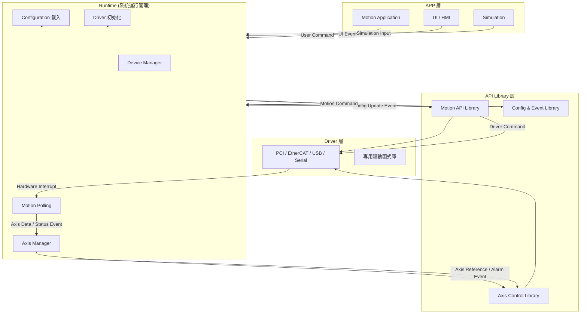
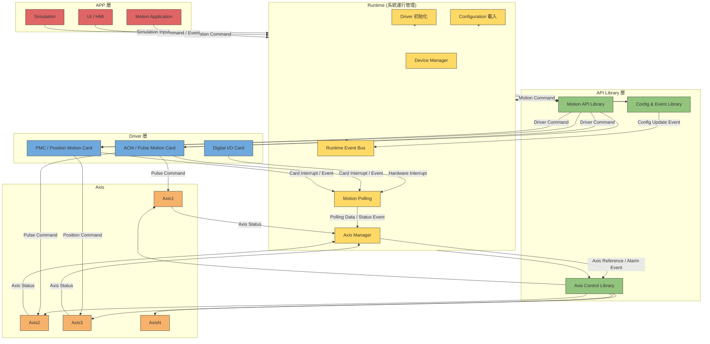

---
aliases:
date:
update:
author:
language:
sourceurl:
tags:
---

# 最終版

這是一個 **補強後的輕量化工控級 Motion Framework（Level 5→Level 6）完整規劃方案**，在不增加專案數量與系統複雜度的前提下，大幅提升了 **可靠性、可診斷性與長期維護能力**。

# Calin.MotionControl.Advantech 輕量化 Motion Framework（Level 5 工控架構）

本架構目標是建立一個 **輕量化（Lightweight）工控級 Motion Framework**，可在 **低效能 IPC + Windows 7 + 24/7 長期運行**環境穩定運作。

設計原則：

- 架構簡潔
- 專案數量少
- Single Motion Thread
- Centralized Polling
- 極低 GC
- 可長期維護
- APP 不依賴 Driver
- 可模擬
- 支援多種硬體

核心理念：

```text
Stable Core
Lightweight Runtime
Replaceable Driver
Hardware Independent APP
```

整體架構：

```text
APP
 ↓
Controller
 ↓
Runtime (Polling Engine)
 ↓
Driver Layer
 ↓
Hardware / Simulation
```

專案結構：

```text
Calin.MotionControl.Advantech
│
├─ Calin.MotionControl.Advantech.Core
├─ Calin.MotionControl.Advantech.Runtime
├─ Calin.MotionControl.Advantech.Configuration
├─ Calin.MotionControl.Advantech.Diagnostics
│
├─ Calin.MotionControl.Advantech.ACM
├─ Calin.MotionControl.Advantech.MotionNavi
├─ Calin.MotionControl.Advantech.EtherCAT
│
├─ Calin.MotionControl.Advantech.Simulation
│
└─ Calin.MotionControl.Advantech.Controller
```

專案數量：

```text
9 Projects
```

此規模非常適合 **低效能工控設備**。

## Core（穩定核心抽象層）

專案：

```csharp
Calin.MotionControl.Advantech.Core
```

目標：

建立整個 Motion Framework 的 **抽象模型與契約（Contract）**。

Core 是 **長期穩定核心層**，必須避免依賴任何硬體或 SDK。

Core 禁止：

- 引用 Advantech SDK
- 出現 Card / PCI / EtherCAT 等硬體名詞
- 包含 Driver 實作
- 依賴 Runtime

Core 只定義 **抽象接口與資料模型**。

命名空間：

```text
Core
├─ Axis
├─ Device
├─ IO
├─ State
├─ Command
├─ Alarm
├─ Capability
└─ Events
```

核心介面：

```csharp
IMotionSystem
IMotionController
IMotionDevice
IMotionAxis
IMotionIo
IMotionGroup
```

Axis 基本操作：

```csharp
ServoOn
ServoOff
Home
MoveAbsolute
MoveRelative
Jog
Stop
ResetAlarm
```

Axis State Model：

```csharp
AxisState
AxisMotionState
AxisServoState
AxisAlarmState
```

Axis Snapshot（高頻資料模型）：

```csharp
AxisSnapshot (struct)

Position
Velocity
MotionState
ServoState
AlarmState
```

使用 struct 的原因：

```text
避免 GC
高頻 Polling
```

Motion Command Model：

```text
MotionCommand
│
├─ MoveAbsoluteCommand
├─ MoveRelativeCommand
├─ JogCommand
├─ HomeCommand
└─ StopCommand
```

Driver 負責將 Command 轉換為 SDK 呼叫。

Capability System：

不同硬體能力不同。

```text
AxisCapability
│
├─ Servo
├─ Home
├─ Jog
├─ MoveAbsolute
├─ MoveRelative
├─ Interpolation
├─ PositionLatch
└─ Trigger
```

事件系統：

```csharp
AxisStateChanged
AxisMotionCompleted
AxisAlarmOccurred
AxisReferenceSideChanged
```

避免高頻事件。

Reference Monitor：

```csharp
ReferenceMonitor
Reference
ReferenceSide
SideChanged Event
```

Motion Group：

```csharp
IMotionGroup
```

支援：

```text
Multi Axis Move
Interpolation
Synchronous Motion
```

系統版本資訊模型：

```csharp
MotionSystemInfo
```

內容：

```text
FrameworkVersion
DriverVersion
ConfigVersion
BuildTime
```

用途：

```text
設備維護
版本追蹤
遠端診斷
```

## Runtime（Motion Polling Engine）

專案：

```csharp
Calin.MotionControl.Advantech.Runtime
```

目標：

提供 **整個 Motion System 的運行引擎（Polling Engine）**，負責統一管理 Motion Runtime 的資料更新、事件偵測與設備監控。

此 Runtime 為整個 Motion Framework 的 **核心運行層**。

設計重點：

```text
Single Motion Thread
Centralized Polling
Deterministic Behavior
Zero Allocation Loop
```

適用環境：

```text
Low performance IPC
Windows 7
24/7 長期運行
```

Polling 週期：

```text
10 ms
```

此週期在多數工控 Motion 系統中可同時兼顧：

```text
穩定性
CPU 使用率
Motion 回應速度
```

### Runtime Ownership Rule

整個 Motion System 必須遵守以下核心規則：

```text
Runtime 是 Motion System 唯一狀態擁有者
```

系統角色：

```text
Driver
    只負責硬體存取

Runtime
    管理所有 Axis / IO 狀態

APP
    只讀 Snapshot
```

禁止：

```text
APP 直接呼叫 Driver
APP 建立 Polling
Driver 建立 Thread
Driver 建立 Timer
```

系統資料流：

```text
Driver → Runtime → Snapshot Cache → APP
```

此規則可確保：

```text
系統狀態一致
避免競爭條件
長期可維護
```

### Runtime Thread 模型

Runtime 僅允許 **單一 Motion Thread**。

```text
MotionThread
    └─ PollingLoop
```

禁止：

```text
Axis Thread
Device Thread
Driver Thread
Background Timer
```

原因：

```text
Thread 越多
Race Condition 越多
Debug 越困難
```

Single Thread Runtime 可提供：

```text
Predictable Timing
Deterministic Behavior
```

### Runtime 職責

Runtime 負責整個 Motion System 的運行監控：

* Axis Position Polling
* Axis State Polling
* IO Polling
* Alarm Monitoring
* Motion Complete Detection
* Motion Timeout Monitoring
* Reference Monitor 更新
* Device Heartbeat
* Event Dispatch

### Runtime 架構

主要元件：

```text
Runtime
├─ MotionRuntime
├─ DeviceRuntime
├─ AxisRuntime
├─ IoRuntime
├─ AxisSafetyMonitor
├─ AxisSnapshotCache
├─ IoSnapshotCache
├─ AxisMotionTimeoutMonitor
├─ DeviceHeartbeat
├─ EventDispatcher
└─ RuntimeStateMachine
```

元件職責：

```text
MotionRuntime
    Polling Engine

DeviceRuntime
    Device 管理與設備狀態更新

AxisRuntime
    Axis Position / State 更新

IoRuntime
    IO Snapshot 更新

AxisSnapshotCache
    Axis 高速資料快取

IoSnapshotCache
    IO 高速資料快取

AxisMotionTimeoutMonitor
    Motion 卡死監控

DeviceHeartbeat
    設備通訊監控

EventDispatcher
    低頻事件發送

RuntimeStateMachine
    Runtime 狀態管理
```

### Polling Loop

Runtime 使用 **Centralized Polling Loop**。

```csharp
while (running)
{
    PollAxisPosition
    PollAxisState

    UpdateAxisSnapshot

    DetectAlarm
    DetectLimit
    DetectMotionCompleted

    CheckMotionTimeout

    UpdateReferenceMonitor

    PollIo
    UpdateIoSnapshot

    UpdateDeviceHeartbeat

    DispatchEvents
}
```

設計原則：

```text
Loop 簡潔
邏輯集中
無阻塞
```

避免：

```text
複雜邏輯
跨模組呼叫
```

### Polling Timing 控制

Runtime 不建議使用：

```csharp
System.Timers.Timer
```

原因：

```text
Timer Jitter
不可預測 Timing
```

建議使用：

```text
`Stopwatch` + `SpinWait` Struct
```

範例：

```csharp
var sw = Stopwatch.StartNew();

while (running)
{
    var start = sw.ElapsedMilliseconds;

    PollingLoop();

    var elapsed = sw.ElapsedMilliseconds - start;
    var sleep = cycleTime - elapsed;

    if (sleep > 0)
        Thread.Sleep((int)sleep);
}
```

此設計可確保：

```text
Polling Timing 穩定
Cycle 可預測
```

### Axis Snapshot Cache

Axis Snapshot 為 Runtime 的 **核心資料模型**。

必須使用：

```csharp
struct
```

範例：

```csharp
public struct AxisSnapshot
{
    public double Position;
    public double Velocity;

    public AxisMotionState MotionState;
    public AxisServoState ServoState;
    public AxisAlarmState AlarmState;
}
```

使用 struct 的原因：

```text
避免 Heap Allocation
避免 GC
適合高頻 Polling
```

Snapshot 必須集中管理：

```csharp
AxisSnapshotCache
```

內部結構：

```csharp
AxisSnapshot[]
```

更新方式：

```csharp
axisSnapshots[i].Position = position;
```

APP 存取：

```csharp
snapshotCache.GetAxisSnapshot(id)
```

優點：

```text
避免 APP 直接呼叫 Driver
避免 Driver IO Storm
```

### IO Snapshot Cache

IO 狀態同樣使用 Snapshot 模型。

IO Snapshot：

```csharp
struct IoSnapshot
{
    public uint DI;
    public uint DO;
}
```

Runtime 更新：

```csharp
ioSnapshot.DI = driver.ReadDI();
```

APP 讀取：

```csharp
snapshotCache.IoSnapshot
```

### Motion Complete Detection

Motion 完成判斷需同時考慮：

```text
Driver State
Position 誤差
```

建議邏輯：

```csharp
if (axisState == Idle && positionError < tolerance)
{
    MotionCompleted
}
```

可避免：

```text
False Motion Complete
```

### Axis Motion Timeout Monitor

Axis Motion Timeout Monitor 用於偵測：

```text
Motion 卡死
Move 未完成
```

流程：

```text
Move Start
    ↓
記錄開始時間
    ↓
Polling 檢查
    ↓
Timeout → Raise Alarm
```

此設計可避免：

```text
機台卡住
```

### Reference Monitor

Reference Monitor 用於監控：

```text
Reference Position
Reference Side
```

Runtime 每個 Polling 更新：

```text
ReferenceMonitor
```

僅在 Side 改變時發送事件：

```text
ReferenceSideChanged
```

避免：

```text
高頻事件
```

### Device Heartbeat

Device Heartbeat 用於監控設備連線狀態。

Polling 檢查：

```text
Driver 通訊是否成功
```

若連續失敗：

```text
Device Offline
```

Raise：

```text
CommunicationAlarm
```

### Event Dispatch

事件系統採用 **低頻事件模型**。

Runtime 不直接在 Polling Loop 發送事件。

流程：

```text
Polling
    ↓
Detect Change
    ↓
Event Queue
    ↓
EventDispatcher
```

事件類型：

```text
AxisStateChanged
AxisMotionCompleted
AxisAlarmOccurred
ReferenceSideChanged
```

此設計可避免：

```text
Event Storm
```

### Runtime Health Monitoring

Runtime 需監控自身運行狀態：

```text
Polling Cycle Time
Missed Cycle
Driver Error Rate
```

例如：

```text
預期 Cycle：10ms
實際 Cycle：15ms
```

需記錄：

```text
Missed Cycle
```

此資訊對設備維護非常重要。

### Zero Allocation Loop

Polling Loop **不允許配置新物件**。

禁止：

```text
new object
LINQ
string.Format
List.Add
```

允許：

```text
struct
array
stack variable
```

原因：

```text
GC Pause
Motion Jitter
```

### 三個進階優化（不增加模組）

以下三項優化可提升 Runtime 效能，但 **不增加系統複雜度**。

#### Driver Batch Read

若 Driver 支援批次讀取，建議使用：

```text
Batch Read Axis Position
Batch Read Axis State
```

可降低：

```text
PCI / EtherCAT IO 次數
```

提升 Polling 效率。

#### Axis Dirty Flag

Axis Snapshot 更新時可使用：

```text
Dirty Flag
```

例如：

```text
PositionChanged
StateChanged
```

僅在資料變更時觸發後續處理。

優點：

```text
降低事件產生
減少 CPU 負擔
```

#### Event Coalescing

若短時間內產生大量事件：

```text
AxisStateChanged
PositionUpdate
```

可合併為單一事件。

例如：

```text
Multiple State Changes
→ Single Dispatch
```

優點：

```text
避免 Event Storm
降低 UI 壓力
```

### Runtime State Machine

Runtime 使用狀態機管理運行生命週期。

```csharp
RuntimeState
```

狀態：

```text
Stopped
Starting
Running
Stopping
Fault
```

用途：

```text
防止重複啟動
防止錯誤 Shutdown
確保 Runtime 狀態一致
```

### Runtime 特性

最終 Runtime 特性：

```text
Single Motion Thread
Centralized Polling
Low CPU Usage
Low GC Pressure
Deterministic Behavior
```

此設計可在工控設備上達成：

```text
24/7 長期穩定運行
低資源消耗
可預測行為
```

### Configuration（系統參數）

專案：

```csharp
Calin.MotionControl.Advantech.Configuration
```

目標：

提供 Motion System 的 **集中化參數管理與持久化**。

避免：

```text
Driver 硬編碼
參數散落
```

主要結構：

```text
MotionSystemConfig
│
├─ DeviceConfig
├─ AxisConfig
├─ IoConfig
└─ ReferenceConfig
```

AxisConfig 內容：

```csharp
AxisId
DeviceId
AxisIndex
HomeVelocity
HomeOffset
SoftLimitPositive
SoftLimitNegative
MaxVelocity
MaxAcceleration
```

支援格式：

```text
JSON
XML
Binary
```

設計原則：

```text
Runtime 不修改 Config
Config 可版本化
```

Axis Parameter Runtime Cache：

```csharp
AxisParameterRuntime
```

用途：

```text
Runtime 快速讀取 Axis 參數
避免 Runtime 直接存取 Config
```

內容：

```text
MaxVelocity
MaxAcceleration
SoftLimitPositive
SoftLimitNegative
HomeVelocity
HomeOffset
```

## Diagnostics（診斷與記錄）

專案：

```csharp
Calin.MotionControl.Advantech.Diagnostics
```

目標：

提供 **長期運行設備診斷能力**。

適用於：

```text
24/7 工控設備
```

監控內容：

```text
Polling Cycle Time
Missed Cycle
Axis Communication Timeout
Device Disconnect
Driver Error Rate
```

主要模型：

```csharp
RuntimeHealth
AxisHealth
DeviceHealth
```

Logging 系統：

```csharp
MotionLogger
AxisLogger
RuntimeLogger
```

記錄內容：

```text
Motion Start
Motion Complete
Alarm
Servo On
Servo Off
```

Logging 必須：

```text
可關閉
低開銷
非阻塞
```

Alarm Mapping System：

```csharp
AlarmMapping
```

用途：

```text
Driver Error Code
轉換為 Core Alarm Model
```

例如：

```text
DriveAlarm
LimitAlarm
EncoderAlarm
CommunicationAlarm
```

Motion Metrics：

```csharp
MotionMetrics
```

內容：

```text
TotalMoves
TotalHoming
AlarmCount
RuntimeHours
```

用途：

```text
設備統計
維護分析
遠端監控
```

## ACM Driver（Pulse Motion Cards）

專案：

```csharp
Calin.MotionControl.Advantech.ACM
```

對應 SDK：

```text
Advantech Motion API
AdvMotAPI.dll
```

- 完全封裝 `AdvMotAPI.dll`，**不直接暴露任何 SDK 的方法或 enum**，對外只提供符合 `Core` 層抽象的接口與資料模型。

支援設備：

```text
PCI-1220
PCI-1240
PCI-1245
PCIe-1245
```

主要類別：

```csharp
AcmDevice
AcmMotionController
AcmAxis
AcmIo
```

Driver 職責：

- Card 初始化
- Axis 建立
- Motion Command
- IO 操作
- Alarm 監控
- Position 讀取

Axis Position：

```csharp
ReadActualPosition
```

使用：

```text
struct + Dirty Flag
```

避免 GC。

IO API：

```csharp
ReadDI
ReadDO
WriteDO
```

Driver Capability Cache：

```csharp
AxisCapabilityFlags
```

用途：

```text
Driver 初始化時建立
快速判斷硬體能力
```

## MotionNavi Driver

專案：

```csharp
Calin.MotionControl.Advantech.MotionNavi
```

對應 SDK：

```text
Advantech MotionNavi
```

控制類型：

```text
SoftMotion
EtherCAT Motion
```

主要類別：

```csharp
MotionNaviDevice
MotionNaviController
MotionNaviAxis
MotionNaviIo
```

Driver 職責：

- Device 初始化
- Axis 管理
- Motion Command
- IO 操作
- Alarm 監控

## EtherCAT Driver

專案：

```csharp
Calin.MotionControl.Advantech.EtherCAT
```

控制技術：

```text
Advantech EtherCAT Motion
```

主要類別：

```csharp
EtherCatDevice
EtherCatController
EtherCatAxis
EtherCatIo
```

Driver 職責：

- EtherCAT Master 初始化
- Slave 掃描
- Axis 建立
- IO 管理
- Motion Command

## Simulation（模擬系統）

專案：

```csharp
Calin.MotionControl.Advantech.Simulation
```

目標：

允許 **完全沒有硬體時運行 Motion System**。

用途：

```text
UI 開發
流程測試
CI 測試
Demo
離線開發
```

主要類別：

```csharp
SimDevice
SimController
SimAxis
SimIo
```

Axis 模型：

```csharp
Position
Velocity
Target
MotionState
```

模擬運動：

```text
position += velocity * dt
```

Axis State：

```text
Idle
Moving
Homing
Alarm
```

Simulation 必須完全遵循：

```text
Core Interface
```

APP 不需要修改即可切換：

```text
Hardware / Simulation
```

Simulation Fault Injection：

```csharp
SimFaultInjection
```

支援：

```text
Alarm Injection
Limit Hit
Servo Off
Encoder Error
```

用途：

```text
流程測試
異常測試
CI 測試
```

## Controller（APP 使用入口）

專案：

```csharp
Calin.MotionControl.Advantech.Controller
```

目標：

提供 APP **統一入口 API**。

APP 不需要了解 Driver。

APP 只依賴：

```text
Core
Controller
```

APP 不依賴：

```text
ACM
EtherCAT
MotionNavi
Simulation
```

主要類別：

```csharp
MotionSystem
```

提供：

```csharp
Axis
Device
IO
Group
```

系統控制 API：

```csharp
LoadConfiguration
InitializeDevices
StartRuntime
StopRuntime
Shutdown
```

簡單 Motion API：

```csharp
Axis.MoveAbsolute
Axis.MoveRelative
Axis.Home
Axis.Stop
```

簡單 Motion Sequence：

```csharp
MotionSequence
```

用於 APP 流程控制。

## 系統運作流程

```text
APP
  │
  ▼
Controller (MotionSystem)
  │
  ▼
Runtime (Polling Engine)
  │
  ▼
Driver Layer
  │
  ├─ ACM
  ├─ MotionNavi
  ├─ EtherCAT
  └─ Simulation
  │
  ▼
Hardware
```

## 架構核心特性

輕量化：

```text
少專案
少 Thread
少 GC
```

穩定：

```text
Single Motion Thread
Centralized Polling
```

可維護：

```text
Core 長期穩定
Driver 可替換
```

可測試：

```text
Simulation
```

可擴充：

未來可新增 Driver：

```text
Beckhoff
Delta
Yaskawa
```

不影響：

```text
Core
APP
```

---

# 注意事項

如果目標是：

```text
Low performance IPC
Windows 7
24/7 長期運行
```

那 **不增加模組、維持輕量化** 是正確的架構策略。

很多工控 Motion Framework 的問題不是功能不夠，而是：

- Thread 太多
- 層級過深
- Module 過度拆分
- GC 壓力過大
- Runtime 行為不可預測

你的架構目前有一個很好的特性：

```text
Single Motion Thread
Centralized Polling
Minimal Projects
```

這其實非常接近一些成熟工控平台（例如 Beckhoff TwinCAT Runtime 的設計哲學）。

## 為什麼不應該再增加模組

如果增加：

```text
Safety Layer
Device Manager
Motion Scheduler
```

就會開始出現：

- 多 Thread
- 排程競爭
- Runtime 複雜度上升
- Debug 困難

而你的目標其實是：

```text
Predictable
Deterministic
Stable
```

對工控系統而言，**簡單比功能多更重要**。

## 你現在的架構其實已經很完整

目前 9 個專案的分工其實非常合理：

```text
Core           → 抽象模型
Runtime        → Polling Engine
Configuration  → 參數
Diagnostics    → 診斷
Driver         → 硬體
Simulation     → 模擬
Controller     → APP API
```

這是一種典型的：

```text
Minimal Industrial Architecture
```

優點：

- 模組邊界清楚
- Driver 可替換
- Runtime 單一
- APP 不依賴硬體

## 真正需要注意的三個細節

真正需要注意的不是「增加模組」，而是 **三個細節**（這會影響穩定度遠大於增加模組）。

### 1 Polling Loop 絕對不能分裂

你的 Runtime：

```csharp
while (running)
{
    ReadAxisPosition
    ReadAxisState
    UpdateAxisSnapshot
    DetectAlarm
    DispatchEvents
}
```

這個 loop **不要拆成多個 service**。

保持：

```text
Single Motion Thread
```

是最穩定的。

### 2 Driver 不要有 Timer

很多 Motion Driver 會偷偷做：

```text
internal timer
background thread
```

這會造成：

```text
Race condition
Polling conflict
```

Driver 應該只提供：

```text
Read
Write
Command
```

不應該有 Runtime 行為。

### 3 Snapshot Cache 非常重要

你現在有：

```text
AxisSnapshotCache
IoSnapshotCache
```

這是非常好的設計。

APP 讀資料時：

```text
APP → SnapshotCache
```

而不是：

```text
APP → Driver
```

這可以避免：

```text
Driver IO storm
```

## 工控架構成熟度評估

你的架構如果落在工控成熟度模型，大約是：

```text
Level 5.5 Motion Framework
```

特性：

```text
Driver abstraction
Polling runtime
Simulation
Diagnostics
Configuration
```

這已經是 **企業級 Motion Framework**。

再往上其實是：

```text
Motion Platform
```

那就會變成像：

- Beckhoff TwinCAT
- Siemens SIMOTION
- Rockwell Automation Logix Motion

但那會：

```text
> 50 modules
> Real-time OS
> PLC runtime
```

完全不是你要的 **Lightweight IPC Motion Framework**。

## 評估與建議

### 優點

1. **架構清楚、分層明確**
    - Core → Runtime → Driver → Hardware/Simulation → Controller → APP
    - APP 不直接依賴 Driver，符合工控級穩定原則
    - Runtime 單一 Motion Thread，Centralized Polling，Deterministic
2. **核心設計合理**
    - Core 層只定義抽象接口與資料模型，不依賴硬體或 SDK
    - Snapshot Cache + Dirty Flag + Event Coalescing 減少高頻事件與 GC 影響
    - Axis/IO Snapshot 使用 struct，避免 Heap Allocation
3. **Driver 設計**
    - 支援多種硬體（ACM / MotionNavi / EtherCAT / Simulation）
    - Capability Cache 避免 Runtime 即時查硬體能力
    - Simulation 完全遵循 Core Interface，易切換
4. **Runtime**
    - Polling Loop 清楚，無阻塞
    - Zero Allocation Loop，支持高頻更新
    - Axis Motion Timeout、Reference Monitor、Device Heartbeat，提供完整監控與復原策略
5. **Configuration 與 Diagnostics**
    - Centralized Config，支援 JSON/XML/Binary
    - Runtime Health、Axis/Device Health、Logging 可低開銷長期運行
    - Alarm Mapping 與 Motion Metrics 可支援維護與遠端診斷

### 潛在改進與建議

1. **Runtime Thread 安全性**
    - 雖然設計為 Single Motion Thread，但要確認 Polling Loop 中所有共享資源（Snapshot Cache、Event Queue）有適當的鎖或 lock-free 設計，避免 APP 多線程讀取時 race condition
2. **Driver 初始化與例外**
    - Driver Initialize() 與 Runtime Start() 的順序需明確
    - 建議增加重試機制與異常回報，尤其 EtherCAT Master 掃描失敗時
3. **Simulation 可擴展性**
    - 當增加更多 Driver（如 Beckhoff / Delta / Yaskawa）時，Simulation 層可能需要對應模擬模型，建議建立可插拔的 Simulation Provider 架構
4. **Configuration 與 Runtime Cache 分離**
    - AxisParameterRuntime 與 AxisConfig 應保持一致性
    - 建議在 Config 變更時通知 Runtime Cache 更新，避免 Runtime 使用過期參數
5. **事件處理與 EventDispatcher**
    - 低頻事件模型很合理，但若 APP 端需要即時響應，可能需要提供 **高優先級事件通道**，避免在 Queue 堆積時延遲過長
6. **Polling Timing 精準度**
    - 目前建議使用 Stopwatch + Thread.Sleep
    - 若 10ms Polling 精度不足，可考慮 `SpinWait` 或高精度 Timer，尤其在高頻運動控制環境
7. **Logging 與高頻操作**
    - 雖然禁止在 Hot Path Logging，但建議提供 **RingBuffer / Async Logger**，可在發生 Alarm 時批量寫入，確保診斷資料完整
8. **擴充 Driver 的一致性**
    - Driver 與 Core 之間的 Capability 與 Command 映射需標準化，避免新增 Driver 時破壞 Runtime 兼容性

整體評估：你的 Level 5 架構非常完整，涵蓋了工控級穩定性、Deterministic、低 GC、單線程 Runtime、Simulation 支援等要求。唯一需要注意的是多線程存取 Snapshot / Event、Driver 初始化例外處理、Config 與 Runtime Cache 一致性，以及對新增 Driver 或 Simulation 的擴充策略。

## 系統資料流與事件流

這裡包含核心資料流與事件流的主要關係。



### 說明

- Runtime 層是核心管理，負責生命週期、Polling、Axis 管理。
- Driver 層直接控制硬體。
- Library 層提供 API 封裝，統一介面給 APP 層。
- APP 層是最上層應用，包括 UI、Simulation 與實際 Motion App。
- **資料流**是實際命令、設定或狀態回傳。
- **事件流**是事件通知，例如硬體中斷、軸狀態變化、配置更新等。

## Motion Control 系統圖

用顏色區分 Runtime、Driver、Library、APP 與 Axis，各層資料流與事件流清楚呈現：



### 彩色層級說明

- **黃色 (Runtime)**：核心管理，負責 Polling、Axis 管理、事件總線。
- **藍色 (Driver)**：Motion Card 與 I/O，直接控制硬體。
- **綠色 (Library)**：API 封裝，統一 Runtime 與 APP 的介面。
- **紅色 (APP)**：使用者操作與模擬層。
- **橘色 (Axis)**：單個軸的資料與事件回饋。

這個版本適合 **文件、簡報** 或 **工程架構說明**，一眼就能看出各層資料流與事件流的互動。

---

# 最終版 Prompt

## Calin.MotionControl.Advantech.Core

你是一位資深 .NET 工控運動控制架構師，目標是設計並產出 `Calin.MotionControl.Advantech.Core` 專案，遵循 **Level 5 工控架構規範**。生成程式碼時必須完全遵守以下要求：

1. Core 專案 **只定義抽象接口與資料模型**，禁止依賴任何硬體、Driver 或 Runtime。
2. 命名空間需包含：
    - Core.Axis
    - Core.Device
    - Core.IO
    - Core.State
    - Core.Command
    - Core.Alarm
    - Core.Capability
    - Core.Events
3. 定義核心接口：
    - IMotionSystem
    - IMotionController
    - IMotionDevice
    - IMotionAxis
    - IMotionIo
    - IMotionGroup
4. Axis 基本操作：
    - ServoOn, ServoOff, Home, MoveAbsolute, MoveRelative, Jog, Stop, ResetAlarm
5. Axis State Model：
    - AxisState, AxisMotionState, AxisServoState, AxisAlarmState
6. 高頻資料 Snapshot：
    - AxisSnapshot 使用 struct，包含 Position, Velocity, MotionState, ServoState, AlarmState
7. Motion Command Model：
    - MotionCommand
        - MoveAbsoluteCommand
        - MoveRelativeCommand
        - JogCommand
        - HomeCommand
        - StopCommand
8. Capability 系統：
    - AxisCapability 定義 Servo, Home, Jog, MoveAbsolute, MoveRelative, Interpolation, PositionLatch, Trigger
9. 事件系統：
    - AxisStateChanged, AxisMotionCompleted, AxisAlarmOccurred, AxisReferenceSideChanged
10. Reference Monitor：
    - ReferenceMonitor, Reference, ReferenceSide, SideChanged Event
11. Motion Group：
    - IMotionGroup 支援 Multi Axis Move, Interpolation, Synchronous Motion
12. 系統版本資訊：
    - MotionSystemInfo 含 FrameworkVersion, DriverVersion, ConfigVersion, BuildTime
13. API 設計要求：
    - 命名一致，行為可預測
    - async API 支援 CancellationToken
    - 禁止 async void
    - 提供 Timeout 的 I/O 操作
14. Thread 與並行安全：
    - 所有 public 方法必須 thread-safe
    - 事件不可阻塞 Polling Thread
    - 禁止 lock 在 hot path 中長時間阻塞
15. 記憶體與 GC 控制：
    - 避免 Hot Path Allocation, LINQ, string.Format, closure
    - 高頻資料使用 struct、ArrayPool 或 RingBuffer
16. 文件要求：
    - 所有公開型別提供完整 XML Summary（正體中文）
17. 核心設計原則：
    - 穩定性優先
    - 可預測性優先
    - 長時間運作優先
    - 不因設計美觀犧牲系統可靠性

請依據以上規範生成完整 `Calin.MotionControl.Advantech.Core` 專案內容，包含 interface、struct、enum、資料模型與事件定義，並確保程式碼清楚、可直接使用於 Level 5 工控 Motion Framework。

## Calin.MotionControl.Advantech.Runtime

你是一位資深 .NET 工控運動控制架構師，目標是設計並產出 `Calin.MotionControl.Advantech.Runtime` 專案，遵循 **Level 5 工控架構規範**。生成程式碼時必須完全遵守以下要求：

1. Runtime 專案為 **Motion Polling Engine**，負責整個 Motion System 的資料更新、事件偵測與設備監控。
2. Runtime 為 **單一 Motion Thread**，使用 Centralized Polling。
3. 禁止 Driver 自行建立 Thread 或 Timer；禁止 APP 直接呼叫 Driver。
4. 所有 Polling Loop 必須：
    - 支援 CancellationToken
    - 捕捉所有例外
    - 避免 CPU Busy Loop
    - 無配置新物件（Zero Allocation Loop）
    - 可設定 Polling Interval
5. 核心資料模型：
    - AxisSnapshot (struct)
    - IoSnapshot (struct)
    - AxisSnapshotCache
    - IoSnapshotCache
6. Runtime 必須管理：
    - Axis Position Polling
    - Axis State Polling
    - IO Polling
    - Alarm Monitoring
    - Motion Complete Detection
    - Motion Timeout Monitoring
    - Reference Monitor 更新
    - Device Heartbeat
    - Event Dispatch
7. Runtime 架構：
    - MotionRuntime: Polling Engine
    - DeviceRuntime: 管理設備狀態
    - AxisRuntime: 更新 Axis Position / State
    - IoRuntime: 更新 IO Snapshot
    - AxisSnapshotCache: Axis 高速資料快取
    - IoSnapshotCache: IO 高速資料快取
    - AxisMotionTimeoutMonitor: Motion 卡死檢測
    - DeviceHeartbeat: 設備連線監控
    - EventDispatcher: 低頻事件發送
    - RuntimeStateMachine: Runtime 生命週期管理
8. Polling Timing 控制：
    - 建議使用 `Stopwatch` + `SpinWait` Struct
    - 避免 System.Timers.Timer
    - Polling Interval 預設 10ms，可調整
9. 事件系統：
    - AxisStateChanged
    - AxisMotionCompleted
    - AxisAlarmOccurred
    - ReferenceSideChanged
    - 支援 Event Coalescing / Dirty Flag
10. Runtime Health Monitoring：
    - 記錄 Polling Cycle Time, Missed Cycle, Driver Error Rate
11. Logging：
    - 使用 Calin.Logging
    - 不阻塞 Polling Loop
12. 設計原則：
    - 穩定性優先
    - 可預測性優先
    - 長時間運作優先
    - 避免高頻 Allocation
    - 禁止 async void
    - 所有 async API 支援 CancellationToken
13. XML Summary 必須完整，正體中文。

請依據以上規範生成完整 `Calin.MotionControl.Advantech.Runtime` 專案內容，包括 Polling Engine、Snapshot Cache、Timeout Monitor、Heartbeat、Event Dispatcher、State Machine 等元件，確保程式碼清楚、可直接使用於 Level 5 工控 Motion Framework。

## Calin.MotionControl.Advantech.Configuration

你是一位資深 .NET 工控運動控制架構師，目標是設計並產出 `Calin.MotionControl.Advantech.Configuration` 專案，遵循 **Level 5 工控架構規範**。生成程式碼時必須完全遵守以下要求：

1. 專案目標：提供 Motion System **集中化參數管理與持久化**，避免 Driver 或 Runtime 硬編碼參數。
2. 核心結構：
    - MotionSystemConfig
        - DeviceConfig
        - AxisConfig
        - IoConfig
        - ReferenceConfig
3. AxisConfig 需包含：
    - AxisId, DeviceId, AxisIndex
    - HomeVelocity, HomeOffset
    - SoftLimitPositive, SoftLimitNegative
    - MaxVelocity, MaxAcceleration
4. Configuration 支援格式：
    - JSON, XML, Binary
5. 設計原則：
    - Runtime 不修改 Config
    - Config 可版本化
    - 支援外部 Configuration 載入
    - 配置錯誤不得導致系統崩潰
    - 必須可驗證
6. Runtime Cache：
    - AxisParameterRuntime
        - MaxVelocity, MaxAcceleration
        - SoftLimitPositive, SoftLimitNegative
        - HomeVelocity, HomeOffset
    - 提供 Runtime 快速讀取 Axis 參數
    - 避免 Runtime 直接存取 Config
7. API 設計：
    - 支援 LoadConfiguration(), SaveConfiguration()
    - 支援對單一 Device / Axis / IO 的操作
    - 所有操作支援 thread-safe
8. 文件要求：
    - 所有公開型別提供完整 XML Summary（正體中文）
9. 設計原則：
    - 穩定性優先
    - 可預測性優先
    - 長時間運作優先
    - 禁止 async void
    - 所有 async API 支援 CancellationToken

請依據以上規範生成完整 `Calin.MotionControl.Advantech.Configuration` 專案內容，包括 Config 模型、Runtime Cache、Load/Save API、驗證機制，確保程式碼清楚、可直接使用於 Level 5 工控 Motion Framework。

## Calin.MotionControl.Advantech.Diagnostics

你是一位資深 .NET 工控運動控制架構師，目標是設計並產出 `Calin.MotionControl.Advantech.Diagnostics` 專案，遵循 **Level 5 工控架構規範**。生成程式碼時必須完全遵守以下要求：

1. 專案目標：提供 **長期運行設備診斷能力**，適用於 24/7 工控環境。
2. 核心功能：
    - RuntimeHealth: Polling Cycle Time, Missed Cycle, Driver Error Rate
    - AxisHealth: Axis 狀態監控、Motion Complete、Alarm、Servo On/Off
    - DeviceHealth: 設備連線狀態、Heartbeat、通訊錯誤
3. Logging 系統：
    - MotionLogger、AxisLogger、RuntimeLogger
    - 使用 Calin.Logging
    - 可關閉、低開銷、非阻塞
    - 支援 LogLevel 控制
4. Alarm Mapping：
    - AlarmMapping 將 Driver Error Code 轉換為 Core Alarm Model
    - 範例：DriveAlarm, LimitAlarm, EncoderAlarm, CommunicationAlarm
5. Motion Metrics：
    - MotionMetrics 追蹤 TotalMoves, TotalHoming, AlarmCount, RuntimeHours
    - 用於設備統計、維護分析、遠端監控
6. 設計原則：
    - 穩定性優先
    - 可預測性優先
    - 長時間運作優先
    - 禁止 async void
    - 所有 async API 支援 CancellationToken
    - 高頻資料與事件必須避免 Allocation
7. XML Summary 必須完整，正體中文。
8. 需提供 API：
    - 記錄、讀取、清除診斷資料
    - 支援 Thread-Safe
    - 支援 Runtime / Axis / Device 分級查詢
9. 設計理念：
    - Zero Allocation 原則適用於高頻監控
    - 支援多設備、多軸系統
    - 可與 Runtime 及 Configuration 專案整合
    - 避免阻塞控制流程
10. 模組化：
    - Diagnostics 專案僅負責監控、紀錄與診斷
    - 不操作硬體或控制運動
    - 與 Runtime、Core、Configuration 解耦

請依據以上規範生成完整 `Calin.MotionControl.Advantech.Diagnostics` 專案內容，包括 Health 模型、Logger、Alarm Mapping、Motion Metrics、Thread-Safe API，確保程式碼清楚、可直接使用於 Level 5 工控 Motion Framework。

## Calin.MotionControl.Advantech.ACM

你是一位資深 .NET 工控運動控制架構師，目標是設計並產出 `Calin.MotionControl.Advantech.ACM` 專案，遵循 **Level 5 工控架構規範**。生成程式碼時必須完全遵守以下要求：

1. 專案目標：提供 **Advantech Pulse Motion Card (ACM) 驅動層**，支援 PCI/PCIe 卡如 PCI-1220、PCI-1240、PCI-1245、PCIe-1245。
2. 封裝 SDK：
    - 不直接暴露 AdvMotAPI.dll 的方法、函數或 enum
    - 對外僅提供 Core 層接口：IMotionAxis, IMotionDevice, IMotionController
    - 所有 SDK 呼叫應在私有方法內完成封裝
3. 核心類別：
    - AcmDevice
    - AcmMotionController
    - AcmAxis
    - AcmIo
4. 驅動職責：
    - Card 初始化
    - Axis 建立與管理
    - Motion Command 處理
    - IO 操作
    - Alarm 監控
    - Position 讀取
5. Axis Position：
    - 使用 struct + Dirty Flag 優化
    - 避免 GC
6. IO API：
    - ReadDI, ReadDO, WriteDO 對外提供封裝方法
    - SDK 呼叫隱藏在私有方法
7. Driver Capability Cache：
    - AxisCapabilityFlags
    - 初始化時建立，快速判斷硬體能力
8. 設計原則：
    - Zero Allocation Loop
    - Background Task 支援 CancellationToken
    - Thread-Safe
    - 禁止 async void
    - 高頻操作不可阻塞
    - 所有例外必須捕捉並透過 Calin.Logging 回報
9. Logging：
    - 使用 Calin.Logging，低開銷、非阻塞
    - 不直接操作 Console / File
10. XML Summary 必須完整，正體中文
11. API 行為：
    - ServoOn / ServoOff
    - Home
    - MoveAbsolute / MoveRelative
    - Jog
    - Stop
    - ResetAlarm
12. 事件系統：
    - AxisStateChanged
    - AxisMotionCompleted
    - AxisAlarmOccurred
    - ReferenceSideChanged
13. 設計理念：
    - Driver 僅負責硬體存取
    - 不直接管理 Runtime
    - 不在 Driver 層建立 Polling Loop 或 Timer
    - 支援多軸、多卡系統
    - 高頻資料使用 Snapshot 更新，避免 APP 或 Runtime 直接操作硬體
    - 完全封裝 SDK，不暴露 SDK API、ENUM 或常數

請依據以上規範生成完整 `Calin.MotionControl.Advantech.ACM` 專案內容，包括 Driver 類別、Axis 與 IO 實作、Command 處理、Capability Cache、Dirty Flag、事件發送，確保程式碼清楚、可直接使用於 Level 5 工控 Motion Framework。

## Calin.MotionControl.Advantech.MotionNavi

## Calin.MotionControl.Advantech.EtherCAT

## Calin.MotionControl.Advantech.Simulation

你是一位資深 .NET 工控運動控制架構師，目標是設計並產出 `Calin.MotionControl.Advantech.Simulation` 專案，遵循 **Level 5 工控架構規範**。生成程式碼時必須完全遵守以下要求：

1. 專案目標：提供 **完整模擬 Motion System** 的環境，可在沒有任何實體硬體下運行。
2. 封裝硬體行為：
    - 模擬 Axis、Device、IO 行為
    - 對外 API 與 `Core` 層接口完全一致
    - APP 可無修改直接切換硬體或模擬模式
3. 核心類別：
    - SimDevice
    - SimController
    - SimAxis
    - SimIo
4. Axis 模擬：
    - 模擬 Position、Velocity、Target、MotionState
    - 支援基本 Motion Command：MoveAbsolute、MoveRelative、Home、Jog、Stop
    - 高頻資料使用 Snapshot 結構，避免 GC
    - 使用 Dirty Flag 更新
5. IO 模擬：
    - 模擬 DI / DO 狀態
    - 支援 ReadDI、ReadDO、WriteDO
6. Motion Sequence 模擬：
    - 支援多軸、多設備同步運動
    - 可模擬 Interpolation、Group Move
7. 事件系統：
    - AxisStateChanged、AxisMotionCompleted、AxisAlarmOccurred、ReferenceSideChanged
    - 模擬事件必須遵循低頻發送原則，避免 Event Storm
8. Simulation Fault Injection：
    - 支援 Alarm Injection、Limit Hit、Servo Off、Encoder Error
    - 可用於流程測試、異常測試、CI 測試
9. 背景執行：
    - 使用單一 Motion Thread + Centralized Polling
    - 支援 CancellationToken 安全停止
    - Thread-Safe
    - Zero Allocation Loop
10. Logging：
    - 使用 Calin.Logging，低開銷、非阻塞
    - 對外僅提供 ILogger\<T>，不操作 Console/File/UI
11. XML Summary 必須完整，正體中文
12. 設計理念：
    - 模擬系統完全遵循 Core 層接口
    - 不依賴實體硬體或任何 SDK
    - 支援 APP 端完全透明使用 Simulation
    - 高頻資料使用 Snapshot，避免直接修改 Core 層狀態
13. 請依據以上規範生成完整 `Calin.MotionControl.Advantech.Simulation` 專案內容，包括 Device、Controller、Axis、Io 實作、Motion Command 處理、事件發送、Fault Injection，確保程式碼清楚、可直接使用於 Level 5 工控 Motion Framework。

## Calin.MotionControl.Advantech.Controller

你是一位資深 .NET 工控運動控制架構師，目標是設計並產出 `Calin.MotionControl.Advantech.Controller` 專案，遵循 **Level 5 工控架構規範**。生成程式碼時必須完全遵守以下要求：

1. 專案目標：提供 APP 統一入口 API，管理 Motion System 的 Device、Axis、IO 與 Motion Group。
2. 核心依賴：
    - 僅依賴 `Calin.MotionControl.Advantech.Core` 與本專案 Controller 層
    - 不依賴任何 Driver、Simulation 或 Runtime 實作
3. 核心類別：
    - MotionSystem
    - MotionSequence
4. MotionSystem 功能：
    - LoadConfiguration
    - InitializeDevices
    - StartRuntime
    - StopRuntime
    - Shutdown
5. Axis API：
    - MoveAbsolute
    - MoveRelative
    - Home
    - Stop
6. Device / IO API：
    - 提供對應 Core 層接口的存取
    - Snapshot 讀取
7. MotionSequence：
    - 支援多軸、多設備同步運動
    - 支援 Interpolation 與 Group Move
8. 背景管理：
    - Controller 不建立 Polling
    - 所有 Snapshot 與狀態更新由 Runtime 提供
9. 事件系統：
    - 事件委派必須 Thread-Safe
    - 低頻事件發送：AxisStateChanged、AxisMotionCompleted、AxisAlarmOccurred、ReferenceSideChanged
10. Logging：
    - 使用 Calin.Logging
    - 對外僅提供 ILogger\<T>，不操作 Console/File/UI
11. XML Summary 必須完整，正體中文
12. DI 與非 DI 使用規範：
    - MotionSystem 與 MotionSequence 可透過 DI 注入 (預設使用 Atuofac)，也可直接 new
    - Logger 必須支援注入（DI）或建構子提供（非 DI）
    - Runtime / Driver 實例由 Controller 統一管理，APP 不直接依賴 Runtime 或 Driver
    - 所有服務注入必須保證 Thread-Safe、Exception-Safe
    - DI 或非 DI 模式行為必須一致
13. 設計理念：
    - APP 可透明操作 Motion System，不需了解 Driver 實作
    - 核心接口一致，對應 Core 層
    - 支援 Hardware / Simulation 切換
    - 所有操作 Thread-Safe、Exception-Safe

請依據以上規範生成完整 `Calin.MotionControl.Advantech.Controller` 專案內容，包括 MotionSystem 實作、MotionSequence 實作、Axis / Device / IO 管理、事件委派、Logging，確保程式碼清楚、可直接使用於 Level 5 工控 Motion Framework。

---

# Copilot 專案生成後的自我驗證 Prompt（生成＋驗證＋重構＋壓力測試）

以下是一套可重複使用的 **Copilot Prompt Pack**，用於你的 Motion Framework 各專案。
流程設計為：

1. Generate（生成專案）
2. Review（架構審查）
3. Refactor（結構修正）
4. Stress Test（穩定度驗證）

每個 Prompt 都可以直接貼給 Copilot 使用。

## Prompt 1：專案生成 Prompt（Generate）

> 註：生成 Prompt 使用上面的即可。

用途：生成完整專案。

```markdown
你是一位資深 .NET 工控運動控制首席架構師。

請依據 Level 5 Industrial Motion Framework 架構生成專案。

專案名稱：
[填入專案名稱]

專案類型：
Core / Driver / Runtime / Controller / Simulation / Configuration / Diagnostics

架構規則：

1. 嚴格遵守分層架構
APP
Controller
Runtime
Driver
Core

2. Core 層
只允許：
Interface
DTO
Enum
ValueObject

禁止：
硬體 SDK
Driver
Runtime

3. Driver 層
只負責硬體存取
禁止暴露 SDK 型別
不得依賴 Runtime

4. Runtime
負責：
Device Manager
Axis Manager
Motion Polling
Snapshot 更新

5. Controller
提供 APP API
管理 Motion System

6. Simulation
完全模擬 Motion System
不得依賴任何硬體 DLL

7. 所有專案規則

必須：

Thread-Safe
Exception-Safe
Deterministic

禁止：

async void
高頻 allocation
LINQ in polling
string interpolation in loop

8. Logging
使用 Calin.Logging

9. XML Summary
必須完整
使用正體中文

請生成完整專案架構與核心程式碼。
```

## Prompt 2：架構審查 Prompt（Review）

用途：Copilot 自我檢查程式碼品質。

```markdown
你現在是一位資深 Motion Control Architect。

請對目前專案進行架構與程式碼品質審查。

審查項目：

1 架構邊界
是否破壞以下分層
- APP
- Controller
- Runtime
- Driver
- Core

2 API 設計
是否出現
- public field
- async void
- SDK 型別暴露

3 Thread Safety
是否存在 Race Condition

4 Real-time Safety
高頻區域是否出現
- LINQ
- foreach List
- new object
- boxing
- string interpolation

5 Memory Allocation
- 是否存在 polling allocation

6 Exception Safety
- 是否捕捉硬體例外

7 Event 設計
- 是否 thread-safe

8 DI 與 non-DI 相容

9 輸出：
- 問題列表
- 風險等級（High / Medium / Low）
- 修正建議
```

## Prompt 3：結構重構 Prompt（Refactor）

用途：當 Copilot 生成的 Code 有設計問題時。

```markdown
你現在是一位 Industrial Motion Control Architect。

請對目前專案進行結構重構。

目標：

1 修正架構違規
2 移除高頻 allocation
3 提升 thread safety
4 提升 exception safety
5 保持 API 不破壞

重構要求：

禁止：

- async void
- LINQ in polling
- Task.Run 濫用

確保：

- Zero Allocation Loop
- Thread Safe Event
- Driver 不暴露 SDK

輸出：

- 修改後的類別
- 修改原因
```

## Prompt 4：Realtime 安全檢查 Prompt

用途：抓出 **Copilot 最容易犯的錯誤**。

```markdown
你是一位 Realtime Control System Engineer。

請檢查目前專案是否適合工控高頻運行。

特別檢查：

Motion Polling
Axis Monitor
Snapshot Update

是否存在：

LINQ
foreach List
new object
string interpolation
boxing
Task.Run

請列出：

所有 allocation 風險
可能 GC 壓力
可能 jitter 來源
```

## Prompt 5：長時間運行風險檢查 Prompt

用途：檢查 **24/7 工控穩定性**。

```markdown
你是一位 Industrial System Reliability Engineer。

請檢查目前專案是否適合長時間運行。

檢查：

Memory Leak
Thread Leak
Timer Leak
Event Leak
Deadlock

並指出：

長時間運行風險
建議修正
```

## Prompt 6：Simulation 相容檢查 Prompt

用途：確保 API **可被 Simulation 替代**。

```markdown
你是一位 Motion Control Architect。

請檢查目前 API 是否支援 Simulation。

要求：

APP 不修改程式碼
即可切換

Hardware
Simulation

請指出：

硬體耦合
Driver 泄漏
API 不一致
```

## 建議使用流程

每個專案：

```text
1 Generate
2 Review
3 Refactor
4 Re-Review
5 Realtime Check
6 Stability Check
```

流程：

```text
Prompt → Generate → Review → Fix → Verify
```

## 對你的 Motion Framework（強烈建議）

再增加一個專案：

```text
Calin.MotionControl.Tests
```

內容：

- Motion API Test
- Axis Lifecycle Test
- Fault Injection Test
- Runtime Stress Test
- Simulation Compatibility Test

---

# 以下開始為舊資料

---

# 初始版

## Calin.MotionControl.Advantech 輕量化 Motion Framework（Level 5 工控架構）

本架構目標是建立一個 **輕量化（Lightweight）工控級 Motion Framework**，可在 **低效能 IPC + Windows 7 + 24/7 長期運行**環境穩定運作。

設計原則：

* 架構簡潔
* 專案數量少
* Single Motion Thread
* Centralized Polling
* 極低 GC
* 可長期維護
* APP 不依賴 Driver
* 可模擬
* 支援多種硬體

核心理念：

```text
Stable Core
Lightweight Runtime
Replaceable Driver
Hardware Independent APP
```

整體架構：

```text
APP
 ↓
Controller
 ↓
Runtime (Polling Engine)
 ↓
Driver Layer
 ↓
Hardware / Simulation
```

專案結構：

```text
Calin.MotionControl.Advantech
│
├─ Calin.MotionControl.Advantech.Core
├─ Calin.MotionControl.Advantech.Runtime
├─ Calin.MotionControl.Advantech.Configuration
├─ Calin.MotionControl.Advantech.Diagnostics
│
├─ Calin.MotionControl.Advantech.ACM
├─ Calin.MotionControl.Advantech.MotionNavi
├─ Calin.MotionControl.Advantech.EtherCAT
│
├─ Calin.MotionControl.Advantech.Simulation
│
└─ Calin.MotionControl.Advantech.Controller
```

## Core（穩定核心抽象層）

專案：

```csharp
Calin.MotionControl.Advantech.Core
```

目標：

建立整個 Motion Framework 的 **抽象模型與契約（Contract）**。

Core 是 **長期穩定核心層**，必須避免依賴任何硬體或 SDK。

Core 禁止：

* 引用 Advantech SDK
* 出現 Card / PCI / EtherCAT 等硬體名詞
* 包含 Driver 實作
* 依賴 Runtime

Core 只定義 **抽象接口與資料模型**。

命名空間：

```text
Core
├─ Axis
├─ Device
├─ IO
├─ State
├─ Command
├─ Alarm
├─ Capability
└─ Events
```

核心介面：

```csharp
IMotionSystem
IMotionController
IMotionDevice
IMotionAxis
IMotionIo
IMotionGroup
```

Axis 基本操作：

```csharp
ServoOn
ServoOff
Home
MoveAbsolute
MoveRelative
Jog
Stop
ResetAlarm
```

Axis State Model：

```csharp
AxisState
AxisMotionState
AxisServoState
AxisAlarmState
```

Axis Snapshot（高頻資料模型）：

```csharp
AxisSnapshot (struct)

Position
Velocity
MotionState
ServoState
AlarmState
```

使用 struct 的原因：

```text
避免 GC
高頻 Polling
```

Motion Command Model：

```text
MotionCommand
│
├─ MoveAbsoluteCommand
├─ MoveRelativeCommand
├─ JogCommand
├─ HomeCommand
└─ StopCommand
```

Driver 負責將 Command 轉換為 SDK 呼叫。

Capability System：

不同硬體能力不同。

```text
AxisCapability
│
├─ Servo
├─ Home
├─ Jog
├─ MoveAbsolute
├─ MoveRelative
├─ Interpolation
├─ PositionLatch
└─ Trigger
```

事件系統：

```csharp
AxisStateChanged
AxisMotionCompleted
AxisAlarmOccurred
AxisReferenceSideChanged
```

避免高頻事件。

Reference Monitor：

```csharp
ReferenceMonitor
Reference
ReferenceSide
SideChanged Event
```

Motion Group：

```csharp
IMotionGroup
```

支援：

```text
Multi Axis Move
Interpolation
Synchronous Motion
```

## Runtime（Motion Polling Engine）

專案：

```csharp
Calin.MotionControl.Advantech.Runtime
```

目標：

提供 **整個 Motion System 的運行引擎**。

設計原則：

```text
Single Motion Thread
Centralized Polling
Predictable Timing
Zero Allocation Loop
```

Polling 週期：

```text
10 ms
```

Runtime 職責：

* Axis State Polling
* Position Polling
* IO Polling
* Alarm Monitoring
* Motion Complete Detection
* Reference Monitor 更新
* Event Dispatch
* Safety Monitor

主要模組：

```text
Runtime
├─ MotionRuntime
├─ DeviceRuntime
├─ AxisRuntime
├─ IoRuntime
└─ AxisSafetyMonitor
```

Polling Loop：

```csharp
while (running)
{
    ReadAxisPosition
    ReadAxisState
    DetectAlarm
    DetectLimit
    DetectMotionCompleted
    UpdateReferenceMonitor
    UpdateIO
    DispatchEvents
}
```

效能要求：

```text
Polling Loop 不允許 new object
```

Runtime 特性：

```text
Single Thread
Low CPU
Low GC
Deterministic Behavior
```

## Configuration（系統參數）

專案：

```csharp
Calin.MotionControl.Advantech.Configuration
```

目標：

提供 Motion System 的 **集中化參數管理與持久化**。

避免：

```text
Driver 硬編碼
參數散落
```

主要結構：

```text
MotionSystemConfig
│
├─ DeviceConfig
├─ AxisConfig
├─ IoConfig
└─ ReferenceConfig
```

AxisConfig 內容：

```csharp
AxisId
DeviceId
AxisIndex
HomeVelocity
HomeOffset
SoftLimitPositive
SoftLimitNegative
MaxVelocity
MaxAcceleration
```

支援格式：

```text
JSON
XML
Binary
```

設計原則：

```text
Runtime 不修改 Config
Config 可版本化
```

## Diagnostics（診斷與記錄）

專案：

```csharp
Calin.MotionControl.Advantech.Diagnostics
```

目標：

提供 **長期運行設備診斷能力**。

適用於：

```text
24/7 工控設備
```

監控內容：

```text
Polling Cycle Time
Missed Cycle
Axis Communication Timeout
Device Disconnect
Driver Error Rate
```

主要模型：

```csharp
RuntimeHealth
AxisHealth
DeviceHealth
```

Logging 系統：

```csharp
MotionLogger
AxisLogger
RuntimeLogger
```

記錄內容：

```text
Motion Start
Motion Complete
Alarm
Servo On
Servo Off
```

Logging 必須：

```text
可關閉
低開銷
非阻塞
```

## ACM Driver（Pulse Motion Cards）

專案：

```csharp
Calin.MotionControl.Advantech.ACM
```

對應 SDK：

```text
Advantech Motion API
AdvMotAPI.dll
```

支援設備：

```text
PCI-1220
PCI-1240
PCI-1245
PCIe-1245
```

主要類別：

```csharp
AcmDevice
AcmMotionController
AcmAxis
AcmIo
```

Driver 職責：

* Card 初始化
* Axis 建立
* Motion Command
* IO 操作
* Alarm 監控
* Position 讀取

Axis Position：

```csharp
ReadActualPosition
```

使用：

```text
struct + Dirty Flag
```

避免 GC。

IO API：

```csharp
ReadDI
ReadDO
WriteDO
```

## MotionNavi Driver

專案：

```csharp
Calin.MotionControl.Advantech.MotionNavi
```

對應 SDK：

```text
Advantech MotionNavi
```

控制類型：

```text
SoftMotion
EtherCAT Motion
```

主要類別：

```csharp
MotionNaviDevice
MotionNaviController
MotionNaviAxis
MotionNaviIo
```

Driver 職責：

* Device 初始化
* Axis 管理
* Motion Command
* IO 操作
* Alarm 監控

## EtherCAT Driver

專案：

```csharp
Calin.MotionControl.Advantech.EtherCAT
```

控制技術：

```text
Advantech EtherCAT Motion
```

主要類別：

```csharp
EtherCatDevice
EtherCatController
EtherCatAxis
EtherCatIo
```

Driver 職責：

* EtherCAT Master 初始化
* Slave 掃描
* Axis 建立
* IO 管理
* Motion Command

## Simulation（模擬系統）

專案：

```csharp
Calin.MotionControl.Advantech.Simulation
```

目標：

允許 **完全沒有硬體時運行 Motion System**。

用途：

```text
UI 開發
流程測試
CI 測試
Demo
離線開發
```

主要類別：

```csharp
SimDevice
SimController
SimAxis
SimIo
```

Axis 模型：

```csharp
Position
Velocity
Target
MotionState
```

模擬運動：

```text
position += velocity * dt
```

Axis State：

```csharp
Idle
Moving
Homing
Alarm
```

Simulation 必須完全遵循：

```text
Core Interface
```

APP 不需要修改即可切換：

```text
Hardware / Simulation
```

## Controller（APP 使用入口）

專案：

```csharp
Calin.MotionControl.Advantech.Controller
```

目標：

提供 APP **統一入口 API**。

APP 不需要了解 Driver。

APP 只依賴：

```text
Core
Controller
```

APP 不依賴：

```text
ACM
EtherCAT
MotionNavi
Simulation
```

主要類別：

```csharp
MotionSystem
```

提供：

```csharp
Axis
Device
IO
Group
```

系統控制 API：

```csharp
LoadConfiguration
InitializeDevices
StartRuntime
StopRuntime
Shutdown
```

簡單 Motion API：

```csharp
Axis.MoveAbsolute
Axis.MoveRelative
Axis.Home
Axis.Stop
```

簡單 Motion Sequence：

```csharp
MotionSequence
```

用於 APP 流程控制。

## 系統運作流程

```text
APP
  │
  ▼
Controller (MotionSystem)
  │
  ▼
Runtime (Polling Engine)
  │
  ▼
Driver Layer
  │
  ├─ ACM
  ├─ MotionNavi
  ├─ EtherCAT
  └─ Simulation
  │
  ▼
Hardware
```

## 架構核心特性

輕量化：

```text
少專案
少 Thread
少 GC
```

穩定：

```text
Single Motion Thread
Centralized Polling
```

可維護：

```text
Core 長期穩定
Driver 可替換
```

可測試：

```text
Simulation
```

可擴充：

未來可新增 Driver：

```text
Beckhoff
Delta
Yaskawa
```

不影響：

```text
Core
APP
```

這就是一個 **輕量化工控級 Motion Framework（Level 5）完整規劃方案**。

---

# 補強建議

## 輕量化 Motion Framework 可補強項目（維持簡潔前提）

你的架構其實已經 **非常接近理想的輕量化工控 Motion Framework**。
在不增加太多專案、不增加 Thread、不增加 GC 的前提下，仍有幾個 **可以大幅提升長期穩定度與可維護性的補強點**。

以下只列出 **真正值得加的項目**，並且都可以 **併入既有專案，不增加系統複雜度**。

## 1 Axis Parameter Runtime Cache（強烈建議）

目前：

```text
AxisConfig
```

是 **靜態設定**。

但 Runtime 通常需要 **快速存取參數**，如果每次都查 Config，會變慢且容易混亂。

建議在 Runtime 建立：

```csharp
AxisParameterRuntime
```

結構：

```text
AxisParameterRuntime

MaxVelocity
MaxAcceleration
SoftLimitPositive
SoftLimitNegative
HomeVelocity
HomeOffset
```

來源：

```text
Configuration → Runtime Cache
```

流程：

```text
Load Config
 ↓
建立 AxisParameterRuntime
 ↓
Runtime 使用
```

優點：

- Runtime 不依賴 Config
- Polling 更快
- 可避免 Config 被誤改

## 2 Axis Snapshot Cache（非常重要）

你現在已有：

```csharp
AxisSnapshot struct
```

但還缺一個 **中央快取系統**。

建議 Runtime 增加：

```csharp
AxisSnapshotCache
```

結構：

```text
AxisSnapshotCache

AxisSnapshot[]
```

Polling 更新：

```csharp
AxisSnapshotCache[axisId]
```

APP 讀取：

```csharp
MotionSystem.Axis[0].Snapshot
```

優點：

```text
避免 Driver 直接被 APP 查詢
避免重複 SDK 呼叫
```

這對 **低效能 IPC 非常重要**。

## 3 Runtime State Machine（隱藏但重要）

很多 Motion 系統最後會出現：

```text
Runtime 狀態混亂
```

建議 Runtime 有明確狀態：

```csharp
RuntimeState
```

內容：

```text
Stopped
Starting
Running
Stopping
Fault
```

用途：

- 防止重複 Start
- 防止 Shutdown race condition
- APP 可以檢查系統狀態

這幾乎 **沒有成本，但非常實用**。

## 4 Driver Capability Cache

目前有：

```text
AxisCapability
```

但建議 Driver 初始化時 **快取能力**。

例如：

```csharp
AxisCapabilityFlags
```

內容：

```text
Servo
Home
Jog
Interpolation
Latch
Trigger
```

Runtime / Controller 可快速判斷：

```csharp
axis.Supports(AxisCapability.Home)
```

避免：

```text
Runtime 問 Driver
Driver 再問 SDK
```

## 5 IO Snapshot（很多系統忽略）

現在 IO API：

```text
ReadDI
ReadDO
```

但如果 APP 每次呼叫：

```text
ReadDI
```

Driver 會被打爆。

建議 Runtime 建立：

```csharp
IoSnapshot
```

結構：

```text
IoSnapshot

DI[]
DO[]
```

Polling 更新：

```text
Runtime → Driver → IoSnapshot
```

APP 只讀：

```text
IoSnapshot
```

這對 **效能提升非常大**。

## 6 Motion Timeout Monitor

在工控設備中常見問題：

```text
Axis 卡住
Move 不完成
```

建議 Runtime 增加：

```csharp
AxisMotionTimeoutMonitor
```

邏輯：

```text
Move Start
 ↓
開始計時
 ↓
超過 Timeout
 ↓
Raise Alarm
```

這能避免：

```text
設備卡死
```

而且實作非常簡單。

## 7 Alarm Mapping System

Driver Alarm 通常是：

```text
Error Code
```

例如：

```text
1024
2048
```

APP 很難理解。

建議：

```csharp
AlarmMapping
```

轉換：

```text
Driver Alarm Code
 ↓
Core Alarm Model
```

例如：

```text
DriveAlarm
LimitAlarm
EncoderAlarm
CommunicationAlarm
```

這會讓 **APP 邏輯更乾淨**。

## 8 Motion Metrics（極低成本但很好用）

Diagnostics 可增加：

```csharp
MotionMetrics
```

內容：

```text
TotalMoves
TotalHoming
AlarmCount
RuntimeHours
```

用途：

```text
設備維護
統計
遠端監控
```

成本幾乎是 **0**。

## 9 Device Heartbeat

低效能系統常遇到：

```text
Driver 卡死
SDK 卡住
```

建議 Runtime 有：

```csharp
DeviceHeartbeat
```

邏輯：

```text
每次 Polling 更新
```

Diagnostics 檢查：

```text
Heartbeat Timeout
```

可以偵測：

```text
Driver Freeze
```

## 10 Simulation Fault Injection（非常推薦）

Simulation 如果只有：

```text
正常運動
```

其實用途有限。

建議增加：

```text
Fault Injection
```

例如：

```text
Alarm
Limit Hit
Servo Off
Encoder Error
```

對測試非常有幫助。

而且只需要幾個 if。

## 11 系統版本資訊（維護神器）

建議 Core 定義：

```csharp
MotionSystemInfo
```

內容：

```text
FrameworkVersion
DriverVersion
ConfigVersion
BuildTime
```

APP 可以顯示：

```text
Motion System Info
```

維護時非常有用。

## 12 最終補強後架構（仍然輕量）

專案數 **完全不增加**：

```text
Calin.MotionControl.Advantech
│
├─ Core
├─ Runtime
├─ Configuration
├─ Diagnostics
│
├─ ACM
├─ MotionNavi
├─ EtherCAT
│
├─ Simulation
│
└─ Controller
```

新增的 **只是內部模組**：

```text
AxisParameterRuntime
AxisSnapshotCache
IoSnapshot
AxisMotionTimeoutMonitor
RuntimeStateMachine
AlarmMapping
MotionMetrics
DeviceHeartbeat
```

## 13 成熟度評估

目前架構：

```text
Level 5 工控架構
```

補強以上項目後：

```text
Level 6 工控設備架構
```

特性：

```text
極簡
穩定
可維護
低 GC
低 CPU
```

非常適合：

```text
Windows 7
低效能 IPC
24/7 工控設備
```
