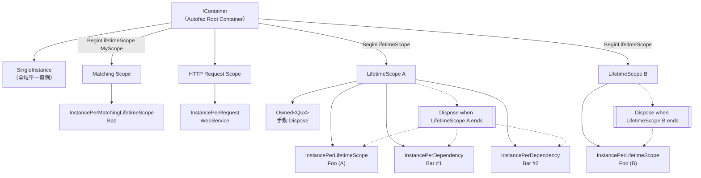
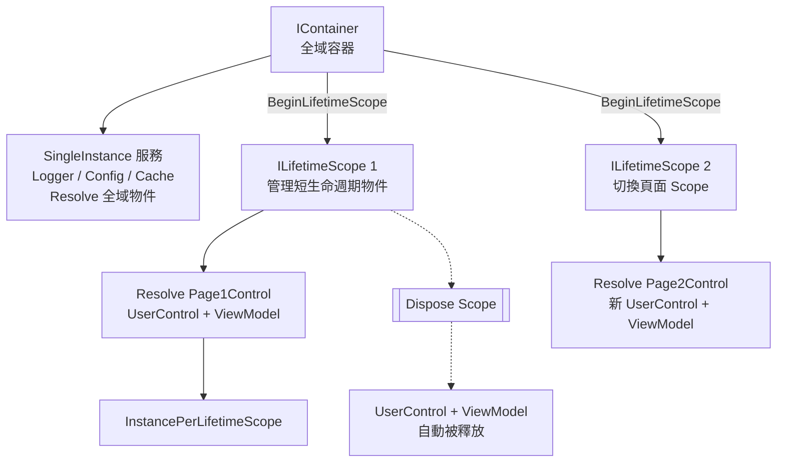

---
aliases:
date:
update:
author:
language:
sourceurl:
tags:
---

# Autofac 常見的生命週期（Lifetime / Scope）定義方式

整理 **Autofac 常見的生命週期（Lifetime / Scope）定義方式**，包含 **註冊語法、生命週期行為、適用情境**，由「最短」到「最長」概念來說明。

## 1️⃣ InstancePerDependency（預設）

### 定義方式

```csharp
builder.RegisterType<Foo>().InstancePerDependency();
```

（不寫時就是這個）

### 說明

* **每次 Resolve 都會建立新實例**
* 不會被共用
* 生命週期最短

### 適用情境

* 無狀態（Stateless）物件
* 輕量服務
* Helper / Utility 類別

## 2️⃣ InstancePerLifetimeScope（最常用）

### 定義方式

```csharp
builder.RegisterType<Foo>().InstancePerLifetimeScope();
```

### 說明

* **在同一個 LifetimeScope 中只會有一個實例**
* 不同 LifetimeScope 會建立不同實例
* Scope Dispose 時會一併釋放

### 適用情境

* ViewModel
* Unit of Work
* 一個頁面 / 一個請求用一次

## 3️⃣ InstancePerMatchingLifetimeScope（指定 Scope）

### 定義方式

```csharp
builder.RegisterType<Foo>()
       .InstancePerMatchingLifetimeScope("MyScope");
```

### 說明

* 只在 **名稱相符的 LifetimeScope** 中共用
* 若 Resolve 時不在該 Scope，會丟例外

### 適用情境

* 特定流程（例如：交易、工作流程）
* 跨多層子 Scope 共享同一實例

## 4️⃣ InstancePerRequest（Web 專用 ⚠）

### 定義方式

```csharp
builder.RegisterType<Foo>().InstancePerRequest();
```

### 說明

* **每個 HTTP Request 一個實例**
* 本質上是 `InstancePerLifetimeScope`
* 需要 `Autofac.Mvc` 或 `Autofac.WebApi`

### 適用情境

* ASP.NET MVC / Web API
* Request-bound 的服務（DbContext、UserContext）

## 5️⃣ SingleInstance（Singleton）

### 定義方式

```csharp
builder.RegisterType<Foo>().SingleInstance();
```

### 說明

* **整個 Container 只會有一個實例**
* 所有 Scope 共用
* Container Dispose 才釋放

### 適用情境

* 設定物件
* Cache
* Logger
* Thread-safe 的共用服務

⚠ **注意**

* 不能依賴 `InstancePerLifetimeScope` 的服務
* 容易造成生命週期錯誤（Captive Dependency）

## 6️⃣ InstancePerOwned（搭配 Owned\<T>）

### 定義方式

```csharp
builder.RegisterType<Foo>().InstancePerDependency();
```

使用時：

```csharp
public class Bar
{
    public Bar(Owned<Foo> foo) { }
}
```

### 說明

* `Foo` 的生命週期由 `Owned<Foo>` 控制
* Dispose `Owned<T>` 才會釋放

### 適用情境

* 手動控制物件生命週期
* 短暫使用的重資源（例如連線）

## 7️⃣ ExternallyOwned（不由 Autofac 釋放）

### 定義方式

```csharp
builder.RegisterInstance(foo)
       .ExternallyOwned();
```

### 說明

* Autofac **不負責 Dispose**
* 由外部程式碼管理生命週期

### 適用情境

* 舊系統
* 第三方建立的物件

## 8️⃣ WithLifetimeScope（進階 / 自訂）

### 定義方式

```csharp
builder.RegisterType<Foo>()
    .InstancePerLifetimeScope()
    .OnActivated(e =>
    {
       // 取得當前 Scope
    });
```

或使用 `ILifetimeScope` 注入

### 說明

* 用於高度客製化 Scope 管理
* 不常見於一般專案

## 📊 快速對照表

| 方式                             | 實例數量      | Scope 綁定 | 常見用途  |
| -------------------------------- | ------------- |:----------:| --------- |
| InstancePerDependency            | 每次 Resolve  |     無     | Helper    |
| InstancePerLifetimeScope         | 每 Scope 一個 |     ✔      | ViewModel |
| InstancePerMatchingLifetimeScope | 指定 Scope    |     ✔      | Workflow  |
| InstancePerRequest               | 每 Request    |     ✔      | Web       |
| SingleInstance                   | 全域一個      |     ✖      | Cache     |
| Owned<T>                         | 手動          |     ✔      | 資源控制  |
| ExternallyOwned                  | 外部管理      |     ✖      | 舊系統    |

## ⚠ 常見錯誤提醒

❌ **Singleton 依賴 Scoped**

```markdown
SingleInstance
  └── InstancePerLifetimeScope ❌
```

✔ 正確方式

* 把依賴往上提為 Singleton
* 或改用 Factory / Func\<T>

---

# Autofac 生命週期總覽

用「容器 → Scope → 物件」的角度，一眼就能看出差異。

## 🔷 Autofac 生命週期 Mermaid 圖



## 🧠 圖解重點說明

### 🔹 SingleInstance

* 掛在 **Root Container**
* 全系統只有一個
* Container Dispose 才釋放

### 🔹 InstancePerLifetimeScope

* **每個 Scope 一個**
* Scope Dispose → 物件一起 Dispose
* 最適合：ViewModel / UnitOfWork

### 🔹 InstancePerDependency

* **每次 Resolve 都新建**
* 不受 Scope 限制
* 最短生命週期

### 🔹 InstancePerMatchingLifetimeScope

* 只在 **指定名稱的 Scope** 共用
* 跨子 Scope 共用同一實例
* 適合 Workflow / Transaction

### 🔹 InstancePerRequest（Web）

* 一個 HTTP Request 一個
* 本質 = InstancePerLifetimeScope
* 僅限 ASP.NET

### 🔹 Owned\<T>

* Autofac 建立
* **呼叫端 Dispose 才釋放**
* 用於精準資源控制

## ⚠ 一眼看懂的設計原則

> **生命週期只能「往下依賴」，不能「往上依賴」**

✅ 合法

```markdown
InstancePerDependency
→ InstancePerLifetimeScope
→ SingleInstance
```

❌ 錯誤

```markdown
SingleInstance
→ InstancePerLifetimeScope  （Captive Dependency）
```

如果你接下來想要：

* 🔸 **WPF / WinForms 實戰註冊範例**
* 🔸 **ASP.NET Core 正確對應 Autofac 生命週期**
* 🔸 **常見 DI 設計錯誤清單**

直接跟我說你用的技術棧，我幫你對症下藥 👍

---

# IContainer VS ILifetimeScope 選擇策略?

這個問題問得很關鍵 👍，很多人在 WinForms 或 Web 專案用 Autofac 時，對 `IContainer` 與 `ILifetimeScope` 的選擇會混淆。下面我整理清楚策略給你。

## 1️⃣ 核心概念

| 介面  | 說明                |
| --- | ------- |
| `IContainer` | Autofac 容器本身，整個應用程式共用的根容器。通常只建立一次。可以 Resolve 物件，但不要用它管理短生命週期的物件。        |
| `ILifetimeScope` | 容器的「範圍」，用來控制 `InstancePerLifetimeScope` 的生命週期。可以從 `IContainer` 建立新 Scope (`BeginLifetimeScope`)。`Dispose` Scope → 釋放該範圍內物件。 |

## 2️⃣ 使用策略

### (A) 需要全局單例服務

- Logger、Config、Cache、Database Connection Pool
- **策略**：直接從 `IContainer` `Resolve`，或註冊 `SingleInstance`
- 範例：

```csharp
builder.RegisterType<Logger>().As<ILogger>().SingleInstance();
```

### (B) 短生命週期、每個單位使用

- UserControl / Form / 每次操作的 ViewModel
- **策略**：建立新的 `ILifetimeScope`，在 Scope 中 `Resolve`，切換頁面或完成操作後 `Dispose` Scope
- 範例：

```csharp
using(var scope = container.BeginLifetimeScope())
{
    var page = scope.Resolve<MyUserControl>();
    panelContainer.Controls.Add(page);
}
```

### (C) 子物件共享單例，但不影響全局

- 有時候一個頁面裡多個控制項共享同一個服務，但其他頁面不共用
- **策略**：使用 **Scope**，註冊 `InstancePerLifetimeScope`

```csharp
builder.RegisterType<PageViewModel>().AsSelf().InstancePerLifetimeScope();
```

## 3️⃣ 決策原則

| 問題                     | 選 IContainer? | 選 ILifetimeScope? |
| ---------------------- | :-----------: | :---------------: |
| 全局共用、長生命週期             |               |         ❌         |
| 每個 Form/UserControl 獨立 |       ❌       |                   |
| 多個子物件需要共享同一範圍內物件       |       ❌       |                   |
| 簡單 Resolve 單例服務        |               |      可，但不必要       |

## 4️⃣ WinForms 實務建議

1. **全局容器** → `IContainer
    - 註冊全局服務
    - 不要在 Form 裡直接 Dispose 它
2. **每頁 Scope** → `ILifetimeScope`
    - UserControl + 對應 ViewModel → 用 Scope 管理
    - 切換頁面時 Dispose Scope → 釋放物件
3. **避免直接在 Form 建構子用 IContainer Resolve 過多物件**
    - 儘量透過 Scope 注入 ViewModel 或屬性注入
    - 保持可測試性

💡 **一句話策略**：

> `IContainer` 管理全局長生命週期物件；
> `ILifetimeScope` 管理短生命週期、可釋放物件。

---

# WinForms + Autofac 生命週期策略圖

下圖直觀顯示 **IContainer 與 ILifetimeScope 在 WinForms 中的使用策略與物件生命週期**。



- IContainer 僅負責全域 SingleInstance 與 Scope 建立
- 每次 BeginLifetimeScope 對應一個頁面或操作情境
- Page 切換即 Dispose 舊 Scope，其下的 UserControl 與 ViewModel 會一併釋放
- 此圖符合 Autofac 建議的 UI Scope 使用模式

## 核心策略

1. **IContainer**
    - 管理整個應用程式的全局物件
    - 單例服務、共用資源、全局設定
2. **ILifetimeScope**
    - 管理短生命週期物件（每頁 UserControl / Form / 每次操作的 ViewModel）
    - 切換頁面或操作完成時 Dispose Scope → 釋放物件
3. **InstancePerLifetimeScope**
    - 每個 Scope 內是單例
    - 不同 Scope 內生成新實例
    - 適合多個子物件共享同一頁面的 ViewModel
4. **InstancePerDependency**
    - 每次 Resolve 都生成新物件
    - 不依賴 Scope
    - 適合短期臨時物件或 UserControl

💡 **實務建議**

- 全局單例 → IContainer + SingleInstance
- 每頁 UserControl → 建立 ILifetimeScope，Resolve 物件，切換頁面時 Dispose Scope
- 子物件共享 → InstancePerLifetimeScope
- 單純短期臨時物件 → InstancePerDependency

---

# AsSelf()

在 Autofac 註冊型別時，**要不要加 `.AsSelf()`**，差別在於**這個型別能否用「自己」來 Resolve**，以及 **如何控制公開的解析方式**。
以下是最完整的整理分析：

## 1. 什麼是 `.AsSelf()`？

表示：**允許用 “類別本身” 來 Resolve 這個型別**

```csharp
builder.RegisterType<MyService>().AsSelf();
...
var obj = container.Resolve<MyService>(); // OK
```

如果你**沒有**加 `.AsSelf()`，而只寫：

```csharp
builder.RegisterType<MyService>();
```

那麼 Autofac 會自動當成 `.AsSelf()`，**所以這兩個是等價的！**

結論：**默認就是 AsSelf()**

## 2. 什麼是 `.As<IInterface>()`？

表示：**只能用介面來 Resolve 這個型別**

```csharp
builder.RegisterType<MyService>().As<IMyService>();
...
var obj = container.Resolve<IMyService>(); // OK
var obj2 = container.Resolve<MyService>(); // ❌ 失敗，因為 MyService 沒曝露 self
```

結論：**只暴露介面，不暴露具體類別**

## 3. **同時使用 AsSelf + AsInterface**

```csharp
builder.RegisterType<MyService>()
 .As<IMyService>()
 .AsSelf();
```

這樣就可以：

```csharp
Resolve<IMyService>(); 
Resolve<MyService>(); 
```

## 4. 什麼時候要特別加 `.AsSelf()`？

|情境|是否需要 AsSelf|
|---|---|
|只寫 `RegisterType<MyService>()`| 不需要，加不加一樣|
|已經 `.As<IInterface>()`| 想用類別 Resolve → 要加 AsSelf|
|你想限制只能用 Interface 解析|❌ 不要加 AsSelf|
|要在 Form / UserControl 中注入自己| 建議加 AsSelf (或不要寫 AsInterface)|

## 5. 「只用介面」 VS 「同時允許類別」

|設計思路|實務建議|
|---|---|
|想遵守介面導向原則（低耦合、易測試）|只註冊 `.As<IInterface>()`|
|WinForms / WPF 中需要直接 new Form / UserControl|`.AsSelf()` 或直接註冊不加介面|
|有 ViewModel 但同時需要直接 Resolve 類別|`.AsSelf().As<IInterface>()`|
|想防止錯誤使用具體類別|不要加 `.AsSelf()`|

## 6. 還有一種：`.AsImplementedInterfaces()`

```csharp
builder.RegisterType<MyService>().AsImplementedInterfaces();
```

會自動註冊類別所有實作的介面，例如：

```csharp
class MyService : IRepo, ILog, IOther { ... }
```

會等同於：

```csharp
.As<IRepo>()
.As<ILog>()
.As<IOther>()
```

但 **不包含 AsSelf()**，所以：

```csharp
Resolve<IMyService>() 
Resolve<MyService>() ❌
```

## 🎯 最終結論

|寫法|可否 Resolve 類別|可否 Resolve 介面|
|---|---|---|
|`RegisterType<T>()`| 是 (因為有隱含 AsSelf)|❌ 否|
|`RegisterType<T>().AsSelf()`| 是|❌ 否|
|`RegisterType<T>().As<I>()`|❌ 否| 是|
|`RegisterType<T>().As<I>().AsSelf()`| 是| 是|
|`RegisterType<T>().AsImplementedInterfaces()`|❌ 否| 是|

## 最實務建議

- **Service / Repository / Manager 類別**
  建議只 As()，保持抽象、低耦合
 
- **ViewModel 或需要手動 Resolve 的類別**
  用 `.AsSelf()` 或不加介面
 
- **Form / UserControl**
  只用 `.AsSelf()` 最簡單
 
- **若你想同時允許介面與類別**
  `.AsSelf().As<IInterface>()`

---

# PropertiesAutowired() 搭配條件

`PropertiesAutowired()` 並不是「自動就會運作」，它 **必須符合幾個條件才會真正注入屬性**。很多人以為加了就會動，結果發現屬性仍然是 null，就是因為少了關鍵條件。

我幫你整理最完整、實務導向的說明：

## PropertiesAutowired() 要能生效，**必須同時符合以下條件**

### 條件 1：這個型別是由 Autofac resolve 出來的

❌ 你自己 `new` 出來的物件，Autofac 不會幫你注入
 必須透過：`container.Resolve<T>()`, `scope.Resolve<T>()`, 或 constructor chain 產生的物件

### 條件 2：屬性必須是 Public + 可寫 (set)

```csharp
public IMyService MyService { get; set; } // 會注入
private IMyService MyService { get; set; } // ❌ 不會
public IMyService MyService { get; } // ❌ 不會
```

### 條件 3：Autofac 要能解析該屬性的型別

```csharp
builder.RegisterType<MyService>().As<IMyService>(); // OK
builder.RegisterType<MyView>(); // PropertiesAutowired()
```

若 `IMyService` 沒註冊或註冊錯誤 → 注入失敗，屬性為 null

### 條件 4：必須在註冊該型別時 加上 `.PropertiesAutowired()`

```csharp
builder.RegisterType<MyView>().PropertiesAutowired();
```

只寫 `builder.RegisterType<MyView>()` → ❌ 屬性不會自動注入

## 常見問題：為什麼已經 `.PropertiesAutowired()` 還是 null？

|原因|解法|
|---|---|
|自己 new|使用 Resolve|
|屬性不是 public set|改成 public set|
|沒有 AsSelf() 或 As 正確註冊|加上正確的 As|
|Autofac 版本太新或太舊|確認用法對版本有效|
|Resolve 時使用 new scope 而物件不在此 scope|確保註冊與解析在同一層級|
|在 Module 中註冊，但忘了調用 base.Load() 或忘了把 Module 加入 container|檢查 Module 是否生效|

## 進階條件：ResolveParameters 要考慮

若你用的是：

```csharp
scope.Resolve<MyView>();
```

那 PropertiesAutowired 就有效。

但如果你用以下方式傳遞參數：

```csharp
scope.Resolve<MyView>(new NamedParameter("xxx", 123));
```

只要你不是用 `new MyView(...)` 自己 new，PropertiesAutowired 仍然會執行。

## 特殊狀況：WInForms/WPF Designer 要求無參建構子

若你的 View (Form/UserControl) 有無參建構子：

```csharp
public partial class MyView : UserControl
{
    public MyView() // Designer 使用
    {
        InitializeComponent();
    }
    
    public IMyService MyService { get; set; } // 希望 Autofac 注入
}
```

你必須確保 Runtime 是 Autofac Resolve：

```csharp
var view = scope.Resolve<MyView>();
```

否則 Designer 自己 new 的物件不會注入 → null 是正常的。

## 進階技巧：若要 Inject Private/Protected 成員？

可以用：

```csharp
builder.RegisterType<MyClass>()
 .PropertiesAutowired(PropertyWiringOptions.AllowNonPublic);
```

通常不推薦，除非你有特殊需求。

## 結論 (最重要 2 行)

 PropertiesAutowired() **會自動掃描 public set 屬性並注入，但前提是物件必須由 Autofac Resolve。**
❌ 如果你用 `new`，即使註冊了 PropertiesAutowired()，也完全不會注入。

## 🎁 額外給你實用建議

在 WinForms 做 MVVM：
 View (UserControl/Form) → 用 PropertiesAutowired() 注入 ViewModel
 ViewModel → 用 constructor injection 注入 Service / DbContext
 Service → constructor injection

這樣 Designer 可以用，DI 也能正常運作。

---

# RegisterBuildCallback()

`RegisterBuildCallback()` **只在 Container 建立完成時執行一次**，
不管你之後 Resolve 多少次，都不會再跑。

## 為什麼？

Autofac 建構流程分兩階段：

1. **Builder 階段**（註冊階段）
    - `RegisterType<>`
    - `As<>`
    - `SingleInstance()`, `InstancePerDependency()`, 等 lifetime 設定
    - ✅ `RegisterBuildCallback()` 會登記一個「container 建完要執行的動作」
2. **Container 建好後**
    - Autofac 呼叫所有 `OnBuild` callback，一次性執行
    - ✅ 在這之後不會再執行 callback

## 那每次 `Resolve<ICore>()` 會怎樣？

這取決於 Lifetime：

|Lifetime 設定|Resolve() 結果|
|---|---|
|預設 (InstancePerDependency)|每次建立新的 CoreService 建構式執行一次|
|SingleInstance()|只建立一次 CoreService 建構式只執行一次|
|InstancePerLifetimeScope()|每個 scope 建一次|

**無論哪一種，`RegisterBuildCallback()` 都不會再次執行！**

## 什麼時候會「看起來像每次執行」？

如果你用的是 **OnActivated**：

```csharp
builder.RegisterType<CoreService>()
       .As<ICore>()
       .OnActivated(e => {
           Console.WriteLine("Activated");
       });
```

這個會在每次 Resolve 時執行一次（如果不是 SingleInstance）。

✅ 所以，如果你想在每次建立 ICore 時執行某些初始化邏輯，用 `OnActivated` 或建構式。

## 實務建議 ✅

- **一次性初始化 → RegisterBuildCallback 或 模組的 Load()**
- **每次建立物件時初始化 → 建構式 或 OnActivated**
- **InstancePerDependency → 每次 Resolve 建構式跑**
- **SingleInstance → 建構式只跑一次**

## 延伸思考

你是不是想在每次 CoreService 被解析時，自動載入資料？
如果是，那 RegisterBuildCallback 完全不適合，應該用建構式或 OnActivated。
如果怕建構式太重，也可改成 Lazy 啟動或背景載入。

---

# 建構式取得 ILifetimeScope，然後程式內取得單例物件 vs 直接在建構式取得單例物件

這是一個非常專業的問題，也很常見於使用 Autofac 的中大型系統。你提到的兩種方式，其實都能正確取得 Singleton（單例）物件，但它們之間有一些**設計面、效率面、與實務上的差異**，我來幫你完整拆解一下。

## 🔍 你提到的兩種方式

### ✅ 方式 1：建構式直接注入單例物件（推薦方式）

```csharp
public class MyClass
{
    private readonly ISingletonService _singleton;

    public MyClass(ISingletonService singleton)
    {
        _singleton = singleton;
    }
}
```

Autofac 會根據註冊的 `SingleInstance()` 自動注入同一個實例。

### ⚠️ 方式 2：建構式注入 `ILifetimeScope`，再手動 Resolve

```csharp
public class MyClass
{
    private readonly ILifetimeScope _scope;

    public MyClass(ILifetimeScope scope)
    {
        _scope = scope;
    }

    public void DoSomething()
    {
        var singleton = _scope.Resolve<ISingletonService>();
    }
}
```

這種方式你還是會取得單例，**只要該服務是用 `.SingleInstance()` 註冊的話**。

## 🧠 差異分析

| 比較項目            | 建構式注入單例（方式 1）                | 注入 `ILifetimeScope` 再 Resolve（方式 2）         |
| --- | --- | --- |
| **設計原則**        | ✅ 遵守依賴反轉原則（DIP）、單一職責原則（SRP） | ❌ 違反 DIP，讓物件自己控制依賴取得                       |
| **測試可攜性**       | ✅ 容易 mock / 測試              | ❌ 難以 mock，需額外建立 container 或 fake scope     |
| **可讀性**         | ✅ 依賴明確，建構式即知道所需服務           | ❌ 依賴隱藏，需看內部邏輯才知道要用哪些服務                     |
| **效率**          | ✅ 效率高，建構時就 resolve 好        | ⚠️ 每次呼叫都 `Resolve()`，雖然會回傳同一實例，但多一次查詢與執行路徑 |
| **靈活性**         | ❌ 無法動態選擇要不要使用某個服務           | ✅ 可以根據邏輯條件動態取得服務（但這通常是設計問題）                |
| **實際取得單例成功與否？** | ✅ 會成功，且由容器自動注入單例實例          | ✅ 也會成功，只要註冊時是 `.SingleInstance()`          |

## 🔧 什麼情況會用到 `ILifetimeScope.Resolve()`？

雖然不推薦在一般情況下這樣使用，但 **以下情況有其合理性**：

1. **Plugin/模組系統中延遲加載服務**
    * 你不想在初始化時就注入所有依賴，而是根據某些條件才 resolve。
2. **循環依賴 workaround**
    * 如果你有難解的循環依賴（不推薦的情況），可以透過 `Resolve()` 延遲解析。
3. **使用第三方事件或 callback（無法注入）**
    * 如 static event handler、delegate 傳遞進來的 context。

## ✅ 建議

* **優先使用方式 1（建構式注入）**，因為：
    * 遵守 SOLID 原則
    * 更容易寫單元測試
    * 不容易產生維護問題
* 僅在必要場景下（如延遲解析、模組化插件）才考慮方式 2，並且最好**將 Resolve 的邏輯包裝起來**，避免在核心邏輯中直接呼叫 `_scope.Resolve<T>()`。

## 🧪 範例對比（方式 1 vs 方式 2）

### 方式 1

```csharp
public class OrderService
{
    private readonly IDiscountCalculator _calculator;

    public OrderService(IDiscountCalculator calculator)
    {
        _calculator = calculator;
    }

    public void ProcessOrder()
    {
        var discount = _calculator.Calculate();
    }
}
```

### 方式 2

```csharp
public class OrderService
{
    private readonly ILifetimeScope _scope;

    public OrderService(ILifetimeScope scope)
    {
        _scope = scope;
    }

    public void ProcessOrder()
    {
        var calculator = _scope.Resolve<IDiscountCalculator>();
        var discount = calculator.Calculate();
    }
}
```

**方式 1 更簡潔、清晰、容易測試。**

## 📌 總結一句話

> ✅「如果你知道這個物件一定會用到某個服務，那就直接建構式注入，不要用 LifetimeScope 來 Resolve。」

---

# 設計一個更乾淨的架構。優化例子

太好了！那我們來一起看一個實際場景，然後針對它設計更「乾淨」又維持彈性的架構。這樣你就能避免不必要的 `ILifetimeScope.Resolve<T>()`，又能保留彈性。

## 🎯 假設場景：Plugin 模組延遲載入服務

### 🧩 背景

你有一個模組系統（例如報表、外掛、計算邏輯模組等），這些模組不一定在程式啟動時就會用到。只有在某些操作發生時，才會決定要不要載入並使用該模組對應的服務。

## ❌ 傳統做法（用 `ILifetimeScope.Resolve<T>()`）

```csharp
public class PluginExecutor
{
    private readonly ILifetimeScope _scope;

    public PluginExecutor(ILifetimeScope scope)
    {
        _scope = scope;
    }

    public void Execute(string pluginKey)
    {
        if (pluginKey == "Excel")
        {
            var excelService = _scope.Resolve<IExcelExporter>();
            excelService.Export();
        }
        else if (pluginKey == "Pdf")
        {
            var pdfService = _scope.Resolve<IPdfExporter>();
            pdfService.Export();
        }
    }
}
```

這種寫法會讓 `PluginExecutor` **依賴所有可能的 plugin 實作**，難以擴充，測試也不容易。

## ✅ 改進寫法：使用 **工廠模式 + 委託 + DI**

讓你仍然保有延遲解析的彈性，但又不違反設計原則。

### 1. 定義 Plugin 接口

```csharp
public interface IPlugin
{
    void Execute();
}
```

### 2. 為每種 Plugin 做實作

```csharp
public class ExcelExporter : IPlugin
{
    public void Execute()
    {
        Console.WriteLine("Exporting Excel...");
    }
}

public class PdfExporter : IPlugin
{
    public void Execute()
    {
        Console.WriteLine("Exporting PDF...");
    }
}
```

### 3. 建立 Plugin Factory

```csharp
public interface IPluginFactory
{
    IPlugin GetPlugin(string pluginKey);
}
```

```csharp
public class PluginFactory : IPluginFactory
{
    private readonly ILifetimeScope _scope;

    public PluginFactory(ILifetimeScope scope)
    {
        _scope = scope;
    }

    public IPlugin GetPlugin(string pluginKey)
    {
        return pluginKey switch
        {
            "Excel" => _scope.Resolve<ExcelExporter>(),
            "Pdf" => _scope.Resolve<PdfExporter>(),
            _ => throw new NotSupportedException($"Plugin '{pluginKey}' not supported.")
        };
    }
}
```

你可以讓這個 Factory **只負責 Resolve，一次集中處理，避免污染主邏輯**。

### 4. 使用端簡潔乾淨

```csharp
public class PluginExecutor
{
    private readonly IPluginFactory _factory;

    public PluginExecutor(IPluginFactory factory)
    {
        _factory = factory;
    }

    public void Execute(string pluginKey)
    {
        var plugin = _factory.GetPlugin(pluginKey);
        plugin.Execute();
    }
}
```

## 🧪 單元測試簡單了

你可以輕鬆 Mock `IPluginFactory` 來測試：

```csharp
_mockFactory.Setup(f => f.GetPlugin("Excel")).Returns(new Mock<IPlugin>().Object);
```

不需要建立一個真的 `ILifetimeScope`。

## 📦 Autofac 註冊方式

```csharp
builder.RegisterType<ExcelExporter>().AsSelf().SingleInstance();
builder.RegisterType<PdfExporter>().AsSelf().SingleInstance();

builder.RegisterType<PluginFactory>().As<IPluginFactory>().SingleInstance();
```

## ✅ 總結優點

| 項目      | 描述                             |
| --- | --- |
| 🔍 可讀性  | 主邏輯看不到 `Resolve`，乾淨清晰          |
| 🧪 可測性  | 可 mock `IPluginFactory`        |
| ♻️ 擴充性  | 新增 Plugin 僅需修改 `PluginFactory` |
| 💡 可維護性 | 模組解耦，遵守 SRP/DIP 原則             |
