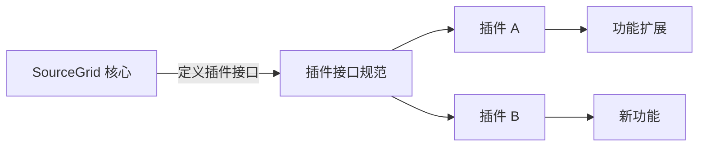

---
aliases:
date: 2024-12-02
update:
author: "\rIT项目经理"
language: C#
sourceurl: https://blog.csdn.net/weixin_36474966/article/details/144202808
tags:
  - CSharp
  - WinForm
  - SourceGrid
---

# 简介

SourceGrid 是一个开源 .NET 框架控件，提供灵活且可定制的网格视图，适用于 Windows Forms 和 WPF 应用。
最新版本 4.3 引入了多项改进，包括高度可定制性、高性能、多语言支持等。
本源码详解将介绍其核心特性、学习要点和源码分析，帮助开发者深入理解控件设计及优化 UI 组件的能力。

# 1. SourceGrid 组件开源控件特性

SourceGrid 是一个流行的 .NET 开源控件，用于创建复杂的网格界面。
作为开发者，理解其特性对于高效集成和应用至关重要。
本章将概述 SourceGrid 的基础特性，为深入研究其核心功能和代码实现打下基础。

## 1.1 开源项目简介

SourceGrid 是一个灵活的网格控件，它提供了丰富的用户界面元素和数据处理功能。
它的核心优势在于其自定义能力，允许用户根据自己的需求定制网格界面。

## 1.2 主要特性概览

- 用户界面自定义： SourceGrid 通过灵活的 API 支持高度自定义的界面元素，例如单元格、行等。
- 数据绑定与同步： 提供强大的数据绑定机制，可以轻松地将数据源与网格控件同步。
- 跨平台兼容性： 支持在不同的.NET 平台上运行，包括 WinForms 和 WPF。

在第一章的后续部分，我们将详细探讨这些特性的实现细节和使用方法。
通过本章，你可以获得如何在项目中应用 SourceGrid 来满足特定界面需求的初步理解。

# 2. 核心特性详细解读

## 2.1 用户界面元素的自定义

### 2.1.1 定制界面元素的必要性

在当今竞争激烈的软件市场中，个性化和用户体验已成为区分软件产品的重要因素。
定制界面元素可以提升软件的专业形象，满足特定用户群体的需求。
通过自定义用户界面元素，开发人员可以提供更加贴合用户业务逻辑和使用习惯的应用程序，从而提高用户满意度和软件的可用性。
同时，这也能够帮助软件更好地融入企业的品牌策略，实现界面风格的统一。

### 2.1.2 界面元素自定义的实现方式

界面元素自定义可以通过多种方式实现，包括但不限于样式定制、模板替换、行为修改等。
在 SourceGrid 控件中，开发者可以利用内置属性和方法对单元格的样式进行调整，
例如字体大小、颜色、背景色等。
更高级的自定义可以通过继承现有的控件类，并重写特定的渲染方法来实现。
例如，下面的代码展示了如何设置一个单元格的背景颜色：

```csharp
// 创建单元格
Cell cell = new Cell();
// 设置单元格背景颜色
cell.BackColor = Color.Green;
// 应用单元格到表格中
gridControl1[row, column] = cell;
```

在上述代码中， `Cell` 类的实例代表了一个单元格，并通过设置 `BackColor` 属性来改变其背景色。
最后，通过将该单元格实例放置到 `gridControl1` 的指定位置，实现了界面的自定义。

## 2.2 数据绑定与同步机制

### 2.2.1 数据绑定的基本原理

数据绑定是将界面上的控件元素与数据源关联起来的技术，
它允许界面上的显示内容随着数据源的变化而自动更新，从而实现数据与视图的分离。
在 SourceGrid 中，数据绑定通常涉及两部分：数据源和绑定控件。
**数据源**可以是数组、列表、数据库或其他数据集；
**绑定控件**则是用户界面上显示和编辑数据的控件。

### 2.2.2 数据同步机制的高级特性

SourceGrid 的数据绑定机制支持多种数据类型，并提供同步机制确保数据的一致性。
开发者可以实现双向绑定，这意味着界面上的修改可以反映回数据源，反之亦然。
此外，SourceGrid 还提供了事件驱动的数据同步机制，当数据源发生变化时，会触发相应的事件来同步界面的显示。
例如，可以注册一个数据源变更事件，当数据源发生变动时，更新界面上的相关元素：

```csharp
// 假设有一个数据源列表
List<DataItem> dataSource = new List<DataItem>();
// 绑定数据源到表格
gridControl1.DataSource = dataSource;

// 注册数据源变更事件
dataSource.CollectionChanged += delegate
{
    // 同步数据更新
    gridControl1.SyncData();
};
```

在这个例子中，使用了数据源的 `CollectionChanged` 事件来触发数据同步，
通过调用 `SyncData` 方法，表格视图与数据源保持了一致性。

## 2.3 组件的跨平台兼容性

### 2.3.1 跨平台开发的挑战

在进行跨平台开发时，开发者面临着一系列的挑战，
这包括不同操作系统间的兼容性问题、硬件环境的差异、用户界面标准的不一致等。
这些因素都可能影响最终软件的运行效率和用户体验。
因此，跨平台组件需要能够适应不同的环境，并提供一致的功能实现。

### 2.3.2 SourceGrid 的跨平台兼容实现

SourceGrid 作为一个跨平台的组件，为了解决兼容性问题，采取了多种策略。
首先，在 UI 元素的设计上，它遵循了通用的设计模式，尽量使用标准的界面控件。
其次，在代码层面，SourceGrid 尽量使用跨平台的 API，并对关键的平台依赖进行了抽象。
例如，下面的代码展示了 SourceGrid 如何在不同平台上加载表格控件：

```csharp
// 使用跨平台抽象的控件加载方法
TableControl tableControl = TableControl.LoadFromXaml("path_to_xaml_file");
// 检测平台并执行相应操作
if (CrossPlatformHelper.IsRunningOnWindows())
{
    // Windows 特有的操作
}
else if (CrossPlatformHelper.IsRunningOnLinux())
{
    // Linux 特有的操作
}
else if (CrossPlatformHelper.IsRunningOnMacOS())
{
    // macOS 特有的操作
}
```

这段代码中，通过 `CrossPlatformHelper` 类判断运行的操作系统平台，
并根据不同的平台执行特定的操作，从而实现了跨平台兼容。
通过这种方式，SourceGrid 确保了其在不同平台上的兼容性和可用性。

# 3. 源码结构解析

## 3.1 代码组织和模块划分

### 3.1.1 源码目录结构的概述

SourceGrid 的源码组织遵循清晰的分层设计，目的是让开发者能够轻松地理解和维护代码库。
源码被组织成多个目录，每个目录代表了组件的不同方面和功能。例如，
`SourceGrid` 目录下是主要的网格控件实现，
`Controls` 目录包含其他辅助控件。
`Utils` 目录则提供了工具性质的功能，如颜色处理或数学计算。
清晰的目录结构不仅有助于代码的阅读和理解，也便于在项目中进行模块化管理和功能扩展。

### 3.1.2 各模块功能与职责划分

在 SourceGrid 的源码中，模块化设计让每个模块承担着特定的职责。例如，
`Core` 模块包含核心的逻辑和基本功能，它为其他模块提供基础服务和接口。
`DataModels` 模块专注于数据模型的管理，处理数据源和数据绑定的细节。
`Events` 模块负责事件的注册、分发和处理逻辑。
通过这种方式，SourceGrid 确保了代码的==高内聚低耦合==，这在模块化开发中是非常关键的。

## 3.2 核心功能的代码实现

### 3.2.1 编辑功能的代码分析

编辑功能是 SourceGrid 中一个核心的特性，它允许开发者在网格控件中输入和编辑数据。
其关键代码实现涉及到了一个 `Cell Editors` 类，该类定义了一个接口来实现不同的编辑行为。
例如，文本编辑器、下拉列表编辑器等。
每个编辑器类型通过实现这个接口来定义特定的编辑行为，
如 `BeginEdit` 、 `EndEdit` 和 `CancelEdit` 方法。
这些方法在用户交互过程中被调用，控制编辑状态的变化。

```csharp
public interface ICellEditor
{
    bool BeginEdit(CellContext context, Control editorControl);
    bool EndEdit(CellContext context, Control editorControl, bool validateValue);
    bool CancelEdit(CellContext context, Control editorControl);
    Control CreateEditor(CellContext context);
    bool ValidateValue(CellContext context, Control editorControl, object value);
}```

### 3.2.2 数据绑定与处理的代码分析

数据绑定是 SourceGrid 将数据源与网格控件相连接的方式。
核心类 `Binding` 负责管理数据的绑定关系。
它包含 `DataSource` 属性用于指定数据源，以及 `DataMember` 指定数据源中的具体数据成员。
`Binding` 类还负责处理数据字段和网格列之间的映射，以及数据同步和更新的逻辑。
数据绑定的实现利用了 .NET 的 `INotifyPropertyChanged` 和 `IList` 接口，
确保了当数据源中的数据发生变化时，网格控件能够自动更新显示。

## 3.3 架构设计与代码复用
### 3.3.1 设计模式在 SourceGrid 中的应用

设计模式在 SourceGrid 的开发中被广泛使用，以确保代码的灵活性和可扩展性。
例如，使用==工厂模式==来创建不同类型的 `Cell Editors` 和 `Cell Renderers` 。
==策略模式==被用于数据绑定和数据验证逻辑，允许开发者根据不同的业务需求选择不同的策略。
==观察者模式==也在事件处理和数据模型更新中起到了关键作用，确保了组件状态的透明性和同步性。

### 3.3.2 代码复用策略及其优势

SourceGrid 采用了多种代码复用策略以提高开发效率和代码质量。
模板方法模式和继承在实现编辑器和渲染器时提供了代码复用的机会。
通过定义抽象类，不同的子类可以继承并覆盖特定的方法来提供特定的功能。
此外，通过扩展点和委托，SourceGrid 允许第三方开发者扩展其核心功能而不必修改源码，
这样既保证了核心代码的稳定性，也提高了项目的可维护性。
```csharp
public abstract class CellBaseEditor<T> : ICellEditor where T : Control
{
    // ...
    public virtual T CreateEditor(CellContext context)
    {
        // Default implementation to create editor based on context
        // Specific implementations can override this to provide custom editor controls
    }
}
```

以上代码展示了如何利用抽象类来实现模板方法模式，
允许开发者通过继承 `CellBaseEditor` 并重写 `CreateEditor` 方法来自定义编辑器的创建逻辑。
这不仅使得核心功能复用变得简单，也保证了扩展点的灵活性和稳定性。

# 4. 事件驱动编程原理

## 4.1 事件驱动模型概述

### 4.1.1 事件驱动模型的基本概念

事件驱动模型是一种编程范式，它通过事件来触发应用程序的行为。
在这种模型中，程序的流程不完全由主函数的代码顺序决定，
而是由一系列事件的发生以及对这些事件的响应来控制。
这些事件可以由用户操作（如点击、按键等）产生，
也可以由系统或程序内部生成（如定时器事件、数据加载完成事件等）。

在事件驱动模型中，事件是程序设计的核心。
程序需要预先设置一系列事件处理器（`Event Handler`），
这些处理器是与特定事件类型关联的函数或方法。
当特定事件发生时，事件循环会调用相应的事件处理器，执行相应的代码逻辑。

事件驱动模型的==优点在于其松耦合的架构，允许开发者在不必了解程序整体流程的情况下，专注于特定事件的处理逻辑。==
这使得程序更容易扩展和维护。

### 4.1.2 事件驱动模型与传统模型的对比

传统模型，如过程式编程模型，通常依赖于函数调用的顺序来执行程序。
在这种模型中，程序的执行路径是线性和顺序的。
而事件驱动模型则允许程序在等待事件发生时处于一种非阻塞的状态。

在事件驱动模型中，程序不需要持续查询某个条件是否满足，而是通过事件处理器响应异步事件。
这种方式减少了资源的浪费，并提高了程序对用户输入的响应速度。
对比来看，传统模型可能在面对需要频繁响应用户交互的场景时效率较低。

事件驱动编程与传统的控制流编程的主要区别在于控制流的方向和程序的组织结构。
事件驱动编程更适合处理并发事件，因为它的控制流是由外部事件驱动的，而不是由程序内部的顺序逻辑决定的。

## 4.2 事件处理机制详解

### 4.2.1 事件的捕获与处理流程

事件处理是事件驱动模型的关键部分，涉及事件的捕获、传递和响应。
事件捕获阶段是从根节点开始，事件对象在 DOM 树中逐级向下传递，直到到达事件的目标节点。
在事件传递过程中，每一个节点都有机会处理该事件。

事件传递到目标节点后，会进入事件处理阶段。
事件处理通常由绑定到目标节点上的事件处理器来完成。
处理器可以是一个函数、一个方法或者一个匿名函数，用于定义当事件发生时应该执行的代码。

事件处理完成后，如果事件不是被阻止冒泡的，它将继续进入事件冒泡阶段。
在冒泡阶段，事件对象会从目标节点向上返回，再次经过 DOM 树的每一个节点。
冒泡阶段允许父级节点有机会响应子节点上的事件。

### 4.2.2 自定义事件的创建与分发

在一些复杂的场景中，开发者可能需要创建并分发自定义事件。
这在事件驱动的框架中是一个常见的操作。
自定义事件可以是任何类型的事件，例如一个数据更新的事件、一个用户行为的事件或者一个业务逻辑的事件。

创建自定义事件通常涉及以下几个步骤：

1. 实例化一个事件对象。
2. 配置事件的名称和其他属性，如 bubbles 、 cancelable 等。
3. 使用 dispatchEvent 方法分发事件。

```javascript
// 创建事件实例
var myEvent = new Event('CustomEventName', {
    bubbles: true,
    cancelable: true
});

// 分发事件
element.dispatchEvent(myEvent);
```

在上述代码中，我们首先创建了一个新的 Event 对象，指定了事件名称和一些可选的属性，
然后通过调用目标元素的 `dispatchEvent` 方法来触发该事件。
任何绑定到该元素的自定义事件处理器都将被执行。

自定义事件可以极大地增强程序的模块化和组件化，使得不同组件之间可以通过定义好的事件接口进行交互。

## 4.3 事件驱动编程在 SourceGrid 中的应用

### 4.3.1 事件处理在用户交互中的作用

在 SourceGrid 组件中，事件驱动编程在用户交互中扮演着至关重要的角色。
SourceGrid 通过定义各种事件（如单元格点击事件、数据变更事件等），
让开发者能够捕获用户的操作，并作出相应的响应。

在用户界面中，事件是实现动态交互的关键。
例如，当用户点击一个按钮时，应用程序需要能够检测到这个点击事件，并执行相应的动作。
在 SourceGrid 中，这样的事件处理机制可以让网格组件响应各种用户操作，比如编辑数据、排序或者筛选。

### 4.3.2 事件驱动与性能优化的平衡

虽然事件驱动编程提供了灵活性和响应性，但它也可能引入性能问题。
例如，如果事件处理函数执行的代码量较大，或者事件处理器被绑定到很多元素上，就有可能导致性能瓶颈。

在 SourceGrid 中，优化事件处理的一个方法是减少绑定在单个元素上的事件处理器数量。
还可以通过以下方法优化性能：
1. 使用 `event.stopPropagation() ` 来阻止事件冒泡，避免不必要的事件处理。
2. 对于频繁触发的事件，使用节流（`Throttling`）或防抖（`Debouncing`）技术，限制事件处理函数的执行频率。
3. 在事件处理器中避免执行耗时的操作，考虑使用 Web Workers 或异步操作来处理。

正确地处理事件，既能保持良好的用户体验，又能确保程序的性能不会因为过多的事件处理而受到影响。

```javascript
// 节流函数示例
function throttle(fn, wait)
{
    let inThrottle, lastFn, lastTime;
    return function() {
        const context = this, args = arguments;
        if (!inThrottle)
        {
            fn.apply(context, args);
            lastTime = Date.now();
            inThrottle = true;
        }
        else
        {
            clearTimeout(lastFn);
            lastFn = setTimeout(function() {
                if (Date.now() - lastTime >= wait)
                {
                    fn.apply(context, args);
                    lastTime = Date.now();
                }
            }, Math.max(wait - (Date.now() - lastTime), 0));
        }
    }
    ;
}
```

在上述节流函数中， `throttle` 函数接受一个函数 `fn` 和一个等待时间 `wait` 作为参数。
这个函数能够限制 `fn` 函数的执行频率，确保它不会在给定的 `wait` 时间间隔内多次执行，
这对于处理连续的事件流（如滚动事件）特别有效。

在 SourceGrid 的应用中，通过实现高效的事件处理机制，我们可以在不牺牲用户体验的情况下，提高整个应用的性能表现。

# 5. 自定义单元格和行的实现方法

单元格和行的自定义是提升用户界面表现力和功能性的关键技术点，
它能够帮助开发者针对特定需求打造独一无二的用户界面。
本章将深入探讨如何实现自定义单元格和行，以及如何通过这些高级技巧提升用户体验。

## 5.1 单元格自定义的策略与方法

单元格自定义在用户界面的设计中扮演着关键角色，它使得开发者可以根据不同的业务场景，提供更加丰富和灵活的数据展示方式。

### 5.1.1 自定义单元格的用途与优势

自定义单元格允许开发者不受限制地设计单元格的外观和行为，以更好地适应特定的业务逻辑和用户体验要求。
例如，一个复杂的表格可能需要在单元格中显示一个进度条、下拉菜单或甚至是图形化的数据展示。
这些定制化的单元格提供了以下优势：

- 增强视觉表现力 ：通过自定义单元格，可以设计出更符合企业品牌风格的界面，提升视觉吸引力。
- 提高数据展示效率 ：根据数据的类型和用户的需要，设计出更为直观的数据展示方式，如图表和进度条。
- 优化用户交互 ：通过交互式的单元格，如嵌入编辑器或按钮，用户可以直接在表格中进行操作，提高工作效率。

### 5.1.2 实现自定义单元格的具体步骤

实现自定义单元格通常包括以下几个步骤：

1. 定义单元格类 ：创建一个新的单元格类，继承自 SourceGrid 的单元格基类。
2. 设置单元格属性 ：根据需要设置单元格的各种属性，比如背景色、字体样式等。
3. 编写绘制逻辑 ：重写单元格类中的绘制方法，实现自定义的绘制逻辑。
4. 添加交互功能 ：编写事件处理逻辑，使单元格可以响应用户的交互，如点击、双击等。

```csharp
// 示例代码：自定义单元格类
public class CustomCell : GridCell
{
    public CustomCell()
    {
        // 设置单元格默认属性
    }
    protected override void OnPaint(PaintArgs e)
    {
        base.OnPaint(e);
        // 绘制自定义图形或文本
    }

    protected override void OnClick(EventArgs e)
    {
        // 处理点击事件
    }
}
```

在上述示例代码中， `OnPaint` 方法用于自定义绘制逻辑，而 `OnClick` 方法则用于添加交互功能。

## 5.2 行自定义的高级技巧

与单元格类似，自定义行能够让开发者设计出满足特定需求的行结构。
这在处理复杂数据或者实现复杂的用户交互时尤其有用。

### 5.2.1 行的个性化定制需求分析

在定制行之前，需要进行细致的需求分析。这包括：

- 业务逻辑分析 ：了解哪些数据需要以行的形式展示，以及展示的优先级。
- 用户交互需求 ：确定用户在查看行数据时期望的交互方式。
- 视觉设计需求 ：分析行的视觉表现如何更好地帮助用户理解和操作数据。

## 5.2.2 行自定义实现的技术要点

实现行的自定义，开发者需要关注以下几个技术要点：

1. 行模板设计 ：创建行模板类，根据业务需求定制行的结构和样式。
2. 数据绑定 ：确保行能够根据数据源动态更新。
3. 事件处理 ：实现对行的事件响应，比如鼠标悬停、点击等。
4. 性能优化 ：在自定义过程中注意性能问题，尤其是在处理大量数据时。

```csharp
// 示例代码：自定义行模板类
public class CustomRowTemplate : GridRowTemplate
{
    public CustomRowTemplate()
    {
        // 设置行模板属性
    }
    protected override void OnRowPaint(RowPaintArgs e)
    {
        base.OnRowPaint(e);
        // 自定义行的绘制逻辑
    }
}
```

上述示例代码中， `OnRowPaint` 方法用于自定义行的绘制逻辑。

## 5.3 提升用户交互体验的实践案例

实现自定义单元格和行的最终目的是为了提升用户的交互体验，让应用更加人性化和直观。

### 5.3.1 用户界面优化的策略

优化策略主要包括：

- 交互反馈 ：提供即时的视觉和声音反馈，让用户了解其操作已被识别和处理。
- 动画效果 ：合理使用动画效果来引导用户的注意力，增加界面的趣味性。
- 布局优化 ：确保界面元素的布局合理，避免拥挤或空旷，提供良好的视觉平衡。

### 5.3.2 交互设计在自定义单元格中的应用实例

在实际应用中，自定义单元格可以实现复杂的功能。
例如，在一个库存管理系统中，自定义单元格可以被用来显示库存状态，
通过不同的颜色表示库存数量的多少，并且当库存数量低于某个阈值时，通过动画效果提醒用户。

通过本章节的介绍，我们了解了单元格和行自定义的策略与方法，
并通过实践案例展示了如何将这些方法应用于提升用户交互体验。
在接下来的章节中，我们将进一步探讨性能优化策略与插件机制研究，
以此来完善 SourceGrid 组件的开发与应用。

# 6. 性能优化策略与插件机制研究

性能优化是任何软件开发过程中的重要方面，对于需要高效处理大量数据的表格控件来说尤其关键。
同时，为 SourceGrid 引入插件机制可以显著增强其功能和灵活性。
在本章节，我们将探讨性能优化的策略以及如何设计和实现 SourceGrid 的插件机制。

## 6.1 性能优化的基本原则

性能优化是提高软件响应速度、减少资源消耗的重要手段。
对于 SourceGrid 这样的表格组件来说，性能优化通常涉及以下几个关键原则：

### 6.1.1 性能评估的标准与方法

在进行性能优化之前，我们首先要了解性能评估的标准和方法。
这通常包括响应时间、内存使用量、CPU 占用率和数据处理速度等指标。
为了准确评估性能，可以使用性能测试工具，
如 Visual Studio 中的性能分析器，或者开源的 BenchmarkDotNet 库。

### 6.1.2 代码层面的性能优化技巧

代码层面的优化可能包括减少不必要的计算、避免频繁的内存分配和释放、使用高效的数据结构和算法等。
例如，可以通过缓存经常访问的对象来减少垃圾回收（GC）的压力。

```csharp
// 代码示例：使用对象池减少对象创建开销
public class MyObjectPool<T> where T : new()
{
    private readonly Stack<T> _availableObjects = new Stack<T>();

    public T GetObject()
    {
        return _availableObjects.Count > 0 ? _availableObjects.Pop() : new T();
    }

    public void Release(T obj)
    {
        _availableObjects.Push(obj);
    }
}
```

上述代码示例中，通过 `GetObject` 和 `Release` 方法管理对象的获取和回收，可有效减少对象创建的开销。

## 6.2 插件机制的设计与实现

插件机制可以使得 SourceGrid 更加强大且易于扩展。
设计一个好的插件架构不仅可以提高软件的可用性，还可以吸引第三方开发者为 SourceGrid 贡献新的功能。

### 6.2.1 插件架构的设计理念

插件架构的设计理念是以最小的改动来引入新的功能，同时保证系统的稳定性和可维护性。
一个清晰的接口定义和插件加载机制是设计插件架构的关键。

### 6.2.2 插件实现的关键技术点

在实现插件机制时，需要关注的几个关键技术点包括：

- 插件加载器 ：负责在运行时加载和卸载插件。
- 接口定义 ：定义插件必须实现的接口，以保证插件与核心组件的兼容性。
- 依赖管理 ：确保插件之间不会出现依赖冲突。

```csharp
// 代码示例：一个简单的插件接口定义
public interface ISourceGridPlugin
{
    void Load();
    void Unload();
    void Initialize();
}

// 插件实现示例
public class MyCustomPlugin : ISourceGridPlugin
{
    public void Load() { /* 插件加载逻辑 */ }
    public void Unload() { /* 插件卸载逻辑 */ }
    public void Initialize() { /* 插件初始化逻辑 */ }
}
```

上述代码定义了一个简单的插件接口，并展示了插件的一个实现示例。

## 6.3 扩展性研究与应用实践

扩展性是衡量软件设计质量的一个重要指标。
SourceGrid 的扩展性研究可以帮助我们理解和改进其架构，而应用实践则可以验证扩展性设计的有效性。

### 6.3.1 源码扩展性的探讨

探讨源码扩展性首先要分析现有架构，确定哪些部分可以被替换或扩展，然后定义清晰的扩展点。
这样做可以使得其他开发者能够更容易地理解架构，并在不破坏现有功能的基础上添加新功能。

### 6.3.2 插件生态系统建设的案例分析

SourceGrid 的插件生态系统建设需要制定一系列的规范和标准，以确保插件的质量和兼容性。
这可能包括插件的注册机制、版本控制和安全策略等。
同时，案例分析可以揭示一些成功的实践和可能遇到的挑战。



通过上述 Mermaid 格式的流程图，我们展示了 SourceGrid 核心组件如何通过定义插件接口来支持插件的扩展，
并进一步展示了两个插件扩展了 SourceGrid 的特性和功能。

在本章节中，我们探讨了性能优化的必要性和基本策略，以及插件机制的设计与实现。
通过对代码层面的优化和插件架构的研究，SourceGrid 可以实现更高效的数据处理和更灵活的功能扩展。
这些内容的深入理解对于 IT 行业的专业人士来说是必要的，对于经验丰富的开发者来说同样具有吸引力。
