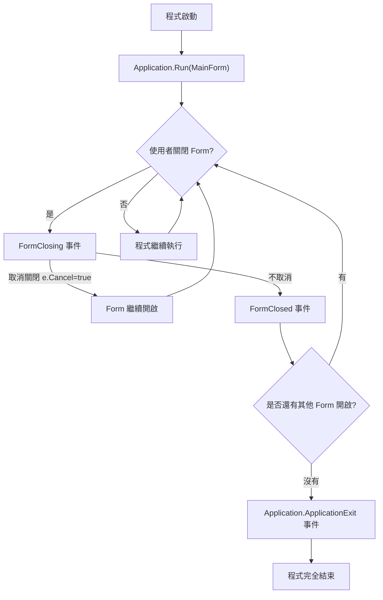
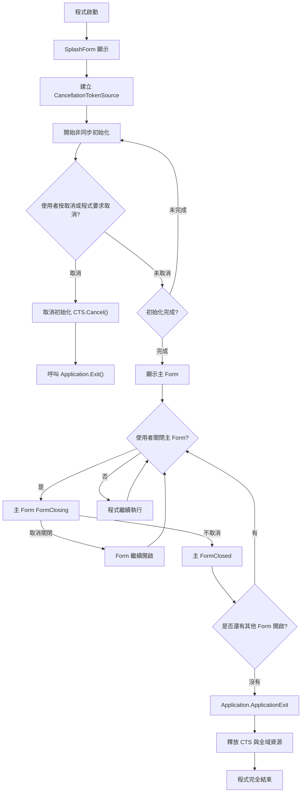

---
aliases:
date:
update:
author:
language:
sourceurl:
tags:
---

# Application.ApplicationExit 事件使用時機

`Application.ApplicationExit` 是 WinForms 應用程式中提供的一個事件，用來在整個應用程式即將結束時執行清理工作。它的觸發時機與用途如下：

## 觸發時機

- 當 WinForms 應用程式即將完全退出（所有 Form 已關閉或呼叫 `Application.Exit()`）時觸發。
- 事件會在應用程式主循環結束前觸發，也就是 `Main()` 方法結束之前。
- 無論是使用者手動關閉最後一個視窗、呼叫 `Application.Exit()`，或是系統關閉程式，事件都會被觸發。

## 使用用途

- **釋放全域資源**：釋放在程式執行期間建立的全域物件，例如檔案、資料庫連線、Socket。
- **保存應用程式狀態**：例如最後一次的使用者設定、視窗大小位置、暫存資料。
- **紀錄日誌**：程式退出前做最後的日誌紀錄。
- **其他清理工作**：例如停止背景執行緒、定時器、取消非同步作業等。

## 注意事項

- 不適合做耗時的操作，因為應用程式正在退出，耗時過久可能導致程式卡住或被系統強制結束。
- 事件中不能阻止程式退出（不像 `FormClosing` 可以透過 `e.Cancel` 取消關閉）。
- 如果有多個 Form 訂閱了此事件，它們都會依序被呼叫。

## 簡單範例

```csharp
using System;
using System.Windows.Forms;

static class Program
{
    [STAThread]
    static void Main()
    {
        Application.EnableVisualStyles();
        Application.SetCompatibleTextRenderingDefault(false);

        Application.ApplicationExit += OnApplicationExit;

        Application.Run(new MainForm());
    }

    private static void OnApplicationExit(object sender, EventArgs e)
    {
        // 釋放資源
        Console.WriteLine("程式即將退出，執行清理工作");
    }
}
```

簡單來說，`Application.ApplicationExit` 是全局應用程式退出前的最後清理事件，適合做「程式整體性資源清理」或「最後紀錄」的工作，而非操作 UI 或阻止關閉。

## FormClosing、FormClosed、ApplicationExit 事件比較表

|事件|觸發時機|是否可取消|使用場合|注意事項|
|---|---|---|---|---|
|**FormClosing**|Form 嘗試關閉時（使用者按 X 或程式呼叫 `Close()`）|可以 (`e.Cancel = true`)|檢查資料是否已儲存、確認使用者是否要關閉、取消關閉|只針對單一 Form，有可能不會結束整個應用程式（其他 Form 還在）|
|**FormClosed**|Form 已完全關閉後|不可取消|釋放 Form 特有資源、UI 元件清理|只針對單一 Form，應用程式可能仍在執行|
|**Application.ApplicationExit**|應用程式即將退出（所有 Form 關閉或呼叫 `Application.Exit()`）|不可取消|釋放全域資源、儲存全域設定、紀錄日誌|不適合做耗時操作，無法操作 UI（因為主窗已關閉）|

## 使用建議

- **單一 Form 資源清理** → 用 `FormClosed`。
- **使用者資料檢查或阻止關閉** → 用 `FormClosing`。
- **整個應用程式全域清理** → 用 `Application.ApplicationExit`。

## WinForms FormClosing / FormClosed / ApplicationExit 事件流程圖



### 說明

- `FormClosing` 可以取消關閉，通常用於提示使用者或儲存資料。
- `FormClosed` 已關閉 Form，釋放該 Form 的資源。
- `ApplicationExit` 是整個應用程式退出前的全局事件，適合做最後清理工作。
- 若應用程式還有其他 Form 開啟，退出流程不會到 `ApplicationExit`。

## WinForms 多 Form / Splash 情境下事件流程圖 + CTS 取消流程事件圖



### 說明

- **CancellationTokenSource (CTS)**
    - 在 Splash 初始化階段建立，用於可取消的非同步初始化工作。
    - 若使用者按取消，呼叫 `CTS.Cancel()` 並直接觸發 `Application.Exit()`。
- **SplashForm**
    - 顯示初始化進度，完成後才顯示主 Form。
    - 按取消可終止初始化。
- **Main Form**
    - 仍遵循 `FormClosing` / `FormClosed` 流程。
- **ApplicationExit**
    - 是程式退出的最後清理點，用於釋放 CTS、停止背景工作、全域資源清理。

這個流程圖完整呈現了 **非同步初始化 + Splash + 主 Form + CTS 取消 + ApplicationExit** 的整體流程，方便設計 WinForms 程式的退出邏輯與資源管理。

## WinForms 初始化 + 背景工作 + CTS + Splash + 主 Form + ApplicationExit 完整流程時間軸 (Mermaid)

```mermaid
gantt
    title WinForms 初始化與退出完整流程
    dateFormat  HH:mm:ss
    axisFormat  %H:%M:%S

    section 程式啟動
    程式啟動                  :a1, 00:00:00, 1s
    Splash 顯示                 :a2, after a1, 1s
    建立 CTS                   :a3, after a2, 0.5s

    section 初始化 (可取消)
    非同步初始化開始             :b1, after a3, 5s
    使用者可能按取消             :b2, after b1, 0.5s
    初始化完成                   :b3, after b1, 0s

    section 背景工作
    背景工作啟動                 :c1, after b3, 6s
    背景工作執行                 :c2, after c1, 5s
    背景工作完成                 :c3, after c2, 0s

    section 主 Form
    顯示主 Form                  :d1, after b3, 1s
    FormClosing 事件             :d2, after d1, 0.5s
    FormClosed 事件              :d3, after d2, 0.5s

    section 程式退出
    檢查其他 Form 是否開啟         :e1, after d3, 0.1s
    ApplicationExit 事件         :e2, after e1, 0.5s
    停止背景工作 & 釋放 CTS      :e3, after e2, 0.5s
    釋放全域資源                :e4, after e3, 0.5s
    程式完全結束                :e5, after e4, 0s
```



### 說明

- **Splash + CTS**：在初始化期間建立 CTS，使用者可按取消中斷初始化，觸發 `Application.Exit()`。
- **非同步初始化**：可被取消，也可以完成後顯示主 Form。
- **背景工作**：例如資料讀取、定時任務，可在初始化完成後啟動。
- **主 Form**：依照 `FormClosing` / `FormClosed` 事件邏輯。
- **ApplicationExit**：程式退出前的全局清理，包括停止背景工作、釋放 CTS、釋放全域資源。
- 時間軸可視化事件順序及任務重疊情況，方便規劃非同步流程與退出策略。

這張圖可以完整呈現 WinForms 從啟動 → Splash/初始化 → 背景工作 → 主 Form → 退出的整體流程。
