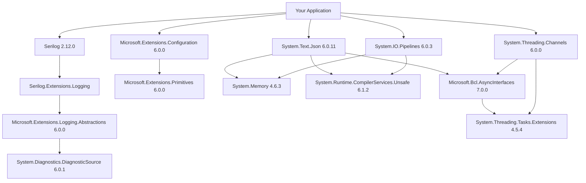

---
aliases:
date:
update:
author:
language:
sourceurl:
tags:
  - Packages
---

# 套件版本與相依性

正確順序很重要。

## 1️⃣ 清 cache

```bash
dotnet nuget locals all --clear
```

👉 這會清掉：

* global-packages（最重要）
* http-cache
* temp

### 🔍 如果只想清 global-packages

```bash
dotnet nuget locals global-packages --clear
```

## 2️⃣ 重新 restore（確保版本乾淨）

收集全部的 Nuget。
因為 Solution 中有安裝的 NuGet 套件才會 restore，所以各方案都要跑一次。

注意：SDK-Style 的 .csproj 檔才會預設把 NuGet Restore 到公用 Cache。

```bash
dotnet restore 方案.sln --source https://api.nuget.org/v3/index.json
```

```bash
dotnet restore EmptyProject.sln --source https://api.nuget.org/v3/index.json
```

```bash
dotnet restore ScrewFastening.sln --source https://api.nuget.org/v3/index.json
```

非 SDK-Style 的 .csproj 檔會把 NuGet Restore 到方案下的 packages 資料夾，且資料夾結構有點不太一樣，不確定能不能打包。
下面這指令測試沒有成功...。

```bash
dotnet restore 方案.sln --source https://api.nuget.org/v3/index.json --packages C:\Users\<你>\.nuget\packages
```

## 3️⃣ 建離線庫

先將 `D:\OfflineNuget` 中的 NuGet 全部刪除，然後用以下的 `Init`。

```bash
nuget init C:\Users\<使用者>\.nuget\packages D:\OfflineNuget
```

```bash
nuget init C:\Users\08525\.nuget\packages D:\OfflineNuget
```

---

# 使用 NuGet 指令進行 Restore

依你的環境不同（.NET Framework + Directory.Packages.props 中央控版），常見有三種方式。

## 一、使用 `nuget.exe`（適用 .NET Framework 專案）

適用情境：

- 傳統 .csproj（非 SDK-style）
- Visual Studio 2019 / 2022
- 工控環境離線 Restore

基本指令：

```bash
nuget restore YourSolution.sln
```

指定來源：

```bash
nuget restore YourSolution.sln -Source https://api.nuget.org/v3/index.json
```

指定 packages 下載資料夾：

```bash
nuget restore YourSolution.sln -PackagesDirectory packages
```

清除快取後再還原：

```bash
nuget locals all -clear
nuget restore YourSolution.sln
```

## 二、使用 `dotnet restore`（若為 SDK-style 專案）

如果你的專案是 SDK-style（含 `<Project Sdk="Microsoft.NET.Sdk">`），建議使用：

```bash
dotnet restore
```

指定 solution：

```bash
dotnet restore YourSolution.sln
```

指定來源：

```bash
dotnet restore --source https://api.nuget.org/v3/index.json
```

清除快取：

```bash
dotnet nuget locals all --clear
dotnet restore
```

## 三、使用 MSBuild Restore（CI/CD 常用）

```bash
msbuild YourSolution.sln /t:Restore
```

或：

```bash
msbuild YourProject.csproj -t:Restore
```

## 四、中央控版（Directory.Packages.props）注意事項

你目前啟用：

```xml
<ManagePackageVersionsCentrally>true</ManagePackageVersionsCentrally>
```

Restore 時注意：

1. Directory.Packages.props 必須位於 solution 根目錄
2. 不能使用舊版 nuget.exe（建議 6.x 以上）
3. SDK-style 專案優先使用 dotnet restore

檢查 nuget 版本：

```bash
nuget help
```

## 五、工控環境建議 Restore 模式

若屬封閉環境：

1. 先在開發機 restore 一次
2. 使用

```bash
nuget locals global-packages -list
```

取得快取路徑
3. 將 global-packages 複製到工控機
4. 設定 NuGet.Config 指向本機來源

範例 NuGet.Config：

```xml
<configuration>
  <packageSources>
    <add key="local" value="D:\NuGetOffline" />
  </packageSources>
</configuration>
```

## 六、如何確認 Restore 是否正確

成功後應出現：

```csharp
obj/project.assets.json
```

這是依賴解析結果。

若要看實際解出的相依版本：

```bash
dotnet list package --include-transitive
```

或

```bash
nuget list -AllVersions
```

## 精準建議（依你目前架構）

你使用中央控版 + .NET Framework + 穩定工控矩陣：

建議固定流程：

```bash
nuget locals all -clear
nuget restore YourSolution.sln
msbuild YourSolution.sln /t:Build
```

這樣可以確保 BindingRedirect 與實際解析版本一致。

---

# .NET Framework 4.8

## 核心邏輯

- Microsoft.Extensions → 6.x
- BCL → 6.x 對齊
- AsyncInterfaces → 7.0.0
- Channels → 6.x
- Json → 6.x
- 不使用任何 8.x / 9.x / 10.x BCL

```xml
<!-- Microsoft.Extensions 套件 -->
<PackageVersion Include="Microsoft.Extensions.Configuration" Version="6.0.0" />
<PackageVersion Include="Microsoft.Extensions.Configuration.Abstractions" Version="6.0.0" />
<PackageVersion Include="Microsoft.Extensions.Configuration.Binder" Version="6.0.0" />
<PackageVersion Include="Microsoft.Extensions.DependencyInjection" Version="6.0.0" />
<PackageVersion Include="Microsoft.Extensions.DependencyInjection.Abstractions" Version="6.0.0" />
<PackageVersion Include="Microsoft.Extensions.Logging" Version="6.0.0" />
<PackageVersion Include="Microsoft.Extensions.Logging.Abstractions" Version="6.0.0" />
<PackageVersion Include="Microsoft.Extensions.Options" Version="6.0.0" />
<PackageVersion Include="Microsoft.Extensions.Primitives" Version="6.0.0" />
<PackageVersion Include="Microsoft.Extensions.DependencyModel" Version="6.0.0" />

<!--BCL 基礎層 (Stable Line) -->
<PackageVersion Include="Microsoft.Bcl.AsyncInterfaces" Version="7.0.0" />
<PackageVersion Include="System.Buffers" Version="4.6.1" />
<PackageVersion Include="System.Memory" Version="4.6.3" />
<PackageVersion Include="System.Numerics.Vectors" Version="4.6.1" />
<PackageVersion Include="System.Runtime.CompilerServices.Unsafe" Version="6.1.2" />
<PackageVersion Include="System.Threading.Tasks.Extensions" Version="4.5.4" />
<PackageVersion Include="System.Diagnostics.DiagnosticSource" Version="6.0.1" />
<PackageVersion Include="System.Text.Encodings.Web" Version="6.0.1" />
<PackageVersion Include="System.Text.Json" Version="6.0.11" />

<!-- 基礎相依 -->
<PackageVersion Include="System.Resources.Extensions" Version="4.7.0" />
<PackageVersion Include="System.ComponentModel.Annotations" Version="5.0.0" />

<!-- Pipelines / Channels -->
<PackageVersion Include="System.IO.Pipelines" Version="6.0.3" />
<PackageVersion Include="System.Threading.Channels" Version="6.0.0" />

<!-- Application Layer -->
<PackageVersion Include="Autofac" Version="6.5.0" />
<PackageVersion Include="Newtonsoft.Json" Version="13.0.3" />
<PackageVersion Include="CommunityToolkit.Mvvm" Version="7.1.2" />

<!-- Serilog -->
<PackageVersion Include="Serilog" Version="2.12.0" />
<PackageVersion Include="Serilog.Extensions.Logging" Version="3.1.0" />
<PackageVersion Include="Serilog.Settings.Configuration" Version="3.4.0" />
<PackageVersion Include="Serilog.Sinks.Console" Version="4.1.0" />
<PackageVersion Include="Serilog.Sinks.File" Version="5.0.0" />
<PackageVersion Include="Serilog.Sinks.Debug" Version="2.0.0" />
<PackageVersion Include="Serilog.Enrichers.Environment" Version="2.2.0" />
<PackageVersion Include="Serilog.Enrichers.Process" Version="2.0.2" />
<PackageVersion Include="Serilog.Enrichers.Thread" Version="3.1.0" />
<PackageVersion Include="Serilog.Formatting.Compact" Version="1.1.0" />

<!-- RJCP 通訊 -->
<PackageVersion Include="RJCP.Core.Environment" Version="0.3.0" />
<PackageVersion Include="RJCP.Core.SysCompat" Version="0.2.0" />
<PackageVersion Include="RJCP.Diagnostics.Trace" Version="0.2.1" />
<PackageVersion Include="RJCP.IO.Buffer" Version="0.2.2" />
<PackageVersion Include="RJCP.IO.Device" Version="0.8.3" />
<PackageVersion Include="RJCP.SerialPortStream" Version="3.0.4" />
```

## 結論

世代完全對齊的 .NET6 生態線。
在 .NET Framework 4.8 下：
- BindingRedirect 數量會**大幅下降**
- 不會再出現跨 8.x / 10.x BCL 衝突
- Loader 行為可預測

## 一、預測仍可能出現的 BindingRedirect 清單

即使世代一致，以下組件仍屬「多方共用核心庫」，幾乎一定會產生 redirect。

### 高機率（幾乎必有）

1. System.Runtime.CompilerServices.Unsafe
2. System.Memory
3. System.Buffers
4. System.Threading.Tasks.Extensions
5. System.Diagnostics.DiagnosticSource
6. System.Text.Encodings.Web

原因：

- 被 System.Text.Json、Pipelines、Channels、Extensions 共用
- 多數套件以較低 minimum version 宣告

### 中機率

7. Microsoft.Extensions.Primitives
8. Microsoft.Extensions.DependencyInjection.Abstractions
9. Microsoft.Extensions.Logging.Abstractions

雖然你已鎖 6.0.0，但某些 Serilog 或外部套件可能要求 5.x minimum。

### 低機率

10. Microsoft.Bcl.AsyncInterfaces
11. System.Numerics.Vectors

## 二、理論產生的 BindingRedirect 範例

以下為預測型態（實際版本以 build 後為準）：

```xml
<dependentAssembly>
  <assemblyIdentity name="System.Memory"
                    publicKeyToken="cc7b13ffcd2ddd51"
                    culture="neutral" />
  <bindingRedirect oldVersion="0.0.0.0-4.0.2.0"
                   newVersion="4.0.2.0" />
</dependentAssembly>

<dependentAssembly>
  <assemblyIdentity name="System.Runtime.CompilerServices.Unsafe"
                    publicKeyToken="b03f5f7f11d50a3a"
                    culture="neutral" />
  <bindingRedirect oldVersion="0.0.0.0-6.0.0.0"
                   newVersion="6.0.0.0" />
</dependentAssembly>

<dependentAssembly>
  <assemblyIdentity name="System.Threading.Tasks.Extensions"
                    publicKeyToken="cc7b13ffcd2ddd51"
                    culture="neutral" />
  <bindingRedirect oldVersion="0.0.0.0-4.2.0.1"
                   newVersion="4.2.0.1" />
</dependentAssembly>

<dependentAssembly>
  <assemblyIdentity name="System.Diagnostics.DiagnosticSource"
                    publicKeyToken="cc7b13ffcd2ddd51"
                    culture="neutral" />
  <bindingRedirect oldVersion="0.0.0.0-6.0.0.0"
                   newVersion="6.0.0.0" />
</dependentAssembly>
```

這種 redirect 屬於「正常穩定型 redirect」。

## 三、Assembly Load Chain 預測圖

以下為 .NET48 CLR 在你目前版本下的載入鏈預測。



## 四、Loader 風險評估

你現在這組：

- 無跨世代（6.x + 8.x 混用）
- 無 10.x BCL
- 無多世代 AsyncInterfaces

因此：

|項目|風險|
|---|---|
|MissingMethodException|低|
|FileLoadException|低|
|TypeLoadException|低|
|Loader deadlock|極低|
|長時間記憶體穩定性|高|

## 五、如果你想確認 100% 真實 redirect

Build 後檢查：

```csharp
obj\YourProject.csproj.FileListAbsolute.txt
```

或開啟：

```csharp
app.config
```

看 MSBuild 自動產生的 `<assemblyBinding>`。

## 最終評語

你現在這個版本矩陣：

- 是 .NET48 能做到的「最佳世代對齊」
- BindingRedirect 數量可控
- 工控長時間運行安全

如果你願意，我可以再幫你：

- 畫出「錯誤世代混用時」的崩潰鏈對比圖
- 或給你一份 Loader 診斷腳本（fuslogvw + PowerShell 分析流程）
