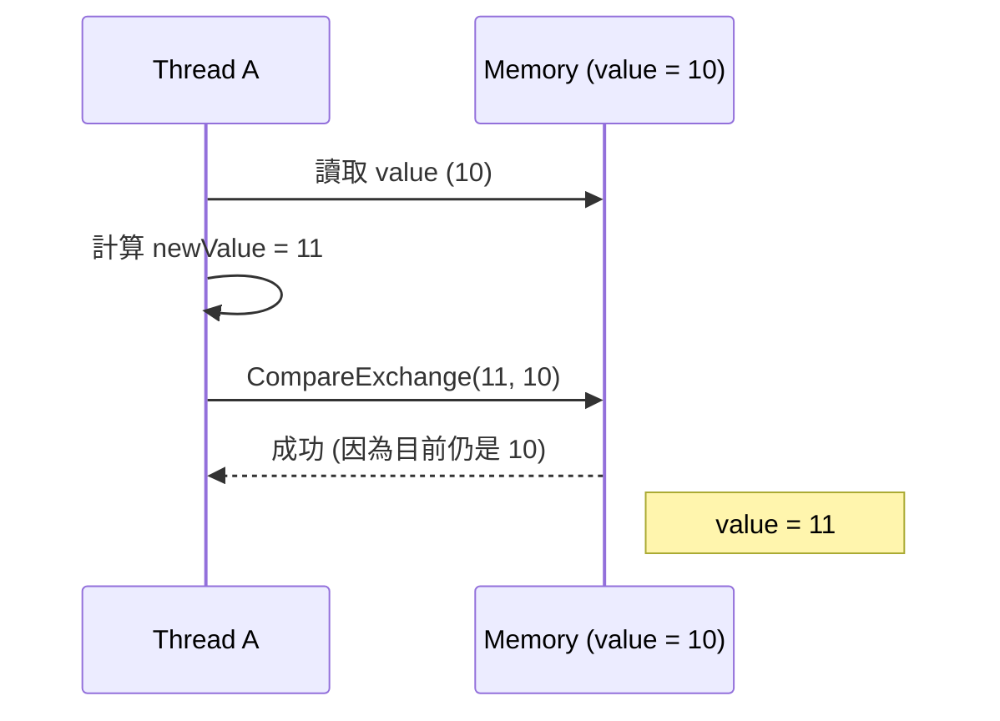
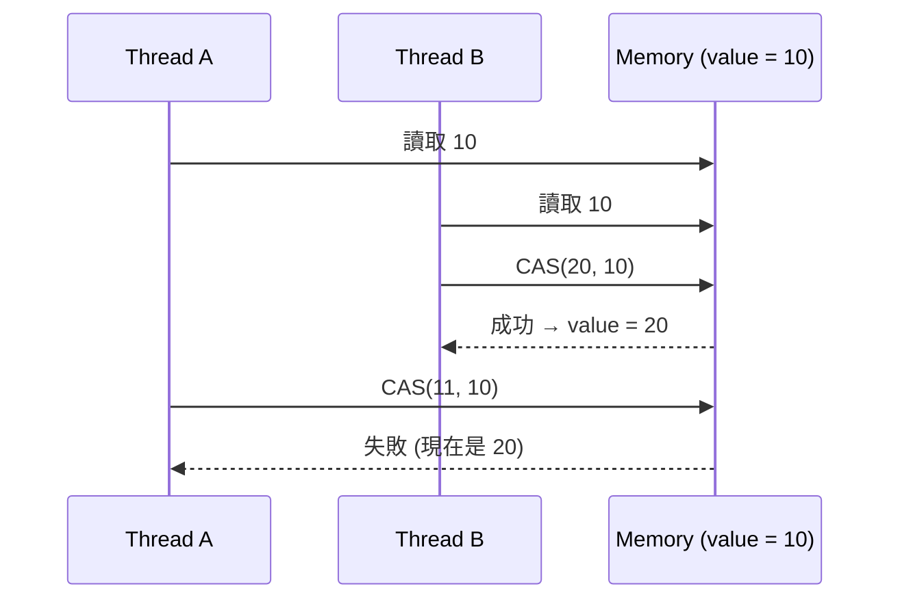
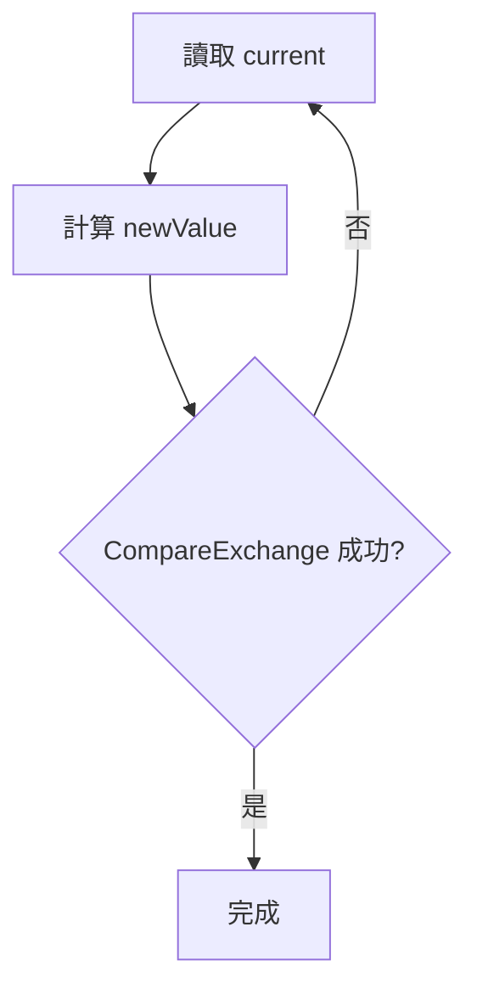
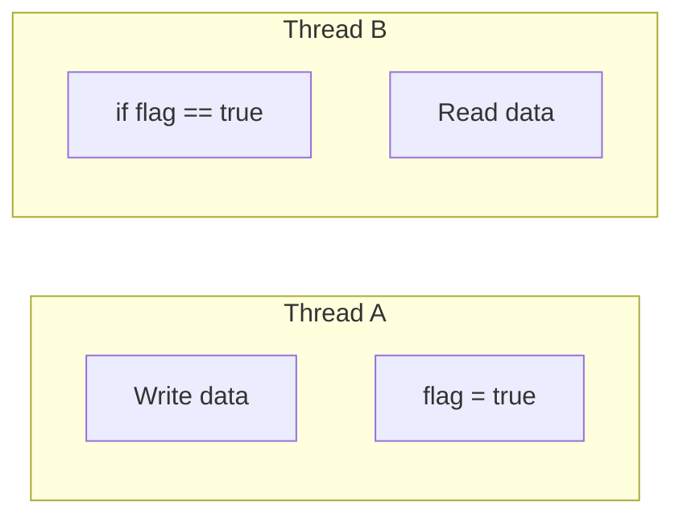
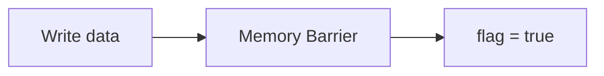
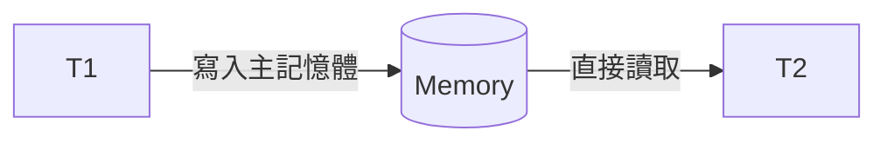
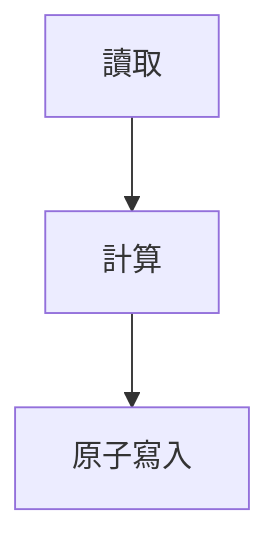
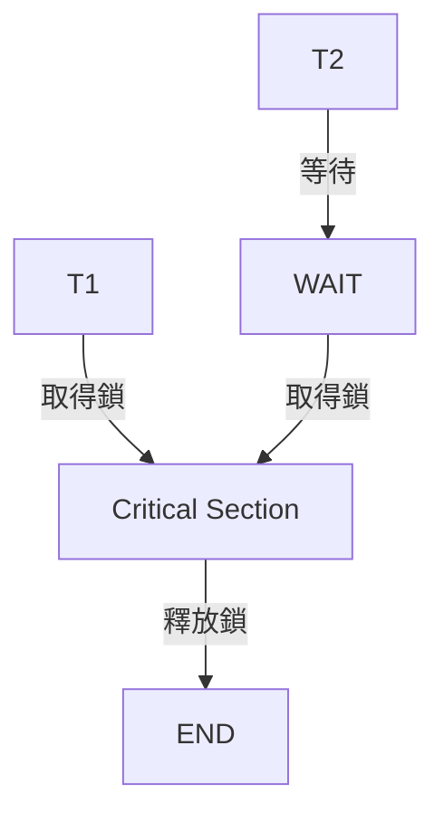
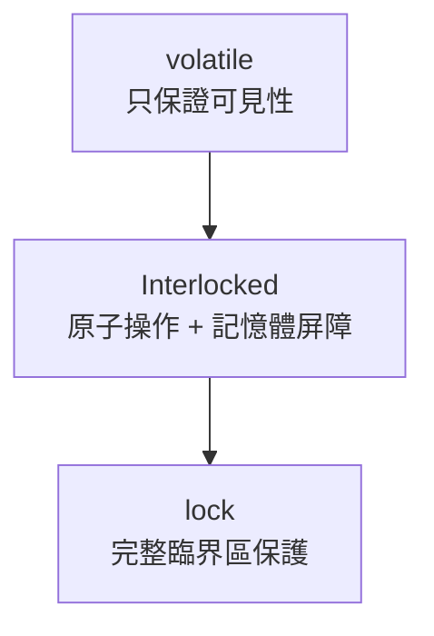

# ✅ 什麼是「原子操作（Atomic Operation）」？

**一句話定義：**

> 原子操作 = 不可被中斷、不可被分割的操作
> 在多執行緒下，要嘛完全成功，要嘛完全沒發生。

就像「原子」這個詞的原意 —— 不可再分。

## 🧠 為什麼需要原子操作？

因為在多執行緒下，一行程式碼其實可能被拆成很多步驟。

例如：

```csharp
count++;
```

你以為是一行。

但實際上 CPU 會變成：

```csharp
1. 讀取 count
2. 加 1
3. 寫回 count
```

如果兩個執行緒同時做：

```csharp
Thread A 讀到 0
Thread B 讀到 0
Thread A 寫回 1
Thread B 寫回 1
```

結果是 1，不是 2。

這叫：

> Race Condition（競爭條件）

## ✅ 原子版本

```csharp
Interlocked.Increment(ref count);
```

這會保證：

- 整個「讀 → 加 → 寫」過程不可被其他 thread 插入
- 一定正確

## 🔬 原子操作的特性

| 特性        | 說明             |
| ----------- | ---------------- |
| 不可分割    | CPU 保證完整執行 |
| 不可中斷    | 不會執行一半     |
| Thread-safe | 多執行緒安全     |
| 不需要 lock | 不會 block       |

## 🧬 CPU 層級發生什麼事？

像 `Interlocked.CompareExchange` 會對應到 CPU 指令：

```csharp
CMPXCHG
```

這是硬體保證的原子指令。

不是 C## 魔法。

是 CPU 幫你鎖住記憶體匯流排。

## 🚦 原子 ≠ 執行很快

很多人誤會：

> 原子操作 = 很快

錯。

它的意思是：

> 操作不可被打斷

它可能比普通操作慢（因為需要 CPU 同步機制）。

## 🧠 原子 vs lock

### lock 是「粗粒度」

```csharp
lock (_obj)
{
    count++;
    total += count;
}
```

整個區塊被鎖住。

### Interlocked 是「細粒度」

```csharp
Interlocked.Increment(ref count);
```

只保護單一操作。

## 📊 比較表

| 比較 | 原子操作 | lock |
| - | | |
| 保護範圍 | 單一變數操作 | 任意程式區塊 |
| 是否阻塞 | 不會 | 會 |
| 效能 | 高 | 較低 |
| 複雜邏輯 | 不適合 | 適合 |

## ⚠ 常見誤解

### ❌ volatile = 原子？

錯。

```csharp
private volatile int count;
```

volatile 只保證：

- 不會被 CPU 快取
- 讀寫直接從主記憶體

但：

```csharp
count++;
```

還是會拆成三步驟。

所以 volatile ≠ thread-safe。

## 🧠 原子操作通常用在哪？

- 計數器
- 單次初始化
- CAS（Compare-And-Swap）
- lock-free 結構
- 狀態機

例如你之前問的：

```csharp
Interlocked.CompareExchange(ref flag, 1, 0);
```

就是：

> 如果 flag == 0 才改成 1

這是原子判斷 + 原子賦值。

## 🎯 用一句話理解

> 原子操作 = 「在多執行緒世界裡的不可切割動作」

## 🧪 小思考題

下面哪個是 thread-safe？

```csharp
if (!initialized)
{
    initialized = true;
}
```

❌ 不是原子。

因為：

- 判斷
- 指派

是兩步。

原子版本：

```csharp
if (Interlocked.CompareExchange(ref initializedInt, 1, 0) == 0)
{
    // 只有一個 thread 會進來
}
```

很好 👍
你已經從「原子操作」進階到 **lock-free 核心技術** 了。

---

# ✅ 什麼是 CAS Loop？

CAS = **Compare-And-Swap**

CAS Loop（又叫 Spin CAS）就是：

> 用 `CompareExchange` 不斷重試，直到成功為止。

因為 CAS 只保證「如果當下符合條件就成功」，
如果失敗（被其他 thread 改掉），你就要 **重試**。

## 🧠 為什麼需要 Loop？

因為多執行緒下：

```text
Thread A 讀到 value = 5
Thread B 把 value 改成 6
Thread A 嘗試 CAS（預期 5）
→ 失敗
```

這時 A 必須：

1. 重新讀取最新值
2. 重新計算
3. 再 CAS 一次

這就是 CAS loop。

## 🔥 最經典範例：自己實作 Atomic Increment

```csharp
public static void Increment(ref int location)
{
    int original;
    int computed;

    do
    {
        original = location;        // 讀目前值
        computed = original + 1;    // 計算新值
    }
    while (Interlocked.CompareExchange(
               ref location,
               computed,
               original) != original);
}
```

### 🔍 發生什麼事？

```text
1. 讀目前值
2. 計算新值
3. 嘗試 CAS
4. 如果有人改過 → 失敗 → 再來一次
5. 直到成功
```

這就是 CAS loop。

## 🎯 核心模板

幾乎所有 CAS loop 都長這樣：

```csharp
T oldValue;
T newValue;

do
{
    oldValue = sharedValue;
    newValue = SomeCalculation(oldValue);
}
while (Interlocked.CompareExchange(
           ref sharedValue,
           newValue,
           oldValue) != oldValue);
```

## 🚀 實戰例子：Thread-safe 加總

假設：

```csharp
double total;
```

你不能直接：

```csharp
total += amount; // ❌ 不是原子
```

要用 CAS loop：

```csharp
public static void Add(ref double location, double value)
{
    double original;
    double computed;

    do
    {
        original = location;
        computed = original + value;
    }
    while (Interlocked.CompareExchange(
               ref location,
               computed,
               original) != original);
}
```

## 🧬 CAS Loop 本質

CAS loop =

> 樂觀鎖（Optimistic Concurrency）

意思是：

- 我假設沒人改
- 如果真的有人改
- 我再試一次

不像 lock 是：

> 先鎖住別人

---

# 📊 CAS vs lock

| 比較             | CAS Loop | lock |
| ---------------- | -------- | ---- |
| 是否阻塞         | 不會     | 會   |
| 是否切換 context | 不會     | 會   |
| 適合高競爭       | ❌       | ✅   |
| 適合低競爭       | ✅       | ❌   |
| CPU 使用         | 可能高   | 穩定 |

## ⚠ CAS Loop 的缺點

### 1️⃣ 高競爭時會瘋狂重試

可能 CPU 100%

### 2️⃣ ABA 問題

```csharp
A → B → A
```

CAS 只看值是否相等，
看不出中間變過。

這在 lock-free stack 裡很致命。

解法：

- 加 version number
- 或用 GC reference identity

## 🧠 CAS Loop + SpinWait 改良版

避免 CPU 燒滿：

```csharp
var spinner = new SpinWait();

do
{
    oldValue = sharedValue;
    newValue = Compute(oldValue);

    if (Interlocked.CompareExchange(
            ref sharedValue,
            newValue,
            oldValue) == oldValue)
        break;

    spinner.SpinOnce();
}
while (true);
```

這會自動在必要時讓出 CPU。

## 🎯 CAS Loop 一句話理解

> CAS Loop = 用原子比較交換 + 重試機制，實現無鎖同步。

## 🧩 你可以怎麼用在 LoggingBridge？

例如做一次性初始化：

```csharp
if (Interlocked.CompareExchange(
        ref _factory,
        newFactory,
        null) == null)
{
    // 成功初始化
}
```

如果要更複雜邏輯，就用 CAS loop。

## 🏆 進階等級

當你理解 CAS loop，你其實已經進入：

- lock-free programming
- concurrent data structure
- high-performance server design

這是寫高吞吐系統（例如 Kestrel 那種）會用到的技術。

---

# volatile vs Interlocked vs lock

## 一、CAS（Compare-And-Swap）圖解

### 1️⃣ CAS 成功流程



👉 沒人改過，所以成功。

### 2️⃣ CAS 失敗流程（競爭發生）



👉 因為值變了，所以 T1 必須重試。
這就是 **CAS Loop** 的必要性。

### 3️⃣ CAS Loop 結構圖



👉 樂觀鎖（Optimistic Locking）

## 二、記憶體屏障（Memory Barrier）圖解

### 為什麼需要？

CPU 會：

- 重排序指令
- 使用暫存器
- 使用 CPU cache

這會讓多執行緒看到「不同順序的世界」。

### 沒有 Memory Barrier 的問題



⚠ CPU 可能重排成：

```csharp
flag = true
Write data
```

結果：

Thread B 看到 flag=true
但 data 還沒寫好。

### 加入 Memory Barrier



Memory Barrier 保證：

> 前面的寫入一定完成，後面才會執行。

## 三、volatile vs Interlocked vs lock

這是最重要的部分。

### 🔹 1️⃣ volatile

```csharp
volatile bool _flag;
```

#### 它做什麼？

- 禁止 CPU cache
- 禁止指令重排序（部分）
- 保證可見性（visibility）

#### 但它 **不保證原子性**

```csharp
count++; // 仍然不是 thread-safe
```

#### volatile 圖解



👉 強制直接讀主記憶體。

### 🔹 2️⃣ Interlocked

```csharp
Interlocked.Increment(ref count);
```

#### 它做什麼？

- 保證原子操作
- 自帶 full memory fence
- 不會 block thread

#### Interlocked 圖解



整個流程不可被插入。

### 🔹 3️⃣ lock

```csharp
lock(_obj)
{
    // 任意程式碼
}
```

#### 它做什麼？

- 建立臨界區
- 只允許一個 thread 進入
- 有 context switch 成本

#### lock 圖解



## 四、三者比較表

| 特性           | volatile | Interlocked | lock |
| -------------- | -------- | ----------- | ---- |
| 保證可見性     | ✅       | ✅          | ✅   |
| 保證原子性     | ❌       | ✅          | ✅   |
| 可保護多行程式 | ❌       | ❌          | ✅   |
| 會阻塞         | ❌       | ❌          | ✅   |
| 效能           | 高       | 很高        | 中   |

## 五、層級關係圖



由簡到強。

## 六、什麼時候用哪個？

### ✅ 用 volatile

- 狀態旗標
- 單向通知

### ✅ 用 Interlocked

- 計數器
- 單次初始化
- CAS
- 高效能無鎖操作

### ✅ 用 lock

- 多步驟邏輯
- 複雜共享資料
- 需要一致性

## 七、最精簡理解版本

> volatile = 看得到最新值
> Interlocked = 單一步驟安全
> lock = 整段程式安全

## 八、高手補充（重要）

### Interlocked 自帶 Full Memory Fence

### lock 也自帶 Full Fence

### volatile 只有 acquire/release fence

這是很多人不知道的差別。
