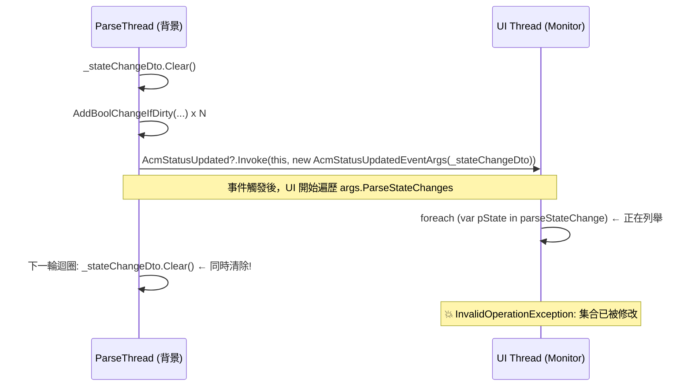
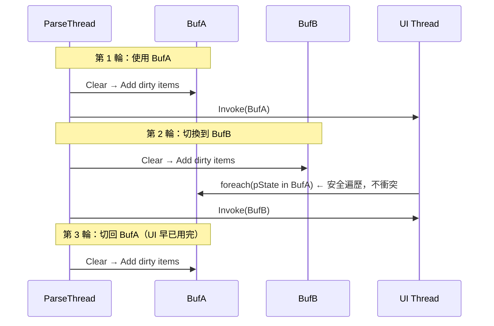

# 關於 Polling 和 UI 共用 Buffer 造成「集合已被修改」異常

## 問題分析

你遇到的是典型的 「Collection was modified; enumeration operation is not permitted」 例外。讓我分析根本原因。

### 根因：`_stateChangeDto` 共用且無同步保護

問題出在 `_stateChangeDto` 這個 `List<ParseStateChange>` 的生命週期與使用方式：



## 具體問題點

### `_stateChangeDto` 是欄位級別的共用實例

```csharp
// AcmService_Polling.cs — 欄位
private List<ParseStateChange> _stateChangeDto = new List<ParseStateChange>();
```

每次迴圈都對同一個 List 做 Clear() → Add() → Invoke，但 Invoke 傳出去的是同一個參考。

### `AcmStatusUpdatedEventArgs` 持有的是同一個參考

`AcmStatusUpdated?.Invoke(this, new AcmStatusUpdatedEventArgs(_stateChangeDto))` — 這裡雖然 new 了一個 EventArgs，但裡面裝的 List 仍是 `_stateChangeDto` 本身，不是複本。

### UI 訂閱者在不同執行緒遍歷

`Monitor.OnAcmStatusUpdated` 中：

```csharp
foreach (var pState in parseStateChange)  // ← 遍歷中
```

此時 ParseThread 的下一輪迴圈已經呼叫 `_stateChangeDto.Clear()`，導致正在被 foreach 的集合被修改。

## 修正方式

最直接的修正：每次派送時建立新的 List，而非重複使用同一個實例。

### 變更說明

唯一的修改是將原本的：

```csharp
_stateChangeDto.Clear();
```

改為：

```csharp
_stateChangeDto = new List<ParseStateChange>();
```

為什麼這樣就夠了？

| 方案                  | 說明                                                                                                    |
| --------------------- | ------------------------------------------------------------------------------------------------------- |
| `new List<>()` (採用) | 每輪建立新 List，已派送出去的舊 List 由 UI 端獨佔遍歷，不會再被修改。零 lock、零阻塞。                  |
| `lock`                | 需要在 `ParseProc` 和 `Monitor.OnAcmStatusUpdated` 兩端都加鎖，會讓 UI 與背景執行緒互相等待，增加延遲。 |
| `ToList()` 複本       | 在 Invoke 前做 `new AcmStatusUpdatedEventArgs(_stateChangeDto.ToList())` 也可行，但多一次複製。         |

採用 new List 的方式最簡潔，且因為每輪的 dirty 項目數量不多（通常 < 50），GC 壓力可忽略不計。其他模組（如 USB4704）若有相同模式，也建議一併修正。

## 效能影響分析

在你的場景下，new List 的效能影響微乎其微，不需要擔心。以下是具體分析：

### 為什麼影響可忽略

| 因素             | 你的情況                                    | 影響           |
| ---------------- | ------------------------------------------- | -------------- |
| 派送頻率         | WaitOne(15) → 最快約 66 次/秒               | 非常低         |
| 每次項目數       | 只有 dirty 的才加入，通常 < 10 筆           | List 極小      |
| ParseStateChange | 是 struct，加入 List 時值複製，無 heap 分配 | 幾乎零 GC 壓力 |
| IO 裝置數        | 4 個                                        | 量級很小       |

每秒最多配置約 66 個小型 List（每個初始容量 0），對 Win7 + .NET 4.7.2 的 GC 來說完全不是負擔。
但有更好的做法：雙緩衝（零配置）
既然你非常在意效能，可以用雙緩衝交換的方式，完全避免 new：

## 雙緩衝（零配置）

核心修改只有 3 行，其餘完全不動：

### 欄位宣告（取代原本的單一 `_stateChangeDto`）

```csharp
private List<ParseStateChange> _stateChangeBufA = new List<ParseStateChange>();
private List<ParseStateChange> _stateChangeBufB = new List<ParseStateChange>();
private List<ParseStateChange> _stateChangeDto;
```

### PollingStart 初始化

```csharp
_stateChangeDto = _stateChangeBufA;
```

### ParseProc 中交換緩衝區（取代原本的 `_stateChangeDto.Clear()`）

```csharp
var sending = _stateChangeDto; // 把當前已填好的交給 UI
_stateChangeDto = (_stateChangeDto == _stateChangeBufA)
    ? _stateChangeBufB
    : _stateChangeBufA;        // 切到另一個
_stateChangeDto.Clear();       // 清空新的緩衝區開始填入
```

### 運作原理



### 為什麼這比 new List 更適合工控場景

|             | new List             | 雙緩衝                   |
| ----------- | -------------------- | ------------------------ |
| GC 配置     | 每輪 1 次 heap alloc | 零配置（啟動後永不 new） |
| GC 暫停風險 | 極低但存在           | 完全不存在               |
| 記憶體碎片  | 長時間運行可能碎片化 | 不碎片                   |
| 程式碼改動  | 1 行                 | 3 行                     |

注意：Usb4704Service_Polling.cs 中的 `_dataChangeDto` 也有完全相同的問題，建議一併用雙緩衝修正。

### 附帶前提條件

此方案成立的前提是 UI 端在下一輪 ParseProc 開始前已遍歷完。以你目前的 WaitOne(15) （15ms 間隔），WinForm UI 處理幾筆 indicator 更新只需 < 1ms，時間餘裕非常充分。
