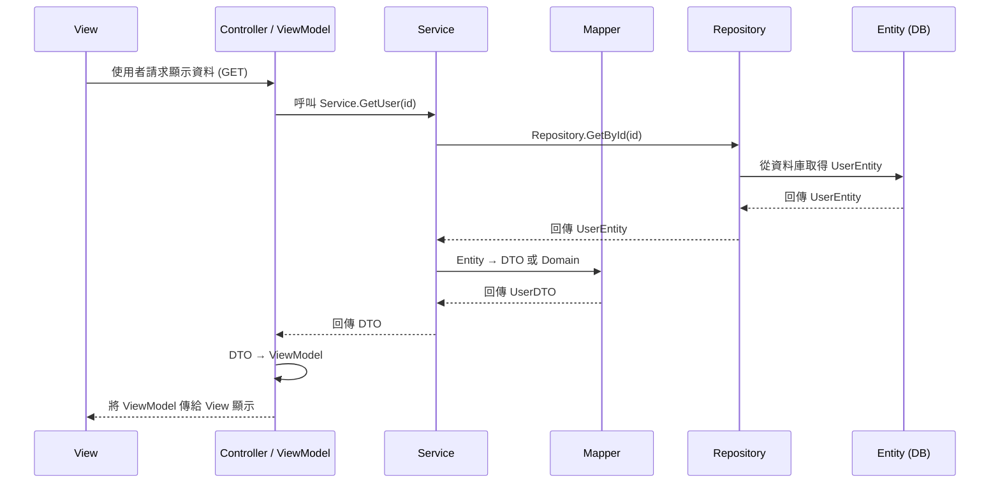
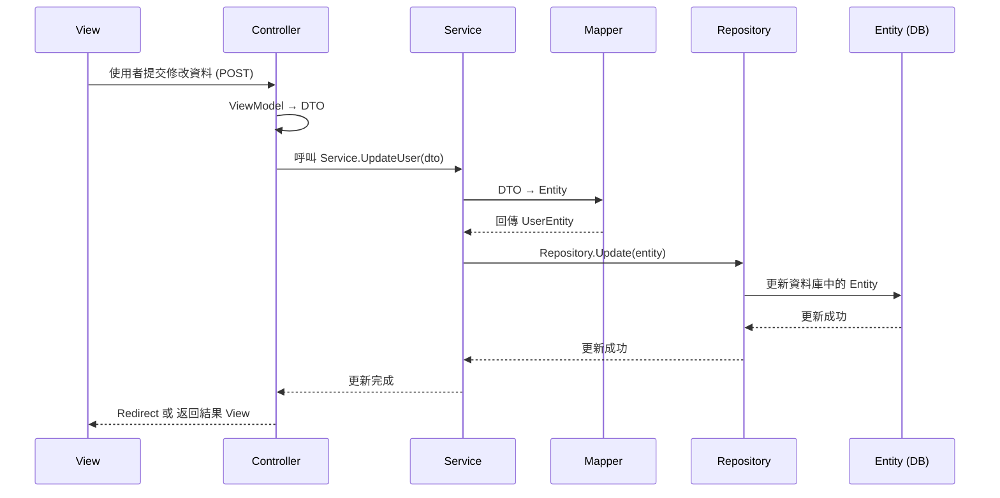
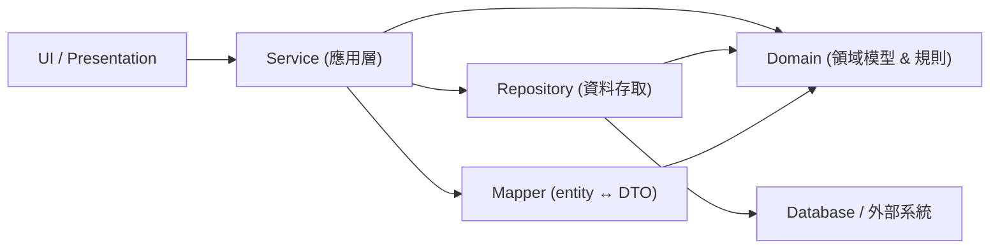
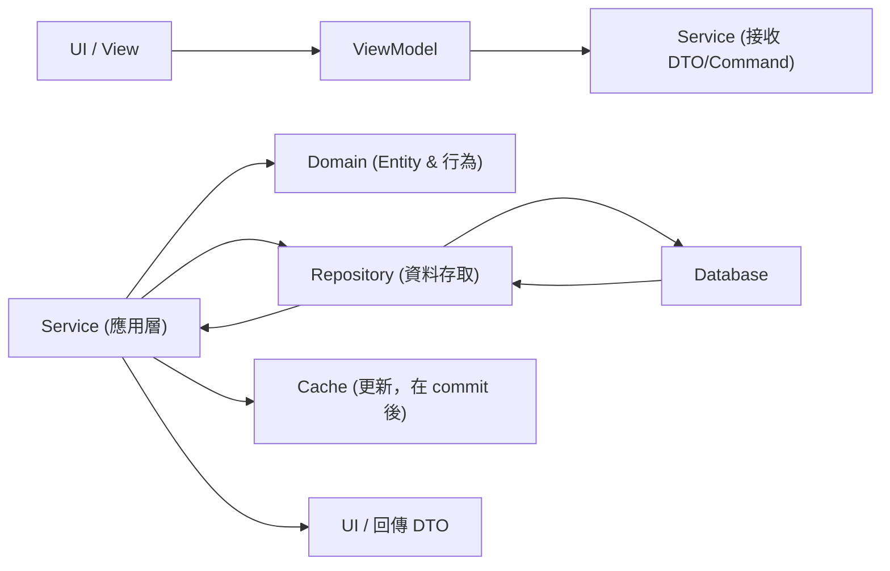

---
aliases:
date:
update:
author:
language:
sourceurl:
tags:
---

# View、ViewModel、Service、DTO、Domain、Entity、MAPPER、Repository、Cache

下面我會提供一個簡單的範例，來說明在一個典型的分層架構中，**View**、**ViewModel**、**Service**、**DTO**、**Domain**、**Entity**、**MAPPER**、**Repository**、**Cache** 之間的關聯、職責和依賴關係。

## 背景假設

假設我們正在開發一個簡單的應用程序，該應用程序需要處理用戶的資料。具體來說，該應用程序包含用戶的基本信息（例如姓名、年齡、電子郵件等）並能將這些資料顯示給使用者。

## 1. **Entity**

* **職責**: 定義資料庫中的實體結構。它直接對應於資料庫中的一張表，通常是應用程序中最基礎的數據結構。
* **範例**: 這是從資料庫獲取數據的原始對象。

```csharp
public class UserEntity
{
    public int Id { get; set; }
    public string Name { get; set; }
    public int Age { get; set; }
    public string Email { get; set; }
}
```

## 2. **Domain**

* **職責**: 定義應用程序的核心業務邏輯。通常用於封裝業務規則，和**Entity**非常相似，但它不直接與數據庫交互，而是代表應用程序的業務需求。
* **範例**: 這是處理業務邏輯的核心對象。

```csharp
public class User
{
    public int Id { get; set; }
    public string Name { get; set; }
    public int Age { get; set; }
    public string Email { get; set; }
    
    // 假設這裡有一些業務邏輯方法
    public bool IsAdult()
    {
        return Age >= 18;
    }
}
```

## 3. **DTO (Data Transfer Object)**

* **職責**: 用於在層與層之間傳遞資料。DTO 主要是用來封裝數據並避免直接傳遞實體對象。它通常是為了 API 傳遞數據或者與前端的溝通。
* **範例**: 用來展示或接收用戶資料，通常會去掉不必要的資料，並根據需要對資料進行格式化。

```csharp
public class UserDTO
{
    public int Id { get; set; }
    public string Name { get; set; }
    public string Email { get; set; }
}
```

## 4. **Mapper**

* **職責**: 負責將不同層次間的對象轉換。從**Entity**到**DTO**的轉換，或者**DTO**到**Domain**的轉換。它是進行數據轉換的橋樑。
* **範例**: 用來將實體對象轉換為 DTO，或者將 Domain 對象轉換為 Entity。

```csharp
public static class UserMapper
{
    public static UserDTO ToDTO(UserEntity entity)
    {
        return new UserDTO
        {
            Id = entity.Id,
            Name = entity.Name,
            Email = entity.Email
        };
    }

    public static User ToDomain(UserEntity entity)
    {
        return new User
        {
            Id = entity.Id,
            Name = entity.Name,
            Age = entity.Age,
            Email = entity.Email
        };
    }
}
```

## 5. **Repository**

* **職責**: 處理對資料庫的讀取和寫入操作。通常會封裝所有對資料庫的操作，讓上層不需要關心具體的資料庫交互方式。
* **範例**: 用來操作資料庫中的用戶資料，執行增、刪、改、查等操作。

```csharp
public interface IUserRepository
{
    UserEntity GetById(int id);
    List<UserEntity> GetAll();
    void Save(UserEntity entity);
}

public class UserRepository : IUserRepository
{
    private readonly DbContext _context;
    
    public UserRepository(DbContext context)
    {
        _context = context;
    }
    
    public UserEntity GetById(int id)
    {
        return _context.Users.FirstOrDefault(u => u.Id == id);
    }
    
    public List<UserEntity> GetAll()
    {
        return _context.Users.ToList();
    }

    public void Save(UserEntity entity)
    {
        _context.Users.Add(entity);
        _context.SaveChanges();
    }
}
```

## 6. **Service**

* **職責**: 處理業務邏輯的實現，並且協調各個層次的互動。**Service**負責調用**Repository**來讀取數據，並調用**Mapper**來將數據轉換成需要的格式，然後再交給上層或前端。
* **範例**: 負責處理業務邏輯，並且協調不同層之間的交互。

```csharp
public class UserService
{
    private readonly IUserRepository _userRepository;
    private readonly ICacheService _cacheService;

    public UserService(IUserRepository userRepository, ICacheService cacheService)
    {
        _userRepository = userRepository;
        _cacheService = cacheService;
    }

    public UserDTO GetUserById(int id)
    {
        // 檢查 Cache 是否有資料
        var cachedUser = _cacheService.Get<UserDTO>($"user_{id}");
        if (cachedUser != null)
        {
            return cachedUser;
        }

        // 從資料庫取得資料
        var userEntity = _userRepository.GetById(id);

        if (userEntity == null)
        {
            return null;
        }

        var userDomain = UserMapper.ToDomain(userEntity);
        var userDTO = UserMapper.ToDTO(userEntity);
        
        // 加入到 Cache
        _cacheService.Set($"user_{id}", userDTO);

        return userDTO;
    }
}
```

## 7. **Cache**

* **職責**: 提供一個緩存機制，用來提高性能，減少重複的資料庫查詢或繁重的計算操作。它通常是在 Service 層中被使用來存儲查詢結果。
* **範例**: 用來緩存頻繁請求的數據。

```csharp
public interface ICacheService
{
    T Get<T>(string key);
    void Set<T>(string key, T value);
}

public class CacheService : ICacheService
{
    private readonly Dictionary<string, object> _cache = new Dictionary<string, object>();
    
    public T Get<T>(string key)
    {
        _cache.TryGetValue(key, out var value);
        return (T)value;
    }

    public void Set<T>(string key, T value)
    {
        _cache[key] = value;
    }
}
```

## 8. **ViewModel**

* **職責**: 用於與前端交互的數據模型。它通常是為了顯示在前端頁面上的數據，並且不需要直接對應到資料庫的結構。它通常包含從**Service**中獲取到的資料。
* **範例**: 用來封裝界面需要的數據，並傳遞給 View 層。

```csharp
public class UserViewModel
{
    public int Id { get; set; }
    public string Name { get; set; }
    public string Email { get; set; }
}
```

## 9. **View**

* **職責**: 負責顯示數據，並與用戶進行交互。View 不應該包含業務邏輯或數據存取邏輯，它只專注於呈現數據。
* **範例**: 在 MVC 架構中，這將是用戶界面部分。它從 ViewModel 獲取數據並顯示給用戶。

```html
<!-- 假設這是HTML頁面 -->
<h1>User Profile</h1>
<div>
    <p>Name: @Model.Name</p>
    <p>Email: @Model.Email</p>
</div>
```

## 總結

* **View**顯示數據，從**ViewModel**獲取數據。
* **ViewModel**是與前端交互的數據模型，與 Service 層交互。
* **Service**處理業務邏輯，調用**Repository**來從資料庫獲取**Entity**，並使用**Mapper**來轉換資料。
* **Repository**負責從資料庫中讀取和寫入數據。
* **Entity**是資料庫中的對象，代表真實的數據結構。
* **Domain**表示業務領域的邏輯，它可能與**Entity**相似但與具體的資料庫無關。
* **Cache**用來存儲暫時的數據，減

---

# Entity ↔︎ View 流程

你提到的流程是從 **Entity** 取得資料顯示到 **View**，以及從 **View** 變更資料並存回 **Entity** 的流程。這個流程會牽涉到不同層次的協作，以下是這個流程的詳細步驟和各層之間的互動。

## 1. **從 Entity 取得資料顯示到 View**

### 步驟 1: View 請求資料

* **View** 層發送一個請求，要求顯示某個資料（例如用戶的基本信息）。

### 步驟 2: Controller / ViewModel 處理請求

* **Controller** 或 **ViewModel** 會接收到這個請求並呼叫 **Service** 層，要求其提供對應的資料。
* 如果使用 **MVC** 架構，通常是 **Controller** 負責處理請求並將資料傳遞給 **ViewModel**。
* **ViewModel** 是一個數據封裝體，通常會在 **Controller** 中創建並填充，並把資料傳遞給 **View** 顯示。

### 步驟 3: Service 層呼叫 Repository 層

* **Service** 層會呼叫 **Repository** 層來從資料庫取得資料。**Repository** 層會與 **Entity** 進行互動，從資料庫中提取實際資料。
* **Service** 會調用 **Repository** 方法，像是 `GetUserById(int id)`，並傳回一個 **Entity** 對象。

### 步驟 4: Mapper 層轉換資料

* **Service** 層會使用 **Mapper** 層將從 **Repository** 層獲取的 **Entity** 轉換為 **DTO** 或 **Domain** 對象，再把資料包裝成 **ViewModel**（如果需要）。
  * 例如，從 **UserEntity** 轉換為 **UserDTO**，然後將其封裝成適合 **View** 顯示的 **UserViewModel**。

### 步驟 5: View 顯示資料

* 最後，**Controller** 或 **ViewModel** 將這些資料（通常是 **ViewModel**）傳遞到 **View** 層進行渲染顯示。

## 具體流程範例（顯示資料）

```csharp
// Controller 觸發，負責處理請求
public class UserController : Controller
{
    private readonly UserService _userService;

    public UserController(UserService userService)
    {
        _userService = userService;
    }

    public IActionResult UserProfile(int id)
    {
        // 呼叫 Service 層，獲取 User 資料
        var userDto = _userService.GetUserById(id);
        
        // 將 Service 層返回的 DTO 轉換為 ViewModel
        var userViewModel = new UserViewModel
        {
            Id = userDto.Id,
            Name = userDto.Name,
            Email = userDto.Email
        };

        // 傳遞資料給 View
        return View(userViewModel);
    }
}
```

在這個過程中：

* **View** 顯示來自 **ViewModel** 的資料。
* **Controller** 會透過 **Service** 來從 **Repository** 取得資料並進行處理。
* **Service** 會將 **Entity** 轉換為對應的 **DTO**，再傳遞給 **ViewModel**。

---

## 2. **從 View 修改資料並存回 Entity**

### 步驟 1: View 提交變更

* 用戶在 **View** 層進行修改，可能是填寫表單或編輯資料。當用戶提交表單時，資料會提交到 **Controller**。

### 步驟 2: Controller 處理提交

* **Controller** 會接收到 **View** 提交的資料（例如用戶修改的姓名、電子郵件等），並將其包裝成 **DTO** 或 **ViewModel**。
* 然後，**Controller** 會呼叫 **Service** 層來處理資料的變更。

### 步驟 3: Service 層處理業務邏輯

* **Service** 層將收到的資料轉換成相應的 **Entity**，並執行必要的業務邏輯（如資料驗證）。
* **Service** 層會呼叫 **Repository** 層來更新資料庫中的資料。

### 步驟 4: Repository 層更新資料

* **Repository** 層負責將變更後的 **Entity** 寫入資料庫，通常會使用 ORM 框架（如 Entity Framework）來進行資料庫更新操作。

### 步驟 5: 反饋結果給 View

* 完成更新後，**Service** 層會將結果回傳給 **Controller**，然後 **Controller** 會根據更新結果回傳適當的 **View** 或重定向至其他頁面。

## 具體流程範例（修改資料）

```csharp
// Controller 觸發，處理修改請求
public class UserController : Controller
{
    private readonly UserService _userService;

    public UserController(UserService userService)
    {
        _userService = userService;
    }

    [HttpPost]
    public IActionResult EditUserProfile(UserViewModel userViewModel)
    {
        if (ModelState.IsValid)
        {
            // 將 ViewModel 轉換為 DTO（或直接使用 ViewModel）
            var userDto = new UserDTO
            {
                Id = userViewModel.Id,
                Name = userViewModel.Name,
                Email = userViewModel.Email
            };

            // 呼叫 Service 層，更新資料
            _userService.UpdateUser(userDto);

            // 重定向到用戶資料頁面
            return RedirectToAction("UserProfile", new { id = userDto.Id });
        }

        return View(userViewModel); // 如果資料驗證失敗，返回原來的 View
    }
}
```

### Service 層更新資料

```csharp
public class UserService
{
    private readonly IUserRepository _userRepository;
    
    public UserService(IUserRepository userRepository)
    {
        _userRepository = userRepository;
    }

    public void UpdateUser(UserDTO userDto)
    {
        // 將 DTO 轉換為 Entity
        var userEntity = new UserEntity
        {
            Id = userDto.Id,
            Name = userDto.Name,
            Email = userDto.Email
        };

        // 呼叫 Repository 層更新資料
        _userRepository.Update(userEntity);
    }
}
```

### Repository 層更新資料

```csharp
public interface IUserRepository
{
    void Update(UserEntity userEntity);
}

public class UserRepository : IUserRepository
{
    private readonly DbContext _context;
    
    public UserRepository(DbContext context)
    {
        _context = context;
    }
    
    public void Update(UserEntity userEntity)
    {
        var user = _context.Users.Find(userEntity.Id);
        if (user != null)
        {
            user.Name = userEntity.Name;
            user.Email = userEntity.Email;
            _context.SaveChanges();
        }
    }
}
```

在這個過程中：

* **View** 提交變更，並將資料傳遞給 **Controller**。
* **Controller** 會將資料轉換為 **DTO** 或 **ViewModel** 並呼叫 **Service** 層。
* **Service** 會將 **DTO** 轉換為 **Entity** 並呼叫 **Repository** 來更新資料庫。
* **Repository** 層會將資料寫入資料庫並保存。

---

## 總結

**從 Entity 取得資料到 View 顯示**：

* **View** -> **Controller** -> **Service** -> **Repository** -> **Entity** -> **Mapper** -> **DTO** -> **ViewModel** -> **View**



**從 View 變更資料並存回 Entity**：

* **View** -> **Controller** -> **Service** -> **Repository** -> **Entity** -> 資料庫更新



在這些過程中，**View**、**ViewModel**、**Service**、**Repository**、**Entity**、**Mapper** 各自扮演了不同的角色，並根據職責進行數據的流動和轉換。

---

# 下面用清楚、簡短的方式說明各層責任、相依關係與 Domain 層的定義

- 核心結論（一句話）
    - Repository 負責資料存取（儲存/查詢/transaction 的低階細節）；
    - Domain（領域）放領域模型與商業規則（實體、值物件、領域服務、事件、驗證、不變式）；
    - Service（應用/業務層）協調流程、授權、transaction 與 DTO 處理；
    - Mapper 負責在 Domain/entity 與 DTO/view-model 之間轉換。相依關係通常是：UI → Service → (Repository, Domain)，Mapper 被 Service 或 Presentation 層使用。
- 各層詳責（快速參考）
	- Repository
		- 負責資料庫或外部儲存的 CRUD、查詢、最佳化（ projection）、 transaction 支援（若不是由上層管理）。
		- 出力應以 domain entity 為主；只有在「	效能關鍵且需避免	載入大量 navigation property」時，才在	repository 使	用 projection 回傳 DTO（在 SQL 階段篩選欄位）。
		- 不該包含授權或業務規則。
	- Domain
		- 放領域模型（Entity、Value Object）、領域行為（單一實體的 商業 規則）、複雜商業演算法、領域事件與驗證邏輯。
		- 應該是系統的核心，盡量不依賴基礎設施（DB、UI）。
		- Service（應用層 / 服務層）
		- 協調多個 repository、呼叫 domain 行為、管理交易/流程、處	理授 權、組裝/清洗 DTO、或決定要不要呼叫 mapper。
		- 對外暴露應用用例（例如 HandleUserRegistrationAsync、 ProcessOrderAsync）。
	- Mapper
		- 單純把 entity/domain model ↔ DTO/VM 轉換（POCO 映射）。
		- mapping 的決定（哪些欄位要屏蔽、哪些集合要篩選）通常由	Service 決定，不應讓 DTO 或 Mapper 含業務規則（Mapper 要簡 潔）。
- 相依方向（建議）
	- Domain 是核心、應該最少依賴（理想上不依賴 repository 實作）。
	- repository 操作 domain 型別或 repository 介面放在 domain 中 （hexagonal / clean architecture 做法）。
	- Service 依賴於 repository 介面、domain model、mapper。
	- 不應該讓 repository 依賴 service。
	- 依賴圖（簡單示意）：



- 實作要點與常見決策
	- DTO 為資料契約：避免讓 repository 直接回傳 DTO（除非 projection 為效能優化）；否則 repository 回 domain entity，service/mapper 負責轉換。
	- 權限/隱私過濾放 Service（或專門的 Authorization 層），不要隱含在 repository。
	- 單元測試：測 domain 的商業規則；測 service 的流程/授權；測 repository 的 projection/查詢。
	- 交易（transaction）通常由 Service 管理（除非使用 Unit of Work 放在 repository 層）。
- 何時把邏輯放哪裡（速查）
	- 單一實體行為、驗證、不變式 → Domain
	- 跨實體協調、流程、交易、授權 → Service
	- 資料查詢/最佳化、SQL 細節、projection → Repository
	- 顯示/欄位移除/DTO 形態化 → Service + Mapper

---

問：我假設一個情況，你看看我說的對不對： 我在 UI 做一個變更，然後按 BUTTON 儲存，則資料會放在 VIEWMODEL，再呼叫 SERVICE，SERVICE 先用 MAPPER 把資料轉成 DTO 型式，然後 SERVICE 再呼叫 Repository 把 DTO 存入 ENTITY，SERVICE 再呼叫 MAPPER 從 ENTITY 讀取成為 DTO，再存成 CACHE。中間都是 SERVICE 在中介控制流程?

你的流程大致正確，但有幾個責任分界與實務細節要修正與注意。重點說明與建議流程如下。

## 問題與建議

- ViewModel、DTO、Entity 的角色要分清：
	- ViewModel（或表單 model）是 UI/視圖專用的表示。
	- DTO（或 Request/Command）是應用層對外/跨層的資料契約。
	- Domain Entity 是領域模型，包含商業行為與不變式。
- 建議：UI 將 ViewModel 轉成 DTO/Command（或直接傳 ViewModel 給 Service，由 Service 轉），然後 Service 把 DTO/Command 轉成 Domain Entity（或呼叫領域工廠/方法建立 Entity），再交給 Repository persist。
- 不建議：Repository 接收 presentation DTO 並自行轉成 Entity（會模糊責任）。除非為了效能 projection（直接回傳 DTO）才在 repository 做 projection。
- 資料存取與交易邊界：Service 負責協調流程與 transaction（或 UnitOfWork）。只有在 DB commit 成功後才更新 cache，避免快取與資料庫不一致。
- 驗證與商業規則：單一實體的驗證/不變式放 Domain；跨實體或流程層的驗證放 Service（或應用層的協調）。
- Cache 更新策略：在 transaction commit 後更新快取；若使用分散式快取，考慮過期或事件驅動使快取一致。

## 建議的正規流程（簡短）

1.	UI -> 按下 Save，把表單資料放到 ViewModel。
2.	Presentation 層把 ViewModel 轉成 DTO/Command（或直接呼叫 Service 傳 ViewModel）。
3.	Service 接收 DTO/Command，執行授權/應用層驗證，然後用 Mapper / 工廠 轉成 Domain Entity 或呼叫 Domain 來執行變更（讓 Domain 負責商業邏輯）。
4.	Service 開啟 Transaction，呼叫 Repository.Save(entity)。
5.	Repository persist 並回傳已儲存的 Entity（或 id）。
6.	Service 在 Transaction 成功 commit 後，用 Mapper 把 Entity 轉回 DTO（或 View DTO）並更新 Cache。
7.	Service 回傳結果給 UI（或通知 UI 更新）。

### 示意圖



## 簡短實務提醒

- 若只為效能而需要 projection，可以讓 Repository 回傳 DTO，但要明確紀錄與測試。
- Mapper 應保持無副作用與簡潔，Mapping 決策（哪些欄位要篩掉）由 Service 決定。
- 錯誤/例外需在 Service 處理，確保 transaction rollback 與快取一致性。

---

# Generic Repository 的功能變化總覽

在資料庫規劃中，將 Repository 設計為 Generic（例如 `Repository<T>`）會帶來明確的功能取捨，本質上是「通用性」與「領域表達力」之間的平衡。

## 功能增加的部分

- 共用 CRUD 行為
    - 提供 `Add`、`Update`、`Delete`、`GetById`、`GetAll` 等泛型操作
    - 可快速套用於多個 Entity，降低重複程式碼
- 統一資料存取介面
    - 所有 Entity 使用一致的 Repository API
    - 對 Service Layer 來說學習成本低、可預期性高
- 跨 Entity 的基礎查詢能力
    - 可支援 `Expression<Func<T, bool>>` 的條件查詢
    - 容易加入分頁、排序、Include 等共用機制
- 基礎 Infrastructure 能力集中
    - 交易控制、Unit of Work、Soft Delete、Audit 欄位可集中實作
    - 易於加上快取、Log、效能監控等橫切關注點
- 測試替身（Mock）較容易
    - 介面規格一致，對單元測試與假資料實作友善

## 功能減少或被弱化的部分

- 領域語意明顯下降
    - 方法名稱偏向技術導向（如 `GetById`）
    - 無法表達如 `GetActiveOrdersForCustomer()` 這類業務語意
- 複雜查詢容易外洩到 Service Layer
    - Service 需自行組合條件，導致 Query Logic 分散
    - 違反「Repository 應封裝資料存取細節」的初衷
- 無法自然處理 Aggregate Root 規則
    - Generic Repository 通常以單一 Entity 為單位
    - Aggregate 邊界與一致性規則容易被忽略
- 對 ORM 功能的包裝價值降低
    - 在 EF / EF Core 下，Generic Repository 往往只是 DbSet 的薄包裝
    - Include、Tracking、Lazy Loading 等行為反而被隱藏或限制
- 例外與效能最佳化困難
    - 特定 Entity 的效能調校（索引、SQL Hint、Raw SQL）不易優雅放入
    - 最終可能破壞泛型介面一致性

## 常見實際演變問題

- 一開始只有 `IRepository<T>`
    - 隨需求增加，不斷加方法參數或旗標
    - 介面逐漸膨脹且語意模糊
- 為補不足，開始出現
    - `IOrderRepository : IRepository<Order>`
    - 但實際查詢仍大量使用 Generic 方法
- Service Layer 變成查詢邏輯集中地
    - Repository 退化為資料存取工具類別

## 建議的折衷設計模式

- Generic Repository 僅負責最小集合
    - 僅包含 CRUD 與基礎 Query
- Domain Repository 負責業務語意
    - 為重要 Aggregate Root 設計專用 Repository
- 實作層共用基礎類別
    - `EfRepository<T>` 提供共用 EF 行為
    - `OrderRepository` 專注 Order 的查詢與規則
- 在 EF6 / EF Core 專案中的實務建議
    - 若已使用 Unit of Work（DbContext），可避免過度 Generic
    - 直接以 DbContext + 專用 Repository 混用較為實際

## 適用與不適用情境快速判斷

- 適合使用 Generic Repository
    - CRUD 為主的後台系統
    - Entity 行為簡單、領域規則薄
    - 需要快速建立大量資料表對應
- 不適合單獨使用 Generic Repository
    - 領域邏輯複雜、查詢語意明確
    - 需要強調 Aggregate 與一致性
    - 對效能與查詢最佳化有高要求

如果你有特定技術背景（例如 EF6 + SQLite + WinForm，或是否導入 DDD / CQRS），我可以直接依你的實際專案結構給出「是否該用 Generic Repository」以及具體介面切法建議。
