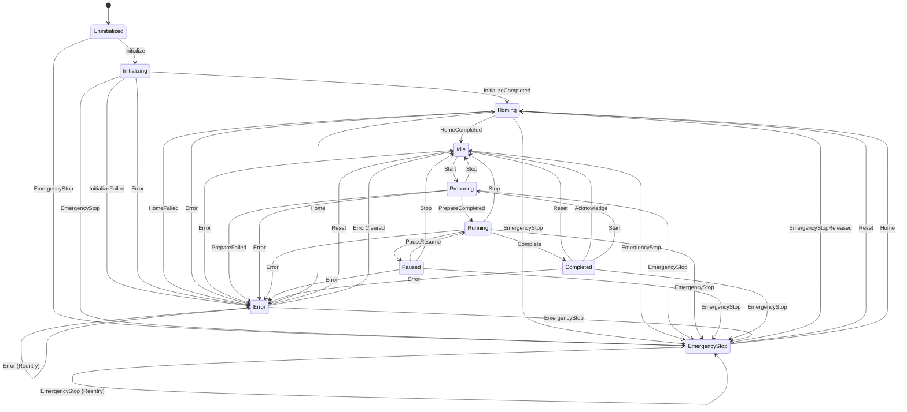
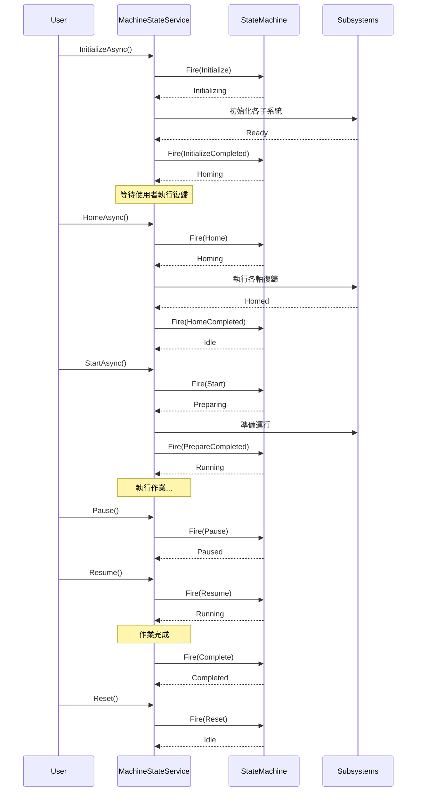
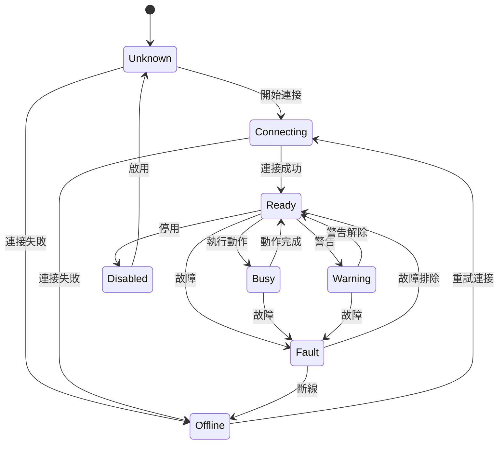
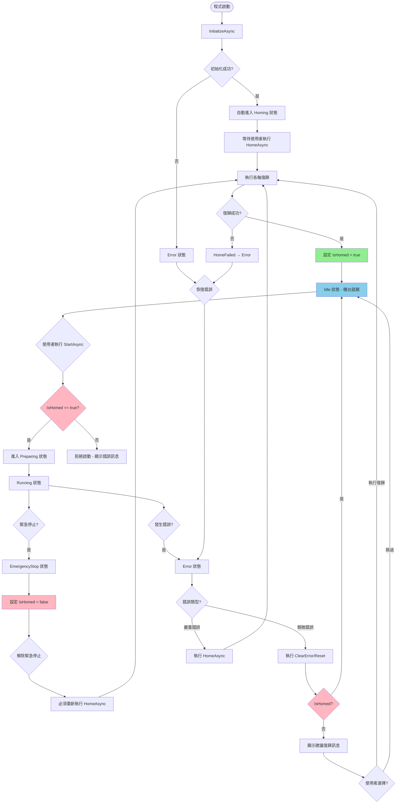

# Calin.ScrewFastening.StateMachine 狀態機模組

## 概述

`Calin.ScrewFastening.StateMachine` 是一個完整的機台狀態管理系統，提供：

- **機台狀態管理**：控制機台生命週期（初始化、運行、暫停、停止、錯誤處理等）
- **子系統狀態追蹤**：監控各子系統（運動控制卡、DAQ、位移計等）的連接與健康狀態
- **狀態轉換控制**：確保狀態轉換的合法性與一致性
- **事件通知機制**：提供狀態變更事件供 UI 或其他模組訂閱
- **復歸機制**：強制執行機台復歸流程，確保機台安全啟動

## 核心組件

### 1. MachineState 枚舉

定義機台的所有可能狀態：

| 狀態            | 值  | 說明                                   |
| --------------- | --- | -------------------------------------- |
| `Uninitialized` | 0   | 未初始化狀態                           |
| `Initializing`  | 1   | 初始化中                               |
| `Homing`        | 5   | 復歸中                                 |
| `Idle`          | 10  | 閒置就緒（已初始化，已復歸，等待操作） |
| `Preparing`     | 20  | 準備中（準備啟動作業）                 |
| `Running`       | 30  | 運行中（執行主要流程）                 |
| `Paused`        | 40  | 已暫停                                 |
| `Completed`     | 50  | 已完成（等待確認）                     |
| `Error`         | 90  | 錯誤狀態（需處理錯誤）                 |
| `EmergencyStop` | 99  | 緊急停止                               |

### 2. MachineTrigger 枚舉

定義所有可用的狀態觸發器：

| 觸發器                  | 值  | 說明                         |
| ----------------------- | --- | ---------------------------- |
| `Initialize`            | 0   | 初始化請求                   |
| `InitializeCompleted`   | 1   | 初始化完成                   |
| `InitializeFailed`      | 2   | 初始化失敗                   |
| `Home`                  | 5   | 開始復歸                     |
| `HomeCompleted`         | 6   | 復歸完成                     |
| `HomeFailed`            | 7   | 復歸失敗                     |
| `Start`                 | 10  | 開始運行                     |
| `PrepareCompleted`      | 11  | 準備完成，進入運行           |
| `PrepareFailed`         | 12  | 準備失敗                     |
| `Pause`                 | 20  | 暫停運行                     |
| `Resume`                | 21  | 恢復運行                     |
| `Stop`                  | 30  | 停止運行                     |
| `Complete`              | 31  | 運行完成                     |
| `Reset`                 | 40  | 重置狀態（回到閒置）         |
| `Acknowledge`           | 41  | 確認完成（從完成狀態回閒置） |
| `Error`                 | 90  | 發生錯誤                     |
| `ErrorCleared`          | 91  | 錯誤已處理/清除              |
| `EmergencyStop`         | 99  | 緊急停止                     |
| `EmergencyStopReleased` | 100 | 緊急停止解除                 |

### 3. SubsystemState 枚舉

定義子系統的狀態：

| 狀態         | 值  | 說明                   |
| ------------ | --- | ---------------------- |
| `Unknown`    | 0   | 未知/未初始化          |
| `Offline`    | 1   | 離線/未連接            |
| `Connecting` | 2   | 連接中                 |
| `Ready`      | 10  | 已連接/就緒            |
| `Busy`       | 20  | 忙碌中（執行動作）     |
| `Warning`    | 30  | 警告狀態（可繼續運作） |
| `Fault`      | 90  | 故障狀態（需處理）     |
| `Disabled`   | 99  | 已停用                 |

### 4. 預設子系統

系統預先註冊以下子系統：

```csharp
public static class SubsystemIds
{
    public const string MotionCard = "MotionCard";      // 運動控制卡
    public const string AxisZ = "AxisZ";                // Z軸
    public const string AxisR = "AxisR";                // R軸
    public const string Daq = "DAQ";                    // DAQ 資料擷取卡
    public const string Displacement = "Displacement";   // 高度位移計
}
```

## 狀態機流程圖

### 機台狀態轉換圖



### 典型操作流程



### 子系統狀態轉換



### 復歸流程圖



## 使用方法

### 1. 依賴注入設置

在 `Program.cs` 或服務註冊處：

```csharp
services.AddSingleton<IMachineStateService, MachineStateService>();
```

### 2. 初始化機台

```csharp
public class MyController
{
    private readonly IMachineStateService _stateService;

    public MyController(IMachineStateService stateService)
    {
        _stateService = stateService;

        // 訂閱狀態變更事件
        _stateService.StateTransitioned += OnStateTransitioned;
        _stateService.SubsystemStateChanged += OnSubsystemStateChanged;
    }

    public async Task InitializeAsync()
    {
        var success = await _stateService.InitializeAsync();
        if (success)
        {
            Console.WriteLine("機台初始化成功");
            // 初始化後需要執行復歸
            await HomeAsync();
        }
        else
        {
            Console.WriteLine($"初始化失敗: {_stateService.LastErrorMessage}");
        }
    }

    public async Task HomeAsync()
    {
        var success = await _stateService.HomeAsync();
        if (success)
        {
            Console.WriteLine("復歸完成，機台就緒");
        }
        else
        {
            Console.WriteLine($"復歸失敗: {_stateService.LastErrorMessage}");
        }
    }

    private void OnStateTransitioned(object sender, StateTransitionEventArgs e)
    {
        Console.WriteLine($"狀態轉換: {e.FromState} -> {e.ToState}");
    }

    private void OnSubsystemStateChanged(object sender, SubsystemStateChangedEventArgs e)
    {
        Console.WriteLine($"子系統 {e.SubsystemName}: {e.PreviousState} -> {e.CurrentState}");
    }
}
```

### 3. 運行控制

```csharp
// 開始運行
public async Task StartOperationAsync()
{
    // 檢查是否已復歸
    if (!_stateService.IsHomed)
    {
        MessageBox.Show("請先執行復歸");
        return;
    }

    if (!_stateService.AllSubsystemsReady)
    {
        MessageBox.Show("並非所有子系統都已就緒");
        return;
    }

    var success = await _stateService.StartAsync();
    if (!success)
    {
        MessageBox.Show("無法啟動運行");
    }
}

// 暫停
public void PauseOperation()
{
    if (_stateService.Pause())
    {
        Console.WriteLine("已暫停");
    }
}

// 恢復
public void ResumeOperation()
{
    if (_stateService.Resume())
    {
        Console.WriteLine("已恢復運行");
    }
}

// 停止
public async Task StopOperationAsync()
{
    await _stateService.StopAsync();
}

// 完成流程
public void CompleteOperation()
{
    _stateService.MarkComplete();
}

// 重置到閒置狀態
public void ResetMachine()
{
    _stateService.Reset();
}
```

### 4. 錯誤處理

```csharp
// 報告錯誤
public void HandleError(Exception ex)
{
    _stateService.ReportError($"操作失敗: {ex.Message}", ex);
}

// 清除輕微錯誤（直接回到 Idle）
public void ClearMinorError()
{
    if (_stateService.ClearError())
    {
        Console.WriteLine("錯誤已清除");
        // 如果系統建議執行復歸，會在狀態列顯示訊息
        // 可以根據實際情況決定是否需要執行復歸
    }
}

// 處理嚴重錯誤（需要重新復歸）
public async Task HandleSevereErrorAsync()
{
    // 方式1: 直接觸發復歸
    if (_stateService.CanFire(MachineTrigger.Home))
    {
        await _stateService.HomeAsync();
    }

    // 方式2: 先清除錯誤，再根據需要決定是否復歸
    if (_stateService.ClearError())
    {
        if (!_stateService.IsHomed)
        {
            // 提示使用者執行復歸
            var result = MessageBox.Show(
                "建議執行復歸以確保機台安全，是否執行？",
                "確認",
                MessageBoxButtons.YesNo);

            if (result == DialogResult.Yes)
            {
                await _stateService.HomeAsync();
            }
        }
    }
}

// 緊急停止
public void EmergencyStop()
{
    _stateService.EmergencyStop("使用者觸發緊急停止");
}

// 解除緊急停止
public void ReleaseEmergencyStop()
{
    if (_stateService.ReleaseEmergencyStop())
    {
        Console.WriteLine("緊急停止已解除，請執行復歸");
        // 解除緊急停止後需要重新復歸
    }
}
```

### 5. 復歸操作

```csharp
// 執行復歸
public async Task PerformHomingAsync()
{
    if (_stateService.CurrentState != MachineState.Homing)
    {
        // 從 Error 或 EmergencyStop 狀態觸發復歸
        if (_stateService.IsError || _stateService.IsEmergencyStop)
        {
            _stateService.Reset(); // 或其他適當的觸發器
        }
    }

    var success = await _stateService.HomeAsync();
    if (success)
    {
        Console.WriteLine("復歸完成");
    }
    else
    {
        Console.WriteLine($"復歸失敗: {_stateService.LastErrorMessage}");
    }
}
```

### 6. 查詢狀態

```csharp
// 檢查當前狀態
public void CheckState()
{
    Console.WriteLine($"當前狀態: {_stateService.CurrentState}");
    Console.WriteLine($"前一狀態: {_stateService.PreviousState}");
    Console.WriteLine($"是否運行中: {_stateService.IsRunning}");
    Console.WriteLine($"是否暫停: {_stateService.IsPaused}");
    Console.WriteLine($"是否錯誤: {_stateService.IsError}");
    Console.WriteLine($"是否緊急停止: {_stateService.IsEmergencyStop}");
    Console.WriteLine($"是否已復歸: {_stateService.IsHomed}");
}
```

### 7. 子系統管理

```csharp
// 註冊自訂子系統
public void RegisterCustomSubsystem()
{
    _stateService.RegisterSubsystem(
        "MyDevice",
        "我的自訂設備",
        SubsystemState.Unknown
    );
}

// 更新子系統狀態
public void UpdateSubsystemState(string id, SubsystemState state, string message = null)
{
    _stateService.SetSubsystemState(id, state, message);
}

// 查詢子系統狀態
public void CheckSubsystems()
{
    var subsystems = _stateService.GetAllSubsystems();
    foreach (var (id, tracker) in subsystems)
    {
        Console.WriteLine($"{tracker.Name}: {tracker.State}");
        if (!string.IsNullOrEmpty(tracker.Message))
        {
            Console.WriteLine($"  訊息: {tracker.Message}");
        }
    }

    // 檢查特定子系統
    var motionCardState = _stateService.GetSubsystemState(
        MachineStateService.SubsystemIds.MotionCard
    );
    Console.WriteLine($"運動控制卡狀態: {motionCardState}");
}

// 檢查所有子系統是否就緒
public bool CheckAllReady()
{
    return _stateService.AllSubsystemsReady;
}
```

## 狀態轉換規則

### 允許的轉換

| 當前狀態      | 允許的觸發器                         | 目標狀態     |
| ------------- | ------------------------------------ | ------------ |
| Uninitialized | Initialize                           | Initializing |
| Initializing  | InitializeCompleted                  | Homing       |
| Initializing  | InitializeFailed                     | Error        |
| Homing        | HomeCompleted                        | Idle         |
| Homing        | HomeFailed                           | Error        |
| Idle          | Start                                | Preparing    |
| Preparing     | PrepareCompleted                     | Running      |
| Preparing     | PrepareFailed                        | Error        |
| Preparing     | Stop                                 | Idle         |
| Running       | Pause                                | Paused       |
| Running       | Stop                                 | Idle         |
| Running       | Complete                             | Completed    |
| Paused        | Resume                               | Running      |
| Paused        | Stop                                 | Idle         |
| Completed     | Reset / Acknowledge                  | Idle         |
| Completed     | Start                                | Preparing    |
| Error         | Home                                 | Homing       |
| Error         | Reset / ErrorCleared                 | Idle         |
| EmergencyStop | EmergencyStopReleased / Reset / Home | Homing       |

### 特殊規則

1. **任何狀態都可以轉換到 EmergencyStop**
   - 緊急停止具有最高優先級

2. **大部分狀態都可以轉換到 Error**
   - 除了 EmergencyStop 和 Error 本身

3. **Error 和 EmergencyStop 允許重入**
   - 可以多次觸發相同觸發器（用於更新錯誤訊息）

4. **復歸機制**
   - 程式啟動後必須經過 `Initialize` -> `Homing` -> `Idle` 流程
   - 從 `EmergencyStop` 恢復時必須重新執行復歸
   - 從 `Error` 恢復時：
     - 可以直接使用 `Reset` 或 `ErrorCleared` 回到 `Idle`（適用於輕微錯誤）
     - 可以使用 `Home` 觸發器進入 `Homing` 重新復歸（適用於嚴重錯誤）
     - 如果 `IsHomed = false`，系統會建議執行復歸
   - 只有在 `IsHomed = true` 且狀態為 `Idle` 時才能執行 `Start`
   - 緊急停止會自動將 `IsHomed` 設為 `false`

## UI 控制元件

模組提供以下 UI 控制元件（位於 `StateMachine\UI` 命名空間）：

### 1. MachineControlPanel

機台控制面板，提供：

- 初始化、啟動、暫停、恢復、停止按鈕
- 緊急停止按鈕
- 重置/清除錯誤按鈕
- 狀態顯示

### 2. MachineStateIndicator

狀態指示器，提供：

- 視覺化顯示當前機台狀態
- 顏色標示（閒置=綠色、運行=藍色、錯誤=紅色等）

### 3. SubsystemStatusPanel

子系統狀態面板，提供：

- 顯示所有子系統的狀態
- 連接狀態指示
- 錯誤訊息顯示

## 最佳實踐

### 1. 初始化順序

```csharp
// 正確的初始化順序
await _stateService.InitializeAsync();

// 初始化完成後，狀態機會自動進入 Homing 狀態
// 但不會自動執行復歸，需要手動觸發

// 執行復歸
await _stateService.HomeAsync();

// 等待所有子系統就緒
while (!_stateService.AllSubsystemsReady)
{
    await Task.Delay(100);
}

// 確認已復歸
if (_stateService.IsHomed && _stateService.CurrentState == MachineState.Idle)
{
    // 現在可以啟動
    await _stateService.StartAsync();
}
```

### 2. 錯誤處理

```csharp
try
{
    // 執行操作
    await PerformOperationAsync();
}
catch (Exception ex)
{
    // 報告錯誤到狀態機
    _stateService.ReportError($"操作失敗: {ex.Message}", ex);
    // 顯示給使用者
    MessageBox.Show(_stateService.LastErrorMessage, "錯誤",
        MessageBoxButtons.OK, MessageBoxIcon.Error);
}
```

### 3. 取消操作

```csharp
private CancellationTokenSource _cts;

public async Task StartWithCancellationAsync()
{
    _cts = new CancellationTokenSource();

    try
    {
        await _stateService.StartAsync(_cts.Token);
        // 執行長時間操作
        await LongRunningOperationAsync(_cts.Token);
    }
    catch (OperationCanceledException)
    {
        // 操作被取消
        await _stateService.StopAsync();
    }
}

public void CancelOperation()
{
    _cts?.Cancel();
}
```

### 4. 事件處理

```csharp
private void OnStateTransitioned(object sender, StateTransitionEventArgs e)
{
    // 在 UI 執行緒上更新 UI
    if (InvokeRequired)
    {
        Invoke(new Action(() => UpdateUI(e.ToState)));
    }
    else
    {
        UpdateUI(e.ToState);
    }
}

private void UpdateUI(MachineState state)
{
    switch (state)
    {
        case MachineState.Running:
            btnStart.Enabled = false;
            btnPause.Enabled = true;
            btnStop.Enabled = true;
            break;
        case MachineState.Paused:
            btnResume.Enabled = true;
            btnStop.Enabled = true;
            break;
        case MachineState.Error:
            btnClearError.Enabled = true;
            lblError.Text = _stateService.LastErrorMessage;
            lblError.Visible = true;
            break;
    }
}
```

## 執行緒安全

- 所有狀態轉換操作都是執行緒安全的
- 使用 `lock` 確保狀態一致性
- 事件處理可能在不同執行緒上觸發，UI 更新需使用 `Invoke`

## 記錄與除錯

狀態機使用 `Calin.Logging.Abstractions` 記錄所有狀態轉換：

```text
[Thread:1] 機台狀態轉換: Uninitialized -> Initializing
[Thread:1] 子系統狀態變更: 運動控制卡 Unknown -> Connecting
[Thread:1] 子系統狀態變更: 運動控制卡 Connecting -> Ready
[Thread:1] 機台狀態轉換: Initializing -> Idle
```

### 復歸機制說明

復歸（Homing）是機台安全操作的關鍵步驟：

1. **程式啟動流程**：`Uninitialized` → `Initializing` → `Homing` → `Idle`
   - 初始化完成後，狀態機自動進入 `Homing` 狀態
   - 必須手動呼叫 `HomeAsync()` 執行復歸
   - 復歸完成後才能進入 `Idle` 狀態

2. **錯誤恢復流程**：
   - **輕微錯誤**：`Error` → `Idle` (透過 Reset/ErrorCleared)
     - 如果已完成復歸 (`IsHomed = true`)，可以直接清除錯誤回到 Idle
     - 例如：參數錯誤、通訊逾時等不影響機械位置的錯誤
   - **嚴重錯誤**：`Error` → `Homing` → `Idle` (透過 Home 觸發器)
     - 如果未完成復歸 (`IsHomed = false`)，建議重新執行復歸
     - 例如：軸運動異常、位置偏移等影響機械位置的錯誤

3. **緊急停止恢復流程**：`EmergencyStop` → `Homing` → `Idle`
   - 解除緊急停止後必須重新執行復歸
   - 緊急停止會自動將 `IsHomed` 標記設為 `false`

4. **啟動前檢查**：
   - `StartAsync()` 會檢查 `IsHomed` 標記
   - 只有在已復歸 (`IsHomed = true`) 且狀態為 `Idle` 時才能啟動

## 相關文件

- **IMachineStateService.cs**: 服務介面定義
- **MachineStateService.cs**: 服務實作
- **MachineStateMachine.cs**: 核心狀態機邏輯
- **SubsystemStateTracker.cs**: 子系統狀態追蹤器

## 範例專案

完整的使用範例請參考：

- `Calin.ScrewFastening\Views\MainPage.cs` - 主頁面整合
- `Calin.ScrewFastening\Views\DataAnalysis.cs` - 資料分析頁面使用

---

**版本**: 1.0  
**最後更新**: 2024  
**維護者**: Calin Development Team
