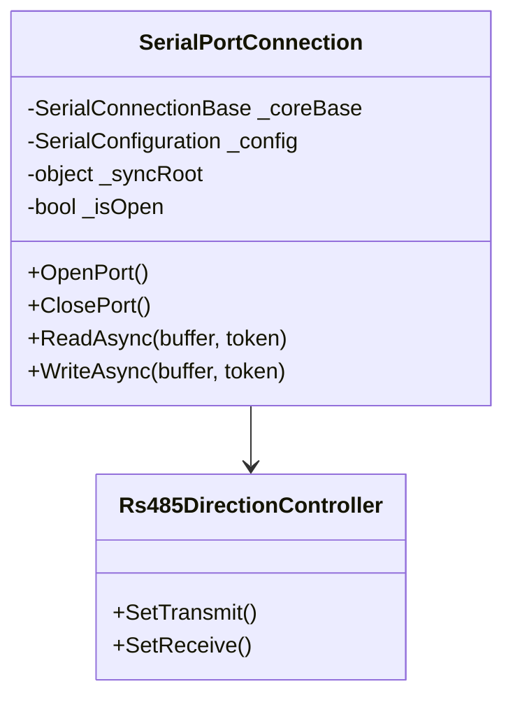

# Calin.Communication.SerialPort 架構規劃（工控 LEVEL 5）

## 專案名稱

`Calin.Communication.SerialPort`

## 目標

建立工控 LEVEL 5 等級的 **SerialPort 實作層模組**，作為 `Calin.Communication.SerialCore` 的具體實現，負責 RS-232 / RS-485 / RS-422 / USB-Serial 實體通訊控制，並提供 **Modbus RTU / ASCII 擴充基礎能力**。確保在 24/7 運作下具備高穩定性、可預測性與可擴充性。

## 環境

- Windows 7 / 10
- .NET Framework 4.8
- C# 9
- 適用低階資源、舊硬體
- 不使用 .NET Core 專屬 API

## 核心設計原則

- **角色定位**：
  - 本專案為 **Core 的具體 Driver 層**
<<<<<<< Updated upstream
  - 僅負責「SerialPort 實體控制 + I/O 行為」
=======
  - 僅負責「SerialPort 實體控制策略 + I/O 行為策略」
  - 不直接操作 SerialPortStream，所有底層 I/O 透過 Core 封裝介面
>>>>>>> Stashed changes
  - 不負責高階協議（由上層 Modbus / PLC 處理）

- **優先順序**：
  1. 穩定性
  2. 相容性（各類 USB-Serial / Driver 差異）
  3. 可預測性（避免隱性狀態）
  4. 效能
  5. 可維護性
  6. 擴充性

- 嚴格遵守 Core 規範（不可重複實作核心邏輯）
- 將所有 I/O 行為封裝於單一連線實例內
- 避免直接暴露底層 SerialPortStream
<<<<<<< Updated upstream
- 硬體差異（USB/RS485）需可透過策略抽象化
- 禁止在 Driver 層加入業務邏輯
- 所有 public API 必須 thread-safe
=======
- 硬體差異（USB/RS485/RS422）需可透過策略抽象化
- 禁止在 Driver 層加入業務邏輯
- 所有 public API 必須 thread-safe
- Configuration 一旦初始化，不可在運行時修改 mutable 參數
>>>>>>> Stashed changes

## 與 SerialCore 關係

- 依賴：
<<<<<<< Updated upstream
  - `Calin.Communication.SerialCore`
- 繼承：
  - `SerialConnectionBase`
- 提供：
  - `SerialPortConnection`（唯一實作）
=======
  - `Calin.Communication.SerialCore`（提供 SerialPort 封裝）
- 繼承：
  - `SerialConnectionBase`
- 提供：
  - `SerialPortConnection`（唯一實作，策略層）
>>>>>>> Stashed changes
- 擴充：
  - `ITransmissionProbe`（Modbus / Custom）

## 非同步與 Thread 安全

- 完全遵守 Core 規範
- 額外限制：
  - 所有 SerialPort 操作必須在 **單一 I/O Thread**
<<<<<<< Updated upstream
  - 禁止跨執行緒呼叫 `_portStream`
  - Read / Write 必須由 Base 控制流程觸發
- Port Open / Close 必須具備同步保護（lock + state）

## I/O 與錯誤處理

- 實作所有 SerialPort 相關例外分類：
  - IOException（USB 拔除 / driver error）
  - UnauthorizedAccessException（Port 被佔用）
  - InvalidOperationException（狀態錯誤）
- USB-Serial 特殊處理：
  - Open 成功 ≠ 可通訊
  - 必須依賴 TransmissionVerified 判定
- Read / Write 必須支援 Timeout
- 發生錯誤時：
  - 不可直接拋出至外部
  - 必須轉為狀態機流（Error → Reconnecting）

## 串列通訊實作細節

- 使用 `RJCP.SerialPortStream`
- 必須封裝以下行為：
  - Open / Close
  - Read（blocking + timeout）
  - Write（queue 控制）
- 必須支援：
  - RS-232（全雙工）
  - RS-485（半雙工，需方向控制策略）
  - USB-Serial（不可靠連線）
- RS-485 擴充：
  - 可選 RTS 控制（方向切換）
  - 寫入後需延遲（driver flush）
- BaudRate / Parity / StopBits 必須可配置
- 不可使用 DataReceived event（改用 ReadLoop）

## TransmissionProbe 擴充（Modbus 基礎）

- 提供內建 Probe：
  - `RawEchoProbe`
  - `ModbusRtuProbe`
- Modbus Probe 必須：
  - 支援 CRC 驗證
  - 至少一次完整 request/response
  - 可設定 SlaveId / FunctionCode
- Probe 設計：
  - 不可依賴 UI 或外部狀態
  - 必須完全可測試（deterministic）

## 狀態機整合（強制）

- 完全沿用 Core 狀態機
- Driver 不可新增狀態
- 僅允許觸發：
  - Open 成功 → Opened
  - Open 失敗 → Error
  - I/O 失敗 → Error
- Ready 必須由 TransmissionVerified 決定
=======
  - 禁止跨執行緒呼叫底層 Stream
  - Read / Write 必須由 Base 控制流程觸發

- Port Open / Close 必須具備同步保護（lock + state）
- `WriteAsync` 可被多個 caller 呼叫，Base queue 必須 thread-safe
- Initialize 必須 thread-safe 並且只能呼叫一次（使用 flag 或 Interlocked）

## I/O 與錯誤處理

- 實作 SerialPort 相關錯誤策略：
  - IOException（USB 拔除 / driver error）
  - UnauthorizedAccessException（Port 被佔用）
  - InvalidOperationException（狀態錯誤）

- USB-Serial 特殊處理：
  - Open 成功 ≠ 可通訊
  - 必須依賴 TransmissionVerified 判定

- Read / Write 必須支援 Timeout + CancellationToken
- 發生錯誤時：
  - 不可直接拋出至外部
  - 必須轉為狀態機流（Error → Reconnecting）

- 提供 Error Event / ErrorCode 回報給上層
- USB-Serial Reconnecting 必須支援最大重試次數與間隔配置

## 串列通訊實作細節

- **底層 I/O 透過 Core Base 提供的接口完成**，Driver 層不直接使用 SerialPortStream
- Driver 對外負責策略控制：
  - RS-485/RS-422 TX/RX 切換
  - 延遲策略（micro-delay）
  - USB-Serial 斷線偵測與 Reconnect
  - TransmissionProbe 驗證

- 必須封裝以下行為：
  - Open / Close
  - Read / Write（透過 Base API）

- 必須支援：
  - RS-232（全雙工）
  - RS-485（半雙工，需方向控制策略）
  - RS-422（全雙工，類似 RS-232）
  - USB-Serial（不可靠連線）

- RS-485 擴充：
  - 可選 RTS 控制（方向切換）
  - 寫入後需延遲（driver flush）
  - RTS 與自動方向不可同時啟用

- BaudRate / Parity / StopBits 必須可配置
- 不可使用 DataReceived event（改用 ReadLoop）

## TransmissionProbe 擴充（Modbus 基礎）

- 提供內建 Probe：
  - `RawEchoProbe`
  - `ModbusRtuProbe`

- Modbus Probe 必須：
  - 支援 CRC 驗證
  - 至少一次完整 request/response
  - 可設定 SlaveId / FunctionCode
  - 支援 CancellationToken 與 Timeout/Retry

- Probe 設計：
  - 不可依賴 UI 或外部狀態
  - 必須完全可測試（deterministic）

## 狀態機整合（強制）

- 完全沿用 Core 狀態機
- Driver 不可新增狀態
- 僅允許觸發：
  - Open 成功 → Opened
  - Open 失敗 → Error
  - I/O 失敗 → Error

- Ready 必須由 TransmissionVerified 決定
- Error Event 用於通知上層 I/O / Transmission failure

## 類別結構建議



- `_coreBase` 取代 `_portStream`，所有 I/O 呼叫透過 Base API，Driver 不操作 SerialPortStream
- Driver 僅添加硬體策略邏輯與 Probe 驗證

## RS-485 特殊規範

- 半雙工控制：
  - Write 前切換 TX
  - Write 後切換 RX

- 必須避免：
  - 切換競態（race condition）

- 可選策略：
  - RTS 控制
  - 自動方向（硬體支援）

- 切換時間需可配置（micro-delay）
- **新增**：
  - RTS 與自動方向必須互斥

## USB-Serial 斷線處理

- 不可依賴 OS Event
- 判斷方式：
  - Read timeout + 無資料
  - Write exception
  - TransmissionVerified failure

- 必須快速進入：
  - Reconnecting

- 支援最大重試次數與間隔控制，避免無限循環

## Write / Read 行為強化

- Write：
  - 透過 Base WriteQueue 完成 I/O
  - Driver 僅負責實際策略控制（RS-485/Probe 等）

- Read：
  - 使用 blocking read（timeout + CancellationToken）
  - 不可 busy loop

- Flush：
  - 必須避免（部分 driver 不穩定）

- Buffer：
  - 使用 ArrayPool（由 Base 控制）

- Driver 使用後立即歸還 buffer，避免 memory leak

## 設定擴充

```csharp
public class SerialPortConfiguration : SerialConfiguration
{
    public bool EnableRs485 { get; set; }
    public bool UseRtsControl { get; set; }
    public int Rs485SwitchDelayUs { get; set; }
    public bool EnableDtr { get; set; }
    public bool AutoReconnect { get; set; }        // 新增
    public int MaxReconnectRetries { get; set; }   // 新增
}
```

- 僅允許初始化時設定
- 執行中變更需重新連線

- **修改**：使用 CancellationToken + WaitOne 避免 Thread.Sleep 阻塞

## Dispose 強化規範

```text
1. 停止 I/O Thread（lock 保護）
2. 關閉 Port（透過 Core API）
3. 清除 RS-485 狀態（避免殘留 TX）
4. 清理 ArrayPool buffer（Base 控制）
5. 確保 Base 層 Dispose
6. 不可遺留 OS Handle
```

- Dispose 流程需依序操作，避免 Thread 還在操作 \_coreBase 時 Dispose

## DI 與非 DI 註冊

- 目的：
  - 提供標準 DI 註冊方式（Microsoft.Extensions.DependencyInjection）
  - 同時支援非 DI（手動建立）模式
  - 對外僅暴露 `ISerialPort`，隱藏實作細節

- 原則：
  - `ISerialPort` 為唯一對外操作介面（供建構式注入）
  - `SerialPortConnection` 為內部實作（不可直接依賴）
  - 支援多實例（多 Port 並行）
  - 不使用 Service Locator
  - 不在建構子中執行 I/O
  - Factory 建立流程與 DI 完全相容

### ISerialPort 介面

```csharp
public interface ISerialPort : IDisposable
{
    Task ConnectAsync(CancellationToken token);
    Task DisconnectAsync(CancellationToken token);
    Task SendAsync(ReadOnlyMemory<byte> data, CancellationToken token);

    ConnectionState Status { get; }

    event EventHandler<ConnectionStatusChangedEventArgs> ConnectionStatusChanged;
    event EventHandler<ReadOnlyMemory<byte>> DataReceived;
    event EventHandler<ErrorEventArgs> ErrorOccurred;   // 新增
}
```

### 核心強化規範

- `ISerialPort` 為唯一對外通訊入口
- 不可直接依賴 `SerialPortConnection`
- DI 與非 DI 行為必須一致
- Factory 建立流程必須與 DI 完全相容
- Initialize 必須 thread-safe 且僅允許呼叫一次
- 不可在 DI 註冊時觸發任何 I/O
- 所有連線生命週期由使用者控制（Connect / Disconnect）
- 多設備情境必須使用 Factory，不可濫用 Singleton
- Read/Write 支援 CancellationToken
- 多 Port 並行使用時不可共享 mutable 狀態
- Error Event 用於通知上層 I/O / Transmission failure

---

# GitHub Copilot Prompt for Calin.Communication.SerialPort

你正在設計一個 **工控 LEVEL 5 等級的 SerialPort Driver**，目標是生成可在 **.NET Framework 4.8 / C# 9** 上運行的高可靠性程式碼，支援 **RS-232 / RS-485 / RS-422 / USB-Serial** 並整合 **Modbus RTU / ASCII 基礎能力**。所有規範必須完全遵守，Driver 層只負責策略控制，不可包含任何業務邏輯。

## 核心設計原則

- 本專案為 **Core 的具體 Driver 層**。
- 僅負責 **SerialPort 實體控制策略 + I/O 行為策略**。
- 不直接操作 SerialPortStream，所有 I/O 透過 `SerialConnectionBase`。
- 不負責高階協議，由上層 Modbus / PLC 處理。
- 優先順序：
  1. 穩定性
  2. 相容性（USB-Serial / Driver 差異）
  3. 可預測性
  4. 效能
  5. 可維護性
  6. 擴充性
- 所有 public API **thread-safe**。
- Configuration 一旦初始化，不可運行時修改。

## 與 SerialCore 關係

- 依賴 `Calin.Communication.SerialCore` 提供 SerialPort 封裝。
- 繼承 `SerialConnectionBase`。
- 提供 `SerialPortConnection`（唯一實作，策略層）。
- 擴充 `ITransmissionProbe`（Modbus / Custom）。

## 非同步與 Thread 安全

- 所有 SerialPort 操作必須在 **單一 I/O Thread**。
- 禁止跨執行緒呼叫底層 Stream。
- Read / Write 由 Base 控制流程觸發。
- Port Open / Close 必須 lock + state 保護。
- `WriteAsync` 可多個 caller 呼叫，Base queue 必須 thread-safe。
- Initialize 必須 thread-safe 且只能呼叫一次。

## I/O 與錯誤處理

- 支援 SerialPort 例外：
  - `IOException`（USB 拔除 / driver error）
  - `UnauthorizedAccessException`（Port 被佔用）
  - `InvalidOperationException`（狀態錯誤）
- USB-Serial 特殊處理：
  - Open 成功 ≠ 可通訊，必須依 TransmissionVerified 判定。
- Read / Write 支援 Timeout + CancellationToken。
- 發生錯誤不直接拋出 → 轉為狀態機流（Error → Reconnecting）。
- 提供 Error Event / ErrorCode 回報。
- USB-Serial Reconnecting 支援最大重試次數與間隔。

## 串列通訊實作細節

- 所有 I/O 透過 Base API。
- Driver 控制策略：
  - RS-485 / RS-422 TX/RX 切換
  - 延遲策略（micro-delay）
  - USB-Serial 斷線偵測與 Reconnect
  - TransmissionProbe 驗證
- 封裝行為：
  - Open / Close
  - Read / Write（透過 Base）
- 支援：
  - RS-232（全雙工）
  - RS-485（半雙工，方向控制策略）
  - RS-422（全雙工）
  - USB-Serial（不可靠連線）
- RS-485 擴充：
  - 可選 RTS 控制
  - 寫入後延遲
  - RTS 與自動方向互斥
- BaudRate / Parity / StopBits 可配置
- 不使用 DataReceived event，改用 ReadLoop

## TransmissionProbe 擴充（Modbus 基礎）

- 內建 Probe：
  - `RawEchoProbe`
  - `ModbusRtuProbe`
- Modbus Probe：
  - 支援 CRC 驗證
  - 至少一次完整 request/response
  - 可設定 SlaveId / FunctionCode
  - 支援 CancellationToken 與 Timeout/Retry
- Probe 不依賴 UI 或外部狀態
- 完全可測試（deterministic）

## 狀態機整合

- 完全沿用 Core 狀態機
- Driver 不可新增狀態
- 允許觸發：
  - Open 成功 → Opened
  - Open 失敗 → Error
  - I/O 失敗 → Error
- Ready 由 TransmissionVerified 決定
- Error Event 用於通知上層 I/O / Transmission failure
>>>>>>> Stashed changes

## 類別結構建議

```mermaid
classDiagram
    class SerialPortConnection {
<<<<<<< Updated upstream
        -RJCP.SerialPortStream _portStream
=======
        -SerialConnectionBase _coreBase
>>>>>>> Stashed changes
        -SerialConfiguration _config
        -object _syncRoot
        -bool _isOpen
        +OpenPort()
        +ClosePort()
        +ReadAsync(buffer, token)
        +WriteAsync(buffer, token)
    }

<<<<<<< Updated upstream
    class ModbusRtuProbe {
        +VerifyAsync()
        -ComputeCRC()
    }

    class RawEchoProbe {
        +VerifyAsync()
    }

    class Rs485DirectionController {
        +SetTransmit()
        +SetReceive()
    }

    SerialPortConnection --|> SerialConnectionBase
    SerialPortConnection --> Rs485DirectionController
    ModbusRtuProbe --|> ITransmissionProbe
    RawEchoProbe --|> ITransmissionProbe
```

## RS-485 特殊規範

- 半雙工控制：
  - Write 前切換 TX
  - Write 後切換 RX
- 必須避免：
  - 切換競態（race condition）
- 可選策略：
  - RTS 控制
  - 自動方向（硬體支援）
- 切換時間需可配置（micro-delay）

## USB-Serial 斷線處理

- 不可依賴 OS Event
- 判斷方式：
  - Read timeout + 無資料
  - Write exception
  - TransmissionVerified failure
- 必須快速進入：
  - Reconnecting

## Write / Read 行為強化

- Write：
  - 必須透過 Base WriteQueue
  - Driver 僅負責實際寫入
- Read：
  - 使用 blocking read（timeout 控制）
  - 不可 busy loop
- Flush：
  - 必須避免（部分 driver 不穩定）
- Buffer：
  - 使用 ArrayPool（由 Base 控制）
=======
    class Rs485DirectionController {
        +SetTransmit()
        +SetReceive()
    }

    SerialPortConnection --> Rs485DirectionController
```

- `_coreBase` 替代 `_portStream`，Driver 不操作 SerialPortStream。
- Driver 僅添加硬體策略邏輯與 Probe 驗證。

## RS-485 特殊規範

- 半雙工控制：
  - Write 前切換 TX
  - Write 後切換 RX

- 避免競態（race condition）
- 可選策略：
  - RTS 控制
  - 自動方向（硬體支援）

- 切換時間可配置（micro-delay）
- RTS 與自動方向互斥

## USB-Serial 斷線處理

- 不依賴 OS Event
- 判斷方式：
  - Read timeout + 無資料
  - Write exception
  - TransmissionVerified failure

- 快速進入 Reconnecting
- 支援最大重試次數與間隔

## Write / Read 行為強化

- Write：透過 Base WriteQueue，Driver 僅策略控制
- Read：blocking read（timeout + CancellationToken），不可 busy loop
- Flush：避免（部分 driver 不穩定）
- Buffer：使用 ArrayPool，由 Base 控制，Driver 使用後立即歸還
>>>>>>> Stashed changes

## 設定擴充

```csharp
public class SerialPortConfiguration : SerialConfiguration
{
    public bool EnableRs485 { get; set; }
    public bool UseRtsControl { get; set; }
    public int Rs485SwitchDelayUs { get; set; }
    public bool EnableDtr { get; set; }
<<<<<<< Updated upstream
}
```

- 僅允許初始化時設定
- 執行中變更需重新連線

## Helper 擴充

```csharp
public static class SerialPortAdvancedHelper
{
    public static bool TryOpen(string portName, int timeoutMs)
    {
        try
        {
            using var port = new RJCP.IO.Ports.SerialPortStream(portName);
            port.Open();
            Thread.Sleep(timeoutMs);
            port.Close();
            return true;
        }
        catch
        {
            return false;
        }
    }
}
```

## Dispose 強化規範

```text
1. 關閉 Port（需 lock 保護）
2. 停止 I/O Thread
3. 清除 RS-485 狀態（避免殘留 TX）
4. 確保 _portStream.Dispose()
5. 不可遺留 OS Handle
```

## DI 與非 DI 註冊

- 目的：
  - 提供標準 DI 註冊方式（Microsoft.Extensions.DependencyInjection）
  - 同時支援非 DI（手動建立）模式
  - 對外僅暴露 `ISerialPort`，隱藏實作細節

- 原則：
  - `ISerialPort` 為唯一對外操作介面（供建構式注入）
  - `SerialPortConnection` 為內部實作（不可直接依賴）
  - 支援多實例（多 Port 並行）
  - 不使用 Service Locator
  - 不在建構子中執行 I/O

### ISerialPort 介面

```csharp
public interface ISerialPort : IDisposable
{
    Task ConnectAsync(CancellationToken token);
    Task DisconnectAsync(CancellationToken token);
    Task SendAsync(ReadOnlyMemory<byte> data, CancellationToken token);

    ConnectionState Status { get; }

    event EventHandler<ConnectionStatusChangedEventArgs> ConnectionStatusChanged;
    event EventHandler<ReadOnlyMemory<byte>> DataReceived;
}
```

- 說明：
  - 對應 `ISerialConnection`，但語意聚焦於 SerialPort
  - 僅保留必要操作，避免洩漏 Core 細節
  - 可直接用於應用層（建構式注入）

### 實作對應

```csharp
internal sealed class SerialPortConnection : SerialConnectionBase, ISerialPort
{
}
```

- 限制：
  - 必須為 internal（避免外部直接依賴）
  - 所有邏輯仍由 `SerialConnectionBase` 控制

### DI 註冊

```csharp
public static class SerialPortServiceCollectionExtensions
{
    public static IServiceCollection AddSerialPort(
        this IServiceCollection services,
        SerialPortConfiguration configuration)
    {
        services.AddSingleton(configuration);

        services.AddTransient<ISerialPort, SerialPortConnection>();

        return services;
    }
}
```

- 設計說明：
  - `ISerialPort` 使用 Transient：
    - 每個設備一個實例
    - 避免共享狀態
  - Configuration 使用 Singleton：
    - 只讀配置
    - 不允許執行期修改

### 多設備註冊（建議）

```csharp
services.AddSerialPort(new SerialPortConfiguration
{
    PortName = "COM1",
    BaudRate = 9600
});

services.AddSerialPort(new SerialPortConfiguration
{
    PortName = "COM2",
    BaudRate = 115200
});
```

- 說明：
  - 多 Port 建議搭配 Factory Pattern（避免覆蓋）
  - 或使用 Named Options（進階）

### Factory 設計（建議）

```csharp
public interface ISerialPortFactory
{
    ISerialPort Create(SerialPortConfiguration config);
}
```

```csharp
internal sealed class SerialPortFactory : ISerialPortFactory
{
    private readonly IServiceProvider _provider;

    public SerialPortFactory(IServiceProvider provider)
    {
        _provider = provider;
    }

    public ISerialPort Create(SerialPortConfiguration config)
    {
        var instance = ActivatorUtilities.CreateInstance<SerialPortConnection>(_provider);
        instance.Initialize(config);
        return instance;
    }
}
```

- 特點：
  - 支援動態建立 Port
  - 適用 100+ 設備場景
  - 避免 DI Container 汙染

### 非 DI 使用方式

```csharp
var config = new SerialPortConfiguration
{
    PortName = "COM1",
    BaudRate = 9600
};

var port = new SerialPortConnection();
port.Initialize(config);

await port.ConnectAsync(CancellationToken.None);
```

- 限制：
  - 僅限測試或簡單應用
  - 大型系統必須使用 DI

### 建構式注入使用範例

```csharp
public class DeviceService
{
    private readonly ISerialPort _serialPort;

    public DeviceService(ISerialPort serialPort)
    {
        _serialPort = serialPort;
    }

    public async Task StartAsync()
    {
        await _serialPort.ConnectAsync(CancellationToken.None);
    }
}
```

### 核心強化規範

- `ISerialPort` 為唯一對外通訊入口
- 不可直接依賴 `SerialPortConnection`
- DI 與非 DI 行為必須一致
- Factory 建立流程必須與 DI 完全相容
- Initialize 必須 thread-safe 且僅允許呼叫一次
- 不可在 DI 註冊時觸發任何 I/O
- 所有連線生命週期由使用者控制（Connect / Disconnect）
- 多設備情境必須使用 Factory，不可濫用 Singleton
=======
    public bool AutoReconnect { get; set; }
    public int MaxReconnectRetries { get; set; }
}
```

- 僅初始化時設定，執行中變更需重新連線

## Dispose 強化規範

- 停止 I/O Thread（lock 保護）
- 關閉 Port（透過 Base API）
- 清除 RS-485 狀態（避免殘留 TX）
- 清理 ArrayPool buffer（Base 控制）
- 確保 Base 層 Dispose
- 不可遺留 OS Handle
- 流程依序操作，避免 Thread 還在操作 `_coreBase` 時 Dispose

## DI 與非 DI 註冊

- 提供標準 DI（Microsoft.Extensions.DependencyInjection）與非 DI 模式
- 對外僅暴露 `ISerialPort`
- `SerialPortConnection` 為內部實作，支援多實例
- 不使用 Service Locator
- 不在建構子中執行 I/O
- Factory 與 DI 建立流程完全相容

## ISerialPort 介面

```csharp
public interface ISerialPort : IDisposable
{
    Task ConnectAsync(CancellationToken token);
    Task DisconnectAsync(CancellationToken token);
    Task SendAsync(ReadOnlyMemory<byte> data, CancellationToken token);

    ConnectionState Status { get; }

    event EventHandler<ConnectionStatusChangedEventArgs> ConnectionStatusChanged;
    event EventHandler<ReadOnlyMemory<byte>> DataReceived;
    event EventHandler<ErrorEventArgs> ErrorOccurred;
}
```

- `ISerialPort` 為唯一對外通訊入口
- 不可直接依賴 `SerialPortConnection`
- Initialize thread-safe，僅允許呼叫一次
- 多 Port 並行不可共享 mutable 狀態
- Read / Write 支援 CancellationToken
- Error Event 用於通知上層 I/O / Transmission failure
>>>>>>> Stashed changes
