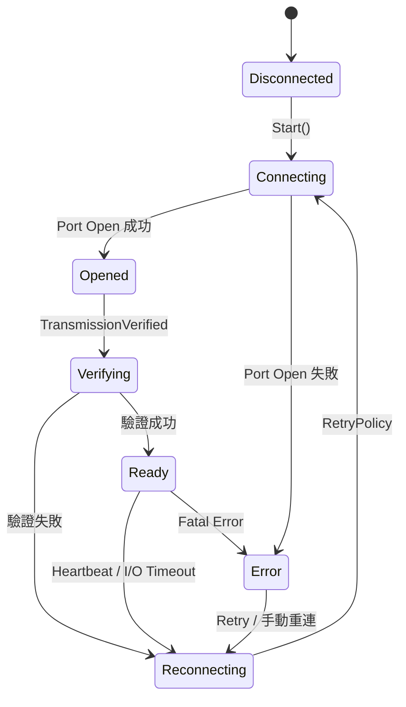
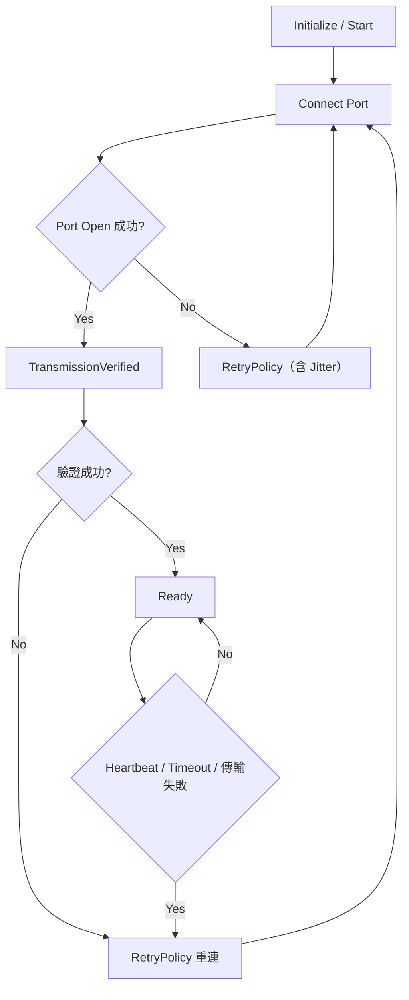
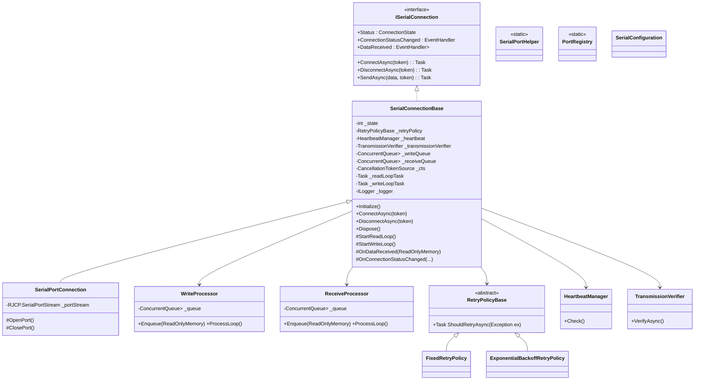

# Calin.Communication.SerialPort 架構規劃（工控 LEVEL 5）

## 專案名稱

`Calin.Communication.SerialCore`

## 目標

建立工控 LEVEL 5 等級的串列通訊核心模組，作為 RS-232 / RS-485 / RS-422 / USB-Serial / Modbus / TCP / CAN / PLC 等通訊基礎程式庫。核心功能為長時間穩定運行、支援大量設備並行（100+）、低資源消耗、24/7 運作，並確保 I/O 高效能與記憶體可控。

## 環境

- Windows 7 / 10
- .NET Framework 4.8
- C# 9
- 適用低階資源、舊硬體
- 不使用 .NET Core 專屬 API

## 核心設計原則

- **優先順序**：
  1. 穩定性
  2. 相容性
  3. 效能
  4. 可預測性
  5. 可維護性
  6. 擴充性
  7. 優雅設計
- 架構簡潔、輕量化，避免過度設計
- 支援 24/7 運作及大量設備並行（100+）
- 無記憶體洩漏，減少物件分配與 GC 壓力
- 高頻路徑禁止隱式配置（LINQ / boxing / new byte[]）
- 遵守 Interface Segregation 原則
- 使用 `Calin.Logging` 作為唯一 logging abstraction
- 每個類別與介面需有 XML Summary（正體中文）
- `Dispose` 必須完整釋放資源且可重入
- 禁止 `Thread.Abort`
- 避免 race condition / deadlock / event re-entrancy
- 所有 public API 必須 thread-safe
- 事件不可阻塞 I/O 執行緒

## 非同步與 Thread 安全

- 禁止 `async void`（UI Handler 除外）
- 所有 Task / ValueTask 必須支援 CancellationToken
- 背景 Task 必須安全停止並捕捉所有例外
- 禁止未受控 fire-and-forget
- 公開 API 或長時間 Task 使用 `async Task`
- 內部短期、頻繁非同步可使用 `async ValueTask`
- Centralized Polling / Single Polling Thread
- 每個 Connection：
    - 單一 Read Loop（唯一）
    - 單一 Write Queue（序列化輸出）
- Polling 固定週期，避免漂移或 Busy Loop
- 禁止多執行緒直接操作 SerialPort
- 禁止多 Writer 同時寫入 Port

## I/O 與錯誤處理

- 建構子不得執行 I/O
- Initialize / Start / Stop / Dispose 必須安全且可重入
- 所有 I/O 操作必須可 Timeout
- 設備異常（斷線、無回應、傳輸失敗）必須被安全處理
- 單一設備或任務失敗不得影響整體系統
- Logging 高頻循環不可阻塞主流程
- I/O Pipeline 必須解耦（Read / Process / Event）
- 常見例外需分類處理：
    - IOException（USB 拔除）
    - UnauthorizedAccessException（Port 被佔用）
    - TimeoutException（Read timeout）
    - InvalidOperationException（Port 狀態錯亂）

## 串列通訊核心功能

- 使用 `RJCP.SerialPortStream`，不可直接曝露給外部，禁用 `System.IO.Ports`
- 支援 RS-232 / RS-485 / RS-422 / USB-Serial
- 可偵測斷線並自動重連
    - USB-Serial 需靠 Heartbeat / Polling 與最後回應時間戳判斷
- TransmissionVerified 功能：
    - 核心檢測 Port 是否可實際傳輸
    - 分級驗證：
        - Level 1：Port Open 成功
        - Level 2：Write 成功
        - Level 3：Read 回應成功（最終判定）
    - 可透過 Heartbeat / Ping / Echo / 測試資料
    - 成功才認定設備可用
    - **策略接口**：
        - `ITransmissionProbe` 可替換不同協議（PLC / Modbus / ASCII / Binary）
        - Probe 必須 timeout、retry、至少一次完整 request/response cycle
- RetryPolicy 抽象化：
    - 固定間隔 / 指數退避
    - 最大重試次數與總時間
    - 必須加入 Jitter（避免同步重連風暴）
- 傳輸驗證（CRC / Checksum / 自訂策略）
- 減少 Buffer 複製，使用共享 / Ring Buffer
- 防止同一 PortName 被重複開啟（全域 Port Registry，僅保證同 Process）
- 參數持久化（Newtonsoft.Json，僅限非高頻）
- 提供 Helper 類：
    - 列出可用串列埠
    - 檢查 Port 使用狀態
    - 簡易連線測試
- Write Queue 背壓策略：
    - Fail-fast + Log（Queue 滿時丟失最舊資料）
- Receive Queue 僅提供 raw stream，**封包邊界由 Parser 層處理**

## ConnectionState Enum

```csharp
public enum ConnectionState
{
    Disconnected = 0,
    Connecting = 1,
    Opened = 2,
    Verifying = 3,
    Ready = 4,
    Reconnecting = 5,
    Error = 6
}
```

- Ready = Open + TransmissionVerified 成功
- Opened 不可對外視為可用
- Error 不可停留，必須導向 Reconnecting 或 Dispose

## I/O Pipeline（強制規範）

```text
[SerialPort ReadLoop]
    ↓（僅資料搬移，不做邏輯）
[ArrayPool Buffer]
    ↓
[Receive Queue / RingBuffer]
    ↓
[Protocol Parser / 上層處理]
    ↓
[Event / Callback（非阻塞）]
```

- DataReceived / ReadLoop：
    - 不可做解析
    - 不可觸發事件
    - 不可阻塞
- 必須寫入內部 Queue / RingBuffer
- Write 必須透過 Queue，不可直接寫入 Port

## Memory / Buffer 管理（強制）

- 禁止：
    - 高頻路徑使用 `new byte[]`
- 必須：
    - `ArrayPool<byte>.Shared`
    - `Memory<byte>` / `Span<byte>`
- 規範：
    - 租借 → 使用 → finally 歸還
    - 不可跨執行緒持有 pooled buffer
    - 不可長時間持有 buffer
    - 減少 buffer 複製（零拷貝或單次拷貝）

## 狀態機設計



## 狀態管理（強制）

- 使用 `Interlocked` / `Volatile`
- 狀態轉換必須原子操作
- 禁止多執行緒同時修改狀態
- 必須避免狀態競態（race condition）
- Dispose 必須雙重保護：_disposed flag + Interlocked

## Retry 與 TransmissionVerified 流程



## 類別結構建議



## 背景 Task / Polling 設計

```text
- 單一 Polling Thread 處理所有設備
- 每個設備：
    - Heartbeat 檢查
    - Timeout 判斷
    - TransmissionVerified 狀態檢查
    - 狀態轉換
- Polling 禁止執行 I/O
- I/O 僅存在於各自 Connection Task
- 捕捉所有例外
- 支援 CancellationToken 安全停止
- 固定 Polling 週期，使用 Stopwatch 校正，避免漂移或 Busy Loop
- 所有高頻事件非阻塞
```

## Event 與 Callback 規範

- 不可在 I/O Thread 直接觸發
- 必須非同步派送（Queue / Task）
- try-catch 保護
- 順序必須保證
- Queue 滿：Drop 最舊資料
好的，我幫你把這段規範 **完整修改成依 `Calin.Logging` 的版本**，整合之前的 Level 5 強化建議，包括 NullLogger fallback、LogThrottle、高頻/低頻限制、Scope 使用規範，並保留你現有的高效能 LoggerMessage 寫法示例：

## Logging 規範（依 Calin.Logging）

- 核心介面：
    - 使用 `Calin.Logging.ILogger` / `Calin.Logging.ILogger<T>`
    - Library / Driver 不直接依賴 Microsoft.Extensions.Logging 或 Serilog / NLog
- 相依套件：
    - `Calin.Logging`
    - `Microsoft.Extensions.Logging`
    - `Microsoft.Extensions.Logging.Abstractions`
    - 禁止直接依賴 Serilog / NLog / 其他 Logging Framework
- 禁止：
    - 高頻路徑（ReadLoop / Polling）直接呼叫 ILogger
    - 字串插值（$""）或 string.Format 用於 logging
    - 高頻路徑建立 Scope
    - 全域 / static Logger
    - LoggingBridge / Global Logger
- 必須：
    - 先判斷 LogLevel（使用 ILogger.IsEnabled 或 LoggerMessage 定義）
    - 使用 LogThrottle 或條件判斷控制高頻 Log
    - 使用非阻塞 Queue / Channel 背景批次寫入
    - 所有 logging 不可阻塞 I/O Thread
    - 未初始化 Logger 時使用 `Calin.Logging.Safety.NullLoggerFactory` fallback
- 高效能寫法（強制）：
    - 使用 `LoggerMessage.Define` 預編譯 logging
    - 避免 boxing / template parsing / allocation
    - 高頻路徑禁止建立 Scope
    - 低頻路徑可使用 `Calin.Logging.Context.LoggingScope` 傳遞 Device / Port / Station Context
- Logger 取得優先順序：
    1. 建構式注入 `ILogger<T>`（首選）
    2. Initialize / 方法注入
    3. Property Injection（限制使用）
    4. Stateless 方法參數傳入 ILogger
- 高效能 LoggerMessage 範例：

```csharp
private static readonly Action<ILogger, int, Exception?> _logValue =
    LoggerMessage.Define<int>(
        LogLevel.Debug,
        new EventId(1001, nameof(LogValue)),
        "Value: {Value}");

public void LogValue(int value, ILogger logger)
{
    _logValue(logger, value, null);
}
```

- 背壓策略：
    - Logging queue 滿時 Drop（避免阻塞主流程）
- 錯誤等級規範：
    - Error：設備異常 / I/O failure
    - Warning：重試 / 非致命錯誤
    - Info：狀態變化（非高頻）
    - Debug：禁止出現在高頻路徑
- Scope / Context 規範：
    - 低頻路徑可使用 `LoggingScope.BeginDeviceScope(logger, deviceId, portName, station)`
    - 高頻路徑禁止建立 Scope
- NullLogger fallback：
    - 所有 Library / Driver 先使用 `NullLoggerFactory.Instance` 初始化 Logger
    - APP 注入 LoggerFactory 後自動替換 NullLogger

## 設定與持久化

```csharp
public class SerialConfiguration
{
    public string PortName { get; set; }
    public int BaudRate { get; set; }
    public Parity Parity { get; set; }
    public int DataBits { get; set; }
    public StopBits StopBits { get; set; }
    public TimeSpan Timeout { get; set; }
    public RetryPolicyConfiguration RetryPolicy { get; set; }

    public void Load(string filePath)
    {
        var json = File.ReadAllText(filePath);
        var config = JsonConvert.DeserializeObject<SerialConfiguration>(json);
        // Thread-safe apply
    }

    public void Save(string filePath)
    {
        var json = JsonConvert.SerializeObject(this, Formatting.Indented);
        File.WriteAllText(filePath, json);
    }
}
```

- 僅允許：
    - 啟動前載入
    - 手動更新
- 禁止高頻 JSON 操作

## Helper 範例

```csharp
public static class SerialPortHelper
{
    public static string[] GetAvailablePorts()
    {
        return RJCP.IO.Ports.SerialPortStream.GetPortNames();
    }

    public static bool IsPortAvailable(string portName)
    {
        try
        {
            using var port = new RJCP.IO.Ports.SerialPortStream(portName);
            port.Open();
            port.Close();
            return true;
        }
        catch
        {
            return false;
        }
    }
}
```

## Dispose 強化規範

```text
1. _disposed flag + Interlocked 防重入
2. Cancel 所有 Token
3. 停止 Read Loop
4. 停止 Write Queue
5. 等待 Task 結束（含 timeout）
6. 關閉 SerialPort
7. 歸還所有 Buffer（ArrayPool）
```

## 核心強化規範

- CORE 層統一管理 Heartbeat / TransmissionVerified / Polling / RetryPolicy
- App 只訂閱事件，不需處理 I/O 或重連邏輯
- USB 轉接頭斷線偵測與 TransmissionVerified 均在 CORE 層完成
- 所有高頻 I/O 操作與事件均非阻塞
- 每個 PortName 由 CORE 層管理，避免重複開啟
- 高頻循環 Log 使用非阻塞 Queue 批次寫入
- I/O、Memory、Thread Model 必須符合高效能強制規範
- TransmissionVerified 與 Heartbeat 職責明確切割
- Write / Receive Queue 背壓與順序策略明確
- Polling 固定週期使用 Stopwatch 校正
- PortRegistry 僅保證 in-process 單例

---

# GitHub Copilot Prompt : `Calin.Communication.SerialCore`
